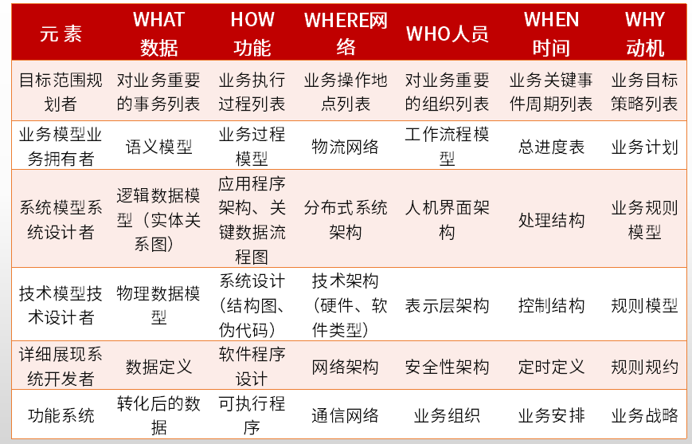

# 案例

## 历年考题

| 年份   | 考题                                                         | 知识点                                                       |
| ------ | ------------------------------------------------------------ | ------------------------------------------------------------ |
| 2014年 | 需求获取（JRP、抽样公式）                                    | 1. JRP（联合需求计划）的定义、优势，不同需求获取的方式的适用场景；  2. 抽样统计的样本公式= $0.25 * （可信度因子 * 错误率）^ 2$ |
|        | 系统规划（可行性、净现值）                                   |                                                              |
|        | 系统运行与维护（恢复信息的级别、重构方法和优缺点）           |                                                              |
| 2015年 | 进度管理（工期计算、进度计划调整）                           | 关键活动的调整；非关键活动的调整；增减工作项；资源调整       |
|        | 架构分析（Zachman架构）                                      |                                                              |
|        | 运行与维护（遗留系统的策略、新旧系统转换策略、数据迁移）     |                                                              |
|        | Web系统（功能划分和业务流程）                                |                                                              |
| 2016年 | 系统规划（可行性、成本和收益类型、投资回收期（动态/静态））  |                                                              |
|        | 系统设计（面向对象设计，设计类分类，活动图/流程图区别，状态图填充） | 设计类的类型、功能： 1. 实体类：映射需求中的每个实体，需要保存在永久存储中的信息；  2. 控制类：控制用例工作的类，用于对用例所特有的行为进行建模； 3. 边界类：用于封装在用例内、外流动的信息或数据流；    活动图和流程图的主要区别： 1. 活动图是面向对象，流程图是面向结过程； 活动图着重表现系统的行为，流程图着重表现系统的处理过程； 2. 活动图能够表示并发活动的情形，流程图主要结构是顺序、循环、分支，严格的顺序和时间关系，不能表示并发。 |
|        | 数据库（反范式问题，读写锁及缺点，并发读写的三种问题现象）   | 1. 数据冗余和数据不一致 2. 丢失修改、读脏数据、不可重复读 |
|        | Web系统（WebX，Hibernate/Mybatis，REST）                     | REST方案缺少对服务安全性的直接支持                           |
| 2017年 | Web系统（微服务概念/优劣势）                                 |                                                              |
|        | 数据库（数据库设计的三个阶段、范式判定、实体联系类型）       | 实体联系分为 1:1, 1:N, M:N                                   |
|        | 数据库（反规范化设计及优缺点、数据分区及优缺点）             |                                                              |
|        | Web系统（分布式数据库概念和性能提升手段）                    |                                                              |
| 2018年 | 系统分析（问题分析阶段的主要任务，因果分析，约束条件分类）   | FAST系统分析的阶段和每个阶段的主要任务                       |
|        | 系统分析（结构化分析和面向对象分析的流程）                   |                                                              |
|        | 数据库（视图概念和优缺点，物化视图，数据不一致的解决手段）   |                                                              |
|        | Web系统（REST的设计原则）                                    |                                                              |
| 2019年 | 系统分析（项目管理，PERT图，松弛时间，自由时差）             |                                                              |
|        | 系统设计（MDA软件开发方法）                                  |                                                              |
|        | 数据库（主从复制的类型，NOSQL比较，DB同步问题的方案）        | DB同步问题（MYSQL-NOSQL）：程序级别，同步工具CDC，触发器     |
|        | web系统（MVP的特点）                                         |                                                              |

## 思维导图

## 知识点

[2023年系分案例必备知识点汇总.pdf](./pdfs/2023年系分案例必备知识点汇总.pdf)

- [案例-系统分析](./pdfs/1-案例分析-系统分析.pdf)
- [案例-架构设计](./pdfs/2-案例分析-架构设计.pdf)
- [案例-系统设计](./pdfs/3-案例分析-系统设计.pdf)
- [案例-数据库](./pdfs/4-案例分析-数据库.pdf)
- [案例-需求工程](./pdfs/26-案例分析-需求工程.pdf)
- [案例-系统规划](./pdfs/30-案例分析-题目-系统规划.pdf)

Zachman框架综合考虑企业业务架构中不同角色的不同观点，提出一个多视角、多角度的企业架构，是许多公司用来理解、表述企业信息基础设施的一种可以理解的信息表述，为企业现在以及未来的信息基础设施建设提供蓝图和架构。横向视角有5W1H，纵向功能视图包括目标范围、企业模型、系统模型、技术模型、详细展现、功能系统

