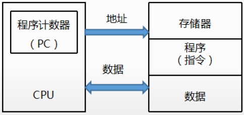
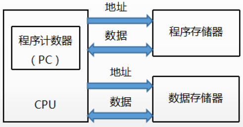
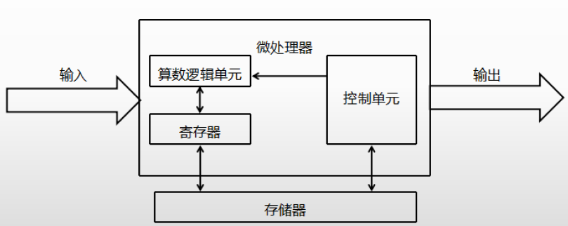

# 嵌入式系统分析与设计

## 嵌入式微处理器体系结构

两种，分别是冯诺依曼体系结构和哈弗体系结构

### 冯诺依曼体系结构

- **程序和数据共用一个存储空间**；
- **单一的地址及数据总线**，程序指令和数据的总线宽度相同；
- **串行执行**，在传输上会出现瓶颈；

### 哈弗体系结构

- 程序和数据采用不同的存储空间，
- 独立的地址和数据总线；
- 并行执行，提高速度；

## 嵌入式系统的硬件系统

微处理器是**核心**，有**控制器**（控制单元）、**运算器**（算术逻辑单元）、**寄存器**组成。

嵌入式系统多使用微控制器，原因：

- 节约成本和功耗；简化硬件设计；

### 嵌入式微控制器MCU

CPU + 片内内存 + 片外内存

单片机，在同一个芯片上集成CPU、内存和外设。

### 嵌入式微处理器MPU

台式机和笔记本电脑的处理芯片属于微处理器，提供高速总线以实现与外部的内存和外设进行交互。

### 嵌入式数据信号处理器DSP（哈弗体系结构）

以**数字信号**处理**大量**信息的器件，强大的数据处理能力和高运行速度。

**特点**：

- 一个指令周期可以完成一次乘法和一次加法；
- 数据和程序空间分开，同时访问指令和数据；
- 片内具有快速RAM，独立的数据总线；
- 低开销或无开销循环及跳转的硬件支持；
- 。。。

### 嵌入式片上系统（SOC，System-on-a-Chip）

在同一个芯片上集成控制部件（微处理器、存储器）和执行部件（I/O接口、微型开关、微机械）；

**片内可再编程技术**，使片上系统内硬件的功能可以向软件一样通过编程来配置。

## 多核处理器

多个独立CPU集成在单个芯片，直接插入单一的处理器插槽中。

### 分类

选用何种架构，需要考虑应用场景和硬件环境

- **非对称多处理**（AMP）：多个核心可能运行不同的操作系统，有主要核心控制整个系统和其它从核心；
- **对称多处理**（SMP）：一个操作系统同等管理各个内核，分配负载；
- **混合多处理**（BMP）：与SMP类似，但可以执行**将某个任务仅在某个指定内核上**执行；

### 调度方式

**全局队列调度**：全局一个队列，为CPU分配任务；CPU核心利用率高；

**局部队列调度**：每个CPU都有自己的单独队列；CPU缓存利用率高，但CPU利用率低；

### 多核操作系统

关键技术有：单核操作系统的区别主要是前四点

- 核结构：同构还是异构；
- Cache设计：多级cache设计和Cache一致性；
- 核间通信技术：
- 操作系统设计：任务调度、中断处理、同步互斥；
- 程序执行模型：将高级语言按一种程序模型翻译成目标机器语言；
- 总线设计；
- 低功耗设计；
- 存储器墙（硬件）；
- 可靠性和安全设计；

## 操作系统EOS

EOS负责嵌入式系统的全部软、硬件资源的分配、任务调度、控制、协调并发活动。

特点：

- 微型化：一般没有大容量内存和外存
- 代码质量高；
- 专业化：针对应用领域设计，因此EOS要很好适应性和移植性，支持多种开发平台；
- **实时性强**；
- **可定制性**：可裁剪和可配置，从减少成本和缩短研发周期考虑，要求嵌入式操作系统能运行在不同的微处理器平台上，能针对硬件变化进行结构与功能上的配置，以满足不同应用的需求；
- **易移植性**：为了提高系统的易移植性，通常采用**硬件抽象层和板级支持包**的底层设计技术。

### 嵌入式实时操作系统RTOS

硬实时操作系统：在规定时间内必须完成；

软实时操作系统：按照任务优先级完成

## 嵌入式系统设计

宿主机 -> (仿真器)  -> 目标机系统

进行低功耗设计，主要技术有：

- **编译优化技术**
- **软硬件协同设计**
- **算法优化**

## AD芯片分辨率

AD芯片分辨率（输入信号的分辨能力）：$U/2^m$

- U 表示电压的的范围大小；
- m表示芯片的bit位数；