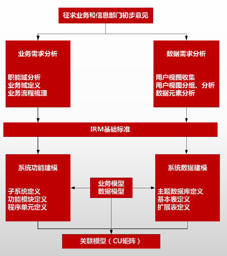
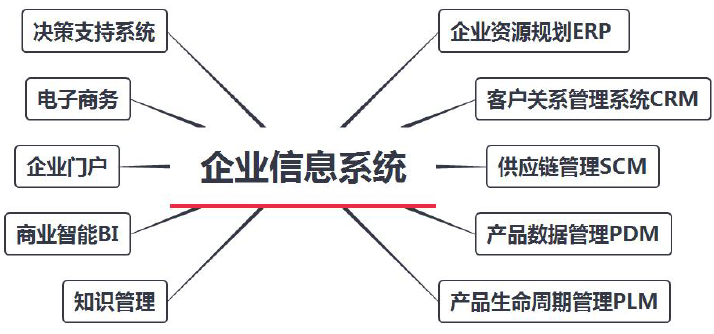
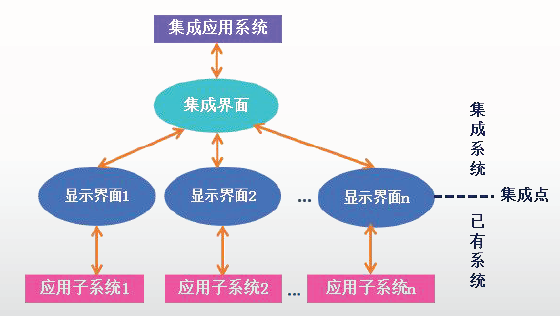

# 企业信息化与战略实施

## 信息的特征

- **真伪性**：真实是信息的中心价值；
- **层次性**：数据加工的结构，分为战略层、策略层和执行层；
- **不完全性**：需要正确滤去不重要的信息、失真的信息；
- **滞后性**：信息加工需要时间；
- **扩压性**：可以扩散和压缩；
- **分享性**：信息分享具有非零和性；

## 企业信息化规划

企业信息化过程中，主要影响因素有：**经营战略**、**业务流程与组织**、**信息架构**。

规划内容：

- **企业战略规划**；
- **信息系统战略规划**；
- **信息技术战略规划**；
- 信息资源规划；

### 企业战略规划

**企业战略与信息化战略**集成的主要方法有**业务与IT整合**（Business-IT Alignment，BITA）和**企业IT架构**（Enterprise IT Architecture，EITA）:

- 业务与IT整合 BITA ：信息系统**不能满足**当前管理中的业务需要，业务和IT之间总是有不一致的地方；
- 企业IT架构 EITA ：现有信息系统和IT基础架构不一致、**不兼容**和缺乏统一的整体管理的企业。

SWOT分析：

- 用**机会**和**威胁**评价现在和未来的环境；
- 用**优势**和**劣势**评价企业现状；

评价企业现状，进而选择和确定企业的**总体**和**长远目标**，制定和抉择实现目标的行动方案

### 信息系统战略规划（ISSP）

通过**信息系统**来支撑业务流程的运作，进而实现企业的**关键业务目标**。

1. 以**数据处理**为核心，围绕**职能部门需求的信息系统规划**，主要的方法包括**企业系统规划法**、**关键成功因素法**和**战略集合转化法**；
2. 以**企业内部管理信息系统**为核心，围绕企业**整体需求**进行的信息系统规划，主要的方法包括**战略数据规划法**、**信息工程法**和**战略栅格法**；
3. 以**集成**为核心，围绕企业**战略需求**进行的信息系统规划，主要的方法包括**价值链分析法**和**战略一致性模型**。

| 名称               | 特点                                                         |
| ------------------ | ------------------------------------------------------------ |
| **企业系统规划法** | BSP方法主要用于**大型**信息系统的开发。BSP方法的目标是提供一个信息系统**规划**，用以支持企业短期的和长期的信息需求。 |
| **关键成功因素法** | 通过对CSF的识别，找出实现目标所需要的**关键信息集合**，从而确定系统开发的**优先次序**。 |
| **战略集合转化法** | SST将企业战略看成是一个“**信息集合**”，包括使命、目标、战略和其他企业属性，例如，管理水平、发展趋势以及重要的环境约束等。 |
| **战略数据规划法** | SDP是**挖掘数据**、信息的规律。                              |
| **信息工程方法**   | 以企业**内部**管理信息系统为核心，围绕企业整体需求进行信息系统规划。 |
| **战略栅格法**     | 该方法创建一个2×2的矩阵（**栅格表**），从战略影响方面标出企业现有的和将来的信息系统组合的特征，也就是它们对企业生存前景的影响。 |
| **价值链分析法**   | 企业为一系列的输入、转换与输出的**活动序列集合**，每个活动都有可能相对于最终产品产生增值行为，从而增强企业的竞争地位。 |
| **战略一致性模型** | SAM把企业战略规划和信息化战略规划的关系划分为**内、外**两大部分。外部是指企域包括企业组织结构、整体信息架构和业务流程等。业所面临的外部竞争环境，例如，产品或IT市场等；内部区 |

### 信息技术（IT）战略规划

对**支撑信息系统运行的硬件、软件、支撑环境等进行具体的规划**。

企业的管理层次：

- 战略计划层决定企业的目标，以及达到这些目标所需要的资源，获取、使用、分配这些资源的策略的过程
- 管理控制层管理人员确认资源的获取，以及企业目标是否有效地使用了这些资源
- 操作控制层保证有效率地完成具体的任务。

4个基本步骤：

- 定义管理目标
- 定义管理功能
- 定义数据分类
- 定义信息结构

## 企业系统规划法（BSP）

企业系统规划（Business System Planning, BSP）方法主要用于大型信息系统的开发。BSP方法的目标是提供一个信息系统规划，用以支持**企业短期的和长期的信息需求**。

## 信息资源管理（IRM）

通过企业内外信息流的畅通和信息资源的有效利用，来提高企业的效益和竞争力。包括：

- **数据资源管理**：对数据的控制；
- **信息处理管理**：企业人员如何获取和处理信息；

### 信息资源规划（IRP）

信息化建设的基础工程，是指对企业生产经营活动所需要的信息，对产生、获取、处理、存储、传输和利用等方面进行全面的规划。

强调**需求分析与系统建模**紧密集合，其主要过程分为7个步骤：

| 定义职能域：征求业务和信息部门初步意见；   **业务需求分析**：职能域分析、业务域定义和业务流程梳理；   **数据需求分析**：用户视图收集、分组、分析和**数据元素分析**；   IRM基础标准；   **系统功能建模**：子系统定义、**功能**模块定义、程序单元定义；   **系统数据建模**：主题**数据库**定义、基本表定义、扩展表定义； |  |
| ------------------------------------------------------------ | ------------------------------------------------------------ |

## 常见的企业信息化系统

### 企业资源规划（ERP）

ERP：Enterprise Resource Planning.

五个层次：

| 名称             | 内容                                                         |
| :--------------- | ------------------------------------------------------------ |
| **生产计划大纲** | 是根据**经营计划的生产目标制定**的，是对**企业经营计划的细化**， 用以描述企业在可用资源的条件下，在一定时期中的产量计划。 |
| **主生产计划**   | 是对**企业生产计划大纲的细化**，说明在一定时期内的如下计划： 生产什么，生产多少和什么时候交货。 |
| **物料需求计划** | 对主生产计划的各个项目所需的全部制造件和全部采购件的 **网络支持计划**和**时间进度计划**。 |
| **能力需求计划** | 对物料需求计划**所需能力进行核算**的一种计划管理方法。 旨在通过分析比较MRP的需求和企业现有生产能力，及早发现能力的瓶颈所在。 |
| **车间作业计划** | 在MRP所产生的加工制造订单（即自制零部件生产计划）的基础上， 按照交货期的前后和生产优先级选择原则以及车间的生产资源情况 （如设 备、人员、物料的可用性、加工能力的大小等）， **将零部件的生产计划以订单的形式下达给适当的车间**。 |

### 客户关系管理系统（CRM）

CRM：Customer Relation Management.

将客户看作是企业的一项重要资产，**客户关怀是CRM的中心**，**核心是客户价值管理**。

CRM解决方案应该具备：

- 有效的客户交流渠道；
- 对所有信息进行有效分析；
- **CRM与ERP很好地集成**；

### 供应链管理（SCM）

企业通过改善上下游供应链关系，整合和优化供应链中的**信息流、物流、资金流**，以获得企业的竞争优势。

包括**计划**、**采购**、**制造**、**配送**、**退货**五部分。

### 产品数据管理（PDM）

管理所有与**产品相关信息**（包括零件信息、**配置、文档、计算机计文件、结构**、权限信息等）和所有与**产品相关过程**（包括过程定义和管理）的技术。

帮助企业实现对企业相关的**数据、开发过程及使用者**进行集成和管理。

### 产品生命周期管理（PLM）

为**企业及其供应链组成产品信息的框架**。由多种信息化元素构成，包括

- **基础技术和标准**（例如，XML、**可视化技术**、**协作和企业应用集成等**）
- **信息生成工具**（例如，**CAD**和技术发布等）
- **核心功能**（例如，**数据仓库**、文档和内容管理、工作流和程序管理等）
- **应用功能**（例如，**配置管理等**）
- **构建在其他系统上的业务解决方案**。

产品的生命周期一般包括5个阶段，分别是培育期（概念期）、成长期、成熟期、衰退期、结束期（报废期）5个阶段。

PLM通过培育期的**研发成本最小化**和成长期至结束期的**企业利润最大化**来达到**降低成本**和**增加利润**的目标。

### 知识管理

**显性知识**：以**文字与数字**来表达，**科学原理**；

**隐性知识**：很难用公式或文字来加以说明，**个人主观的洞察力、直觉与预感**等

知识管理工具分为：

- **知识生成工具**：包括产生**新的想法**、发现**新的商业模式**、发明新的生产流程，以及对**原有知识的重新合成**
- **知识编码工具**：通过**标准的形式表现知识**，使知识能够方便地被共享和交流。
- **知识转移工具**：最终就是要**使知识能在企业内传播和分享**；

### 商业智能（BI）

主要包括**数据预处理（ETL）**、**建立数据仓库**、**数据分析**和**数据展现**4个主要阶段。

- **数据分析**是体现系统智能的关键，一般采用**OLAP（联机分析处理，多维分析）和数据挖掘（模型）**两大技术；
- 一般认为，**数据仓库、OLAP和数据挖掘**技术是BI的三大组成部分。

### 电子商务

按参与**交易的对象**分类，**电子商务**大致可以分为以下几类：

（1）企业对消费者（Business to Customer, **B2C**）

（2）企业对企业（Business to Business, **B2B**）

（3）消费者对消费者（Customer to Customer, **C2C**）

（4）线上对线下（Online To Offline，**O2O**）

### 电子政务

**G2G**：政府**上下级**之间、**不同地区和不同职能部门**之间实现的电子政务活动，如人口信息；

**G2B**：政府向**企业**提供的各种公共服务；

**G2C**：政府面向**公众**所提供的服务；

**G2E**：指政府与**政府公务员**即政府雇员之间的电子政务；

### 决策支持系统（DSS）

**辅助决策者**通过数据、模型和知识，以**人机交互**方式进行半结构化或非结构化决策的计算机应用系统。

**DSS不可以代替决策者。**

- **数据库子系统、模型库子系统、推理部分和用户接口子系统**；

### 企业门户（EP）

企业门户（Enterprise Portal, EP）已经成为企业优化业务模式、扩展市场渠道、改善客户服务，以及提升企业形象和凝聚力的强有力手段。

关键在于它具备广泛的用途和灵活、全面的模型。

按照实际应用领域，EP可以划分为4类，分别是**企业网站、企业信息门户、企业知识门户和企业应用门户**。

### 企业应用集成（EAI）

Enterprise Application Integration, EAI

以消除信息孤岛，它将**多个企业信息系统连接**起来，实现无缝集成。

包括**表示集成**、**数据集成**、**控制集成**和**业务流程集成**等。

- **表示集成**：**界面**集成，**黑盒**集成，**原始和最浅层**次的集成；常用的集成技术主要有屏幕截取和输入模拟技术。

  - 统一的用户界面，只能界面上集成；

  

- **数据集成**：**白盒**集成，控制集成和业务流程集成的基础；对数据进行标识并编成目录，确定元数据模型；

  - **中间件的集成**；
  - 多个信息源的数据进行综合分析和决策；公用信息库；数据更新和关联等；

- **控制集成**：**功能**集成或应用集成，**黑盒**集成，是在**业务逻辑层**上对应用系统进行集成

  - **应用逻辑**处集成；

- **业务流程**：**过程**集成，对各种业务信息的交换进行定义、授权和管理
  - 包括应用集成、B2B集成、自动化业务流程管理、人工流程管理、企业门户，以及对所有应用系统和流程的管理和监控等。

### 业务流程重组（BPR）

针对企业业务**流程的基本问题进行反思**，并对它进行**彻底的重新设计**(**根本性改造**）。

坚持以**流程为中心**的原则、**团队式管理**原则（以人为本的原则）和**以顾客为导向**的原则。.

### 事件驱动的企业应用集成

**事件驱动架构**（Event-Driven Architecture, EDA）是一种设计和构建应用的方法，其中事件触发消息在独立的、非耦合的模块之间（它们之
间不需要知道对方）传递。

- **异步**、**发布/订阅**、**解耦**。

## 项目管理网络

项目成本管理中，**成本预算是将总的成本估算分配**到各项活动和工作包上。

项目时间管理中的过程包括：

- 活动定义、活动排序、活动资源估算、活动历时估算、制定计划、进度控制

**最早开始时间**：紧前工作的最早结束时间的最大值

**最早结束时间**：最早开始时间 + 工作时间

**最迟结束时间**：紧后工作的最迟开始时间的最小值

**最迟开始时间**：最迟结束时间 - 工作时间

**工作总时差**：**最多玩多少天，不影响本身工作**

**工作总时差** = 最迟开始时间 - 最早开始时间 = 最迟结束时间 - 最早结束时间

**自由时差**：**最多玩多少天，不影响紧后工作**

**自由时差** = 工作总时差 - 紧后工作的工作总时差的最小值 = **紧后工作的最早开始时间最小值** - **本工作的最早结束时间**