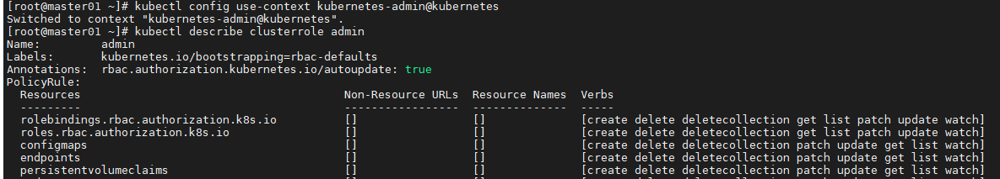
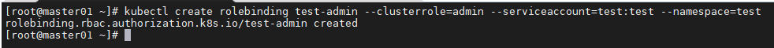
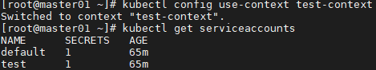
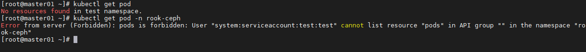
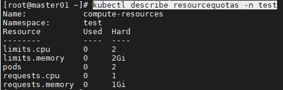
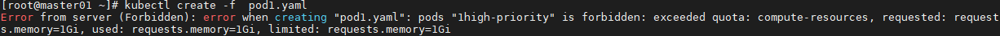
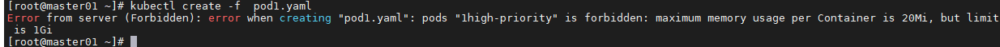
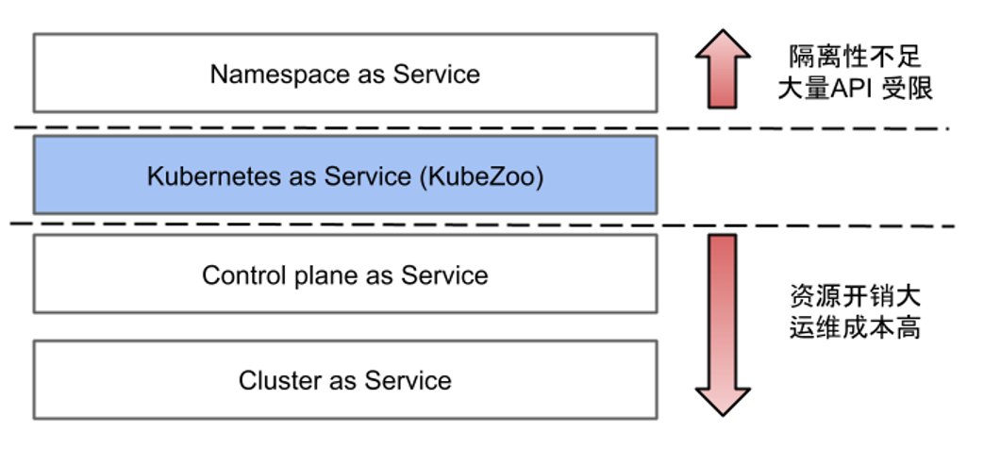
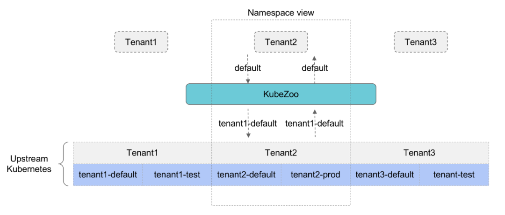

# 用户

Kubernetes提供了一系列机制以满足多用户的使用，包括多用户，鉴权，命名空间，资源限制等等。


在Kubernetes里User只是一个用户身份辨识的ID，没有真正用户管理。

k8s通过**第三方提供用户管理和存储**，k8s通过User进行身份验证与权限认证。

Kubernetes用户验证支持**X509证书认证，token认证和密码验证**几种方式。

RBAC是Kubernetes进行**权限控制**的方式。用户与角色绑定，赋予角色权限。


## Service Account

属于账号的一种，但是不是给K8s集群的用户（系统管理员、运维人员、租户用户等）使用，而是**给运行在Pod中的进程使用**，提供必要的身份证明。


## 使用示例

接下来将创建一个名为test的用户，其拥有test命名空间下的管理员权限，该命名空间有着CPU，内存，Pod数量等限制。

## 创建用户

Kubernetes中的用户创建大体包括静态创建和动态创建两类。

- 静态创建需要apiserver启动时提供用户信息文件；
- 动态创建则可以在apiserver启动后动态添加。

动态创建的认证方式包括客户端证书认证和Service Account Token认证。如果能够登录至master的话建议使用客户端证书认证，这里使用Service Account Token认证方式创建用户。

- Service Account隶属于命名空间之下，因此首先创建namespace/test：

```shell
kubectl create namespace test
```

- **每创建一个命名空间，都会为其新建一个名为default的serviceaccount**，这里新建名为test的serviceaccount：

```shell
kubectl create -n test serviceaccount test
```

- 此时一个新的用户test就已经创建好了，只不过在apiserver看来，他的用户名全称应为

```shell
system:serviceaccount:test:test
```

## 切换用户验证权限

创建用户后还需要切换至该用户，kubectl命令提供了config子命令以完成这一目的，该命令本质上是修改了位于`~/.kube/config`的kubeconfig文件，因此也可以为新用户创建一个新的Linux用户，为其放置kubeconfig文件，以实现针对不同Linux用户使用不同的Kubernetes用户

- 首先需要获取serviceaccount/test用户的token

```shell
kubectl describe -n test serviceaccount/test | grep Token
# 将上一步的token信息复制下来
kubectl describe -n test secret/test-token-xz9dl
```

- 设置kubeconfig的user，其名称为test（<TOKEN_CONTENT>就是serviceaccount/test的token）：

```shell
kubectl config set-credentials test --token=<TOKEN_CONTENT>
```

- 然后设置context，名称为test-context，引用user为test，cluster为kubernetes，命名空间为test（使用kubectl命令时如不指定namespace，则默认为test）：

```shell
kubectl config set-context test-context --user=test --cluster=kubernetes --namespace=test
```

- 最后，切换至该context：

```shell
kubectl config use-context test-context
```

- 尝试获取pod列表，发现无权限，不过可以验证用户切换成功：

```shell
# 输出 Forbidden字眼，没有权限
kubectl get pod
```

## 授予用户权限

新创建的用户没有任何权限，因此需要为其授予权限，Kubernetes提供了多种权限授予方式，包括ABAC，Webhook，RBAC等等。

RBAC为Kubernetes默认且推荐的权限授予方式，如果想要使用其他方式，需修改apiserver启动参数。

首先需要新建一个`Role/ClusterRole`资源并指定允许的权限，Kubernetes预设了`clusterrole/admin`，允许单个命名空间内除了资源配额和命名空间本身的写访问，很适合作为单个命名空间的管理员使用。因此这里不再新建role。

- 如果想知道`clusterrole/admin`到底授予了什么样的权限，可以使用describe命令查看：

```shell
# 切换回admin用户
kubectl config use-context kubernetes-admin@kubernetes

# 查看权限
kubectl describe clusterrole admin
```



- 接下来需要将clusterrole/admin绑定至serviceaccount/staight上：

```shell
kubectl create rolebinding test-admin --clusterrole=admin --serviceaccount=test:test --namespace=test
```



如上，为test用户授予了test命名空间的admin角色，如果需要让该用户管理多个命名空间，更改–namespace参数再次创建即可。

- 切换至test用户，尝试获取test命名空间下的Service Account：

```shell
kubectl config use-context test-context

kubectl get serviceaccounts 
```





成功获取，授权成功。

大部分情况下，完成新用户对单个命名空间的管理权限就已经可以了，不过如果需要对其资源使用做进一步的限制的话，还需修改命名空间的资源配额。

## 资源配额

资源配额是一个用于限制一个命名空间下资源使用的机制，其包括如下两个对象：

`ResourceQuota`：限制单个命名空间下的资源使用量。包括***CPU，内存，存储，资源对象的个数***等等。

`LimitRanger`：为容器的Limits和Requests设置默认值和范围约束。

### ResourceQuota

resourcequota对相当多的资源提供限制，详细内容可参考文档：https://kubernetes.io/docs/concepts/policy/resource-quotas/#compute-resource-quota。

- 示例：为test命名空间设置资源配额

```shell
kubectl apply -f resource.yaml
```
resource.yaml的信息如下：

```yaml
apiVersion: v1
kind: ResourceQuota
metadata:
  name: compute-resources
  namespace: test
spec:
  hard:
    pods: "2"
    requests.cpu: "1"
    requests.memory: 1Gi
    limits.cpu: "2"
    limits.memory: 2Gi
```

- 如上，对pod数量和使用的requests与limits值做了限制。可以使用describe命令查看目前的资源使用量和限制：

```yaml
kubectl describe resourcequotas -n test
```



- 尝试创建两个Pod，再次创建后报错：记得再次创建时修改pod名称

```yaml
apiVersion: v1
kind: Pod
metadata:
  name: high-priority
  namespace: test
spec:
  containers:
  - name: high-priority
    image: ubuntu
    command: ["/bin/sh"]
    args: ["-c", "while true; do echo hello; sleep 10;done"]
    resources:
      requests:
        memory: "1Gi"
        cpu: "500m"
      limits:
        memory: "1Gi"
        cpu: "500m"
```




### LimitRanger

LimitRanger用于为容器设置默认的requests和limits值，以及限制其范围。

- 示例：限制test命名空间下容器的requests值和limits值	
- kubectl config use-context kubernetes-admin@kubernetes
-  kubectl apply -f limit.yaml

```yaml
apiVersion: v1
kind: LimitRange
metadata:
  name: memory-range
  namespace: test
spec:
  limits:
  - max: # 限制容器最大limits值
      memory: 20Mi
    min: # 限制容器最小limits值
      memory: 10Mi
    default: # 默认limits值
      memory: 10Mi
    defaultRequest: # 默认requests值
      memory: 10Mi
    type: Container
```

- 如上，如创建Pod时未指定limits和requests值，则自动为其添加requests.memory: 10Mi，limits.memory: 10Mi；
- 如创建时limits.memory值小于10Mi或大于20Mi，则会拒绝该请求：




# 集群安全机制

## API Server 认证

K8s集群中所有资源访问和变更都是通过k8s API Server的REST API实现，

认证（Authentication）：识别客户端的身份；

### API 访问方式

K8s API的访问方式分类：

- 证书方式访问的普通用户或进程，包括运维人员、kubectl、kubelets等进程；
- Service Account方式访问的K8s的内部服务进程；
- 匿名方式访问的进程。

### API 认证方式

- HTTPS 证书认证：默认，基于**CA根证书签名的双向数字证书**认证方式；
- HTTP Bear Token认证：通过**Bearer Token**识别合法用户，指定存储的文件（存储token对应的用户信息，csv格式）；
- OpenID Connect Token认证：通过第三方OIDC协议进行认证；
- Webhook Token认证：通过**外部Webhook服务**进行认证；
- Authentication Proxy认证：通过认证代理程序进行认证；

## API Server 授权

### 授权策略

默认为`--authorization-mode=Node,RBAC`

- ~~AllowDeny：拒绝所有，仅用于测试；~~
- ~~AlwaysAllow：允许所有，集群不需要授权时使用；~~
- ~~ABAC：基于属性的访问控制；~~
- **RBAC**：基于角色的访问控制；
- **Webhook**：基于外部的REST服务进行授权；
- **Node**：对kubelet进行授权的特殊模式；

### RBAC

资源对象：Role（受限于命名空间）、ClusterRole（全局）、RoleBinding、ClusterRoleBinding；

- Role或ClusterRole与RoleBinding或ClusterRoleBinding**绑定之后，则Role/ClusterRole无法修改**；
- K8s内置ClusterRole，包括admin，view，edit等；

Rules的使用：

- `apiGroups`：“”（Core），"extensions", "apps", "batch" 等；
- `resources`：“services”, “endpoints”, “pods“，"deployments“，“jobs”，“configmaps”，“nodes”，“rolebindings”，“clusterroles” 等；
- `verbs`：create、delete、deletecollection、get、list、patch、update、watch、bind；
- `resourceNames`：数据权限，**限制特定实例名称**有权限，可用于`get,delete,update,patch`，但对`list`, `watch`, `create`, `deletecollection`操作无效；

主体绑定：

- `User`：字符串标识，通常应该在客户端CA证书中进行设置，K8s内置系统级别的用户/用户组，以"system:"开头；
- ``Group`：与用户名类似，通常应该在客户端CA证书中进行设置，不以"system:"为前缀；
- `Service Account`：用户和所属的组名，会被k8s设置为以"system:serviceaccount"为前缀的名称；

示例：

```yaml
kind: Role
apiVersion: rbac.authorization.k8s.io/v1
metadata:
  namespace: default
  name: pod-reader
rules:
- apiGroups: [""]
  resources: ["pods"]
  resourceNames: ["test-app"]
  verbs: ["get", "watch", "list"]
---
kind: RoleBinding
apiVersion: rbac.authorization.k8s.io/v1
metadata:
  name: read-pods
  namespace: default
subjects:
- kind: User
  name: mark
  apiGroup: rbac.authorization.k8s.io  # 固定的字段指
roleRef:
  kind: Role
  name: pod-reader
  apiGroup: rbac.authorization.k8s.io
```

## Admission Control

准入控制器的插件列表，支持用户自定义扩展。

- [**Mutating Admission Webhook，Validating Admission Webhook**](./k8s.md#Webhook)


# 多租户管理


## 多租户方案 HNC（K8s-builtin）

- 层级化的 Namespace 的结构；

  

## Operator实现用户管理

> 参考：[Kubernetes Operator实现用户管理](https://mp.weixin.qq.com/s/p7i5qn3ipvJXGQl-Y14EBQ)

- 在Kubernetes里创建User自定义资源，使用LDAP存储用户帐号信息；
- 通过Kubernets CertificateSigningRequest请求X509证书，生成Kubeconfig；
- 通过各种自定义Role资源来创建Kubernetes Role与用户绑定，分配用户权限；
- 最终用户通过客户端使用kubeconfig来访问Kubernetes资源。

**主要流程**

1. User控制器调谐，创建LDAP用户，创建用户KubeConfig的Configmap；

2. 在CreateKubeConfig生成kubeconfig用户信息，创建CertificateSigningRequest；

3. 在Informer中监听CertificateSigningRequest事件，Approve请求，更新Configmap中用户kubeconfig的证书。


## 轻量级多租户（KubeZoo-字节-非开源）

> [轻量级 Kubernetes 多租户方案的探索与实践](https://mp.weixin.qq.com/s/V6x9V4AW3-XFEmv_b8LmvA)

在云计算时代，就出现了多个租户共享同一个 Kubernetes  集群的需求。

在这方面，社区的`Kubernetes Multi-tenancy Working Group`定义了三种 Kubernetes 的多租户模型：

- `Namespaces as a Service`：多个租户共享一个 Kubernetes 集群，每个租户被限定在自己的 Namespace 
  - 只能使用 Namespace 级别的资源，**不能使用集群级别的资源**，它的 API 兼容性比较受限。
- `Clusters as a Service`或`Control planes as a Service`：租户间做物理集群隔离的方案。每个租户都有独立的 Master，通过 Cluster API 或 Virtual Cluster 等项目完成它的生命周期管理。
  - 每个租户都会有一套独立的控制面组件，包括 API Server、Controller Manager 以及自己的 Scheduler



**KubeZoo 目的：在一个K8s集群中，实现多租户隔离，租户可以创建集群级别的资源（如Namespace等）**

### 架构和原理



KubeZoo 作为一个**网关服务**，部署在 API Server 的前端。它会抓取所有来自租户的 API 请求，然后注入租户的相关信息，最后把请求转发给 API Server，同时也会处理 API Server 的响应，把响应再返回给租户。

KubeZoo 的核心功能是**对租户的请求进行协议转换**，使得每个租户看到的都是独占的 Kubernetes 集群。对于后端集群来说，多个租户实际上是利用了 Namespace 的原生隔离性机制而共享了同一个集群的资源。


限制：

- 针对 Daemonset 和 Node 等集群共享资源对象是受限制；
- 