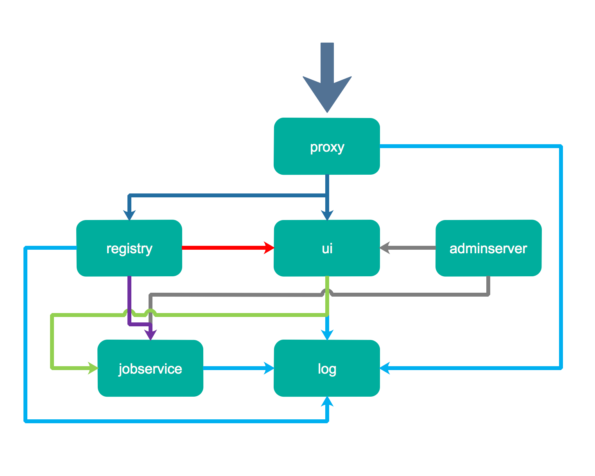

# Habor

Harbor 是为企业用户设计的容器镜像仓库开源项目，包括了权限管理(RBAC)、LDAP、审计、安全漏洞扫描、 镜像验真、管理界面、自我注册、HA 等企业必需的功能，同时针对中国用户的特点，设计镜像复制和中文支持等功能。

## 组件

**Nginx(Proxy)**：用于代理Harbor的registry,UI, token等服务 

**db**：负责储存用户权限、审计日志、Dockerimage分组信息等数据

**UI**：提供图形化界面，帮助用户管理registry上的镜像, 并对用户进行授权 

**jobsevice**：负责镜像复制工作的，他和registry通信，从一个registry pull镜像然后push到另一个registry，并记录job_log 

**Adminserver**：是系统的配置管理中心附带检查存储用量，ui和jobserver启动时候回需要加载adminserver的配置

**Registry**：原生的docker镜像仓库，负责存储镜像文件

**Log**：为了帮助监控Harbor运行，负责收集其他组件的log，记录到syslog中



## Kubernetes 拉取Harbor仓库私有项目镜像

 

### 通过k8s 构建指定命名空间的Harbor仓库密钥

```shell
kubectl create secret docker-registry hc-secret --docker-server=172.16.2.132:30002 --docker-username=hc --docker-password=Hc123456 -n ai-education
```

- docker-registry：密钥类型
- hc-secret：密钥名称
- --docker-server：镜像仓库地址
- --docker-username：镜像仓库用户名
- --docker-password：镜像仓库密码
- -n：需拉取镜像对应服务的命名空间

### 通过yaml部署时使用对应密钥

```yaml
spec:
  imagePullSecrets:
  - name: hc-secret
```

