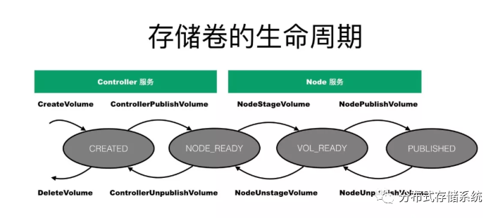

# CSI

CSI插件主要有2个独立的组件：

- **Node Plugin**(节点插件)：对主机上的存储卷进行相应的操作，负责将 Volume mount 到 pod 中，以 DaemonSet 形式部署在每个 node 中；
- **Controller Plugin**(控制插件)：从存储服务端角度对存储卷进行管理和操作，负责 Volume 的管理，以 StatefulSet 形式部署。
- **Identify** 组件：用来获取插件的信息，检查插件的状态。

## SideCar组件

`external-attacher`

- 监听 VolumeAttachment 对象，并调用 CSI driver Controller 服务的 `ControllerPublishVolume` 和 `ControllerUnpublishVolume` 接口，用来将 volume 附着到 node 上，或从 node 上删除。

`external-provisioner`

-  监听到 PVC创建，会调用 CSI driver Controller 服务的 `CreateVolume` 接口
- 组件监听到 PVC 的删除后，会调用 CSI driver Controller 服务的 `DeleteVolume` 接口

`external-resizer`、`external-snapshotter`、... ...

## 接口规范

### Indentity接口

用于提供 CSI driver 的身份信息，Controller 和 Node 都需要实现。

```go
service Identity {
  // 返回插件的名字和版本
  rpc GetPluginInfo(GetPluginInfoRequest)
    returns (GetPluginInfoResponse) {}
  // 返回插件的功能点，是否支持存储卷创建、删除等功能，是否支持存储卷挂载的功能
  rpc GetPluginCapabilities(GetPluginCapabilitiesRequest)
    returns (GetPluginCapabilitiesResponse) {}
  // 返回插件的健康状态(是否在运行中)
  rpc Probe (ProbeRequest)
    returns (ProbeResponse) {}
}
```

### Controller接口

- **CreateVolume**：创建一个存储卷(如EBS盘)
  -  **无需在宿主机上执行**的操作，k8s 通过调用该方法创建底层存储

- **DeleteVolume**：删除一个已创建的存储卷(如EBS盘)
- **ControllerPublishVolume**：将一个已创建的存储卷，挂载(attach)到指定的节点上
- **ControllerUnpublishVolume**：从指定节点上，卸载(detach)指定的存储卷
- ValidateVolumeCapabilities：返回存储卷的功能点，如是否支持挂载到多个节点上，是否支持多个节点同时读写
- ListVolumes：返回所有存储卷的列表
- GetCapacity：返回存储资源池的可用空间大小
- ControllerGetCapabilities：返回controller插件的功能点，如是否支持GetCapacity接口，是否支持snapshot功能等.

### Node接口

- **NodeStageVolume**：如果存储卷没有格式化，首先要格式化。然后**把存储卷mount到一个临时的目录**(这个目录通常是节点上的一个全局目录)。再通过NodePublishVolume将存储卷mount到pod的目录中。**mount过程分为2步，原因是为了支持多个pod共享同一个volume(如NFS)**。

- **NodePublishVolume**：将存储卷**从临时目录mount到目标目录(pod目录)**，Pod创建时才会进行该操作；

- **NodeUnstageVolume**：NodeStageVolume的逆操作，将一个存储卷从临时目录umount掉（一个节点同一个PVC没有Pod挂载时才会操作）

- **NodeUnpublishVolume**：将存储卷从pod目录umount掉，Pod删除时会执行

- NodeGetId：返回插件运行的节点的ID

- NodeGetCapabilities：返回Node插件的功能点，如是否支持`stage/unstage`功能


## 存储卷的生命周期




## 自定义的Driver Plugin容器


## node-driver-registrar容器

> **Git Repository:** https://github.com/kubernetes-csi/node-driver-registrar
>
> ~~废弃：https://github.com/kubernetes-csi/driver~~


负责请求 Identity Service 来获取插件信息并且注册到 kubelet，初始化的时候通过 csi-sock 的 RPC 获取 driver name 和 node id。主要功能给 node 打上 annotations，device-driver-registar 主要是注册 Node annotation


自定义结构Driver，实现

```go
func Register(mgr manager.Manager, cfg config.Config) error {
	csiDriver := NewDriver(cfg.NodeId, cfg.Endpoint, mgr.GetClient(), mgr.GetAPIReader())

	if err := mgr.Add(csiDriver); err != nil {
		return err
	}

	return nil
}

func NewDriver(nodeID, endpoint string, client client.Client, apiReader client.Reader) *driver {
	csiDriver := csicommon.NewCSIDriver(driverName, version, nodeID)
		csiDriver.AddControllerServiceCapabilities([]csi.ControllerServiceCapability_RPC_Type{
            csi.ControllerServiceCapability_RPC_CREATE_DELETE_VOLUME})
	csiDriver.AddVolumeCapabilityAccessModes([]csi.VolumeCapability_AccessMode_Mode{
        csi.VolumeCapability_AccessMode_MULTI_NODE_MULTI_WRITER})

	return &driver{
		nodeId:    nodeID,
		endpoint:  endpoint,
		csiDriver: csiDriver,
		client:    client,
		apiReader: apiReader,
	}
}
func (d *driver) run() {
	s := csicommon.NewNonBlockingGRPCServer()
	s.Start(
		d.endpoint,
		csicommon.NewDefaultIdentityServer(d.csiDriver),
		d.newControllerServer(),
		d.newNodeServer(),
	)
	s.Wait()
}
```

