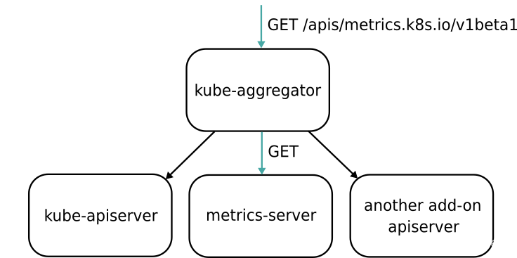

# K8s 监控

Metrics数据来源：

- 宿主机的监控数据，通过 Prometheus 的 `Node Exporter`工具；
- K8s的API Server/kubelet的 `/metrics`API，核心组件的 Metrics；
- K8s相关的监控数据，包括 Pod, Node, Container, Service的 Metrics 数据（来源于 kubelet 内置的 cAdvisor 服务）。


## cAdvisor

> Analyzes resource usage and performance characteristics of running containers.
>
> 用于收集、聚合和公开 Kubelet 中包含的容器指标的守护程序。

目前cAdvisor集成到了kubelet组件内，可以在kubernetes集群中每个启动了kubelet的节点使用cAdvisor提供的metrics接口获取该节点所有容器相关的性能指标数据。

从api server访问cadvisor的地址：

- cAdvisor的metrics地址: `/api/v1/nodes/[节点名称]/proxy/metrics/cadvisor`

直接从各个node的 kubelet 访问cadvisor的地址：

- cAdvisor的metrics地址: `node_ip:10250/metrics/cadvisor`


## Aggregator

> **kubeadm 部署的 K8s 集群，Aggregator 模式默认开启**。
>
> - kube-aggregator 根据URL选择具体的API后端的代理服务器，将第三方服务注册到 Kubernetes API 中。

```shell
--requestheader-client-ca-file=<path to aggregator CA cert>
--requestheader-allowed-names=front-proxy-client
--requestheader-extra-headers-prefix=X-Remote-Extra-
--requestheader-group-headers=X-Remote-Group
--requestheader-username-headers=X-Remote-User
--proxy-client-cert-file=<path to aggregator proxy cert>
--proxy-client-key-file=<path to aggregator proxy key>
```




## [Metrics Server](https://github.com/kubernetes-sigs/metrics-server)

> Metrics Server 并不是 kube-apiserver的一部分，而是通过 Aggregator 插件机制。
>
> Metrics Server is a scalable, efficient source of container resource metrics for Kubernetes **built-in autoscaling pipelines**.

通过标准的 K8s API 访问监控数据：

- Pod的监控：`/apis/metrics.k8s.io/v1beta1/namespaces/<namespace-name>/pods/<pod-name>`

如果 metrics server 的 pod 存在，但是 `kubectl top pods` 报错：“No Metrics for pods ...”

- `kubectl get --raw /api/v1/nodes/node134/proxy/metrics/resource` 查看是否有 pod 的 cpu / memory 的指标；
- 如果没有，则重启 kubelet：`systemctl restart kubelet.service`


### Custom Metrics

> https://github.com/kubernetes-sigs/prometheus-adapter
>
> An implementation of the custom.metrics.k8s.io API using Prometheus.

通过查询 Prometheus 的指标，暴露 custom metrics。

### Auto Scale

hpa-web.yaml 

```yaml
apiVersion: autoscaling/v2beta2
kind: HorizontalPodAutoscaler
metadata:
  name: web
spec:
  maxReplicas: 10
  minReplicas: 2
  scaleTargetRef:
    apiVersion: apps/v1
    kind: Deployment
    name: web
  targetCPUUtilizationPercentage: 40
  # 根据 custom metrics 触发扩缩容
  metrics:
  - type: Object
    object:
      metric:
        name: capacity_used_rate
      describedObject:
        apiVersion: data.fluid.io/v1alpha1
        kind: Dataset
        name: spark
      target:
        type: Value
        value: "90"
  behavior:
    scaleUp:
      # 一次扩容周期为 10 分钟(periodSeconds),扩容时新增 2 个副本数
      policies:
      - type: Pods
        value: 2
        periodSeconds: 600
    scaleDown:
      selectPolicy: Disabled
```

### Cron Scale

> https://github.com/AliyunContainerService/kubernetes-cronhpa-controller
>
> HPA controller that allows to scale your workload based on time schedule.

定时扩缩容

```yaml
apiVersion: autoscaling.alibabacloud.com/v1beta1
kind: CronHorizontalPodAutoscaler
metadata:
  name: spark
  namespace: default
spec:
  # 描述伸缩的对象
  scaleTargetRef:
    apiVersion: data.fluid.io/v1alpha1
    kind: AlluxioRuntime
    name: spark
  excludeDates:
  # 提供关闭伸缩规则的时间, exclude May 1st
  - "* * * 1 5 *"
  jobs:
  - name: "scale-down"
    schedule: "0 0 8 ? * 1-6"
    targetSize: 0
  - name: "scale-up"
    schedule: "0 30 21 ? * 1-5"
    targetSize: 3
```


## 获取集群资源信息

### 集群总的资源信息/节点的总资源信息

通过 client-go 获取所有的 Nodes 信息，将资源进行汇聚

```go
// this code is copied from kubedl project.
func (ov *DataHandler) GetClusterTotalResource() (model.ClusterTotalResource, error) {
    nodes := &corev1.NodeList{}
    err := client.List(context.TODO(), nodes)
    if err != nil {
        klog.Errorf("GetClusterTotalResource Failed to list nodes")
        return model.ClusterTotalResource{}, err
    }
    totalResource := corev1.ResourceList{}
    for _, node := range nodes.Items {
        allocatable := node.Status.Allocatable.DeepCopy()
        totalResource = resources.Add(totalResource, allocatable)
    }
    clusterTotal := model.ClusterTotalResource{
        TotalCPU:    totalResource.Cpu().MilliValue(),
        TotalMemory: totalResource.Memory().Value(),
        TotalGPU:    getGpu(totalResource).MilliValue()}
    return clusterTotal, nil
}
// get gpu from custom resource map
func getGpu(resourceList corev1.ResourceList) *resource.Quantity {
	if val, ok := (resourceList)["nvidia.com/gpu"]; ok {
		return &val
	}
	return &resource.Quantity{Format: resource.DecimalSI}
}
```


### 集群已使用的资源信息/节点已使用的资源信息

获取在每个节点上的Pod，对于 Phase 为 Running 的 Pod 计算总的资源申请：

- 通过 controller-runtime 的 client 对 `pod.spec.nodeName`进行 index，提升 List 效率，可参考 [kubedl](https://github.com/kubedl-io/kubedl/blob/434352b51ce11c7a3508ec8ad651329ab761a9a9/console/backend/pkg/handlers/data.go#L29)；


### 运行中的 Pod 的资源使用情况

通过 Metrics Server 可以获取 Pod 的 CPU/Memory 的实时使用信息。

```shell
$ curl -ik -H "Authorization: Bearer $TOKEN" https://k8s.hc.cn:6443/apis/metrics.k8s.io/v1beta1/namespaces/default/pods/
```

结果如下：

```json
{
  "kind": "PodMetricsList",
  "apiVersion": "metrics.k8s.io/v1beta1",
  "metadata": {
    "selfLink": "/apis/metrics.k8s.io/v1beta1/namespaces/default/pods/"
  },
  "items": [
    // 每个 Pod 的 CPU / GPU 使用情况
    {
      "metadata": {
        "name": "minio-7d66769f84-4qw52",
        "namespace": "default",
        "selfLink": "/apis/metrics.k8s.io/v1beta1/namespaces/default/pods/minio-7d66769f84-4qw52",
        "creationTimestamp": "2024-02-20T07:03:29Z"
      },
      "timestamp": "2024-02-20T07:02:49Z",
      "window": "30s",
      "containers": [
        {
          "name": "minio",
          "usage": {
            "cpu": "201812n",
            "memory": "92596Ki"
          }
        }
      ]
    },
    ...
  ]
}
```


#### NVIDIA GPU 信息

> [NVIDIA/dcgm-exporter: NVIDIA GPU metrics exporter for Prometheus leveraging DCGM](https://github.com/NVIDIA/dcgm-exporter)

