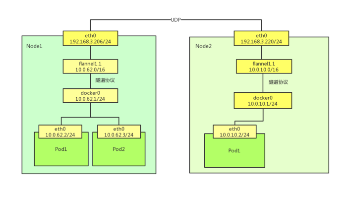
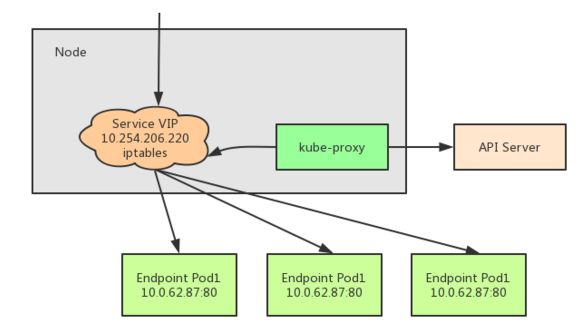

# k8s网络模型

每一个Pod都拥有一个扁平化共享网络命名空间的「PodIP」。

通过PodIP跨越网络与其他物理机和Pod进行通信。

IP-Per-Pod 模型创建了一个干净的、反向兼容的模型。

该模型中，从端口分配、网络、域名解析、服务发现、负载均衡、应用配置和迁移等角度，Pod都能被看作是虚拟机或者物理机，应用可以平滑地从非容环境迁移到同一个Pod内的容器环境。

## 容器间通信 (Container to Container)

Pod：

- Pod是容器的集合；
- **Pod包含的容器都运行在同一个宿主机**，拥有相同网络空间，容器之间可以互相通信；
- Pod运行的容器中包含业务容器和网络容器 「pause」；
- 「pause」顾名思义，暂停，防止容器退出
- 网络容器只用来接管Pod的网络，业务容器通过加入网络容器的网络实现网络共享

Pod内容器类似使用以下命令运行：

```shell
docker run -p 80:80 -p 8080:8080 --name network-container -d gcr.io/google_container/pause:3.1
 
docker run --net container:network-container -d jonlangemak/docker:web_container_8080
```

Pod中的容器网络拓扑


## Pod间通信 (Pod to Pod)

- k8s网络模型是一个扁平化的网络平面
- Pod作为一个网络单元通k8s Node网络处于一个层级

示例：最小的k8s网络拓扑

- Pod间通信：Pod1和Pod2（同主机）， Pod1和Pod3（跨主机通信）
- Node与Pod间通信：Node1与Pod1/Pod2（同主机），Pod3（跨主机能够通信）


问题：

1. 如何保证Pod的PodIP是全局唯一的？
   - **Pod的PodIP是Docker网桥分配**的，所以将不同k8s Node的Docker网桥配置成不同的IP网段即可。
2. 同一个k8s Node上的Pod/容器原生能通信，不通Node之间的Pod如何通信？
   - 对Docker进行增强，在容器集群中创建一个覆盖网络（Overlay Network），联通各节点，如Flannel 。

#### Flannel 网络模型

- Flannel 是由CoreOS团队设计的覆盖网络工具
- Flannel为主机设定一个子网，通过隧道协议封装容器之间的通信报文，实现容器的跨主机通信。
- Flannel在运行之前需要使用Etcd进行配置

```
etcdctl set /coreos.com/network/config '{"Network": "10.0.0.0/16"}'
```

- 配置完成，Node上运行Flannel；
- 初次启动时会检查Etcd中的配置；
- 为当前节点分配可用的IP网段；
- 在Etcd中创建一个路由表

```
etcdctl ls /coreos.com/network/subnets
ectdctl get /coreos.com/network/subnets/10.0.62.0-24
ectdctl get /coreos.com/network/subnets/10.0.10.0-24
```

- 分配网段之后，会创建一个虚拟网卡

```
ip addr show flannel.1
```

- 还会配置Docker网桥（docker0）,通过修改Docker启动参数 --bip实现

```
ip addr show docker0
```

- 除此之外，Flannel会修改路由表，使得Flannel虚拟网卡可以接管容器跨主机的通信。

```
route -n 
```



#### Service到Pod的通信（Service to Pod）

Service在Pod之间起「服务代理」的作用，对外表现为一个单一访问接口，将请求转发给Pod。

```
$ kubectl decsribe service myservice
Name: myservice
Namespace: default
Lables: <none>
Selector: name=mypod
Type: ClusterIP
IP: 10.254.206.220
Port: http 80/TCP
Endpoints: 10.0.62.87:80,10.0.62.88:80,10.0.62.89:80

Session Affinity: None
No evevts.
```

解读如下：

- Service的虚拟IP是 10.254.206.220
- 端口80/TCP对应3个后端：10.0.62.87:80,10.0.62.88:80,10.0.62.89:80
- 请求 10.254.206.220:80 时会转发到这些后端之一
- 虚拟IP是K8s创建的，虚拟网段是API server启动参数 --service-cluster-ip-range=10.254.0.0/16 配置的

## kube-proxy

**kube-proxy组件负责虚拟IP路由和转发**，在容器覆盖网络之上实现的虚拟转发网络，功能如下：

- 
- 监控Service和Endpoints的变化，实现刷新转发规则
- 提供负载均衡能力

kube-proxy的代理模式：~~userspace模式不再推荐~~

- `**iptables**`模式：设置iptables规则，效率高，但失败响应不友好，可以通过Pod的readinessprobe控制只有ready状态的pod可以响应；
- **`**ipvs**`模式**：通过Linux kernel的`netlink`接口设置**IPVS**规则，**转发效率和吞吐量都是最高**；
  - 要求**Linux Kernel启用 IPVS 模块**，未启用会自动切换到iptables模式；
  - 支持更多负载均衡模式：rr（轮询），lc（最小连接数），dh（目标地址hash），sh（源地址hash），sed（最短期望延迟），nq（永不排队）
- `**kernelspace**`模式：Windows Server的代理模式；


### iptables

完全通过创建iptables规则，直接重定向访问Service的虚拟IP的请求到endpoints;当Endpoints发生变化的时候，kube-proxy会刷新相关的iptables规则，在此模式下，kube-proxy只负责监控Service和Endpoints,更新iptables规则，报文的转发依赖于Linux内核，默认的负载均衡方式是随机方式。



查询关于Service myservice的iptables规则

```
iptables-save | grep myservice
```

kube-proxy会为Service创建一系列Iptables规则，其中包含Iptables自定义链：

- KUBE-SERVICES: 绑定在NAT表PREROUTING链和OUTPUT链
- KUBE-SVC-*: 代表一个Service , 绑定在KUBE-SERVICES
- KUBE-SEP-*: 代表Endpoints的每一个后端，绑定在KUBE-SVC-*

查询转发规则

```
iptables -t nat -L -n
```