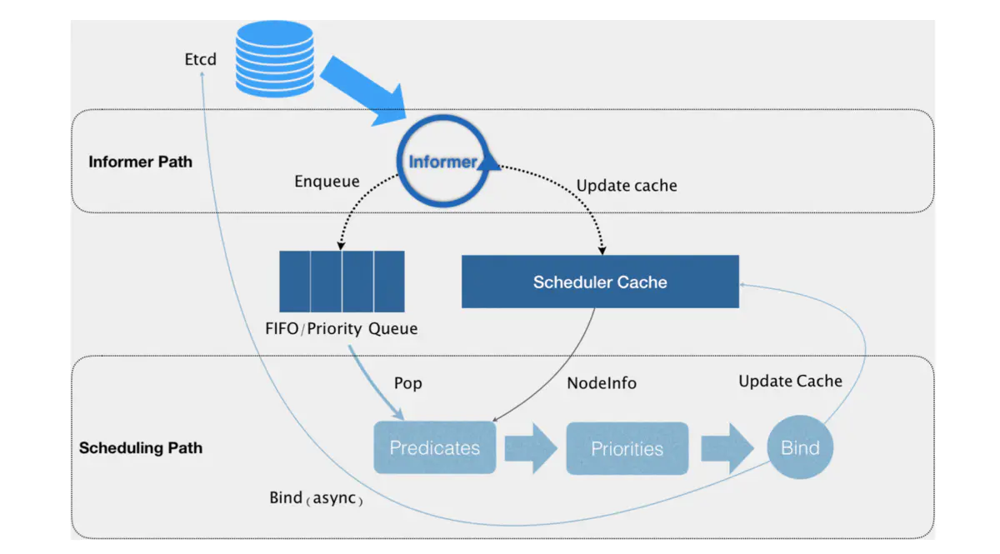
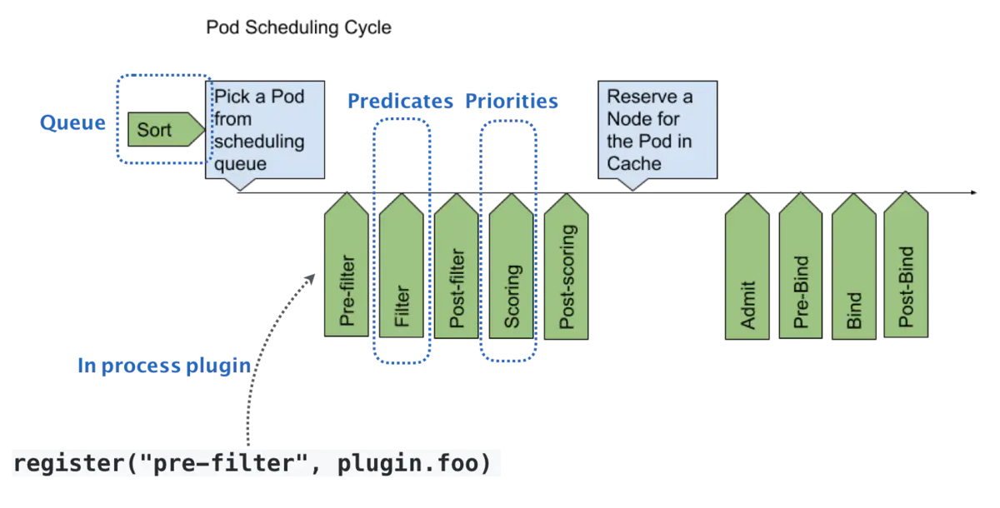

# K8s调度器

## 资源限制

> requests + limits : 大多数作业用到的资源其实远少于它所请求的资源限额
>
> - 声明较小的requests值供调度器使用；
> - 给容器Cgroups设置的limits值相对较大；

### 资源类型

针对每个container，都可以配置:

```yaml
spec.containers[].resources.limits.cpu
spec.containers[].resources.limits.memory
spec.containers[].resources.limits.ephemeral-storage
spec.containers[].resources.requests.cpu
spec.containers[].resources.requests.memory
spec.containers[].resources.requests.ephemeral-storage
```

### Qos模型

> 根据 requests 和 limits，将 Pod 划分为不同的 Qos 级别。
>
> - 配置DaemonSet时资源副本控制器，Qos的等级务必为Guaranteed

**Guaranteed**：requests 和 limits 相等时（如果只设置limits，则requests等于limits）；

**Burstable**：不满足 Guaranteed 条件，但至少一个Container设置 requests；

**BestEffort**：既没有 requests，也没有 limits；

当宿主机当不可压缩资源短缺时（如内存，磁盘）时，kubelet 对 Pod 进行 Eviction（资源回收）：

- Soft Eviction：到达阈值一段时间后才会进行 Eviction；
- Hard Eviction：到达阈值后立即开始；

```yaml
# 默认配置，kubelet 启动时可配
memory.available < 100Mi
nodefs.available < 10&
nodefs.inodesFree < 5%
iamgefs.available < 15%
```

当宿主机的 Eviction 阈值达到后，进入 MemoryPressure 或 DiskPressure 状态，避免新的 Pod 被调度到该宿主机，删除Pod的优先级：

- 首先，BestEffort 类别 Pod 优先删除；
- 其次，Burstable类别，且发生“饥饿”的资源使用量超出 requests 的 Pod；
- 最后，Guaranteed类别，且只有当 Guaranteed 类别的 Pod 的资源使用量超过 limits 限制，或者宿主机本身处于 Memory Pressure 状态时，Guaranteed 类别的 Pod 才可能被选中进行 Eviction 操作；

### cpuset

> 将容器绑定到某个 CPU 核上，减少CPU之间的上下文切换，提升容器性能。

通过将 Pod 的 CPU 资源的 requests 和 limits 的值设置为相等即可达到 cpuset，具体绑定的核由 kubelet 决定。


## 资源配额

资源配额是一个用于限制一个命名空间下资源使用的机制，其包括如下两个对象：

`ResourceQuota`：限制**单个命名空间下的资源使用量**。包括***CPU，内存，存储，资源对象的个数***等等。

`LimitRanger`：为容器的Limits和Requests设置默认值和范围约束。

### ResourceQuota

resourcequota对相当多的资源提供限制，详细内容可参考文档：https://kubernetes.io/docs/concepts/policy/resource-quotas/#compute-resource-quota。

- 示例：为test命名空间设置资源配额

```shell
kubectl apply -f resource.yaml
```

resource.yaml的信息如下：

```yaml
apiVersion: v1
kind: ResourceQuota
metadata:
  name: compute-resources
  namespace: test
spec:
  hard:
    pods: "2"
    requests.cpu: "1"
    requests.memory: 1Gi
    limits.cpu: "2"
    limits.memory: 2Gi
```

- 如上，对pod数量和使用的requests与limits值做了限制。可以使用describe命令查看目前的资源使用量和限制：

```yaml
kubectl describe resourcequotas -n test
```


- 尝试创建两个Pod，再次创建后报错：记得再次创建时修改pod名称

```yaml
apiVersion: v1
kind: Pod
metadata:
  name: high-priority
  namespace: test
spec:
  containers:
  - name: high-priority
    image: ubuntu
    command: ["/bin/sh"]
    args: ["-c", "while true; do echo hello; sleep 10;done"]
    resources:
      requests:
        memory: "1Gi"
        cpu: "500m"
      limits:
        memory: "1Gi"
        cpu: "500m"
```


### LimitRanger

LimitRanger用于为容器设置默认的requests和limits值，以及限制其范围。

- 示例：限制test命名空间下容器的requests值和limits值	
- kubectl config use-context kubernetes-admin@kubernetes
- kubectl apply -f limit.yaml

```yaml
apiVersion: v1
kind: LimitRange
metadata:
  name: memory-range
  namespace: test
spec:
  limits:
  - max: # 限制容器最大limits值
      memory: 20Mi
    min: # 限制容器最小limits值
      memory: 10Mi
    default: # 默认limits值
      memory: 10Mi
    defaultRequest: # 默认requests值
      memory: 10Mi
    type: Container
```

- 如上，如创建Pod时未指定limits和requests值，则自动为其添加requests.memory: 10Mi，limits.memory: 10Mi；
- 如创建时limits.memory值小于10Mi或大于20Mi，则会拒绝该请求。


## 默认调度器

职责：为新创建出来的Pod寻找一个合适的节点。



Kubernetes 调度器的核心，**实际上就是两个相互独立的控制循环**。

- **`Informer Path`**：启动一系列 informer，来监听 Etcd 中 Pod、Node、Service 等与调度相关的对象的变化，加入调度队列；
  - 负责对调度器缓存( scheduler cache）进行更新，通过缓存提升算法执行效率；
- **`Scheduling Path`**：不断地从调度队列里出队一个 Pod
  - **Predicate**：从集群所有的节点中根据调度算法选出所有可以运行该Pod的节点；
  - **Priority** ：从第一步结果中，再根据调度算法挑选一个最符合条件的节点作为最终结果；
  - **Bind**：将pod的`spec.nodeNmae`字段填上调度结果的节点名称。

乐观绑定（Assume）：**不在这个关键调度步骤中远程访问 API server，在 Bind 阶段，调度器只会更新 Scheduler Cache 里的 Pod 和 Node 信息**

- 再创建一个 Goroutine 来异步向 API server 发起更新 Pod 的请求，来完成真正的 Bind 操作。

- 对应节点的 kubelet 会进行一个 Admit 的操作，再次确认该 pod 能否运行在该节点上。

### 优先级和抢占

> 解决 **Pod 调度失败**时该怎么办的问题。
>
> 优先级越高的Pod在调度时会优先出队。

默认情况下，Pod调度失败后，会被暂时“搁置”，直到 Pod 被更新或者集群状态发生变化，调度器才会对 Pod 进行重新调度。

当高优先级的Pod调度失败后，触发“抢占”，调度器在集群中寻找一个节点：

- 该节点上的一个或多个低优先级的Pod被删除后，高优先级的Pod可以被调度到该节点；
- 仅设置`spec.nominatedNodeName`字段，下一个周期进行调度；

```yaml
# 定义 PriorityClass
apiVersion: scheduling.k8s.io/v1
kind: PriorityClass
metadata:
  name: high-priority
value: 1000000
globalDefault: false  # 是否作为系统的默认优先级
description: "This priority class should be used for high priority service pods only."
-----
# Pod使用PriorityClass
apiVersion: v1
kind: Pod
metadata:
  name: nginx
labels:
  env: test
spec:
  containers:
  - name: nginx
    image: nginx
    imagePullPolicy: IfNotPresent
  priorityClassName: high-priority
```


### Kubernetes Scheduling Framework

> 默认调度器的可扩展机制，在 Kubernetes 里面叫作 Scheduler Framework。
>
> - 将插件和原生调度器统一构建成新镜像使用；

在调度器生命周期的各个**关键点**上，为用户暴露出可以**进行扩展和实现的接口**，从而实现由用户自定义调度器的能力。



在执行调度流程时，运行到相应的扩展点时会调用用户注册的插件，影响调度决策的结果。将用户的调度逻辑集成到 Scheduling Framework 中。

分为两个阶段 scheduling cycle 和 binding cycle。

- **scheduling cycle** 是同步执行的，同一个时间只有一个 scheduling cycle，是线程安全的；
- **binding cycle** 是异步执行的，同一个时间中可能会有多个 binding cycle在运行，是线程不安全的。

## 多Schduler模式

`Kubernetes` 允许在一个集群中运行多个调度程序。


## 官方调度插件

https://github.com/kubernetes-sigs/scheduler-plugins

支持

- [Capacity Scheduling](https://github.com/kubernetes-sigs/scheduler-plugins/blob/master/pkg/capacityscheduling/README.md)
- [Coscheduling](https://github.com/kubernetes-sigs/scheduler-plugins/blob/master/pkg/coscheduling/README.md)：Gang Scheduling
- [Node Resources](https://github.com/kubernetes-sigs/scheduler-plugins/blob/master/pkg/noderesources/README.md)
- [Node Resource Topology](https://github.com/kubernetes-sigs/scheduler-plugins/blob/master/pkg/noderesourcetopology/README.md)
- [Preemption Toleration](https://github.com/kubernetes-sigs/scheduler-plugins/blob/master/pkg/preemptiontoleration/README.md)
- [Trimaran](https://github.com/kubernetes-sigs/scheduler-plugins/blob/master/pkg/trimaran/README.md)

## 三方调度器

[kube-batch](https://github.com/kubernetes-sigs/kube-batch/blob/master/doc/usage/tutorial.md)

[Volcano](../../scheduler_system/volcano.md)：基于 kube-batch

