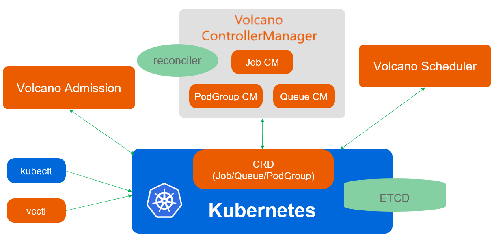
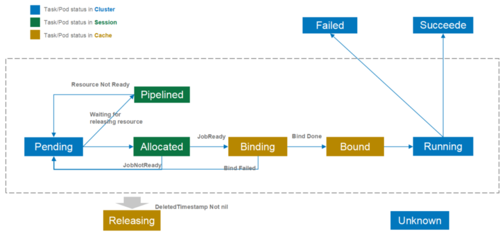

# Volcano

> [Volcano](https://volcano.sh/zh/docs/)：基于Kubernetes的高性能工作负载调度引擎。

- 作为一个通用批处理平台，Volcano与几乎所有的主流计算框 架无缝对接，如[Spark](https://spark.apache.org/) 、[TensorFlow](https://tensorflow.google.cn/) 、[PyTorch](https://pytorch.org/) 、 [Flink](https://flink.apache.org/) 、[Argo](https://argoproj.github.io/) 、[MindSpore](https://www.mindspore.cn/) 、 [PaddlePaddle](https://www.paddlepaddle.org.cn/) 等；
- 提供了包括基于各种主流架构的CPU、GPU在内的异构设备混合调度能力；


Volcano支持各种调度策略，包括：

- Gang-scheduling
- Fair-share scheduling
- Queue scheduling
- Preemption scheduling
- Topology-based scheduling
- Reclaims
- Backfill
- Resource Reservation


## 架构



Volcano由scheduler、controllermanager、admission和vcctl组成:

- Scheduler： Volcano scheduler通过一系列的action和plugin调度Job，并为它找到一个最适合的节点。与Kubernetes default-scheduler相比，Volcano与众不同的 地方是它支持针对Job的多种调度算法。
- Controllermanager： Volcano controllermanager管理CRD资源的生命周期。它主要由**Queue ControllerManager**、 **PodGroupControllerManager**、 **VCJob ControllerManager**构成。
- Admission： Volcano admission负责对CRD API资源进行校验。
- Vcctl： Volcano vcctl是Volcano的命令行客户端工具。

### Scheduler

负责Pod调度的组件，它由一系列action和plugin组成。action定义了调度各环节中需要执行的动作；plugin根据不同场景提供了action 中算法的具体实现细节。


工作流程如下：

1. 客户端提交的Job被scheduler观察到并缓存起来。
2. **周期性的开启会话，一个调度周期开始**。
3. 将没有被调度的Job发送到会话的待调度队列中。
4. 遍历所有的待调度Job，按照定义的次序**依次执行enqueue、allocate、preempt、reclaim、backfill等动作，为每个Job找到一个最合适的节点**。将该Job 绑定到这个节点。action中执行的具体算法逻辑取决于注册的plugin中各函数的实现。
5. 关闭本次会话。


## 概念

### PodGroup

强关联pod的集合，主要用于批处理工作负载场景，比如Tensorflow中的一组ps和worker。



### Queue

queue是容纳一组**podgroup**的队列，也是该组podgroup获取集群资源的划分依据。

`kubectl get Queue default`

- volcano启动后，会默认创建名为default的queue，weight为1。后续下发的job，若未指定queue，默认属于default queue

```yaml
apiVersion: scheduling.volcano.sh/v1beta1
kind: Queue
metadata:
  creationTimestamp: "2020-08-10T11:54:36Z"
  generation: 1
  name: default
  resourceVersion: "559"
  selfLink: /apis/scheduling.volcano.sh/v1beta1/queues/default
  uid: 14082e4c-bef6-4248-a414-1e06d8352bf0
spec:
  # 该queue在资源使用量超过该queue所应得的资源份额时，是否允许其他queue回收该queue使用超额的资源
  reclaimable: true
  weight: 1
  # 所有podgroup使用资源量之和的上限，它是一个硬约束
  capability:
    cpu: "4"
    memory: "4096Mi"
status:
  state: Open
```


### VolcanoJob

简称vcjob，是Volcano自定义的Job资源类型。

可**指定调度器、支持最小运行pod数、 支持task、支持生命周期管理、支持指定队列、支持优先级调度**等

```yaml
apiVersion: batch.volcano.sh/v1alpha1
kind: Job
metadata:
  name: test-job
spec:
  minAvailable: 3
  schedulerName: volcano
  priorityClassName: high-priority
  policies:
    - event: PodEvicted
      action: RestartJob
  plugins:
    ssh: []
    env: []
    svc: []
  maxRetry: 5
  queue: default
  volumes:
    - mountPath: "/myinput"
    - mountPath: "/myoutput"
      volumeClaimName: "testvolumeclaimname"
      volumeClaim:
        accessModes: [ "ReadWriteOnce" ]
        storageClassName: "my-storage-class"
        resources:
          requests:
            storage: 1Gi
  tasks:
    - replicas: 6
      name: "default-nginx"
      template:
        metadata:
          name: web
        spec:
          containers:
            - image: nginx
              imagePullPolicy: IfNotPresent
              name: nginx
              resources:
                requests:
                  cpu: "1"
          restartPolicy: OnFailure
```


## 安装

```bash
 $ kubectl create namespace volcano-system
```

