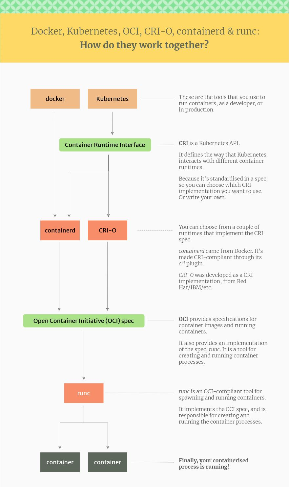
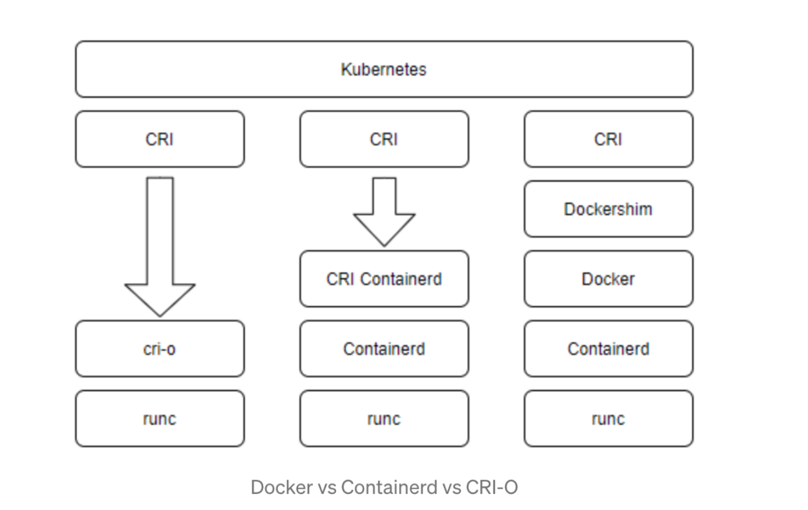

# 容器生态

容器镜像标准（image spec）。

## 容器运行时标准

容器运行时标准 （runtime spec）的实现：

- Low-Level 容器运行时：负责为容器建立namespaces和cgroups
  - runc：容器运行时，如runc
  - runv：基于虚拟机的运行时，通过虚拟化 guest kernel，将容器和主机隔离开来，如 kata, Firecracker
  - runsc：runc + safety，如gvisor，通过拦截应用程序的所有系统调用，提供安全隔离的轻量级容器运行时沙箱。
- High-Level容器运行时：除了LowLevel，还需**镜像格式、镜像管理和共享镜像**相关的API接口和特性
  - dockershim
  - containerd
  - cri-o

Kubernetes 只需支持 containerd 等high-level container runtime即可。

Docker Vs ContainerD Vs crio

### [Runc](https://github.com/opencontainers/runc)

> CLI tool for spawning and running containers according to the OCI specification.
>
> Please note that runc is **a low level tool not designed with an end user** in mind. 

- runc fully supports cgroup v2 (unified mode) since v1.0.0-rc93

> In order to enable seccomp support you will need to install libseccomp on your platform.
>
> —runc需要seccomp的支持，seccomp是一个Linux系统调用的“管理过滤”工具，可以认为它限制应用的权限

 **容器运行时标准**的参考实现：

- 从 Docker 的 libcontainer 中迁移而来的，实现了容器启停、资源隔离等功能。

### [Kata](https://github.com/kata-containers/kata-containers)

> Kata Containers is an open source project and community working to build a standard implementation of **lightweight Virtual Machines (VMs)** that feel and perform like containers, but provide the workload isolation and security advantages of VMs.

### [Gvisor](https://github.com/google/gvisor)

> Application Kernel for Containers.
>
> gVisor is an application kernel, written in Go, that implements a substantial portion of the [Linux system call interface](https://en.wikipedia.org/wiki/Linux_kernel_interfaces). It provides an additional layer of isolation between running applications and the host operating system.
>
> gVisor includes an [Open Container Initiative (OCI)](https://www.opencontainers.org/) runtime called `runsc` that makes it easy to work with existing container tooling. The `runsc` runtime integrates with Docker and Kubernetes, making it simple to run sandboxed containers.

### [Containerd](./containerd/README.md)

> [An open and reliable container runtime. ](https://github.com/containerd/containerd)CNCF gradulated project.

containerd 是一个工业级标准的容器运行时，它强调**简单性**、**健壮性**和**可移植性**，其功能包括：

- 管理容器的生命周期（从创建容器到销毁容器）
- 拉取/推送容器镜像
- 存储管理（管理镜像及容器数据的存储）
- 调用 runc 运行容器（与 runc 等容器运行时交互）
- 管理容器网络接口及网络

### [cri-o](https://github.com/cri-o/cri-o)

> Open Container Initiative-based implementation of Kubernetes Container Runtime Interface.

## 其它

### [Podman](https://podman.io/)

Podman 可以**管理和运行**任何符合 OCI（Open Container Initiative）规范的容器和容器镜像。Podman 提供了一个与 Docker 兼容的命令行前端来管理 Docker 镜像。

- 不需要在你的系统上运行任何守护进程，并且它也可以在没有 root 权限的情况下运行。