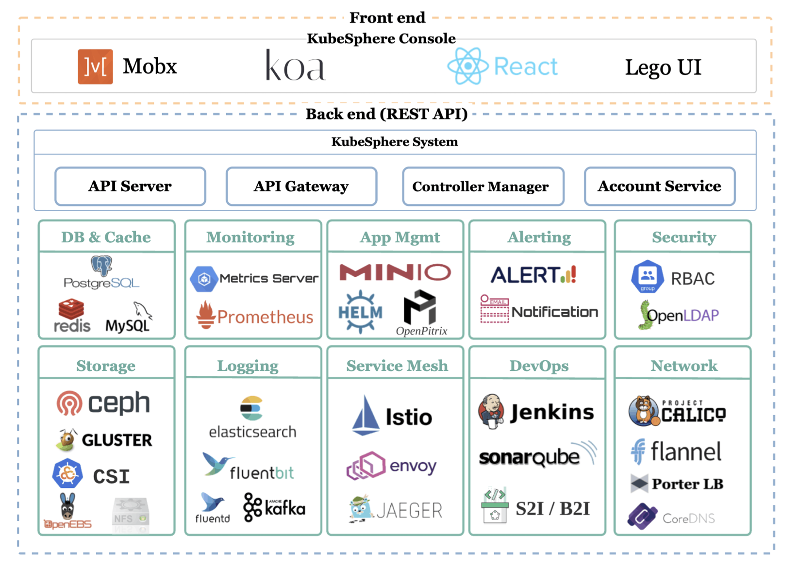

# [KubeSphere](https://kubesphere.com.cn/)

[KubeSphere](https://kubesphere.com.cn/) 是在 [Kubernetes](https://kubernetes.io/) 之上构建的面向云原生应用的 **容器混合云**，支持多云与多集群管理，提供全栈的 IT 自动化运维的能力，简化企业的 DevOps 工作流。

## 架构

