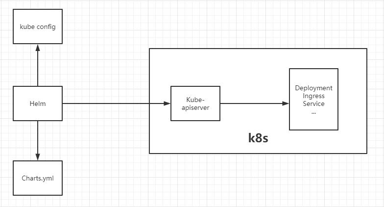

# Helm

## 概念



简化Kubernetes应用的部署和管理，等价于CentOS的yum；
- **Chart**: 是Helm管理的安装包，里面包含需要部署的安装包资源。可以把Chart比作CentOS yum使用的rpm文件。每个Chart包含下面两部分：
  - **包的基本描述文件Chart.yaml**
  - 放在**templates目录**中的一个或多个**Kubernetes manifest文件模板**
- **Release**：是chart的部署实例，一个chart在一个Kubernetes集群上可以有多个release，即这个chart可以被安装多次；
- **Repository：chart**的仓库，用于发布和存储chart

v3 版本仅有客户端 ***helm*** ：

- helm是一个命令行工具，可在本地运行，一般运行在CI/CD Server上。

***templates*** 目录

- Kubernetes 资源的配置模板，Helm 会将 `values.yaml` 中的参数值注入到模板中生成标准的 YAML 配置文件

## 组成

### Chart模板

参考 https://helm.sh/docs/chart_template_guide/

```shell
$ helm create nginx
$ tree .
.
├── charts
├── Chart.yaml
├── templates
│   ├── deployment.yaml
│   ├── _helpers.tpl
│   ├── hpa.yaml
│   ├── ingress.yaml
│   ├── NOTES.txt
│   ├── serviceaccount.yaml
│   ├── service.yaml
│   └── tests
│       └── test-connection.yaml
└── values.yaml

3 directories, 10 files
```


## 命令

### search

- `helm search repo mysql` ：搜索charts

### install

- `helm install aliyun aliyun/mysql`：安装chart

### create

- ``：创建应用模板

### lint

- `helm lint promocouponsvc/`
  - 会检测 chart 的语法，报告错误以及给出建议；

### package

- `helm package promocouponsvc/`
  - 打包后生成一个 tgz文件


## 安装

```shell
$ tar -zxvf helm-v3.2.1-linux-amd64.tar.gz
$ cp linux-amd64/helm /usr/local/bin/
$ helm version
#　version.BuildInfo{Version:"v3.2.1", GitCommit:"fe51cd1e31e6a202cba7dead9552a6d418ded79a", GitTreeState:"clean", GoVersion:"go1.13.10"}
```


## 配置

配置国内Chart仓库

- 微软仓库（http://mirror.azure.cn/kubernetes/charts/）
- 阿里云仓库（https://kubernetes.oss-cn-hangzhou.aliyuncs.com/charts ）
- 官方仓库（https://hub.kubeapps.com/charts/incubator）

```shell
$ helm repo add stable http://mirror.azure.cn/kubernetes/charts
$ helm repo add aliyun https://kubernetes.oss-cn-hangzhou.aliyuncs.com/charts 
$ helm repo update
# 删除存储库
$ helm repo remove aliyun
```

