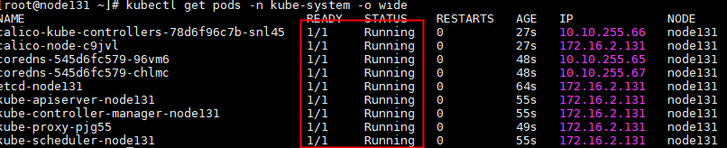

# 部署

目前为止，在容器里运行`kubelet`依然没有非常稳妥的解决办法（因为`kubelet`需要设置容器的namespace），不建议在生产环境中直接使用。

## 系统配置（所有节点）

### 关闭selinux

```bash
# 1.临时关闭
setenforce 0 
# 2.永久关闭，再执行以下命令
sed -i "s/SELINUX=enforcing/SELINUX=disabled/g" /etc/selinux/config
```

### 关闭swap分区

```bash
# 1.临时关闭 
swapoff -a 
# 2.永久关闭，再执行以下命令，注释掉swap的挂载
sed -i 's/.*swap/#&/' /etc/fstab 
```

### 关闭防火墙

```bash
#关闭防火墙 
systemctl stop firewalld 
#设置不自启 
systemctl disable firewalld 
```

### 加载ipvs模块

**默认情况下，kube-proxy将在kubeadm部署的集群中以`iptables`模式运行；(需确认）**

需要注意的是，**当内核版本大于4.19（centos 7内核版本为3.10）时**，移除了`nf_conntrack_ipv4`模块，kubernetes官方建议使用`nf_conntrack`代替，否则报错无法找到`nf_conntrack_ipv4`模块

```bash
yum install -y ipset ipvsadm 
# nf_conntrack_ipv4 
cat > /etc/sysconfig/modules/ipvs.modules <<EOF
 #!/bin/bash modprobe -- ip_vs
 modprobe -- ip_vs_rr
 modprobe -- ip_vs_wrr
 modprobe -- ip_vs_sh
 modprobe -- nf_conntrack 
 EOF  
chmod +x /etc/sysconfig/modules/ipvs.modules && bash /etc/sysconfig/modules/ipvs.modules 
```

### 其它配置

配置内核参数

```bash
# 绑定非本机 IP （ip_nonlocal_bind）
# 将Linux系统作为路由或者VPN服务就必须要开启IP转发功能（ip_forward）
vim /etc/sysctl.d/kubernetes.conf
  net.bridge.bridge-nf-call-ip6tables = 1
  net.bridge.bridge-nf-call-iptables = 1  
  net.ipv4.ip_nonlocal_bind = 1
  net.ipv4.ip_forward = 1
  vm.swappiness = 0  

sysctl -p /etc/sysctl.d/kubernetes.conf 
# 如果出错
modprobe br_netfilter 
```

所有用户的打开文件数

```bash
echo "* soft nofile 65536" >> /etc/security/limits.conf 
echo "* hard nofile 65536" >> /etc/security/limits.conf 
```


## 安装docker（所有节点)

1）配置yum源

```bash
# cd /etc/yum.repos.d/ 
# curl -O http://mirrors.aliyun.com/docker-ce/linux/centos/docker-ce.repo 
```

2）安装docker

```bash
yum -y install docker-ce 
```

3）配置docker

```bash
mkdir /etc/docker 
vim /etc/docker/daemon.json
 {   "exec-opts": ["native.cgroupdriver=systemd"],
     "log-driver": "json-file", 
     "log-opts": { 
       "max-size": "100m"
     },
    "storage-driver": "overlay2",
    "storage-opts": [ 
      "overlay2.override_kernel_check=true"
    ],
     "registry-mirrors": [
        "https://1nj0zren.mirror.aliyuncs.com",
        "https://docker.mirrors.ustc.edu.cn",
        "http://f1361db2.m.daocloud.io",
        "https://registry.docker-cn.com"
    ]

} 
```

修改`docker Cgroup Driver`为`systemd`（不用修改，上面已经配置）

```bash
# # 将/usr/lib/systemd/system/docker.service文件中的这一行 ExecStart=/usr/bin/dockerd -H fd:// --containerd=/run/containerd/containerd.sock
# # 修改为 ExecStart=/usr/bin/dockerd -H fd:// --containerd=/run/containerd/containerd.sock --exec-opt native.cgroupdriver=systemd
# 如果不修改，在添加 worker 节点时可能会碰到如下错误
# [WARNING IsDockerSystemdCheck]: detected "cgroupfs" as the Docker cgroup driver. The recommended driver is "systemd". 
# Please follow the guide at https://kubernetes.io/docs/setup/cri/
sed -i "s#^ExecStart=/usr/bin/dockerd.*#ExecStart=/usr/bin/dockerd -H fd:// --containerd=/run/containerd/containerd.sock --exec-opt native.cgroupdriver=systemd#g" /usr/lib/systemd/system/docker.service 
```

4）启动docker

```bash
systemctl enable docker 
systemctl start docker 
```

## kubeadmin 安装 k8s

### 安装kubeadm（所有节点)

- 配置 k8s 的yum repo

```bash
cat <<EOF > /etc/yum.repos.d/kubernetes.repo
[kubernetes]
name=Kubernetes
baseurl=http://mirrors.aliyun.com/kubernetes/yum/repos/kubernetes-el7-x86_64
enabled=1
gpgcheck=0
repo_gpgcheck=0
gpgkey=http://mirrors.aliyun.com/kubernetes/yum/doc/yum-key.gpg
       http://mirrors.aliyun.com/kubernetes/yum/doc/rpm-package-key.gpg
EOF
```

- 安装 kubelet, kubeadm, kubectl

```bash
# 自动安装依赖kubelet和kubectl
yum install kubeadm-1.21.1
```

- 启动 kubelet

```bash
systemctl enable kubelet && systemctl start kubelet 
```

### 初始化Master（仅master节点）

创建 `kubeadm-config.yaml`，

```yaml
apiVersion: kubeadm.k8s.io/v1beta2
kind: InitConfiguration
nodeRegistration:
  kubeletExtraArgs:
    cgroup-driver: "systemmd"
---
apiVersion: kubeadm.k8s.io/v1beta2
kind: ClusterConfiguration
kubernetesVersion: v1.21.1
clusterName: "hc_bigdata_c1"
controllerManager:
  extraArgs:
    horizontal-pod-autoscaler-sync-period: "10s"
    node-monitor-grace-period: "10s"
apiServer:
  exitArgs:
    runtime-config: "api/all=true"
imageRepository: registry.aliyuncs.com/google_containers  
controlPlaneEndpoint: "node131:6443"
networking:
  podSubnet: "10.10.0.1/16"

```

- 初始化

```shell 
kubeadm init --config=kubeadm-config.yaml --upload-certs
```

- 初始化 root 用户的 kubectl 配置

```bash
rm -rf $HOME/.kube/
mkdir -p $HOME/.kube
sudo cp -i /etc/kubernetes/admin.conf $HOME/.kube/config
sudo chown $(id -u):$(id -g) $HOME/.kube/config
```

- 安装 calico（网络）

```bash
# 数据存储在Kubernetes API Datastore服务中
curl https://docs.projectcalico.org/manifests/calico.yaml -o calico.yaml
# 还是
kubectl apply -f calico.yaml # configmap/calico-config created 
# 查看
kubectl get pod --all-namespaces
```

成功后，应该显示类似的服务状态：



### 部署node节点

主节点（Master）获取 join 参数

```bash
$ kubeadm token create --print-join-command
kubeadm join 192.168.174.129:6443 --token a95vmc.yy4p8btqoa7e5dwd     --discovery-token-ca-cert-hash sha256:7c43918ee287d21fe9b70e4868e2e0fdd8c5f6b829a825822aecdb8d207494fc 
```

在 从节点 输入刚才获取的join参数输出，执行join命令

```bash
$ kubeadm join 192.168.174.129:6443 --token 46q0ei.ivbs1u1n2a3tayma     --discovery-token-ca-cert-hash sha256:7c43918ee287d21fe9b70e4868e2e0fdd8c5f6b829a825822aecdb8d207494fc 
```

查看节点状态

```bash
[root@node131 ~]# kubectl get node
NAME      STATUS   ROLES                  AGE    VERSION
node131   Ready    control-plane,master   18m    v1.21.1
node132   Ready    <none>                 105s   v1.21.3
```

待所有节点都ready后, 集群部署完成。


### kube-proxy开启ipvs（在master节点执行就行）

修改ConfigMap的`kube-system/kube-proxy`中的`config.conf`，`mode: "ipvs"`

```bash
kubectl edit cm kube-proxy -n kube-system 
```

之后重启各个节点上的kube-proxy pod：

```bash
kubectl get pod -n kube-system | grep kube-proxy | awk '{system("kubectl delete pod "$1" -n kube-system")}'
```


## 存储配置

见 [K8s 部署 CephFS](./k8s_rook_ceph.md)

## Dashborad部署

部署和查看

```bash
kubectl apply -f https://raw.githubusercontent.com/kubernetes/dashboard/v2.3.1/aio/deploy/recommended.yaml
# 查看
kubectl get pods -n kubernetes-dashboard
# 配置代理，接受所有地址的访问
kubectl  proxy --address="172.16.2.131" --port=8001 --accept-hosts="^.*"
```

```bash
# 查看kubernetes-dashboard的token
kubectl -n kubernetes-dashboard describe secret $(kubectl -n kubernetes-dashboard get secret | grep kubernetes-dashboard | awk '{print $1}')
```

该token可能因为kubernetes-dashboard 这个账户的角色权限不够，界面数据出问题。

**创建dashboard-adminuser.yaml**（未尝试）

```yaml
cat > dashboard-adminuser.yaml << EOF
apiVersion: v1
kind: ServiceAccount
metadata:
  name: admin-user
  namespace: kubernetes-dashboard

---
apiVersion: rbac.authorization.k8s.io/v1
kind: ClusterRoleBinding
metadata:
  name: admin-user
roleRef:
  apiGroup: rbac.authorization.k8s.io
  kind: ClusterRole
  name: cluster-admin
subjects:
- kind: ServiceAccount
  name: admin-user
  namespace: kubernetes-dashboard  
EOF
```


```bash
# 创建了一个叫 admin-user 的服务账号，并放在kubernetes-dashboard 命名空间下，并将 cluster-admin 角色绑定到admin-user账户，这样admin-user账户就有了管理员的权限。默认情况下，kubeadm创建集群时已经创建了cluster-admin角色，我们直接绑定即可。
kubectl apply -f dashboard-adminuser.yaml
# 查看admin-user账户的token
kubectl -n kubernetes-dashboard describe secret $(kubectl -n kubernetes-dashboard get secret | grep admin-user | awk '{print $1}')

```


## Master节点执行Pod配置

默认情况下，Master节点是不允许运行用户Pod的。通过[`Taint/Toleration`机制](./conf.md#Taint/Toleration)，可以在Master节点部署用户Pods。

删除Master的Taint

```bash
kubectl taint nodes --all node-role.kubernetes.io/master-
```


## 问题

下载过程中可能会出现报错信息提示镜像：

`docker pull registry.aliyuncs.com/google_containers/coredns/coredns:v1.8.0`

没有下载下来，这是由于阿里云命名错误（多了个coredns） ，先通过docker手动下载镜像。

然后进行重新tag命名：

```bash
docker tag $IMAGE_ID registry.aliyuncs.com/google_containers/coredns/coredns:v1.8.0
```

