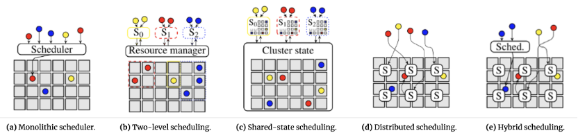

# 调度器的分类

业内的集群调度系统按照架构区分，可以分为**单体式调度器、两级调度器、共享状态调度器、分布式调度器和混合调度器**这五种不同架构（见下图）

- **单体式调度器**：使用复杂的调度算法结合集群的全局信息，计算出高质量的放置点，不过延迟较高。如Google的Borg系统、开源的Kubernetes系统。
- **两级调度器：**通过将**资源调度和作业调度分离**，解决单体式调度器的局限性。两级调度器允许根据特定的应用做不同的作业调度逻辑，且同时保持了不同作业之间共享集群资源的特性，可是无法实现高优先级应用的抢占。具有代表性的系统是Apache Mesos和Hadoop YARN。
- **共享状态调度器**：通过半分布式的方式来解决两级调度器的局限性，共享状态下的每个调度器都拥有一份集群状态的副本，且调度器独立对集群状态副本进行更新。一旦本地的状态副本发生变化，整个集群的状态信息就会被更新，但持续资源争抢会导致调度器性能下降。具有代表性的系统是Google的Omega和微软的Apollo。
- **分布式调度器**：使用较为简单的调度算法以实现针对大规模的高吞吐、低延迟并行任务放置，但由于调度算法较为简单并缺乏全局的资源使用视角，很难达到高质量的作业放置效果，代表性系统如加州大学的Sparrow。
- **混合调度器**将工作负载分散到集中式和分布式组件上，对长时间运行的任务使用复杂算法，对短时间运行的任务则依赖于分布式布局。微软Mercury就采取了这种这种方案。

