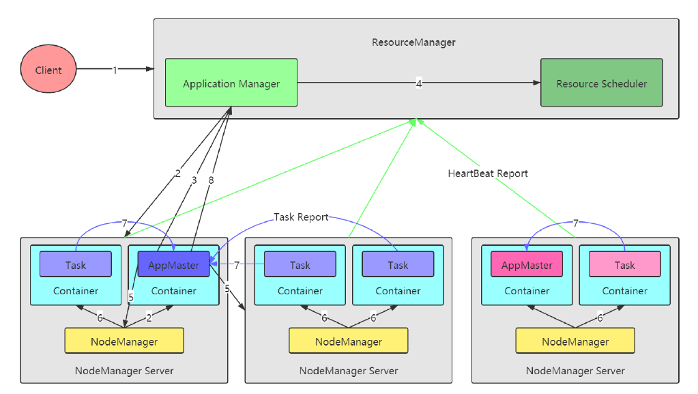
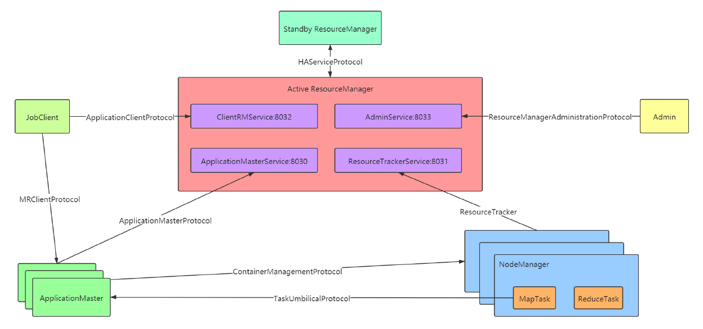
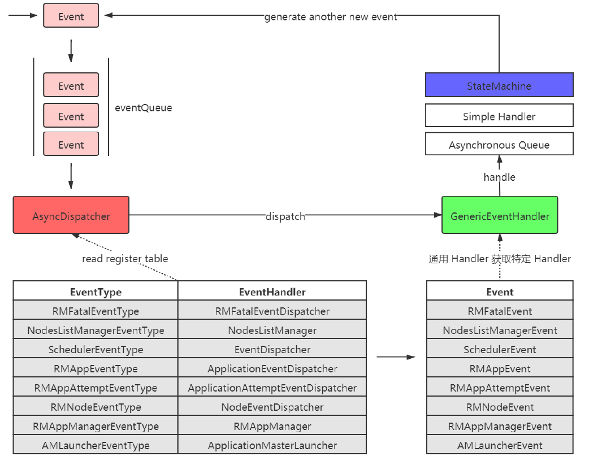

# Yarn 

服务化（Service）+ 事件驱动（Event/Dispatcher），模块间通过事件联系，异步、并发，更适合大型分布式系统。

## 架构



## 组件

### Resource Manager

- 处理客户端请求
- 启动/监控ApplicationMaster
- 监控NodeManager
- 资源分配与调度

### Node Manager

- 单个节点上的资源管理
- 处理来自ResourceManger的命令
- 处理来自ApplicationMaster的命令

### Application Master

- 为应用程序申请资源，并分配给内部任务
- 任务调度、监控与容错


## 通信



### Yarn间通信

AM，RM，NM，Admin四个服务

- **ApplicationClientProtocol**（Client -> RM） **clients 与 RM 之间的协议**，如MR JobClient 通过该 RPC 协议提交应用程序、 查询应用程序状态等；
- **ResourceTracker**（NM -> RM）NM 与 RM 之间的协议， NM 通过该 RPC 协议向 RM 注册， 并定时发送心跳信息汇报当前节点的资源使用情况和
  Container运行情况。

- **ApplicationMasterProtocol**（AM -> RM）AM 与 RM 之间的协议， AM 通过该 RPC 协议向 RM 注册和撤销自己， 并为各个任务申请资源。
- **ContainerManagementProtocol**（AM -> NM）AM 与 NM 之间的协议， AM 通过该 RPC 要求 NM 启动或者停止 Container， 获取各个
  Container 的使用状态等信息。
- **ResourceManagerAdministrationProtocol**（RM Admin -> RM）Admin 与 RM 之间的通信协议， Admin 通过该 RPC 协议更新系统配置文件，
  例如节点黑白名单等。
- **HAServiceProtocol**（Active RM HA Framework Standby RM）Active RM 和 Standby RM 之间的通信协议，提供状态监控和 fail over 的 HA 服
  务；

### MapReduce间通信

- **TaskUmbilicalProtocol**（YarnChild -> MRAppMaster）YarnChild 和 MRAppMaster 之间的通信协议，用于 MRAppMaster 监控跟踪
  YarnChild 的运行状态，YarnChild 向 MRAppMaster 拉取 Task 任务信息。
- **MRClientProtocol**（JobClient -> ApplicationMaster）JobClient 和 ApplicationMaster 之间的通信协议。用于客户端拉取 Application 的执行状
  态，以及 Application 返回执行结果给 客户端。


## 事件

YARN 将各种处理逻辑抽象成事件和对
应事件调度器，并将每类事件的处理过程分割成多个步骤，用有限状态机表示。AsycDispatcher 是 YARN 的中央异步调度器。在 ResourceManager
中，几乎所有的事件都通过 AsyncDispatcher 进行事件的派发。



## 状态机

在 YARN 中，每种状态转换（doTransition 方法去执行状态转换，addTransition 注册状态转换）由一个四元组表示，分别是**转换前状态（preState）、**
**转换后状态（postState）、事件（event）和回调函数/转换器（hook = Transition）**。

YARN 定义了三种状态转换方式，具体如下：

- 一个初始状态、一个最终状态、一种事件：经过处理之后，无论如何，进入到一个唯一状态；
- 一个初始状态、多个最终状态、一种事件：不同的逻辑处理结果，可能导致进入不同的状态；
- 一个初始状态、一个最终状态、多种事件：多个不用的事件，可能触发到多个不同状态的转换；


为了便于用户查看这些状态机的状态变化以及相关事件，YARN 提供了一个状态机可视化工具，具体操作步骤如下。

1. 将状态机转化为 graphviz(.gv) 格式的文件，在源代码根目录下执行编译命令如下：

   `mvn compile -Pvisualize`

2. 使用可视化包 graphviz 中的相关命令生成状态机图，Shell 命令具体如下：

   ```shell
   # 需要先安装graphviz
   # yum install graphviz
   dot -Tpng ResourceManager.gv > ResourceManager.png
   dot -Tpng NodeManager.gv > NodeManager.png
   dot -Tpng MapReduce.gv > MapReduce.png
   ```

   
