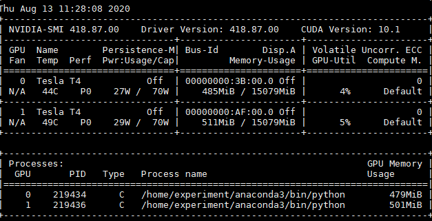
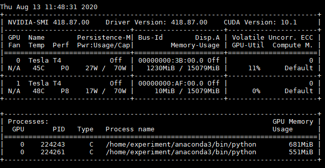

[toc]

# Yarn GPU（3.x版本）

## 前提

- 只支持Nvidia的GPUs调度；
- YARN NodeManager 所在机器必须预先安装了 Nvidia 驱动器；
- 如果使用 Docker 作为容器的运行时上下文，需要安装 nvidia-docker 1.0。


注：**GPU资源的隔离，需要使用 LinuxContainerExecutor** (YARN-9419)，当前 GpuResourcePlugin

## 配置

### GPU调度

#### resource-types.xml

```xml
<configuration>
  <property>
     <name>yarn.resource-types</name>
     <value>yarn.io/gpu</value>
  </property>
</configuration>
```

`yarn-site.xml`中必须配置 `yarn.scheduler.capacity.resource-calculator`为`org.apache.hadoop.yarn.util.resource.DominantResourceCalculator`。

### GPU隔离

#### yarn-site.xml

在NodeManager端启用GPU隔离模块

```xml
<property>
    <name>yarn.nodemanager.resource-plugins</name>
    <value>yarn.io/gpu</value>
</property>
```

默认情况下，当设置了上面的配置时，YARN会自动检测并配置gpu。

只有当管理员有特殊要求时，才需要在`yarn-site.xml`配置以下配置。

1）**管理的GPU设备**

`yarn.nodemanager.resource-plugins.gpu.allowed-gpu-devices`：默认auto。

- 指定NM管理的GPU设备，逗号分隔；GPU设备的数量会上报给NM进行调度决策；
- GPU设备是通过它们的副设备号和索引来识别
  - 获取gpu minor设备号的一种常用方法是使用`nvidia-smi -q`并搜索*Minor Number*输出；
  - GPU的索引格式为`index:minor_number[,index:minor_number...]`；
  - 示例"0:0,1:1,2:2,3:4"，管理的GPU为MinorNumber为0,1,2,4，其索引为0,1,2,3

2）**发现GPU的命令**

`yarn.nodemanager.resource-plugins.gpu.path-to-discovery-executables`：nvidia-smi命令的绝对路径

3）**Docker插件相关的配置**

当用户需要在Docker容器中运行GPU应用程序时，可以自定义配置。如果管理员遵循nvidia-docker的默认安装/配置，则不需要它们。

`yarn.nodemanager.resource-plugins.gpu.docker-plugin`：默认 nvidia-docker-v1

为GPU指定docker命令插件。默认使用Nvidia docker V1.0, V2.x可以使用`nvidia -docker-v2`。

`yarn.nodemanager.resource-plugins.gpu.docker-plugin.nvidia-docker-v1.endpoint`：默认http://localhost:3476/v1.0/docker/cli

指定nvidia-docker-plugin的end point。请查看文档:https://github.com/NVIDIA/nvidia-docker/wiki了解更多细节。

4) **CGroups mount**

GPU隔离使用**CGroup设备控制器对每个GPU设备**进行隔离。接下来的配置应该添加到**yarn-site.xml来自动挂载CGroup子设备**，否则管理员必须手动创建device子文件夹来使用这个特性。

`yarn.nodemanager.linux-container-executor.cgroups.mount`：默认false

#### container-executor.cfg

**添加**以下内容

```ini
[gpu]
module.enabled=true
```

当用户需要在非docker环境下运行GPU应用时:

```ini
[cgroups]
# This should be same as yarn.nodemanager.linux-container-executor.cgroups.mount-path inside yarn-site.xml
root=/sys/fs/cgroup
# This should be same as yarn.nodemanager.linux-container-executor.cgroups.hierarchy inside yarn-site.xml
yarn-hierarchy=yarn
```

当用户需要在Docker环境下运行GPU应用时:

1）在docker部分添加GPU相关设备

通过`ls /dev/nvidia*`查看

```ini
[docker]
docker.allowed.devices=/dev/nvidiactl,/dev/nvidia-uvm,/dev/nvidia-uvm-tools,/dev/nvidia1,/dev/nvidia0
```

2）添加*nvidia-docker*到volumn-driver白名单

```ini
[docker]
...
docker.allowed.volume-drivers
```

3）添加*nvidia-driver_<version>*到只读mount的白名单

```ini
[docker]
...
docker.allowed.ro-mounts=nvidia_driver_375.66
```

4）如果使用*nvidia-docker-v2*作为gpu docker插件，则添加nvidia到运行时白名单中。

```ini
[docker]
...
docker.allowed.runtimes=nvidia
```


## 使用

### Distributed-shell + GPU

分布式shell目前支持指定内存和vcore之外的其他资源类型。

#### Distributed-shell + GPU without Docker

不使用docker容器运行分布式shell(要求2个任务，每个任务有3GB内存，1个vcore，2个GPU设备资源):

```shell
yarn jar <path/to/hadoop-yarn-applications-distributedshell.jar> \
  -jar <path/to/hadoop-yarn-applications-distributedshell.jar> \
  -shell_command /bin/nvidia-smi \
  -container_resources memory-mb=3072,vcores=1,yarn.io/gpu=2 \
  -num_containers 2
```

对于启动的Container任务可以看到如下信息（**如果节点有两个GPU，申请两个Container，每个Container一个GPU，则每个Container只打印一个GPU信息**）

```
Tue Dec  5 22:21:47 2017
+-----------------------------------------------------------------------------+
| NVIDIA-SMI 375.66                 Driver Version: 375.66                    |
|-------------------------------+----------------------+----------------------+
| GPU  Name        Persistence-M| Bus-Id        Disp.A | Volatile Uncorr. ECC |
| Fan  Temp  Perf  Pwr:Usage/Cap|         Memory-Usage | GPU-Util  Compute M. |
|===============================+======================+======================|
|   0  Tesla P100-PCIE...  Off  | 0000:04:00.0     Off |                    0 |
| N/A   30C    P0    24W / 250W |      0MiB / 12193MiB |      0%      Default |
+-------------------------------+----------------------+----------------------+
|   1  Tesla P100-PCIE...  Off  | 0000:82:00.0     Off |                    0 |
| N/A   34C    P0    25W / 250W |      0MiB / 12193MiB |      0%      Default |
+-------------------------------+----------------------+----------------------+

+-----------------------------------------------------------------------------+
| Processes:                                                       GPU Memory |
|  GPU       PID  Type  Process name                               Usage      |
|=============================================================================|
|  No running processes found                                                 |
+-----------------------------------------------------------------------------+
```

#### Distributed-shell + GPU with Docker

使用Docker容器运行分布式shell。

必须指定**YARN_CONTAINER_RUNTIME_TYPE**/**YARN_CONTAINER_RUNTIME_DOCKER_IMAGE**才能使用docker容器。

```shell
yarn jar <path/to/hadoop-yarn-applications-distributedshell.jar> \
       -jar <path/to/hadoop-yarn-applications-distributedshell.jar> \
       -shell_env YARN_CONTAINER_RUNTIME_TYPE=docker \
       -shell_env YARN_CONTAINER_RUNTIME_DOCKER_IMAGE=<docker-image-name> \
       -shell_command nvidia-smi \
       -container_resources memory-mb=3072,vcores=1,yarn.io/gpu=2 \
       -num_containers 2
```


### 效果

Yarn是没有通知container，可用的GPU卡号，而是通过cgroup device隔离，限定Container可以使用的卡号。


```shell
./bin/yarn jar share/hadoop/yarn/hadoop-yarn-applications-distributedshell-3.2.1.jar -jar share/hadoop/yarn/hadoop-yarn-applications-distributedshell-3.2.1.jar -shell_command '/home/experiment/anaconda3/bin/python /home/experiment/pytorch.py' -container_resources memory-mb=1024,vcores=1,yarn.io/gpu=1 -num_containers 2
```

python.sh

```python
# encoding: utf-8
import torch
from torch import nn

is_gpu = torch.cuda.is_available()
print("gpu是否可用：",is_gpu)

gpu_nums = torch.cuda.device_count()
print("gpu的数量：",gpu_nums)

x=torch.Tensor([1,2,3])
print(x)

# 指定第0号GPU
x=x.cuda(0)
print(x)
```

从结果中可以看出，两个Container，各申请一个GPU，但是分配在两个GPU设备中，即使在代码中指定cuda(0)。



如果没有配置LinuxContainerExecutor，则运行结果如下，都跑在一个GPU卡上。



### TODO：devices设备的配置