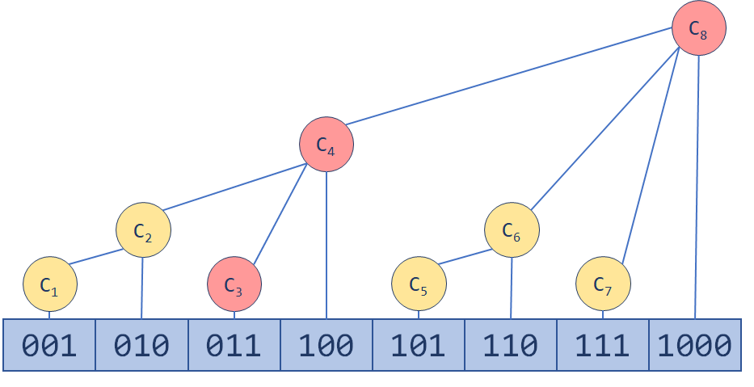

# 数组

> 所有代码实现见 [Java数据结构与算法](https://gitee.com/oscsc/data-structure-and-algorithm)

## 堆

堆可以用数组进行实现，堆是个完全二叉树。

## 并查集

> 假设元素间有关联，且存在传递关系，如何快速判断两个元素是否有关联。

**用途**

1、维护无向图的连通性。支持判断两个点是否在同一连通块内；
2、判断增加一条边是否会产生环：用在求解最小生成树的Kruskal算法里；

**定义**：管理一系列**不相交的集合**，只支持两种操作：

- **合并**（Union）：把两个不相交的集合合并为一个集合。
- **查询**（Find）：查询两个元素是否在同一个集合中。

**初始版本**（合并复杂度/查询复杂度：O(h)，h表示树的高度，最差为链表）

算法过程：每个元素只知道自己的父节点；

- 初始每个元素父节点即自身或者 -1，`ids[i] = i`；

- 查找元素所属的集合

  ```c
  int find(i) {
      while (ids[i] != i) {
          i = ids[i];
      }
      return i;
  }
  ```

- 合并两个元素时，将其中一个节点的集合指向另一个节点，`ids[find(i)]=j`；

- 判断两个是否处于同一个集合，`find(i)==find(j)`；

**路径压缩**

- 解决查找时次数过多的问题，防止树变成链表，查找复杂度变为O(n)；
- 查找时将x到根节点路径上的所有点的parent设为根节点，该优化方法称为压缩路径

**按秩合并**

- 维护每个子树的节点个数，合并时将小的子树合并到大的子树上
- 如果是维护子树的高度，则路径压缩会造成rank不准确，因此按照 size 进行合并；


## 树状数组

树状数组（**B**inary **I**ndex **T**ree, **BIT**），最简单的树状数组支持两种操作，时间复杂度均为 Olg(n)：

- **单点修改**：更改数组中一个元素的值
- **区间查询**：查询一个区间内所有元素的和

对于普通数组而言，**单点修改**的时间复杂度是O(1)，但**区间求和**的复杂度是O(n)。

### 原理

树状数组的定义：

- 二进制数最右边的一个1，连带着它之后的0为$lowbit(x)$，用$C(i)$维护区间$(A_i-lowbit(A_i), Ai]$，这样查询前n项和时需要合并的区间数是少于$log_2(n)$：


更新就是一个“**爬树**”的过程。一路往上更新，直到MAXN（树状数组的容量）。




$lowbit(x)=(x)\&(-x)$


## 线段数组

用于维护**区间信息**（要求满足结合律）。与树状数组相比，它可以实现 Olg(n) 的**区间修改**，还可以同时支持**多种操作**（加、乘)，更具通用性。

线段树是一棵**平衡二叉树**：

- **母结点代表整个区间的和**，越往下区间越小；
- 线段树的每个**节点**都对应一条**线段（区间）**，但并不保证所有的线段（区间）都是线段树的节点
- 对于线段树中的每一个**非叶子节点[a,b]**，它的左儿子表示的区间为**[a,(a+b)/2]**，右儿子表示的区间为**[(a+b)/2+1,b]**

### 原理

> 参考：https://zhuanlan.zhihu.com/p/106118909

就是**将[1,n]分解成若干特定的子区间（数量不超过4*n）**，然后，将每个区间[L,R]都分解为少量特定的子区间，通过对这些少量子区间的修改或者统计，来实现快速对[L,R]的修改或者统计。

用线段树统计的东西，必须**符合区间加法**，否则，不可能通过分成的子区间来得到[L,R]的统计结果。

符合区间加法的例子：

- 数字之和——总数字之和 = 左区间数字之和 + 右区间数字之和

- 最大公因数(GCD)——总GCD = gcd(左区间GCD , 右区间GCD );

- 最大值——总最大值=max(左区间最大值，右区间最大值)

不符合区间加法的例子：

-  众数——只知道左右区间的众数，没法求总区间的众数
-  01序列的最长连续零——只知道左右区间的最长连续零，没法知道总的最长连续零


“**懒标记**”（或延迟标记）：区间修改

- 朴素的想法是用**递归**的方式一层层修改（类似于线段树的建立），但这样的时间复杂度比较高；
- 使用懒标记，对于那些正好是线段树节点的区间，我们不继续递归下去，而是打上一个**标记**，将来要用到它的**子区间**的时候，再向下**传递**；
  - 向下延迟修改，但是向上显示的信息是修改以后的信息


标记有**相对标记**和**绝对标记**之分：**非递归线段树**只能维护相对标记。

**相对标记**是将区间的所有数+a之类的操作，标记之间可以共存，跟打标记的顺序无关（跟顺序无关才是重点）。

所以，可以在区间修改的时候不下推标记，留到查询的时候再下推。

**绝对标记**是将区间的所有数变成a之类的操作，打标记的顺序直接影响结果，

所以这种标记在区间修改的时候必须下推旧标记，不然会出错。