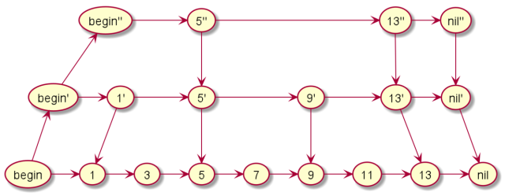

# List

## 跳表(SkipList)

> 跳表（Skiplist）是一个特殊的链表，相比一般的链表，有更高的查找效率，可比拟二叉查找树，平均期望的查找、插入、删除时间复杂度都是O(logn)。

- 建立层级索引，减少比较的次数，增加搜索效率；
- 空间增加一倍；

### 示意图

### 算法流程

1. 新节点和各层索引节点逐一比较，确定原链表的插入位置。O（logN）
2. 把索引插入到原链表。O（1）
3. 利用抛硬币的随机方式，决定新节点是否提升为上一级索引。结果为“正”则提升并继续抛硬币，结果为“负”则停止。O（logN）

## 无锁链表

