# 计算机基础

## 冯诺依曼计算机

冯诺依曼计算机：以运算器为中心

- 输入设备、输出设备，控制器，运算器，存储器

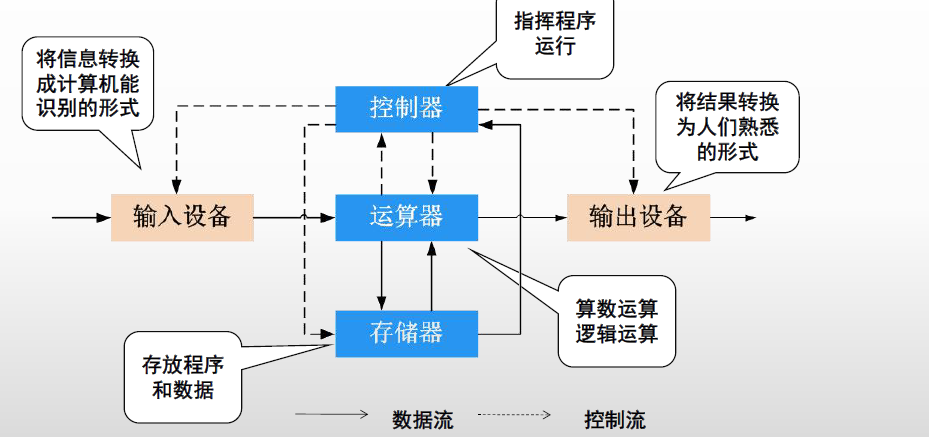

## 现代计算机硬件图

当前主流的计算机（建立在冯诺依曼体系上）：**以（内）存储器为核心**

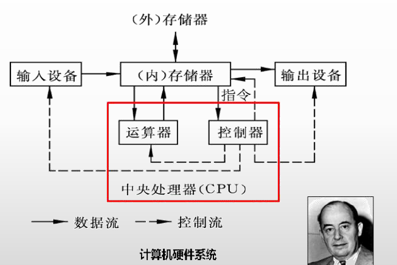

## 中央处理器（CPU）

包括**运算器**和**控制器**

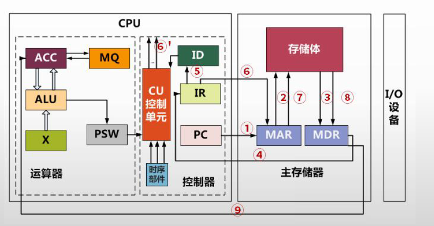

- 运算器
  - ALU（算术逻辑单元）：数据的算术运算和逻辑运算；
  - AC（累计寄存器）：通用寄存器，ALU使用，**暂存源操作数和结果**；
  - DR（数据缓冲寄存器）：写内存时，**暂存指令**和数据；
  - PSW（状态条件寄存器）：存状态标志和控制标志（如中断标志、溢出标志）；
- 控制器
  - PC（程序计算器）：存储下一条执行**指令的地址**；
  - IR（指令寄存器）：存储**即将执行**的**指令**；
  - ID（指令译码器）：对指令中的操作码字段进行分析解释；
  - AR（地址寄存器）：保存当前CPU所访问的内存单元的地址；
  - 时序部件：控制时序控制信号。

**指令的执行步骤**：

- 取指：PC -> AR -> 存储体 -> DR -> IR
  - PC 存储的指令地址，通过内存获取真是指令，存到 IR 中；
- 分析：OP（操作） -> ID -> CU控制器
- 执行：Ad -> AR -> 存储体 -> DR -> AC

## 主存

一般以 **8位二进制** 作为基本的存储单元。

**数据总线**：一次处理n位的数据，则数据总线的长度为n，**n同时表示为一个字的长度**；

**地址总线**：需要n位二进制数表示所有的地址，则地址总线的个数为n；

## 存储器

### 分类

按照**构成材料**分类：

- 半导体存储器
  - 静态存储器：双稳态触发器
  - 动态存储器：依靠电容上的电荷存储信息，主存
- 磁存储器
  - 利用磁性材料两种不同的状态长期保存信息，外存
- 光存储器
  - 利用光斑、晶像变化保存信息，外存

按照**工作方式**分：

- 读写存储器：RAM；
- 只读存储器：
  - 固定只读存储器ROM：不能写；
  - 可编程的只读存储器PROM：只能写一次；
  - 可擦除可编程的只读存储器EPROM：可多次编程，紫外线擦除；
  - 电擦除可编程的只读存储器EEPROM：可多次编程，电擦除；
  - 闪存：接近EEPROM，U盘

按照**访问方式**分：

- 按照地址访问；主存
- 按照内容访问：Cache

按照**寻址方式**分：

- **随机存储器**RAM：按地址访问存储器的任一单元，主存；
- **顺序存储器**SAM：访问时按顺序查找目标地址，磁带；
- **直接存储器**DAM：按照数据块所在位置访问，磁盘；
- **相联存储器**：也是随机存储，但是选择单元读写取决于内容而不是地址，如Cache；

## 校验码

### 码距和检错纠错

**码距**：编码系统中**任意（所有）两个码字**的**最小**距离；

- 距离：同一位置上不同值的个数和；

**纠错检错**：

- 在一个码组内为了检测 e 个误码，要求最小码距应该满足： d >= e + 1；
- 在一个码组内为了纠错 t 个误码，要求最小码距应该满足： d >= 2t + 1；
- 同时纠错检错： d >= t+ e + 1；

### 奇偶校验码

增加冗余位：只能发现**奇数个位置**出错的情况

- 偶校验码：所有1的个数（含冗余位）为偶数；
- 奇校验码：所有1的个数（含冗余位）为奇数；

分组校验：比如每8位添加一位冗余位

### 海明码

基于奇偶校验、分组校验；海明码默认进行偶校验

- 侦测**两个或以下同时发生的比特错误**，并能够**更正单一比特**的错误；
- 如在一个7位的信息中，单个位出错有7种可能，因此3个错误控制位就足以确定是否出错及哪一位出错；

**海明码的校验码的位置必须是在2^n位置**（n从0 开始，分别代表从右边数起分别是第1、2、4、8、16……），信息码也就是在非2^n位置

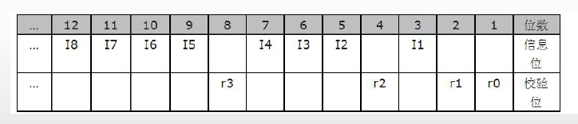

设数据位为n位，校验位位k位，则n和k必须满足以下关系：**2^k >= n + k + 1**；

比如**7个bit**中，三个校验位，4个数据位

- 第一组：1(001)，3(011)，5(101)，7(111)；
- 第二组：2(010)，3(011)，6(110)，7(111)；
- 第三组：4(100)，5(101)，6(110)，7(111)；

假设接收到数据后，计算出来的第一、二、三组的偶校验结果分别是0，1，0，则是第二位数据出了问题。

### 循环冗余校验码CRC

### 生成多项式和信息码字

生成多项式为 $G(X)=X^4+X+1$，对应信息码字为 10011：

- **信息码的位置k，表示为$X^k$是否在生成多项式中存在**；

### 模二除运算

补位0（个数位最高次幂的值），采用不进位加法计算（即异或），最后得到的余数为校验码：

示例：

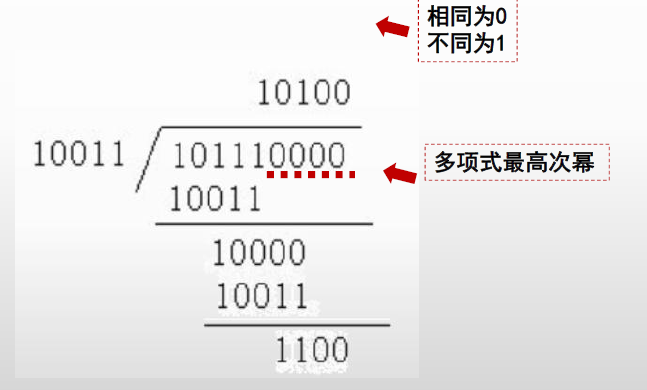

最终码为：101111100

## 指令

### 流水线

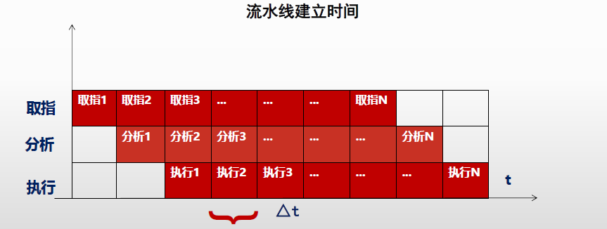

**流水线**

- **周期**($\triangle t$)：不同阶段，执行时间最长的一段的时间；
- **执行n条指令的执行时间**：
  - 理论公式：**$（t1 + t2 + ... + tk) + (n - 1) * \triangle t$ **
  - 实际公式：$（k + n - 1) * \triangle t$，即开始的第一条的执行，每段的执行时间统一按照同样的周期算；

- **吞吐率**：**指令执行条数** / **流水线的执行时间**；
- **最大吞吐率**：是**指令执行周期的倒数**；
- **加速比**：**不使用流水线的时间比上使用流水线的时间**；

## 高速缓冲存储器（Cache）

### 映射方式

主存放入Cache的几种计算方式：

- **直接映射**：主存划分为区（等价于Cache的大小），区内位置一一映射到Cache对应位置；

  - 算法简单（取模），但冲突率高

  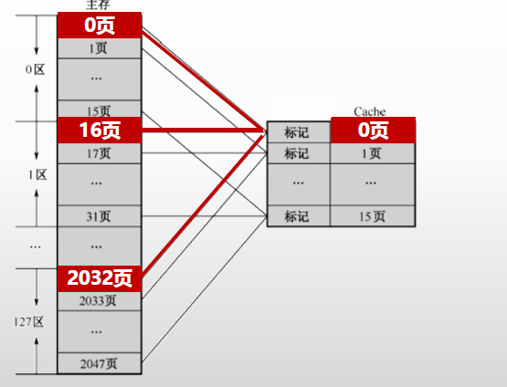

- **全相联映射**：主存的每个位置都可以映射到Cache的每个位置

  - 位置不受限，无法从主存块号中直接获得Cache的块号（需要一一比较是否存在），变换比较复杂，速度比较慢

    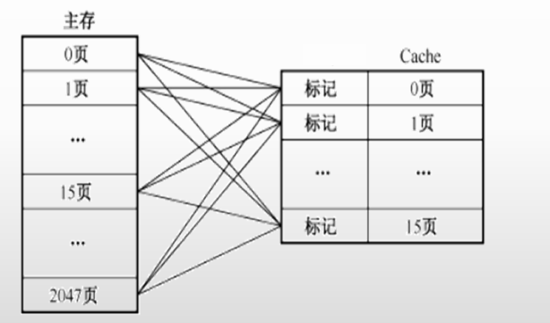

- **组相联映像**：Cache划分为多组，组内采用全相联，组间直接相连

  - **通过直接映射决定组号，全相联映射决定块号**；
  - 主存和Cache按同样大小划分成块，主存和Cache按同样大小划分成组
  - 主存中组内的块数(下图Cache的0-7共8组），等于Cache的分组数（下图的127区)；

  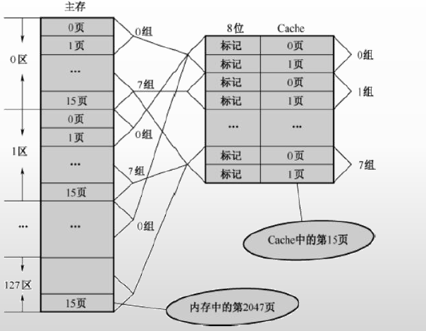

### 写策略

写回法（write-back）：**修改cache的内容，不立即写入主存**，只有此行被换出时才写回主存。

写直达（write-through）：**修改cache的内容，立即写入主存**；

标记法：修改数据时，**数据不写缓存只写入内存**，同时将cache的**标志位从1改为0**；

## 磁盘存储器

存储容量=$n×t×s×b$，n表示盘面数。

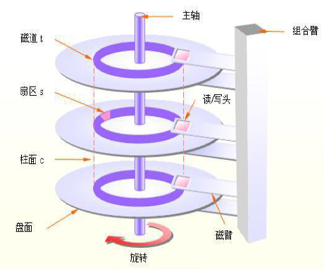

### 存储单位

#### 扇区

扇区是块设备传输数据的基本单元（磁盘进行读写的最小单位是扇区），是**块设备中最小的寻址单位**，扇区通常的大小为512B。

#### 块（Block）

**内核执行的所有磁盘操作都是以块为基本单位**。

磁盘块由连续几个（2^n）扇区组成。

#### 页（Page）

页、内存页或者虚拟页是指内存中的一段固定长度的块，其**在物理地址和虚拟内存地址上都是连续**，内存的最小存储单位。

一个页通常是以下操作的最小单元：

- 操作系统为程序分配空间；
- 内存和外存传输，比如说硬盘。

页的大小为磁盘块大小的2^n倍（一般磁盘块和页大小都是4K）。

### RAID

> RAID (Redundant Array of Independent Disks ) ：独立磁盘冗余阵列

**多个独立的高性能磁盘驱动器组成的磁盘子系统**，从而提供**比单个磁盘更高的存储性能和数据冗余**的技术，是一类**多磁盘管理**技术；

- **镜像**：将数据复制到多个磁盘，一方面可以提高可靠性，另一方面可并发从两个或多个副本读取数据来提高读性能。显而易见，镜像的写性能要稍低，确保数据正确地写到多个磁盘需要更多的时间消耗。

- **数据条带**：将数据**分片**保存在多个不同的磁盘，多个数据分片共同组成一个完整数据副本，这与镜像的多个副本是不同的，它通常用于性能考虑。数据条带具有更高的并发粒度，当访问数据时，可以同时对位于不同磁盘上数据进行读写操作，     从而获得非常可观的 I/O 性能提升 。

- **数据校验**：利用冗余数据进行数据错误检测和修复，冗余数据通常采用海明码、异或操作等算法来计算获得。利用校验功能，可以很大程度上提高磁盘阵列的可靠性、鲁棒性和容错能力。不过，数据校验需要从多处读取数据并进行计算和对比，会影响系统性能。

  

#### RAID0 - RAID6

- **RAID0** 是一种简单的、无数据校验的数据条带化技术，不是一种真正的 RAID ，因为它并不提供任何形式的冗余策略。
- **RAID1** 称为镜像，它将数据完全一致地分别写到工作磁盘和镜像 磁盘，它的**磁盘空间利用率为 50%** 。
  - RAID1 在**数据写入时，响应时间会有所影响**，但是读数据的时候没有影响。 
  - RAID1 提供了最佳的数据保护，一旦工作磁盘发生故障，系统自动从镜像磁盘读取数据，不会影响用户工作。无校验的相互镜像；

- **RAID2** 称为**纠错海明码**磁盘阵列，大数据传输IO性能高，但不利于小批量数据传输，数据冗余开销大，很少应用；
  - 单纠错，双验错，需要增加校验盘（4块数据盘需要增加三块校验盘）；

- **RAID3** （奇偶校验码的磁盘阵列），**至少需要三块磁盘**（两块数据，一块校验）
  - RAID3 完好时读性能与 RAID0 完全一致，并行从多个磁盘条带读取数据，性能非常高，同时还提供了数据容错能力；
  - 向 RAID3 写入数据时，必须计算与所有同条带的校验值，并将新校验值写入校验盘中。**一次写操作包含了写数据块、读取同条带的数据块、计算校验值、写入校验值等多个操作，系统开销非常大，性能较低**。
  - 读性能高、连续写性能高、随机写性能差，最少 3 个盘、有效容量 N-1、允许坏 1 个盘。

- **RAID4**和RAID3很像，数据都是依次存储在多个硬盘之上，奇偶校验码存放在独立的奇偶校验盘上，
  - 在数据分割上RAID3对数据的访问是按位进行的，**RAID4是以数据块为单位**。

- **RAID5**（无独立校验盘的奇偶校验码的磁盘阵列） 应该是目前**最常见的 RAID 等级**，**校验数据分布在阵列中的所有磁盘**上，而没有采用专门的校验磁盘，按照块的方式来组织数据；
  - 为 RAID0 和 RAID1 的折中方案，大批量和小批量的数据读写性能都很好；
  - 读性能高、连续写性能高、随机写性能一般，最少 3 个盘，**N块盘时有效容量 N-1、允许坏 1 个盘**；

- **RAID6** （独立的数据硬盘与两个独立的分布式校验方案）具有快速的读取性能、更高的容错能力（允许坏 2 个盘）：
  - 与RAID5比，增加了第二个独立的奇偶校验信息块，奇偶系统使用不同的算法；
  - 成本要高于 **RAID5** 许多，**写性能也较差**，并且设计和实施非常复杂；
  - RAID6 很少得到实际应用，主要**用于对数据安全等级要求非常高的场合**；
  - 一般是替代 RAID10 方案的经济性选择。最少 4 个盘、**N块盘有效容量 N-2**、允许坏 2 个盘。

- **RAID7**（最优化的异步高IO速率和高数据传速率）：独立存储计算机，自身带有操作系统和管理工具，完全**独立运行**；

|   |   |  |
| ----------------------- | ----------------------- | ---------------------- |
| 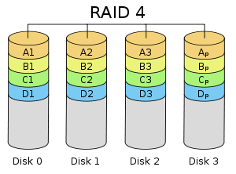 |  |  |

实现方式：

- 软件：没有专用的控制芯片和 I/O 芯片，完全由操作系统和 CPU 来实现所的 RAID 的功能；通过在**磁盘设备驱动程序上添加一个软件层，提供一个物理驱动器与逻辑驱动器之间的抽象层**；
- 硬件：有自己的 RAID 控制处理与 I/O 处理芯片，甚至还有阵列缓冲；硬 RAID 包含 RAID 卡和主板上集成的 RAID 芯片， 服务器平台多采用 RAID 卡。 RAID 卡由 RAID 核心处理芯片（ RAID 卡上的 CPU ）、端口、缓存和电池 4 部分组成。其中，端口是指 RAID 卡支持的磁盘接口类型，如 IDE/ATA 、 SCSI 、 SATA 、 SAS 、 FC 等接口。
- 软硬件结合：RAID 虽然采用了处理控制芯片，但是为了节省成本，芯片往往比较廉价且处理能力较弱， RAID 的任务处理大部分还是通过固件驱动程序由 CPU 来完成

#### RAID01和RAID10

**RAID01**又称为RAID0+1，先进行条带存放（RAID0），再进行镜像（RAID1）。

**RAID10**（最可靠与高性能）又称为RAID1+0，**先进行镜像（RAID1），再进行条带存放（RAID0）**，比较常用。

|  | 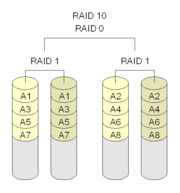 |
| ------------------------ | ------------------------ |

#### JBOD

JBOD （ Just a Bunch Of Disks ）不是标准的 RAID 等级，它通常用来表示一个没有控制软件提供协调控制的磁盘集合。 JBOD 将多个物理磁盘串联起来，提供一个巨大的逻辑磁盘。 存储性能完全等同于单块磁盘，而且也不提供数据安全保护

## 计算机体系结构分类

> 参考 [服务器体系(SMP, NUMA, MPP)与共享存储器架构(UMA和NUMA)](https://www.cnblogs.com/still-smile/p/11564518.html)

### 系统架构分类

- **对称多处理器结构(SMP：Symmetric Multi-Processor)**，属于**均匀存储器存取（Uniform-Memory-Access，简称UMA）**模型(一致存储器访问结构)
  - 各CPU共享相同的物理内存，每个 CPU访问内存中的任何地址所需时间是相同
  - 扩展能力非常有限

- **非一致存储访问结构(NUMA：Non-Uniform Memory Access)**
  - 具有多个CPU模块，每个CPU模块由多个CPU(如4个)组成，并且具有独立的本地内存、I/O槽口等
  - 访问远地内存的延时远远超过本地内存，因此当CPU数量增加时，系统性能无法线性增加

- **海量并行处理结构(MPP：Massive Parallel Processing)。**
  - 多个SMP服务器通过一定的节点互联网络进行连接，协同工作

共享存储型多处理机有两种模型

- **均匀存储器存取（Uniform-Memory-Access，简称UMA）**模型(一致存储器访问结构)
- **非均匀存储器存取（Nonuniform-Memory-Access，简称NUMA）**模型    (非一致存储器访问结构)

COMA和ccNUMA都是NUMA结构的改进

### Flynn分类

分为指令流和数据流

SISD：单指令流单数据流，流水线方式的单处理机有时也被当做SISD；

SIMD：单指令流多数据流，如GPU，并行处理机（阵列处理机）；

MISD：多指令流单数据流，比较少见；

MIMD：多指令流多数据流，MPP、SMP、多核处理器、多处理机；

### 指令系统

#### 复杂指令系统CISC

- 指令数量众多、使用频率悬殊、支持多种寻址方式、支持变长指令；
- 直接对主存单元中的数据直接进行处理，以**微程序（硬件直接执行）**控制为主；

#### 精简指令系统RISC

- **指令数量少**、**寻址方式少**、**指令长度固定**，适合流水线；
- 优化编译，以**硬布线逻辑控制**为主，**通用寄存器个数较多**；

## 总线

总线：一组能为多个部件分时共享的公共信息传送线路。

按照**功能**划分：

- 地址总线：传递地址信息；
- 数据总线：传送数据信息；
- 控制总线：传送控制信号；

按照**数据线**多少：

- 并行总线：多条双向数据线，有传输延迟，近距离连接，如系统总线（计算机各个部件）；
- 串行总线：一条双向数据线或者两条单向数据线，速率不高，长距离连接，如通信总线（计算机之间）；

按照**工作方式**分：

- 单工总线：只能在**单个**方向进行传输信息；
- 半双工总线：可以在**两个**方向**轮流**传输信息；

- 全双工总线：可以在**两个**方向**同时**传输信息；

## 字节序

字节排序按分为大端和小端，概念如下， 0x1234, low --> high

大端(big endian)：  **低地址存放高有效字节**, 00 00 12 34

小端(little endian)：**低字节存放低有效字节**, 34 12 00 00

**TCP/IP统一采用大端方式传送数据**，C/C++语言编写的程序里数据存储顺序是跟编译平台所在的CPU相关的，而 **JAVA编写的程序则唯一采用big endian方式**来存储数据。

## VGA、DVI、HDMI

显卡产生数字信号，显示器使用数字信号

- **VGA**：输出和传递都是模拟信号，只含视频
- **DVI**：数字信号，25针和29针，只含视频，有空针脚没用（可以用来传递音频，但没有统一标准规范）
- **HDMI**：数字信号，包含视频和音频信息

