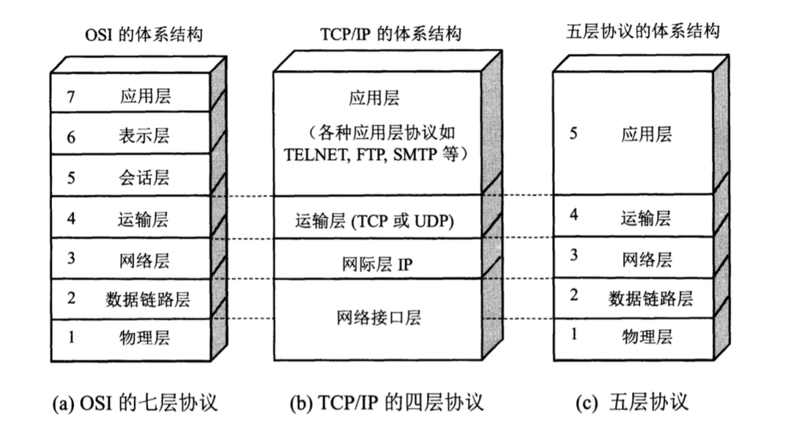
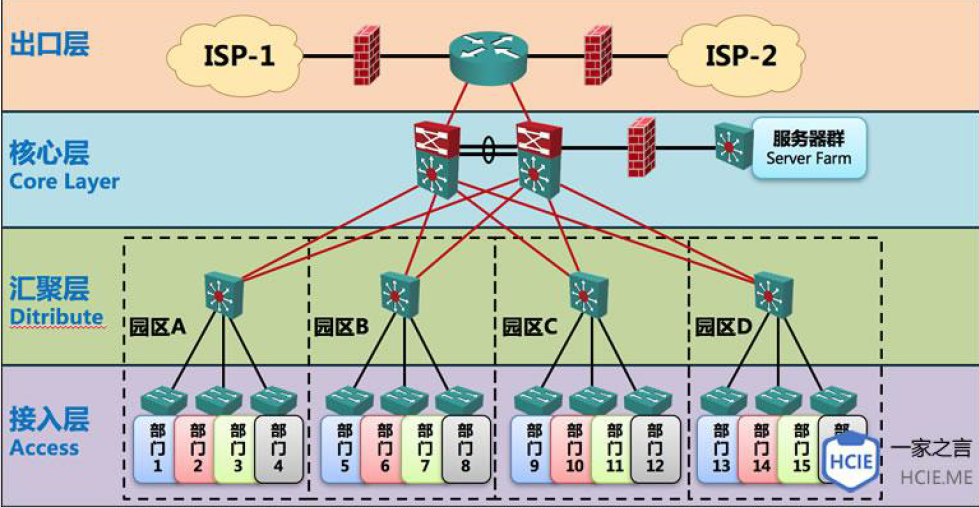
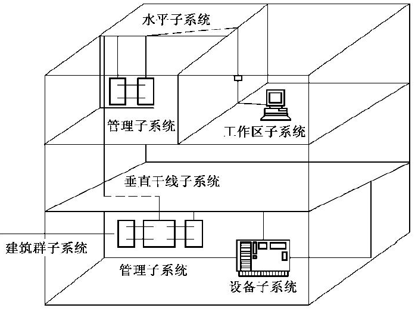

# 网络

## 网络模型

- 物理层：二进制为传输；
- 数据链路层：传输以帧为单位的信息（如IEEE802.3，ATM、PPP等）；
- 网络层：分组传输和路由选择，如 IP、IPX等；
- 传输层：端到端连接，如TCP、UDP、SPX等；
- 会话层：互联主机通信（如SQL、RPC等）；
- 表示层：数据表示，使应用层可以根据服务解释数据的含义，（如 JPEG、ASCII、GIF、DES等）
- 应用层：处理网络应用，直接为端用户服务，如 HTTP、Tenlent、FTP、SMTP等；

**以太网帧**

- 最小帧长：**64字节**，依据**检测冲突的最长时间**决定**最小帧长**和**最小发送间隙**；
- 采用 CSMA/CD 作为冲突检测算法，先听后发、边听边发、随机延迟后重发。一旦发生冲突，必须让每台主机都能检测到。

## 常见的协议

**FTP**：建立在TCP之上，可靠的文件传输。

- 端口20：传送文件内容；

- 端口21：传送控制信息；

**TFTP（Trivial FileTransfer Protocol）**：采用UDP，不可靠数据流传输，超时传送机制；

**HTTP（HyperText Transfer Protocol）**：WWW服务器传输超文本到本地浏览器，建立在TCP之上；

**POP3服务器：110端口**

**DNS：53端口**

**动态主机配置协议DHCP**：**67**端口号，租约默认8天，过半需要续约；

**传输层**

- **[TCP](./network/tcp.md)**：**可靠的、面向连接的、全双工**的数据传输服务；
- **UDP**：**不可靠的、无连接**的协议，用于传输数据量大且可靠性不高，如实时传播；

## 网络设计

- **接入层**：直接**面向用户连接或访问网络**的部分，适当负责一些**用户管理功能**（MAC地址过滤、用户认证、计费管理等），**用户信息**收集工作；
- **汇聚层**：**网络访问策略控制、广播域的定义、数据包处理、过滤、寻址**；
- **核心层**：**高速转发通信**，出口路由，提供优化、可靠的**骨干传输**；双机冗余热备份，负载均衡；

## 综合布线系统

**工作区子系统**：

- **工作区内终端设备连接到信息插座**之间的设备组成；

**水平子系统**：

- 布置在同一楼层上，一端**接在信息插座，另一端接在配线间的跳线架**上；
- 将**干线子系统与用户工作区连接**起来；将**用户工作区引至管理子系统**;

**管理子系统**：

- 安装有线路管理器件及各种公用设备，实现整个系统集中管理；
- **干线子系统和水平子系统的桥梁**，同时又可为同层组网提供条件；

**垂直（干线）子系统**：

- 由主设备间至各层管理间；两端分别端接在**设备间和管理间**的跳线架上；
- 实现计算机设备、程控交换机(PBX)、控制中心与各管理子系统间的连接，是建筑物干线电缆的路由；

**设备间子系统**：

- 由设备间中的电缆、连接跳线架及相关支撑硬件、防雷电保护装置等构成；

- 整个配线系统的中心单元

**建筑群子系统**：

- 将**多个建筑物的数据通信信号连接成一体**的布线系统；
- 结构化布线系统的一部分，支持提供**楼群之间通信所需的硬件**。

## 域名和地址

**域名系统**：将**主机域名解析成IP地址**的系统，普遍使用UDP协议，端口号 **53**

- **根域名器采用迭代算法**（向其他根域名器寻求解析），**本地域名和中介域名采用递归算法**；

域名系统由三部分构成：DNS名字空间、域名服务器、DNS客户机

## 网络存储技术

主流的网络存储技术主要有三种：

- **直接附加**存储（Direct Attached Storage， DAS）：目前 DAS 基本被 NAS 所代替
  - 存储设备通过 SCSI（Small Computer System Interface，小型计算机系统接口）电缆直接连到服务器
  - 存储操作依赖于服务器，不带有任何存储操作系统
- **网络附加**存储（Network Attached Storage，NAS）：**通过网络接口与网络直接相连，用户通过网络访问**
  - 专用的**文件**服务器，支持即插即用；
- **存储区域**网络（Storage Area Network，SAN）：
  - **专用交换机将磁盘阵列与服务器连接起来的高速专用子网**
  - 采用**块（block）**级别存储；

## 网络系统建设

原则：

- 采用先进，成熟的技术；
- 遵循国际标准，坚持开放性原则；
- 网络的可管理性；
- 系统的安全性；
- 灵活性和扩充性；
- 系统的稳定性和可靠性；
- 经济性、实用性。

## 其它

### 光纤

单模光纤：纤芯直径更细，更长的传输距离；

多模光纤：LED光源，多种模式传播；
