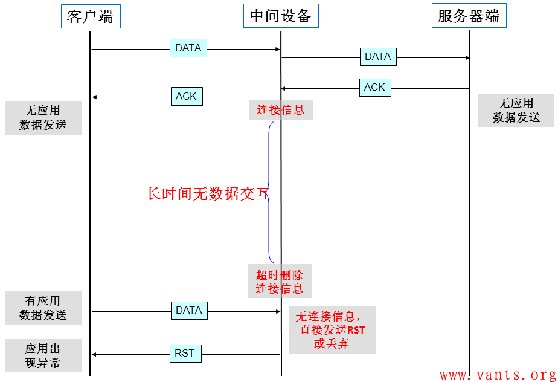
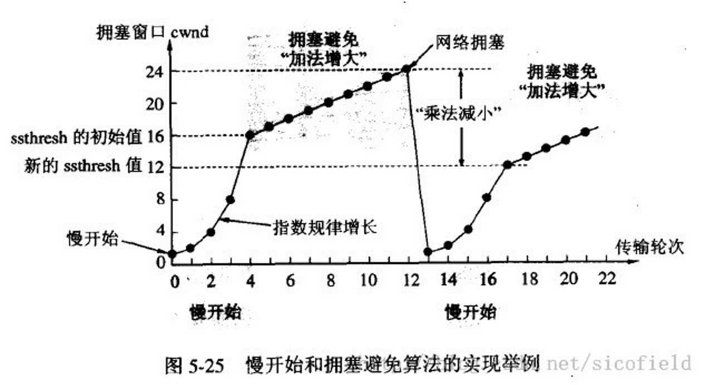
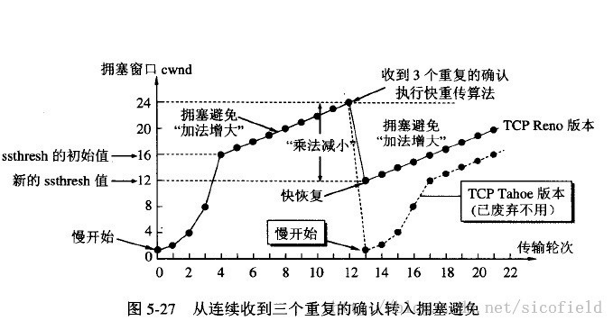

# TCP

## 三次握手协议

状态：

- SYN_SENT
- SYN_RECEIVED
- 

## TCP保活

保活功能主要是为服务器提供的，服务器可能会代表客户绑定一些资源，希望知道客户主机是否崩溃。

> 客户端也可以设置Socket保活，设置的一方会向对端发送Keepalive报文；

如果一个给定的连接在2个小时之内没有任何动作，则服务器就向客户发送一个探查报文段：

- 对端仍然运行正常
  客户主机依然正常运行，并且服务器可达。则客户的TCP响应正常，而服务器也知道对方是正常工作的，则服务器在2小时内以后将保活定时器复位。在这2小时以内，如果有数据流交换，则在交换数据后的未来2小时再复位。
- 对端已经崩溃
  客户主机已经崩溃，并且关闭或者正在重新启动。在任何情况下，客户的TCP都没有响应。服务器不能够收到对探查的响应，并在75秒后超时(服务器总共发送10个这样的探查，每个间隔75秒)。如果服务器没有收到一个响应，则认为客户主机已经关闭并会终止这个连接。
- 对端已经崩溃并重新启动
  客户主机崩溃并已经重新启动。这时服务器将收到一个对其保活探查的响应，然而这个响应是一个复位，使得服务器终止这个连接。
- 对端当前无法到达
  客户主机正常运行，但是服务器不可达。

### 参数解释

SO_KEEPALIVE 用于开启或者关闭保活探测，默认情况下是关闭的。

- `net.ipv4.tcp_keepalive_intvl = 75` （发送探测包的周期，前提是当前连接一直没有数据交互，才会以该频率进行发送探测包，如果中途有数据交互，则会重新计时tcp_keepalive_time，到达规定时间没有数据交互，才会重新以该频率发送探测包）

- `net.ipv4.tcp_keepalive_probes = 9` （探测失败的重试次数，发送探测包达次数限制对方依旧没有回应，则关闭自己这端的连接）

- `net.ipv4.tcp_keepalive_time` = 7200 （空闲多长时间，则发送探测包）

#### 全局修改

在Linux中我们可以通过修改` /etc/sysctl.conf` 的全局配置：

```java
net.ipv4.tcp_keepalive_time=7200
net.ipv4.tcp_keepalive_intvl=75
net.ipv4.tcp_keepalive_probes=9
```

添加上面的配置后输入 `sysctl -p` 使其生效，可以使用命令来查看当前的默认配置

```shell
sysctl -a | grep keepalive 
```

如果应用中已经设置SO_KEEPALIVE，程序不用重启，内核直接生效。

#### 单socket修改

TCP_KEEPCNT、TCP_KEEPIDLE、TCP_KEEPINTVL

> C 可以对单个socket设置不同的keepalive参数，但是 Java Socket 只能设置keepalive是否开启。

### 中间设备

中间设备如防火墙等，会为经过它的数据报文建立相关的连接信息表，并为其设置一个超时时间的定时器，如果超出预定时间，某连接无任何报文交互的话，中间设备会将该连接信息从表中删除，在删除后，再有应用报文过来时，中间设备将丢弃该报文，从而导致应用出现异常，这个交互的过程大致如下图所示：	



### 问题

但是日常更多的是在应用层加入**心跳包**机制
因为TCP的这个保活机制由几个缺陷：

- keepalive只能检测连接是否存活，**不能检测连接是否可用**。比如服务器因为负载过高导致无法响应请求但是连接仍然存在，此时keepalive无法判断连接是否可用。
- 如果TCP连接中的另一方因为停电突然断网，我们并不知道连接断开，此时发送数据失败会进行重传，由于重传包的优先级要高于keepalive的数据包，因此keepalive的数据包无法发送出去。只有在长时间的重传失败之后我们才能判断此连接断开了。

## 传输

### 慢开始和拥塞控制

拥塞窗口ssthresh，cwnd发送方维持的拥塞窗口

**当cwnd<ssthresh时，使用慢开始算法。**

**当cwnd>ssthresh时，改用拥塞避免算法。**

**当cwnd=ssthresh时，慢开始与拥塞避免算法任意。**

**慢开始**：从1开始，指数增长直至大于阈值

**拥塞控制**：每次只增长1

**拥塞**：阈值减半，重新慢开始



### 快重传和快恢复

快重传配合使用的还有快恢复算法:

- 当发送方连续收到三个重复确认时，就执行“乘法减小”算法，把ssthresh门限减半。但是接下去并不执行慢开始算法。
- 考虑到如果网络出现拥塞的话就不会收到好几个重复的确认，所以发送方现在认为网络可能没有出现拥塞。所以此时不执行慢开始算法，而是将cwnd设置为ssthresh的大小，然后执行拥塞避免算法



## WebSocket

**单个TCP连接上进行全双工通信**的协议。

Websocket 通过HTTP 1.1 协议的101状态码进行握手。

在 WebSocket API 中，浏览器和服务器只需要完成一次握手，两者之间就直接可以创建持久性的连接，并进行双向数据传输。

