# 软件工程

## 软件开发方法

### 分类

#### 开发风范分类

- **自顶向下**：**由问题到解答、由总体到局部、由一般到具体**，如**结构化**方法；
- **自底向上**：**由简单到复杂、逐层向上构造**；

#### 性质分类

- **形式化**：采用**严格的数学方法**描述软件，如有限状态机、Perti网、VDM语言、Z语言；（净室软件工程CSE）
- **非形式化**：各种**开发模型**，如瀑布模型等；

#### 适用范围分类

- 整体性方法：
- 局部性方法：

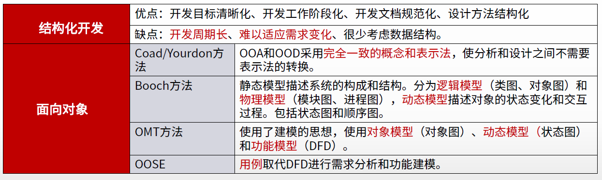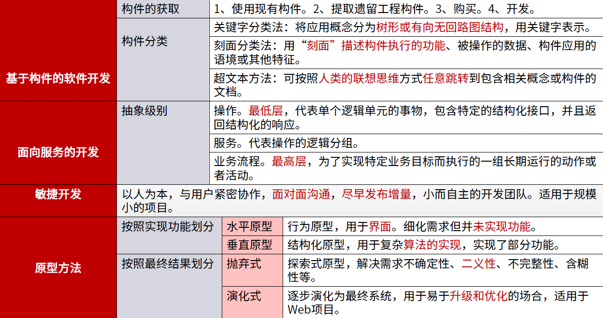

### 结构化方法

**自顶向下**，以**过程**为中心，通过功能分解方式把系统功能分解到各个模块，开发模型是 **瀑布模型**，使用**数据流图、ER图、状态转换图、模块结构图、流程图**等。

**优点**：

- **开发目标清晰化**：面向用户的观点，**保持与用户沟通**，不断让用户了解工作进展，校准工作方向；
- **开发工作阶段化**：**严格区分工作阶段**，每个阶段有明确的任务和成果；
- **开发文档规范化**：每个阶段完成后，**工作成果文档化**；
- **设计方法结构化**：**自顶向下分解，进行分析设计**，根据设计要求先编写各个功能模块，自底向上实现；

**缺点**：

- **开发周期长、难以适应需求变化和复杂的项目、很少考虑数据结构**。

针对软件生存周期的不同阶段，包括：分析、设计、编程

- **结构化分析**（Structured Analysis, **SA**）
- **结构化设计**（Structured Design, **SD**）
- **结构化程序设计**（Structured Programming，**SP**）

#### 结构化分析

不考虑数据结构，只考虑**数据流**的流转。**用数据流图建立系统的模型，完成需求分析工作**。

常用的工具/方法：**数据流图、数据字典**等。

数据流图的主要作用：

- DFD是理解和表达用户需求的工具，是需求分析的手段。**系统分析师可以通过DFD与用户进行交流**。
- DFD概括地描述了**系统的内部逻辑过程**，是需求分析结果的表达工具，也是系统设计的重要参考资料，是系统设计的起点。
- DFD作为一个**存档的文字材料**，是进一步修改和充实开发计划的依据。

**数据流图（Data FLow Diagram， DFD）**的构成：每个部分都有明确的标识

| 元素     | 说明                                                         | 图示                                                         |
| -------- | ------------------------------------------------------------ | ------------------------------------------------------------ |
| 数据流   | 由一组固定成分的数据组成，表示数据的流向。每个数据流有明确的名字表示。 **允许的数据流流向**： - **从一个加工流向另一个加工**； - **从加工流向数据存储**（写）； - **从数据存储流向加工**（读）； - **从外部实体流向加工**（输入）； - **从加工流向外部实体**（输出）； | 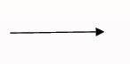 |
| 加工     | 描述数据数据流到输出数据流之间的变换。 **加工必须要有输入输出**。 | 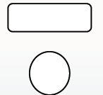 |
| 数据存储 | 以记录文件或记录表的形式来**存储数据**。                     |  |
| 外部实体 | 存在于软件系统之外的**人员、物品或组织**。数据的发源地和归宿地。 |  |

示例：（D1 -> A2 是非法的数据流向，P5.4 加工没有输入， P5.3 加工没有输出）

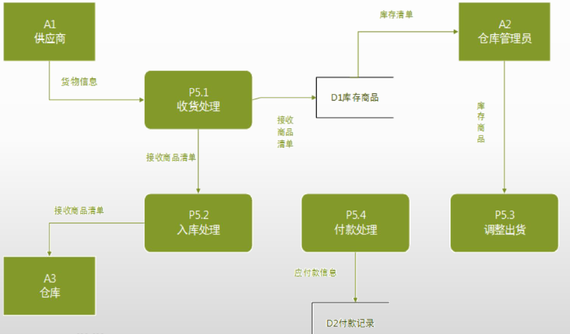

绘制数据流图的步骤：

- 画系统的输入和输出；
- 画DFD的内部：将系统的输入、输出用一系列的处理连接起来；
- 为每一个数据流命名；
- 为加工命名：使用动宾短语为每个加工命名。

**状态转换图（State Transform Diagram, STD）**

- 通过描述**系统的状态和引起系统状态转换的事件**，表示**系统的行为**；
- 作为特定事件的结果将执行哪些动作（如处理数据）。

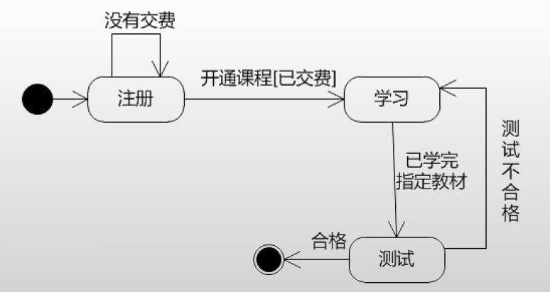

**数据字典**

- **数据流**、**数据项**、**数据存储**和**基本加工**。

**加工**描述方法：

- 结构化语言（伪代码）、判定表（表格型IF/ELSE）、判定树（属性IF/ELSE)。

#### 结构化设计

面向**数据流**的设计：包括**体系结构设计、接口设计、数据设计、过程设计**

- 抽象化：过程的抽象（概要->详细->代码）、数据抽象、控制的抽象；
- 自顶向下、逐步细化；
- 信息隐蔽；模块尽可能少暴露内部处理；
- 模块独立：高内聚、低耦合；

模块划分的原则：

- 模块的大小要适中：
- 模块的扇入和扇出要合理：
  - 模块的扇出：**大表示模块的复杂度高，缺乏中间层级**，调用其它模块过多；
  - 模块的扇入：**扇入大表示模块复用程度高**，扇入小可以直接合并到上层模块或者分解成若干子模块；
- 深度和宽度适当：

模块的内聚分为7中，根据**内聚度从高到低排序**：

| 内聚类型                 | 描述                                         |
| ------------------------ | -------------------------------------------- |
| **功能内聚**             | 完成一个单一功能，各个部分协同工作，缺一不可 |
| **顺序内聚**             | 处理元素相关，而且必须**顺序**执行           |
| 通信内聚                 | 所有处理元素集中在**一个数据结构**的区域上   |
| **过程内聚**             | 处理元素相关，而且必须按照**特定次序**执行   |
| 瞬时内聚                 | 所包含的任务必须在**同一时间间隔内**执行     |
| 逻辑内聚                 | 完成**逻辑上相关**的一组任务                 |
| **偶然内聚（巧合内聚）** | 完成一组没有关系或**松散关系**的任务         |

耦合类型分7种，根据耦合度从低到高排序：

| 耦合类型     | 描述                                                         |
| ------------ | ------------------------------------------------------------ |
| 非直接耦合   | 没有直接联系，互相不依赖对方                                 |
| **数据耦合** | 借助**参数表**传递**简单数据**                               |
| **标记耦合** | 一个**数据结构**的一部分借助于**模块接口**被传递             |
| 控制耦合     | 模块间传递的信息中包含用于**控制模块内部逻辑**的信息         |
| 外部耦合     | 与**软件以外**的环境相关                                     |
| 公共耦合     | 多个模块引用同一个**全局数据**区                             |
| 内容耦合     | 一个模块**直接访问另一个模块的内部数据**；模块不通过正常入口转到另一模块内部； 两个模块有一部分程序代码重叠（仅汇编）；一个模块多个入口； |

### 面向对象方法

面向对象分析的任务：

- 对**问题域**进行分析和理解，**正确认识其中的事物及它们之间的关系**，**找出**描述问题域和系统功能所需的**类和对象**，**定义**它们的**属性和职责**，以及它们之间所形成的各种**联系**。最终产生一个符合用户需求，并能直接反映问题域和系统功能的面向对象分析模型及其详细说明。

以**“对象”**为中心：**对象组成：标识、属性、方法、消息**；

- 消息是”对象.函数()"的调用和执行，是对象之间交互的唯一内容。

针对软件生存周期的不同阶段，由以下部分组成：

- 面向对象的分析（Object-Oriented Analysis, OOA）
- 面向对象的设计（Object-Oriented Design, OOD）
- 面向对象的程序设计（Object-Oritented Programming, OOP）

方法列表如下（根据时间先产生排序）

| 方法                                | 描述                                                         |
| ----------------------------------- | ------------------------------------------------------------ |
| **Coad/Yourdon**方法                | 特别强调 OOA 和 OOD 完全采用一致的概念和表示法，使分析和设计之间不需要表示法的转换 |
| **Booch** 方法                      | 开发模型包括静态模型和动态模型： - **静态模型**：**逻辑**模型（**类图、对象图**）和**物理**模型（**模块图、进程图**）； - **动态类图**：**状态图和顺序图**，描述对象的状态变化和骄傲胡过程 |
| **OMT** 方法 | 使用**建模**思想，采用**对象模型**（对象图）、**动态模型**（状态图）和**功能模型**（DFD）来建立实际的应用模型 |
| **OOSE** 方法                       | 基于OMT，使用**用例（use case）**取代 DFD 进行需求分析和建立功能模型 |

面向对象的分析OOA：

- **功能**模型：描述系统功能，**用例图**（结构化方法，对应数据流图）
- **数据**模型（对象模型）：描述系统数据结构的对象模型，如**类图**（结构化方法，对应ER图）
- **行为**模型（动态模型）：描述系统控制结构，**活动图、顺序图、状态图**（结构化方法，对应状态转换图）

#### 功能模型/需求模型/用例模型（用例图，需求分析）

由**参与者(系统外部，如人/物)、用例、通信关联**三部分组成。**用例**对应数据流图中的**加工**。

- 信息流不是由通信关联表示，默认存在且双向；

**用例建模**的流程如下：

- **识别参与者**；
- **合并需求获取用例**；
- **细化用例描述**
  - 名称、简要说明、主事件流、备注事件流（分支情况，如异常处理）、非功能需求（如性能）、前置条件、后置条件、扩展点、优先级；
- **调整用例模型**（可以不需要）。

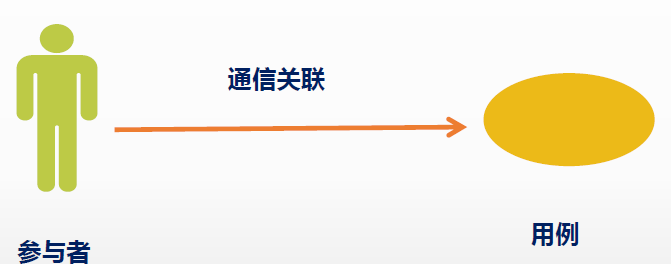

**用例间的关系**：**包含和扩展是依赖关系**（**指向和箭头**）

- **包含**关系（include）：基用例指向子用例，基用例包含子用例；
  - 将多个用例的共同动作抽出来单独作为子用例，被多个基用例共享；
  - **基用例执行必须执行子用例；**比如 权限检查就是子用例，很多基用例都包含；
- **扩展**关系（extend）：子用例指向基用例，子用例扩展了基用例；
  - **基用例是个单独完整的用例**（即子用例是按条件可能执行也可能不执行）；
  - 如买课时钱不够需要支付，支付用例扩展了买课用例；
- **泛化**关系（generalize）：
  - 一般情况和泛化情况，如网络支付和支付宝支付；

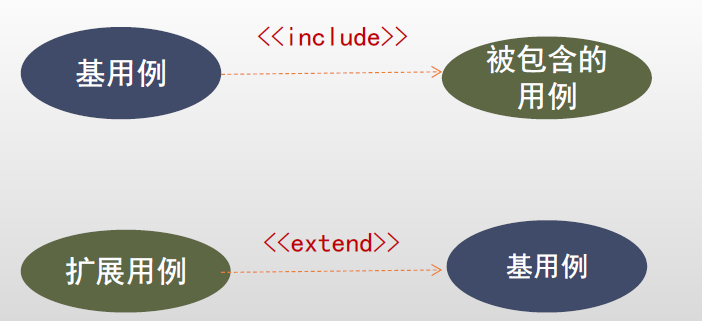

#### 数据模型/分析模型（类图）

建立数据模型的**步骤**：

- 定义**概念类**：
- 确定**类之间关系**：
- 为类**添加职责**：
- 建立**交互图**：

**领域模型（概念类）**称为概念模型或域模型，**通过确定类之间的关系，可以建立领域模型**。

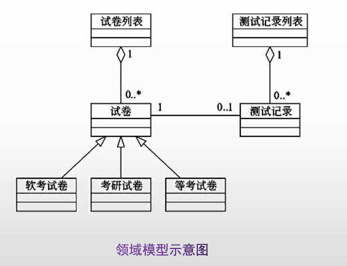

#### 行为模型（活动图、顺序图、状态图）

面向对象的设计（OOD）：是构建数据模型的方式和方法

- 利用用例和用例图表示需求；
- 从用例模型中提炼形成**领域模型**，用例的实现用**交互图**标识；
- 从**领域模型**和用例图形成**类图**；
- 用**包图**和**类图**形成**体系结构**图；

#### 统一建模语言（Unified Modeling Language, UML）

类多态：

- **参数多态**：参数模板，或者函数覆盖；
- **包含多态**：子类型化，一个类型是另一个类型的子类型；运行时的类型检查；
- **过载**（重载）多态：同一个名（操作符、函数名）在不同上下文不同的类型；
- **强制多态**：通过语义强制转换；

UML的构成：

- **构造块**：**事物**、**关系**、**图**；
  - 事物是UML的重要组成部分；
  - **图是多个相关关联的事物的集合**；
- **公共机制**：UML方法，包括**规则说明**、**修饰**、**公共分类和扩展机制**；
  - **规则说明**：元素语义的文本描述，事物语义的**细节描述**，模型真正的**核心**；
  - 公共分类：类元与实体、接口和实现分类；
  - 扩展机制：约束、构造型、标记值；
- **规则**：**命名、范围、可见性、完整性和执行**；

UML中四种事物：

- **结构**事物：静态部分，物理元素，包括**类、接口、协作、用例、活动类、构件、节点**；
- **行为**事物：动态部分，包括**交互（内部活动）、状态机**；
- **分组**事物：包；
- **注释**事物：注解，解释部分；

**类(事务)之间的关系**：

| 关系                                   | 说明                                               | 图示                                                         |
| -------------------------------------- | -------------------------------------------------- | ------------------------------------------------------------ |
| 关联关系（has-a）                      | 不同类之间对象可以相互作用的连接，**拥有的关系**   |  |
| 聚合关系（特殊形式的关联，has-a）      | 部分和整体的关系（购物车与商品）                   | 部分  整体 |
| 组合关系（特殊形式的关联，contains-a） | 强聚合，部分和整体的生命周期一样（人与各种器官）   | 部分  整体 |
| 依赖关系（包含和扩展关系）             | **使用的关系**，修改X，导致要修改Y（方法参数对象） | Y  X |
| 泛化关系                               | 一般（父类）与特殊（子类），父类是子类的泛化       | 子类  父类 |
| 实现关系                               | 说明（接口）与实现（子类）                         | 子类  父接口 |

14 种类图：

**静态图**：用例图、类图、对象图、包图、构件图等

- **用例图**：描述一组用例、参与者机它们之间的关系；

- **类图**：系统的**静态设计视图**，描述一组**类/对象、接口、协作**和它们之间关系；

  - **实体类**（Entity）、**控制类**（用例的行为封装）、**边界类（接口类）**（外部用户与系统之间的交互，如界面类）；
  - 依赖、泛化、实现、关联（聚合、组合）关系；

- **对象图**：**事物实例的静态快照**，某一时刻一组对象及它们之间关系；

- **包图**：描述由**模型本身分解而成的组织单元**以及依赖关系；

- **构件图**（组件图）：系统的**静态设计实现**视图，描述**一个封装的类和它的接口、端口以及由内嵌的构件和连接构件**构成的内部结构。

  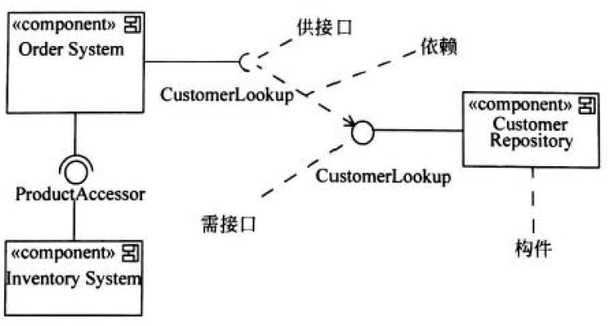

- **组合结构图**：结构化类的内部内容，描述**结构化类（如构件或类）的内部结构**；

  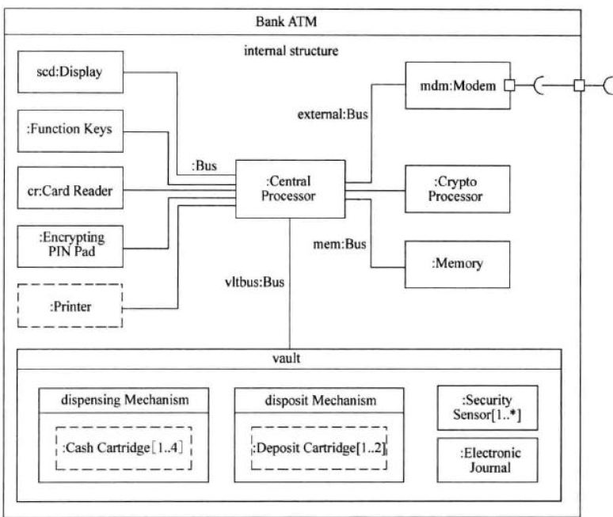

- **部署图**：**体系结构的静态部署视图**

**交互图**：序列图、通信图、计时图

- **序列图**（顺序图）：强调**消息的时间次序**的交互图；

  - **对象、生命线、控制焦点、消息**；

  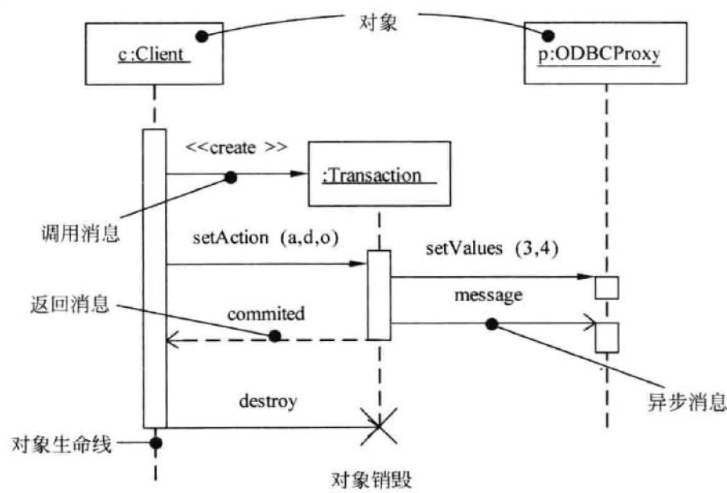

- **通信图**（协作图）：强调消息流经的**数据结构**的交互图；

  | 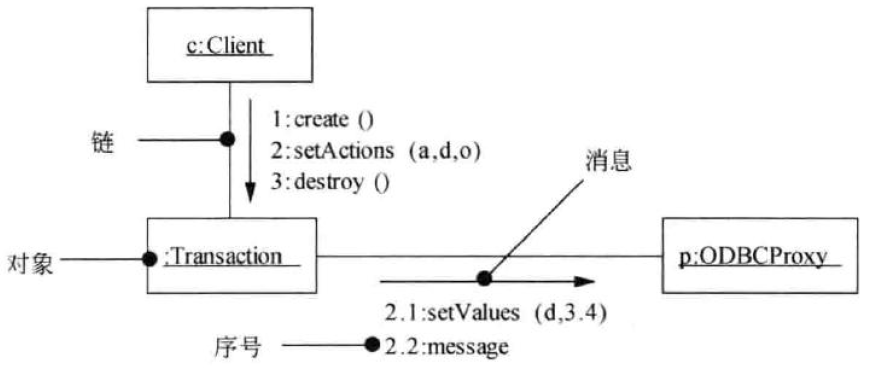 | 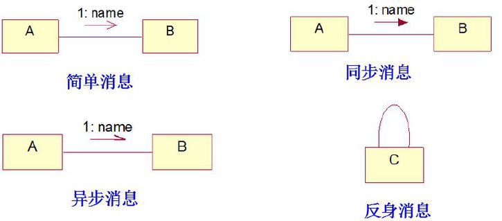 |
  | ------------------------------------------------------------ | ------------------------------------------------------------ |

- **交互概览图**：强调**控制流**的交互图；

  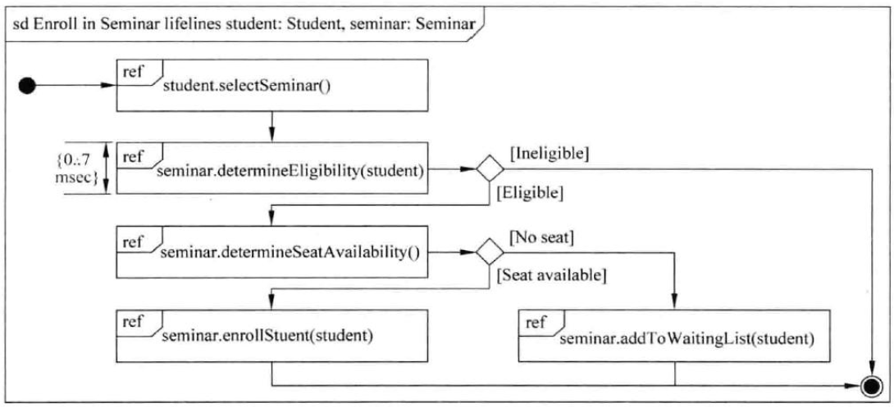

- **计时图（定时图）**：适合**嵌入式系统建模**的交互图，强调消息跨越不同对象或参与者的实际时间，不关心消息相对顺序；

  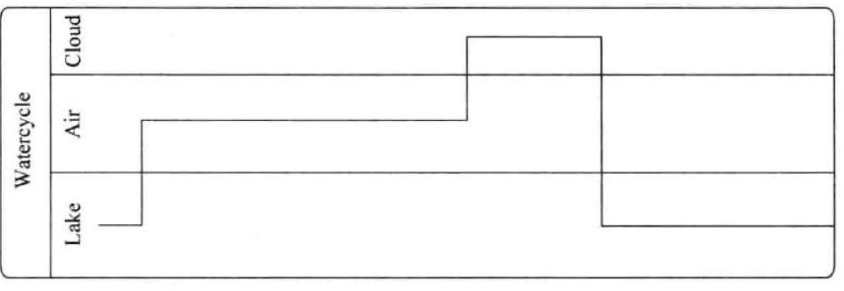

**动态视图**：状态图、活动图 以及交互视图

- **状态图**：对象的动态视图，描述**特定的对象的所有可能的状态（行为的结果）**，,以及由于各种事件的发生而引起的状态之间的转移和变化。

  - 由**状态、转移、事件、活动**组成

  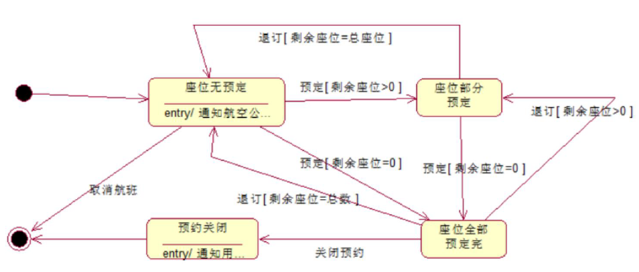

- **活动图**：系统的动态视图，将**进程或其它计算结构展示位计算内部的控制流和数据流（行为的动作）**，支持并发；

  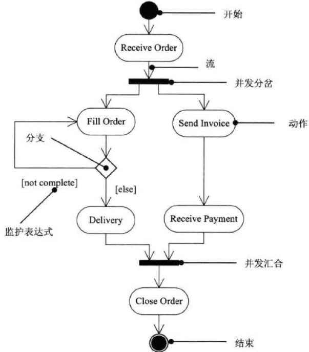

#### 设计模式

| 分类           | 功能                               | 具体模式                                                     |
| -------------- | ---------------------------------- | ------------------------------------------------------------ |
| **创建型模式** | 用于创建对象                       | **工厂方法**模式（类）、**抽象工厂**模式、**单例**模式、**建造者**模式、**原型**模式。 口诀：单抽元件（建）厂 |
| **结构型模式** | 处理类或对象的组合                 | **适配器**模式（类）、**装饰器**模式、**代理**模式、**外观**模式、**桥接**模式、**组合**模式、**享元**模式。 口诀：外侨（桥）组员（元）戴（代）配饰 |
| **行为型模式** | 描述类与对象怎样交互、怎样分配职责 | **策略**模式、**模板方法**模式（类）、**观察者**模式、**迭代器**模式、**责任链**模式、**命令**模式、**备忘**录模式、 **状态**模式、**访问者**模式、**中介者**模式、**解释**器模式（类）。 口诀：观摩（模）对（迭）策，责令解放（访），戒（介）忘台（态） |

- **访问者模式**：对象的行为模式，用于表示一个**作用于某对象结构中的各元素的操作**，它使得用户可以在不改变各元素的类的前提下定义作用于这些元素的新操作。访问者模式**使得新的操作变得很容易**，但在一定程度上破坏了封装性。
- **观察者模式**：
- **桥接模式**：表示层和数据层的分离

### 构件化开发方法

基于**构件/组件**的软件开发是解决复杂环境下软件规模和复杂性的一种手段。

构件：构建**并非一定**包含类，一个类元素**只能属于**一个构建

- **独立部署**单元；
- 作为第三方的组装单元；
- **没有（外部可见）状态**

#### 构件获取

构建获取的方式：

- 从现有构建直接使用或作适应性修改，得到可复用的构件；
- 通过遗留工程，将潜在的复用价值的构件提取出来；
- 从市场上购买，或者开发新的构件；

#### 构件分类和检索

**关键字分类**法：

- 将**应用领域的概念从抽象到具体的顺序分解为树形或者DAG结构**，每个概念用一个描述性的**关键字描述**；

**刻面分类**法：

- 定义若干个用于刻画构件**特征**的“刻面”，每个面包含若干概念，概念描述构件在刻面上的特征。
- 刻面描述构件**执行的功能**、**被操作的数据**、**应用的语境**或其他特征。

**超文本分类**法：

- **全文检索，文档链接**，任意跳转到包含相关概念或构件的文档；

#### 复用方法

- **检索与提取构件；**
- **理解和评价构件；**
- **修改构件；**
- **构建组装。**

#### 开发方法

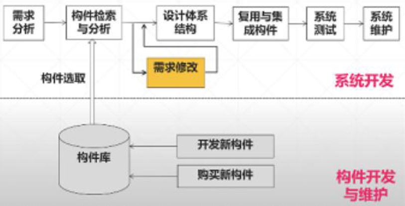

论文：从各个维度进行阐述

### 面向服务的方法

基于面向构建的方法，对外**提供服务，注册到服务总线ESB**。

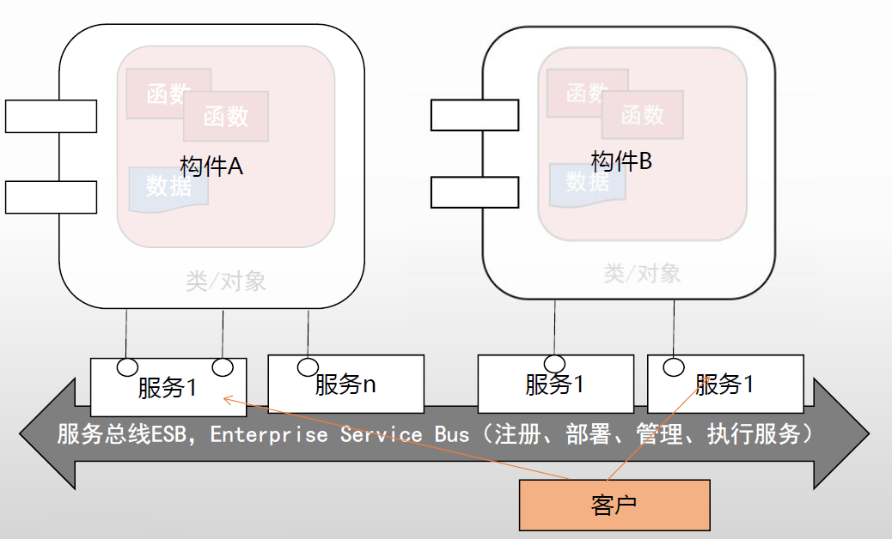

### 原型方法

系统开发**初期必须明确系统的功能要求**，确定系统边界。

- 根据用户初步需求利用系统工具**快速建立一个系统模型，与用户交流**；

**实现功能**划分：

- **水平原型**：**行为**原型，用于界面；细化需求但并**未实现功能**；
- **垂直原型**：**结构化**原型，用于复杂算法实现，**实现部分功能**；

**最终结果**划分：

- **抛弃式**：探索式原型，解决需求不确定性、二义性、不完整性、含糊性；
- **演化式**：逐步演化为最终系统，用于易于升级和优化的场合，适用于Web项目；

### 敏捷方法（也是开发模型）

**特征**：

- **以人为本**、**面对面沟通**、**与用户紧密协作**；
- **尽早发布增量**、**小而自主的开发团队**、**适用于规模小的项目**；

**原则**：

- 认为个体和交互胜过过程和工具；
- 可工作的软件胜过大量的文档；
- 客户何做胜过合同谈判；
- 响应变化胜过遵循计划；

**开发方法**：

- 极限编程、水晶方法、SCRUM、自适应性软件开发、特性驱动开发；

**极限编程**：

- 更短周期内，更早地提供具体、持续的反馈信息；
- 迭代进行计划编制，开始快速生成总体计划，在项目开发过程中不断发展它；
- 依赖于自动测试监控开发进度，及早捕获缺陷；
- 依赖于口头交流、测试、源程序进行沟通；
- 持续的演化式的设计；
- 依赖于开发团队内的紧密协作；

**SCRUM（并列争球法）**

- 使用了迭代的方法，把**每段时间（迭代周期，Sprint）一次的迭代称为一个“冲刺”**，并按需求的优先级别来实现产品，多个自组织和自治的小组并行地递增实现产品；

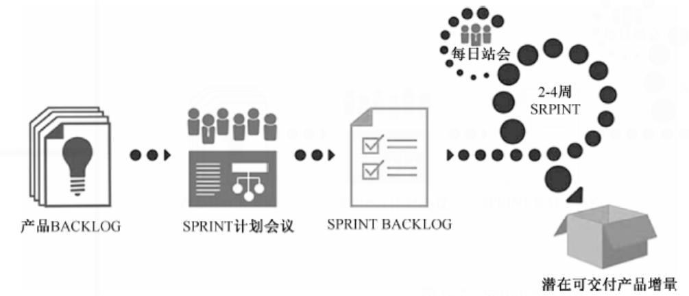

## 开发模型

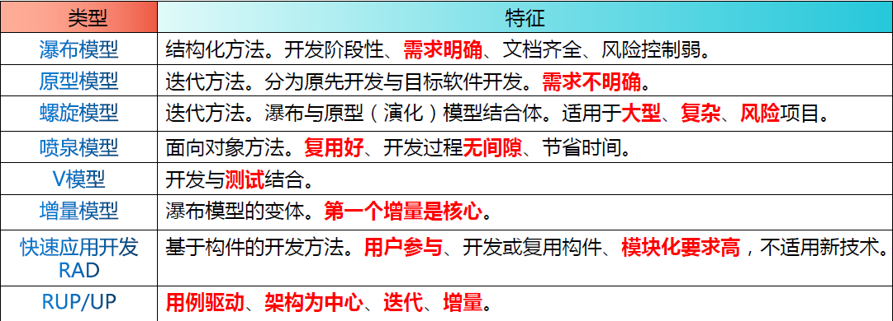

### 瀑布模型（结构化方法）

瀑布模型是一个**线性顺序**模型，它将软件开发的过程分为线性的软件计划、需求分析、软件设计、程序编码、软件测试和运行维护6个阶段，形如瀑布流水，最终
得到软件产品：

**优点**：

- 强调开发的阶段性、早期计划及需求调查和产品测试，有利于项目管理。

**缺点**：

- 不能适应需求的变化，风险在后期的开发阶段才能显露；
- 需求或设计中的错误在开发后期才能发现；
- 对于项目风险的控制能力较弱，从而导致项目常常延期完成，开发费用超出预算；

- 需要**很长时间**才能得到软件初始版本，需求**变更**导致损失巨大；
- 文档数量众多；

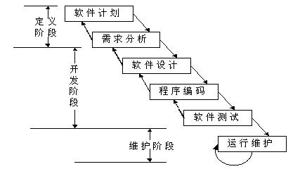

### 增量模型

增量模型是一种非整体开发的模型，分为两种形式：**基于瀑布模型的渐增模型**；**基于原型的快速原型模型**。

**优点**：

- 人员分配灵活，刚开始不用投入大量人力资源。
- 如果核心产品很受欢迎，则可增加人力实现下一个增量客户可以不断地看到所开发的软件，从而降低开发风险。

**缺点**：

- 各个构件逐渐并入已有的软件体系结构中,加入构件必须不破坏已构造好的系统部分，这需要软件具备开放式的体系结构；
- 增量模型的灵活性可以适应需求的变化，但也很容易退化为边做边改模型，从而使软件过程的控制失去整体性。

### 原型模型（原型方法）

迭代式（循环式）模型；

- 优点：**减少由于软件需求不明确带来的开发风险**，功能一经开发就能进入测试，快速验证是否符合产品需求，可以引导出高质量的产品要求；
- 缺点：如果不加控制让用户接触到开发中不稳定的功能，会对开发人员和用户会产生负面影响，连续修改会导致质量低下；

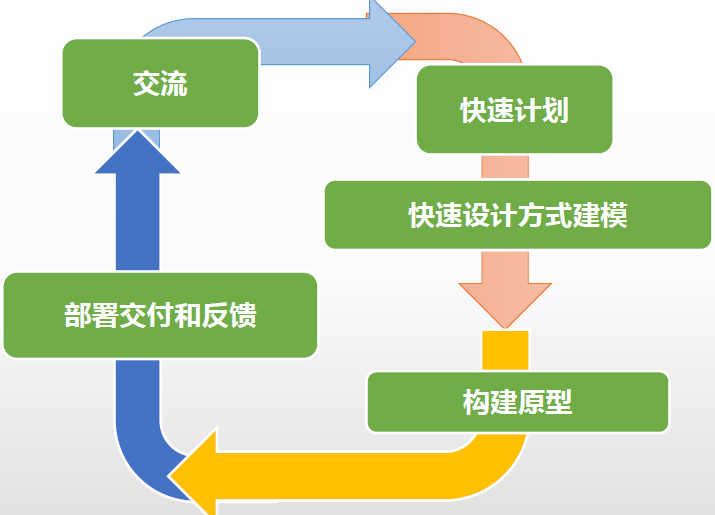

### 螺旋（演化）模型

由**瀑布**模型和**原型**模型组成：适用于大型、复杂的项目

- 沿着螺线进行若干次迭代，每次迭代都包括制订计划、风险分析、实施工程和客户评估4个方面的工作。
- 强调风险分析

**优点**

- 支持用户需求的动态变化，为用户参与软件开发的所有关键决策提供了方便，有助于提高软件的适应能力，并且为项目管理人员及时
  调整管理决策提供了便利，从而降低了软件开发的风险。

**缺点**

- 需要开发人员具有相当丰富的风险评估经验和专门知识。
- 过多的迭代次数会增加开发成本，延迟提交时间。

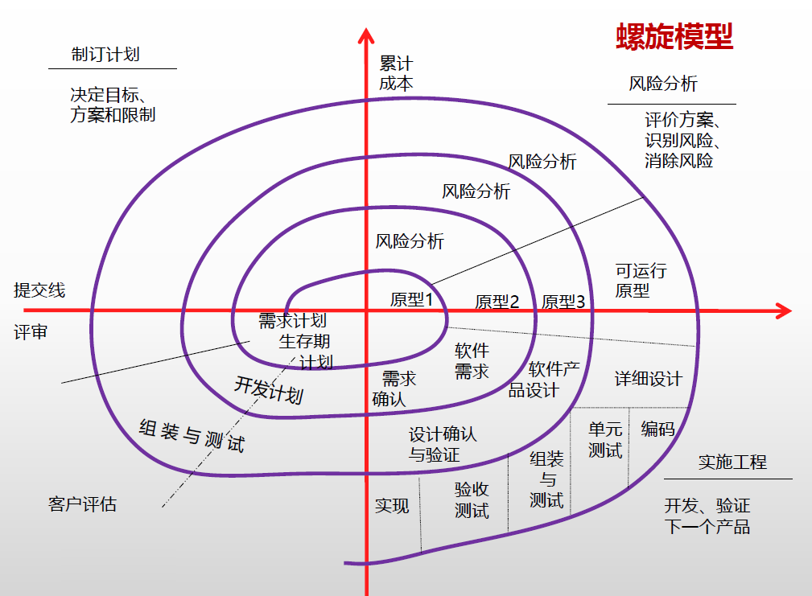

### 喷泉模型（面向对象法）

以用户需求为动力，以对象为驱动的模型，主要用于描述面向对象的软件开发过程。该模型认为软件开发过程自下而上的各阶段是相互重叠和多次反复的，就像水喷上去又可以落下来，类似一个喷泉。各个开发阶段没有特定的次序要求，并且可以交互进行，可以在某个开发阶段中随时补充其他任何开发阶段中的遗漏。

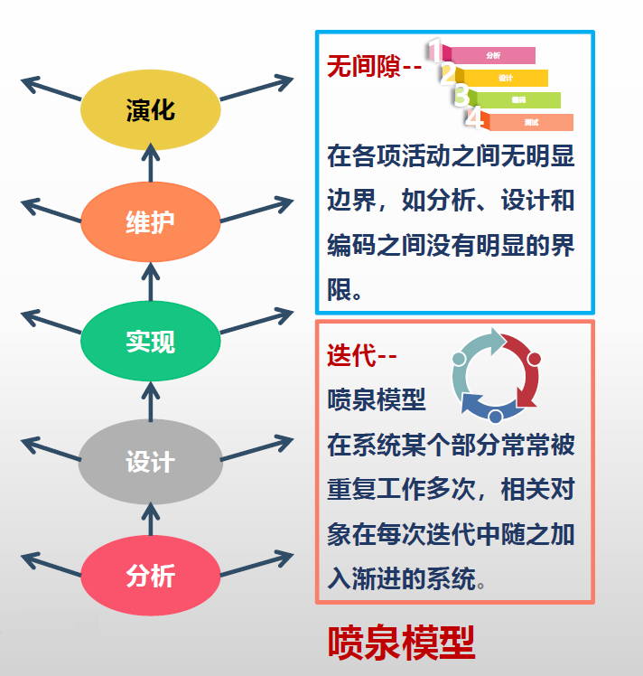

### V模型

以**测试为中心**的开发模型，弥补瀑布模型中测试介入太靠后的问题。

- 在**代码编写**阶段**制定单元测试计划**，**详细设计**阶段**制定集成测试计划**；

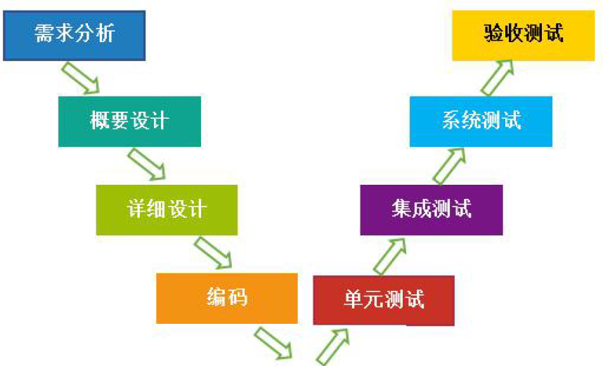

### RAD快速应用开发（构件开发方法）

**增量型**的软件开发过程模型，强调极短的开发周期，**基于瀑布模型**，大量**使用可复用构件**。

- **规划**阶段 -> **设计**阶段 -> **实现**阶段 -> **运行**阶段

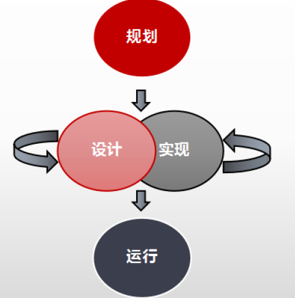

基本思想体现在以下4个方面：

- 让用户更主动地参与到系统分析、设计和构造活动中来。
- 将项目开发组织成一系列重点突出的研讨会，研讨会要让项目投资方、用户、系统分析师、设计人员和开发人员一起参与。
- 通过一种迭代的构造方法，加速需求分析和设计阶段。
- 让用户提前看到一个可工作的系统。

**缺点**：

- 并非所有应用都适合RAD，对模块化要求高；
- 开发者和客户必须短时间内完成需求分析；
- 不适合新技术或者技术风险高的情况；

 RAD的流程：

- 业务建模。使用数据流图进行业务流程建模。
- 数据建模。使用E-R图来帮助建立数据模型。
- 过程建模。细化数据流图中的加工。
- 应用生成。复用已有构件或创建新的可复用构件，利用环境提供的工具自动生成并构造出整个应用系统。
- 测试与交付。由于RAD复用大量构件，这些构件已经做过测试，会节省大量测试的时间。

### 统一过程模型RUP/UP（面向对象）

重型的开发模型，特征：**用例驱动、以体系结构为中心、迭代和增量**；

阶段：**初始、细化、构建、交付阶段**。

**四个阶段是个开发周期**，每次开发周期都会产生一代软件。

工作流程分为：

- **核心过程工作流（项目中流程）**：业务需求建模、分析设计、实现、测试、部署；
- **核心支持工作流（组织中流程）**：环境、项目管理、配置和变更管理；

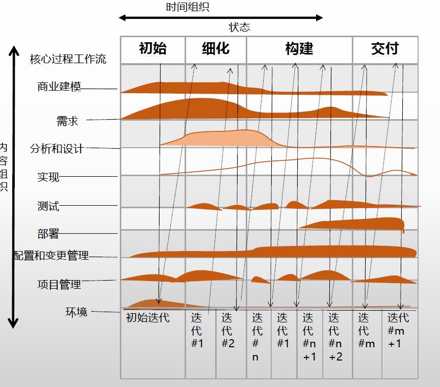

#### 初始阶段

- 明确**项目规模**：
  - 建立项目**软件规模和边界条件**，包括验收标准；
  - 了解**环境**及重要的**需求和约束**，识别系统的关键用例；
- 评估**项目风险**：
  - 了解项目所面临的风险，并对如何降低或处理风险有明确的策略；
- 制定**项目计划**：
  - 评估项目**总体成本、进度和人员配备**；
  - 综合考虑备选架构，评估设计和自制/外购/复用方面的方案，估算出成本、进度和资源。
- **阶段技术评审**：
  - 检查初始阶段的目标是否完成，并决定是否继续项目还是取消；

#### 细化阶段

- **确定架构**：建立一个已确定的基线的架构，验证其时间和成本支持系统需求；
- **制定构建阶段计划**：为构建阶段制定详细的过程计划并建立基线；
- **建立支持环境**：开发环境、开发流程、支持构建团队所需的工具、自动/半自动化支持；
- **选择构件**：集成所选构件，按主要场景进行评估；
- 阶段技术评审：检验详细的系统目标和范围、架构的选择，以及主要风险的解决方案。

#### 构建阶段

- 对系统进行**详细设计**，并进行成像**编码、测试、集成**等；
- 阶段技术评审

#### 交付阶段

- 对系统全面**测试**，补充各种**文档**，并把**产品移交**用户、培训等；
- 阶段技术评审

## 软件过程管理

卡耐基梅隆大学对**软件工程的工程管理能力和水平**，提出的5级定义：

- **临时凑和阶段、简单模仿阶段、完成定义阶段、管理阶段、最佳化阶段**；

### 能力成熟度模型CMM

| 级别                                | 定义                                                         |
| ----------------------------------- | ------------------------------------------------------------ |
| 初始级                              | 未定义的**随意**过程，**无秩序**，**混乱**                   |
| **可重复级** | 建立**基本的项目管理**过程，对**成本、进度和功能**特性进行**跟踪** |
| **已定义级** | 软件过程已**文档化、标准化**，形成**标准软件过程**           |
| **可管理级** | **可预测**的过程，软件过程和产品质量有详细的**度量标准**，**定量**的认知和控制 |
| 优化级                              | **持续改进**的过程                                           |

### 能力成熟度模型集成CMMI

| 级别 | 连续式表示法（能力等级）                               | 阶段式表示法（成熟度等级）             |
| ---- | ------------------------------------------------------ | -------------------------------------- |
| 0级  | 未完成级（过程域未执行）                               |                                        |
| 1级  | 已执行级（支持过程域的特定目标）                       | 初始级  （随意、混乱的过程）           |
| 2级  | 已管理级（管理过程制度化，监督和控制，适用于特定项目） | 已管理级（监督和控制，适用于特定项目） |
| 3级  | 已定义级（定义过程的制度化，适用于特定组织）           | 已定义级（适用于特定组织）             |
| 4级  | 定量管理级（定量管理的过程的制度化）                   | 已量化级（建立量化目标，可预测性高）   |
| 5级  | 优化级（使用量化（统计学）改变和优化过程域）           | 持续优化级（过程与技术持续改进）       |

