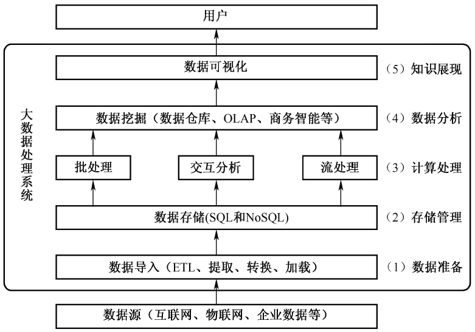
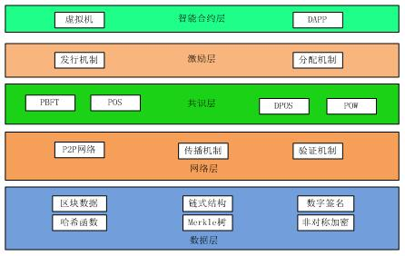

## 多媒体

MPEG-7 是ISO制定的**多媒体内容描述接口**的标准。

彩色视频信号数字化过程中，利用图像子采样技术通过**降低对色度信号**的采样频率，达到减少编码数据量的目的。

**分类**：

- **感觉媒体**：视觉、味觉、触觉、听觉、味觉；
- **表示媒体**：文字、图形、图像、音频、视频；
- **显示媒体**：显示器、打印机、音箱；
- **存储媒体**：磁盘、光盘、内存；
- **传输媒体**：电缆、光缆、交换设备；

### 声音

- 模拟信号，转换成数字信号：
  - **采样**：**采样频率大于声音最高频率的两倍**；
  - **量化**：
  - **编码**：哈夫曼树编码

数据传输率公式：

- **数据传输率（bps）=采样频率（Hz）* 量化位数（bit）*声道数**
- KHz = 1000Hz

声音信号数据量公式：

- **声音信号数据量（Byte）=数据传输率（bps）* 持续时间 (s) / 8**

声音格式文件：

- Wave
- Sound
- Audio
- Voice
- AIFF
- MPEG-1 Audio Layer
- RealAudio
- MIDI

### 图像

颜色可以分为：

- **色调**：如红黄蓝；
- **饱和度** ：某一颜色的深浅程度；
- **亮度**：明暗程度；

色彩模型：

- **RGB**颜色模型；
- YUV颜色模型；
- **CMY**颜色模型：如打印机；

## 新技术

### 大数据

特点：5V

- Volume：数据体量大
- Variety：数据类型多
- Value：数据价值密度低
- Velocity：处理速度快
- Veracity：**真实性**，数据的准确性和可信赖度，即数据的质量

大数据系统处理流程：

大数据的关键环节：

- 数据采集：ETL
- 数据存储：SQL/NOSQL
- 数据管理：分布式并行处理技术，MR/Spark；
- 数据分析和挖掘：机器学习，OLAP，钻取、分析 、展示；

数据中台的核心能力包含四点：***数据采集整合、数据提纯加工、数据服务可视化以及数据价值变现。***

### 云计算

体系结构：应用层、平台层、资源层、用户访问层、管理层。

类型：

- **Iaas**：基础设施即服务，包括**处理、存储、网络和其它基本的计算资源**；
- **Paas**：平台即服务，包括**操作系统、编程语言的运行环境、数据库和Web服务器**；
- **Saas**：软件即服务，向用户提供应用软件(如CRM、办公软件等)、组件、工作流等虚拟化软件的服务，SaaS一般采用Web技术和SOA架构，通过 Internet向用户提供多租户、可定制的应用能力；

关键技术：

- **网格计算**：并行计算理论，**网格计算的基础技术Web Service，云计算平台主要依赖SOA**；
- **虚拟化**：基础设施的虚拟化，**核心是集群计算和分区计算**的结合；

### 物联网

关键技术：**嵌入式技术和传感器技术**；

从技术架构上，分为：

- **感知层**：核心，**信息采集和物物之间的信息传输**，如**传感器、RFID**；
- **网络层**：利用无线和有线网络对采集的数据进行编码、认证和传输，是物联网三层中**标准化程度最高、产业化能力最强、最成熟**的部分；
- **应用层**：提供丰富的基于物联网的应用，是物联网发展的根本目标

### 移动互联网

技术层面的定义：

- 以**宽带IP**为技术核心，可以同时提供语音、数据、多媒体等业务的开放式基础电信网络

移动互联网=移动通信网络+互联网内容和应用

- **核心是互联网**，**应用和内容是移动互联网的根本**；

新特征：**接入移动性、时间碎片性、生活相关性、终端多样性**

六大技术产业领域：

- 关键应用服务平台
- 网络平台技术
- 移动智能终端软件平台技术
- 移动智能终端硬件平台技术
- 移动智能终端**原材料元器件**技术
- **安全控制技术**

关键技术

- 架构技术SOA：服务之间通过简单、精确定义接口进行通信，不涉及底层编程接口和通讯模型，**Web Service**是目前实现SOA的主要技术；
- 页面展示技术Web2.0：高参与度、**互动**接受；
- 页面展示技术HTML5：在网页上直接调试和修改，支持**地理位置定位**；
- 主流开发平台Android：基于Linux，开源，Java；
- 主流开发平台IOS：闭源，Object-C，C

### 区块链

区块链是**分布式数据存储、点对点传输、共识机制、加密算法**等计算机技术的新型应用模式。

核心技术：

- 分布式账本/去中心化
- 哈希加密/防篡改
- 非对称加密/数字签名
- 共识算法（博弈论）/全民记账

### 互联网+

实现**互联网与传统产业**的联合，如滴滴、美团；

六大特征：一是**跨界融合** 二是**创新驱动** 三是**重塑结构** 四是**尊重人性** 五是**开放生态** 六是**连接一切**。

**制造业服务化将价值链由以制造为中心向以服务为中心转变**。

2015年3月，国务院总理李克强提出“互联网+”，**“互联网+”成为两化(工业化和信息化)融合的升级版本**。

- 消费领域向生产领域拓展
- 2025年，体系基本完善；

### 智慧城市

智慧城市五层模型：

- **物联感知层**：智能感知能力，信息的采集、识别和监测；
- **通信网络层**：网络通信基础设施，互联网、电信网、广播电视网、城市专用网、无线网络（如Wi-Fi）、移动4/5G
- **计算与存储层**：软件资源、计算资源和存储资源
- **数据及服务支撑层**：利用SOA（面向服务的体系架构）、云计算、大数据等技术，通过数据和服务的融合，支撑承载智慧应用层中的相关应用，提供应用所需的各种服务和共享资源。
- **智慧应用层**：行业或领域的智慧应用，如智慧交通等；

三个支撑体系：

- 安全保障体系：构建统一的安全平台
- 建设和运营管理体系：整体的运维管理机制
- 标准规范体系：智慧应用信息系统的总体规划和工程建设

### 5G

第五代移动通信技术，新一代蜂窝移动通信技术。最高可达10Gbit/s，用户体验的速率为1Gbps

关键技术：

- 超密集异构网络、自组织网络技术、内容分发网络、设备到设备通信 (D2D)、M2M通信、信息中心网络 (ICN)

## 知识产权

地域性：仅在申请的国家内有效；

### 著作权法

示例：

- 学术论文引用，不可以引用未发表的作品；

**注意条文**

- 第二条：中国公民、法人或者非法人组织的作品，**不论是否发表**，依照本法享有著作权；
- 第三条：作品，是指文学、艺术和科学领域内具有独创性并能以一定形式表现的智力成果
  - 工程设计图、产品设计图等；
  - 计算机软件；
  - 。。。
- 第五条：**本法不适用于**
  - 具有**立法、行政、司法性质的文件及其官方正式译文**；
  - 单纯事实消息；
  - 历法、通用数表、通用表格和公式；
- 第十条：著作权包括下列人身权和财产权；
  - **发表权、署名权、修改权、保护作品完整权、复制权、发行权、出租权、展览权、表演权、放映权、广播权、信息网络传播权、摄制权、改编权、翻译权、汇编权**（编排）；
  - 从`复制权`后，可以获取报酬，并且可以部分转让；
- 第十八条：职务作品，作者具有署名权，其他权利由法人或非法人组织享有，可以给予作者一定奖励：
  - 利用法人或者非法人的物质技术条件，并由法人或非法人组织承担责任；
  - 除上述之外的作品，著作权由作者享有，但法人具有业务范围内优先使用，且两年内，不可以给竞争对手使用；
- 第十九条：**未约定合同的受委托创作的作品，著作权属于受托人**；
- 第二十条：作品原件**所有权的转移**，**不改变作品著作权的归属**，但**展览权由作品原件的所有人享有**。
- 第二十二条：作者的**署名权、修改权、保证作品完整权**的保护期**不受限制**；
- 第二十三条：
  - 自然人的作品，保护期为**作者终生及其死亡后五十年**；
  - 法人或者非法人的职务作品，**保护期50年**；

### 计算机保护条例（国务院）

计算机软件，指的是计算机程序（源程序/目标程序）及其有关文档（程序设计说明书/流程图/用户手册等）。

- 软件必须固化在有形物体上；

条例：

- 中国公民、法人或其他组织对其所开发的软件，**不论是否发表**，依照本法享有著作权；
- 对软件著作权的**保护不延及开发软件所有的思想、处理过程、操作方法或者数学概念**等；

- 软件著作权的权利：
  - 发表权、署名权、修改权、复制权、发行权、出租权、信息网络传播权、翻译权（**自然语言文字**的转换）；
- **未约定合同的受委托开发的软件，著作权属于受托人**；
- **软件著作权的继承人可以依照《中华人民共和国继承法》继承除署名权之外的其他权利**；
- 和著作权法条例类似；

### 专利法

**算法可以申请专利**，计算机程序不可以申请专利。

- 专利的发明创造包括：**发明、实用新型、外观设计**三种；
- **职务发明创造**：
  - 本职工作的发明创造；
  - 单位交付的本职工作之外的任务的发明创造；
  - 退休、调离、劳动关系终止**1年内**作出的，与原单位承担的本职工作或分配的任务的有关的发明创造；

- **同样的发明创造**只能授予**一项专利权**；
- 不授予专利权的：
  - 科学发现；
  - **智力活动的规则和方法**；
  - 疾病的诊断和治疗方法；
  - 动物和植物品种；
  - 原子核变换方法获得的物质；
  - 图案、色彩等起标识作用的设计；
- **发明专利的期限二十年**，**实用新型和外观设计期限**10年，由**申请日**开始计算；

### 商标法

必须使用注册商标的商品，必须申请商标注册，否则不得在市场销售。

- 国家工商行政管理局公布的**烟草制品，必须使用注册商标**；
- 同一种商品或类似商品，相同或近似的商标注册，**申请在先**；同一天申请，**使用在先**；同一天使用，30内协商或抽签；
- 商标的有效期为**十年**，自**核准注册之日**起计算；期满前12个月内**续期**（6个月宽展期），期限为十年；
- 非驰名商标，在不同类别的商品，可以申请相同的商标；
- 驰名商标，即使不同类别的商品，也不可以申请相同的驰名商标；

### 商业秘密权

不同于一般的知识产权，具有以下的独有特征：

- 商业秘密权的权利**主体不是单一**的；
- 商业秘密权的客体：**技术信息和经营信息**，本身具有个性特征；
- 保护**期限不具有确定性**；
- 商业秘密权的确立**无需国家审批**；

## 工作流参考模型

Workflow Reference Model，WRM：6个基本模块

- **工作流执行服务**：**核心**模块
- 工作流引擎；
- **流程定义工具**：图形化显示和操作复杂的流程定义；
- **客户端应用**；
- 调用应用；
- 管理监控工具；