# 系统工程

## 系统规划

### 可行性研究

- **经济可行性**：**投资收益分析或成本效益分析**，评估项目的**建设成本、运行成本**和项目**建成后的可能的经济效益**；
- **技术可行性**：**技术风险分析**，技术能力和现有的资源；
- **法律可行性**：政策、法律、道德、制度等社会因素论证；
- **用户使用可行性**：执行可行性，包括管理可行性（企业管理上分析）和运行可行性（用户无能力使用或者反对）；
- **进度可行性**：项目的最后期限的合理性评估；

### 成本效益分析

将项目所有的成本和收益一一列出，并进行量化。

#### 成本

按照投资时间分类：

- 基础建设投资；平台软件、房屋设施、办公设备；
- 其它一次性投资；管理成本、 培训费等；
- 非一次性投资；人员工资和奖金、通信费、租金、公共设施维护；

按照成本的性质分类：

- 固定成本：总额在一定期间和一定业务量范围内随着业务变动而固定不变的成本，如**管理人员的工资、资产折旧费、培训费、技术开发经费**等；
- 变动成本：随业务变动而正比例变动的成本，如**外包费用、开发奖金、产品包装费、直接材料费**等；
- 混合成本：水电费、电话费、员工工资（算加班工资），通常有一个基数，超过该基数后才随业务量增大而增大；

#### 收益

**有形收益**：经济收益，用货币的时间价值、投资回收期、投资回收率等指标进行度量。

- **一次性经济收益**：体现在**开支的缩减**和**价值的提升**；如资源要求的减少、资源利用的改进、多于设备的出售收入等；
- **非一次性收益**：**按月的、按年的用货币数目表示的收益**，如工作效率提升的每个月节约的人员工资等；

**无形的收益**：不可定量的收益，如服务的改进、企业形象改善、技术积累等；

#### 盈亏临界分析

盈利为0：**总固定成本 = 销售量 * （单价 - 单位变动成本）**

#### 净现值

净现值（Net Present Value, NPV）指**项目在生命周期内各年的净现金流量按照一定、相同的折现率折现到初始的现值之和**。

$NPV = \sum_{t=0}^n{\frac{(C_I-C_O)_t}{(1+i)^t}} $

- $(C_I-C_O)_t$为第 t 年的净现金流量（流入-流出），i 表示折现率（年利率）；
- 净现值 > 0，除规定的基准收益外，还有超额收益； 

#### 净现值率

考虑到方案**投资额**的大小，比较多个方案；

$NPVR = NPV / P = \frac{\sum_{t=0}^n{(C_I-C_O)_t(1+i)^{-t}}}{\sum_{t=0}^{n}I_t{(1+i)}^{-t}}$

- $I_t$ 为第t年的投资额，公式的意思即：净现值 / 投资的折现值；
- 净现值率越大越好；

#### 投资回收期

**静态投资回收期**：**不考虑折现，多少年能够回本**。

$T = 累计净现金出现正值的年份数 - 1 + | 上年累计净现金 | / 当年净现金$

**动态投资回收期**：**考虑折现，多少年能够回本**。

$T = 累计折现值出现正值的年份数 - 1 + | 上年累计折现值 | / 当年折现值$

#### 投资回收率

投资回收率 =  1 / 动态投资回收期 * 100%

#### 投资收益率 (现值指数)

$投资收益率 = 投资收益 / 投资成本 + 100% = 净现值率（NPVR） + 100%$

## 系统分析

**逻辑设计阶段**，根据**系统设计任务书**确定的范围，**描述现有系统的业务流程，提出新系统的逻辑模型**。

- 成果：**需求规格说明书**

### 详细调查

静态信息（如**组织结构**、系统功能）和动态信息（如**业务流程**、数据流程）的调查；

- **收集资料**、**开调查会**、**个别访问**、**书面调查（问卷调查）**、**抽样调查**、**现场观摩**、**业务实践**、**阅读历史文档**；

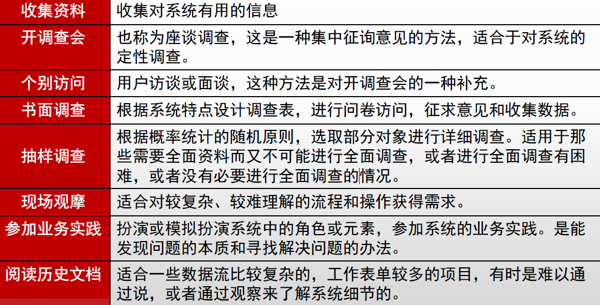

### 现有系统分析和研究过程

在详细调查的基础上，开展对现有系统的分析工作，多于用户沟通，了解他们对现有系统的认识和评价；

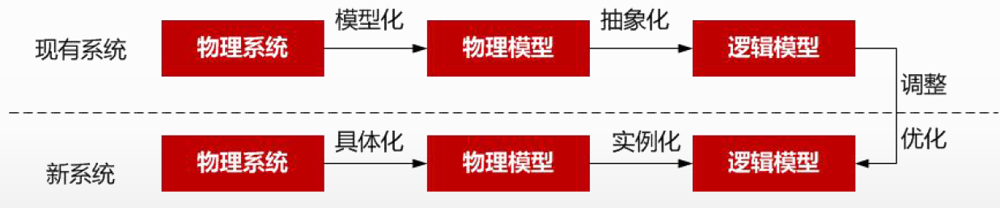

- 获取现有系统的物理模型；
- 抽象现有系统的逻辑模型；
- 建立新系统的逻辑模型；
- 建立新系统的物理模型；

### 功能分析

#### 组织结构图

企业**内部部门的划分及其相互之间的关系**，对企业组织结构与职责进行分析，**明确企业内部的部门划分**，以及**各部门之间的领导与被领导关系**、**信息传递关系、物质流动关系和资金流动关系**，并了解**各部门的工作内容与职责**，掌握企业组织结构的现状和存在的问题。

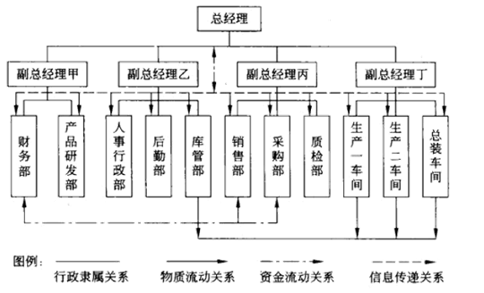

#### 功能体系图

以**业务功能为主体**的树形图，层层了解**各个部门的职责、工作内容和内部分工**，描述企业内部各部分的业务和功能。

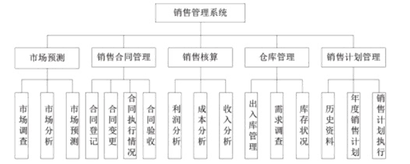

#### 功能流程图

分析**各功能之间的关系和流程**，检验是否识别出所有的功能，判定系统分析师是否理解了系统功能，也是以后进行**系统设计的基础**

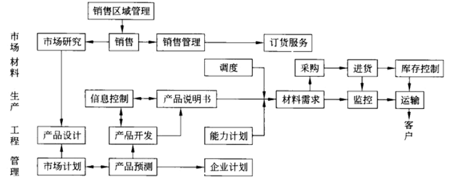

### 业务流程分析

了解业务流程，**明确各个部门间的业务关系和每个业务处理的意义**。

**常用的分析方法**：

- **价值链分析法**：顾客**价值最大化**的业务流程；
- **客户关系分析法**：CRM用在业务流程的分析上；
- **供应链分析法**：源于SCM，从**企业供应链的角度分析企业的业务流程**；
- **基于ERP的分析法**：将企业的业务流程看作是一个紧密联接的供应链，对**供应链上的所有环节有效管理**，对企业动态控制和各种资源的**集成和优化**；
- **业务流程重组**：重新审视企业的价值链，以**流程为核心**对业务流程进行**根本式**再造

### 业务流程建模

自顶向下或者自底向上，进行业务流程建模：

常见方法分类：1）形式化描述：精确、严谨，模型可读性差；2）图示化描述：UML图；

具体的方法：

- **标杆瞄准**：行业标杆企业的业务流程，作为参考；

- **IDEF**：一系列建模、分析和仿真方法的统称，从IDEF0到IDEF14：
  - IDEF0：**功能**建模；IDEF1：**信息**建模；IDEF1X：**数据**建模；IDEF4：**面向对象设计**；

- **DEMO**：交互模型、业务流程模型、事务模型、行为模型、事实模型、互约束模型；
- **Petri**：从流程角度，图形化、数学化建模工具，适用于并行、异步、分布式、随机性的系统；
- **业务流程建模语言**
  - **BPEL**：文本XML，业务流程执行语言，Business Process Execution Language；
  - **BPML**：文本XML，业务流程建模语言，Business Process Modeling Language；
  - **BPMN**：图形化，业务流程建模标注，Business Process Modeling Notation；
  - **XPDL**：XML流程定义语言，XML Process Definition Language；
  - **UML**；图形化，主要使用活动图对业务流程进行建模；

### 系统分析的方法

**FAST分析**：不是一种规范，灵活的框架，用于不同类型的项目和策略。

- 范围定义、问题分析、需求分析、逻辑设计、决策分析、物理设计和集成、构造和测试

**模型驱动的分析**：

- **传统方法**：**结构化分析**和信息工程
  - DFD、ER图
- **面向对象方法**

### 数据与数据流程分析

**建立数据库系统和设计功能模块处理过程的基础**。

#### 数据汇总分析

- 收集到的数据，**按照业务流程进行分类编码**，按处理过程的顺序排排放；
- 按**业务流程自顶向下地**对数据项进行整理，如从最终统计报表检查一直到原始统计数据；
- 将所有原始数据和最终输出数据分类整理出来；
- 确定数据的字长和精度；

#### 数据属性分析

**静态分析**：数据的静态特征；

- 类型和长度，取值范围；
- 发生的业务量，包括数据发生的频率、峰值数据量和时间、存储和保留时间；
- 重要程度和保密程度，决定权限、备份、加密等；

**动态分析**：

- 固定值属性：值不随时间而改变，如客户基础材料等；
- 固定个体变动属性：对整体相对固定的个体集，但对个体来说值会变动，如库存余额等；
- 随机变动属性：个体随机出现，值也是变动，如产品的月累计销售量（不一定每个月都有销售）

数据的存储分布

- 固定属性的数据存放在基本表（或主文件）中；
- 随即变动属性的数据存在视图（或处理文件）中；

#### 数据流程分析

发现和挖掘数据流通中的问题，如前后数据不匹配、输入输出不平衡等；

包括对**数据的输入、输出、流动、传递、处理和存储**的分析：

结构化分析（SA）：DFD，数据流图；

面向对象（OO）：用例图，对象、属性、交互、 持久化；

### 系统需求规格说明书

引言、引用文件、需求（功能、业务、数据要求）、合格性规定、需求可追踪性、非技术性需求、未解决的问题、注解、附录。

**系统分析**阶段的产出，是**系统设计阶段的主要依据**，技术合同，**验收标准之一**。

## 需求工程

**创建和维护软件需求文档**的活动的过程。

需求层次：业务需求、用户需求、系统需求

**质量功能部署（Quality Function Deployment, QFD）：将用户需求转化成软件需求的技术**。

- 常规需求：系统应该做到的；
- 期望需求：应该做到但用户无法正确描述，未实现用户会不满意；
- 意外需求：不在预期的需求，未实现用户不会不满意；

### 需求开发

阶段：**需求获取**、**需求分析**、**编写需求规格说明书**（需求定义）、**需求验证**

#### 需求获取

需求获取方式：用户访谈、问卷调查、采样、联合需求计划（组织会议）

需求记录工具：任务卡片、场景说明、用户故事（敏捷开发）等

#### 需求分析

提炼、分析和仔细审查已经获取到的需求，关键在于对问题域的研究和理解；

工作包括：

- 绘制系统上下文范围关系图；
- 创建用户界面原型；
- 分析需求可行性；
- 确定需求优先级；
- 为需求建立模型：OOA中用例模型、领域模型，SA中的DFD和ER图；
- 创建数据字典；
- 使用QFD(质量功能展开) ；

方法：

- SA（结构化）方法：自顶向下，不断分解；
- OO（面向对象）方法：抽象、信息隐藏（只暴露特定的）、封装、接口；

#### 需求定义

- 严格定义方法
- 原型方法

#### 需求验证

### 需求管理

**定义需求基线**、**处理需求变更**、**需求跟踪**等。

主要活动内容：

- **变更控制、版本控制、需求管理、需求状态跟踪**

需求基线：功能基线、指派基线（通过评审后的）和产品基线

需求跟踪：正/反向跟踪（双向跟踪），**需求 <-> 代码/文档**（编制需求和系统元素之间的联系文档）

## 软件架构设计

软件架构设计包括**提出架构模型、产生架构设计、进行设计评审**等活动，关注**软件组织的结构、属性和交互作用**，通过多种**视图**描述特定系统的架构。

### 软件架构建模

UML视图通过五个视图定义系统架构：

- **逻辑视图**，也称为设计视图，它表示了设计模型中在架构方面具有重要意义的部分，即类、子系统、包和用例实现的子集；
- **进程视图**，进程视图是可执行线程和进程作为活动类的建模，它是逻辑视图的一次执行实例，描述了并发与同步结构；
- **实现视图**，实现视图对组成基于系统的物理代码的文件和构件进行建模；
- **部署视图**，部署视图把构件部署到一组物理节点上，表示软件到硬件的映射和分布结构；
- **用例视图**，用例视图是最基本的需求分析模型。

#### 4 + 1 视图

- 4：逻辑视图、实现（开发）视图、物理视图、进程（过程）视图；
- 1：场景视图（即用例视图），包含用例图、描述和概述图

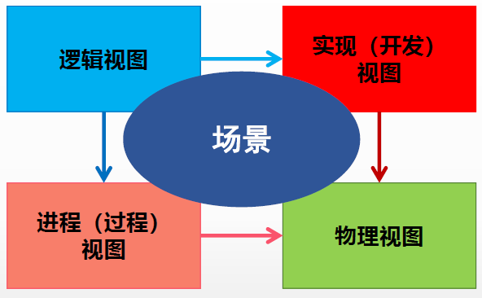

**逻辑视图**：

- 描述系统**各部分的抽象**描述，支持系统的功能需求；
- 用于建模系统的**组成部分以及各部分之间的交互**方式；
- **类图、对象图、状态图、协作图**；

**开发视图(模块视图）**

- 系统的**各部分如何被组织为模块和组件**。管理系统体系结构中的**层**非常有用。
- **包图、组件图**，系统输入输出关系的模型图和子系统图。

**过程视图（进程视图）**：

- 描述**系统中的进程**。当可视化系统中一定会发生的事情时，该视图特别有用；
- 强调并发性、分布性、系统集成性和容错能力；
- **活动图**。

**物理视图**

- 如何将前三个视图中所述的**系统设计实现为一组现实世界的实体**。
- **部署图**

**场景**：

- **重要系统活动的抽象**，将4个视图关联结合；
- 用例图

### 软件架构风格

#### 数据流风格

流水线架构，不存在结构的反复和重构；

- **批处理序列**：步骤独立，顺序处理；
- **管道-过滤器**：构件都有输入和输出；

#### 调用-返回风格

- **主程序/子程序**：结构化开发方法使用；
- **面向对象风格**：对象是一种被称为管理者的构件，对象通过函数和过程的调用交互；

- **层次结构风格**：每一层为上层服务，并作为下层客户。如OSI七层模型；

#### 独立构件风格

- **进程通信**：构件是独立的进程，通过消息传递连接。远程方法调用，同步/异步，点对点；
- **事件驱动**：注册事件，事件触发时零一个模块的过程调用；

#### 虚拟机风格

- **解释器**：虚拟机，语法解析（适用运行时系统行为定义和改变）等；
- **基于规则的系统**

#### 仓库风格

- **数据库系统**：中央共享数据源，保存系统的当前状态；多个独立处理单元，处理单元对数据元素进行操作；
- **黑板系统**：知识源、黑板和控制三部分；知识源响应黑板变化，只修改黑板；信号处理（语音识别）专家系统、问题规划，无确定性算法的软件； 
- **超文本系统**：网状链接方式相互连接，互联网领域

### 层次架构风格

#### 二层架构

CS（Client/Server）架构：胖客户机、瘦服务器；

#### 三层CS架构

增加应用服务器，瘦客户机；

表示层（客户机）、功能层（应用服务器）、数据层（数据服务器）

#### BS架构

零客户端，仅用浏览器

#### 面向服务的架构（SOA）

所有功能都定义成独立的服务，所有服务通过服务总线连接。

面向对象和构件的设计原则；

相关的技术：

- UDDI（Universal Description Discovery and Integration）：统一描述、发现和集成，服务发布、查找和定位的方法，服务注册的规范；
- WSDL（Web Service Description Language）：Web服务描述语言；
- SOAP（Simple Object Access Protocol）：简单对象访问协议；
- REST（Representational State Transfer）：表述性状态转移；

主流实现：

- Web Service：服务注册中心、服务请求者、服务提供者；
- 企业服务总线：
- 服务注册表：

#### RESTful架构

RESTful API：面向资源

- **资源**：URL（URI的一种）
- **动作**：HTTP 方法（GET、POST、PUT、PATCH、HEAD、DELETE）
- **结果**：状态码
- **无状态**：服务器不仅返回所请求的资源，而且根据请求**返回用户所处的状态和可转移的状态**；

## 系统设计

**物理设计阶段**，根据需求规格说明书中规定的功能，考虑实际条件，具体设计实现逻辑模型的技术方案，实现**物理模型**。

软件设计包括四个部分：

- **数据设计**：改善程序结构和模块划分；
- **软件结构设计**：模块化的程序结构，表示模块间的控制关系；
- **人机界面设计（接口设计）**：软件内部、软件和操作系统间以及软件和人之间的通信；
- **过程设计**：系统结构部件转换为软件的过程描述。

**数据库设计**，分布设计法分为四个阶段：

- 规划：可行性分析；
- 需求设计：需求说明书；
- **概念设计**：概要结构设计，根据需求说明书，建立**概念数据模型**（ER图），得到应用视图；
- **逻辑结构设计**：将概念数据模型，转换为等价的特定DBMS的概念模式，将概念视图转**为外部模式**；
- 物理结构设计：逻辑模型选择合适的物理结构（数据库在物理设备上的存储结构和存取方法）；

从工程管理角度，软件设计分为概要和详细设计。

### 概要设计

将系统的功能需求分配给软件模块，**确定每个模块的功能和调用关系**，形成软件的**模块架构图**，即**系统结构图**。

采用**模块结构图、层次图和HIPO（Hierarchy plus Input-Process-Output）图**描述程序的结构。

### 详细设计

为**每个具体任务选择适当的技术手段和处理方法**的过程称为详细设计。

包括：网络设计、代码设计、输入/输出设计、处理流程设计、数据存储设计、用户界面设计、安全和可靠性设计；

用户界面设计：**人机交互的黄金三原则**

- 置于用户控制之下；
- 减轻用户的记忆负担；
- 保持界面一致性。

**流程设计**中，相关工具：

- 图形工具：**程序流程图（分支、循环、顺序）、IPO图、盒图（N-S图）、问题分析图（PAD图）、判定树**；
  - IPO图描述每个模块的**输入、输出和数据加工**；
- 表格工具：**判定表**；
- 语言工具：**过程设计语言（伪代码）**；

| 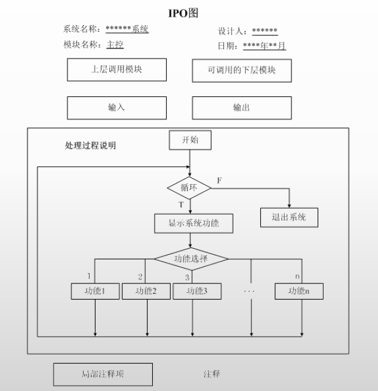 | 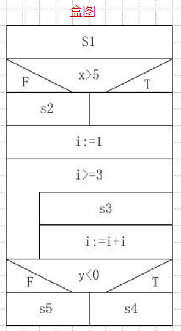 | 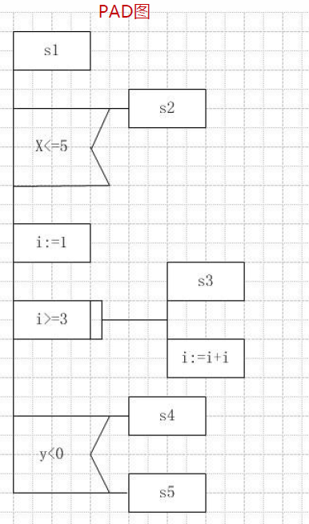 |
| ------------------------------------------------------------ | ------------------------------------------------------------ | ------------------------------------------------------------ |

### 结构化设计(SD)

面向**数据流**的设计方法，以**数据流图**和数据字典为基础。

**模块**是组成系统的基本单位，包括：

- **输入和输出、处理功能、内部数据、程序代码**；

模块划分的原则：

- 模块大小要适中、模块扇入扇出合理、模块的深度和宽度适中；

模块的类型：

- 传入模块、传出模块、变化模块（加工模块）、协调模块（管理下属模块）

**系统结构图**（Structure Chart, SC），称为模块结构图，是软件概要设计阶段的工具。

- 包括**模块、模块间调用关系、模块间通信、辅助控制符号**四部分；

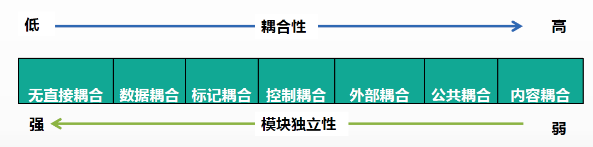

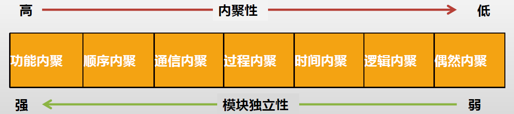

### 面向对象设计（OOD）

UML图和设计模式，具体见面向对象的开发方法。

**分析类图**是从用户的角度出发得到的业务“系统”，而**设计类图**更多的是从系统、软件的角度来描述和表达系统。二者具体的区别：

- 分析类图：在需求分析阶段，类图是研究领域中的概念；
  - 分析类图主要用于描述应用领域中的概念，**类图中的类从领域中**得出，从需求中获取。
- 设计类图：在设计阶段，类图重点描述类与类之间的接口；
  - 设计类图用于**描述软件的接口部分**，而不是软件的实现部分，设计类图更易于开发者之间的相互理解和交流；
  - 设计类图通常是**在分析类图的基础上**进行细化和改进的。

在系统设计过程中，类可以分为三种类型：**实体类、边界类（接口类）和控制类**。

实体类

- 来源于领域模型中的类
- 一定有属性，但不一定有操作。
- 反映的信息需要在系统中处理，并需要进行持久化存储。

边界类

- 用于系统接口与系统外部进行交互

控制类

- 控制用例工作的类
- 体现应用程序的执行逻辑

## 软件测试

**静态测试**：**依赖人工或者代码分析工具**，对程序代码进行静态分析，包括**控制流分析、数据流分析、接口分析、表达式分析**；

- **桌前检查**（程序员自检）、**代码审查**（错误清单）、**代码走查**（人工运行）

**动态测试**：

- **黑盒（功能）测试**：等价类划分、边界值分析、错误推测、判定表、因果图等；
- **白盒（结构）测试**：分为控制流测试、数据流测试、程序变异测试
  - 基本路径测试、循环覆盖测试、逻辑覆盖测试等；

测试的类型：

- 单元测试：模块测试，依据详细设计文档，驱动模块->被测模块->桩模块；
- 集成测试：概要设计文档，非渐增式和渐增式两种集成策略；
- 系统测试：依据是用户需求，包括功能测试、健壮性测试、性能测试、用户界面测试、安全性测试；
- 配置项测试：
- 确认测试（有效性测试）：验证软件功能、性能及其它特性是否与用户需求一致
  - 内部确认测试，Alpha测试（开发环境），Beta测试（实际环境）、验收测试（以用户为主进行测试）
- 回归测试：变更后，需要重新进行测试

## 系统运行和维护

### 遗留系统的处理策略

**淘汰**策略、**集成**策略、**继承**策略（有价值才继承，完全兼容）、**改造**策略（旧模型向新模型转化/增加新功能）

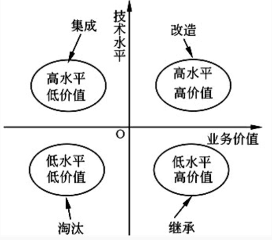

### 新旧系统的转换策略

- 直接转换策略
- 并行转换策略
- 逐步转换策略

### 数据转换和迁移

- 系统切换前通过工具迁移：一次性迁移或分次迁移
- 系统切换前采用手工录入；
- 系统切换后通过新系统生成；

### 软件维护

**救市鱼丸**

- **改正（纠正）**性维护：识别和纠正软件错误；
- **适应**性维护：外部环境、数据环境的变化；
- **完善**性维护：新功能和性能要求；
- **预防**性维护：预先提高软件的可维护性、可靠性；

## 系统可靠性分析和设计

### 系统故障类型和模型

故障类型：

- 永久性、间歇性、瞬时性

故障模型：

- 逻辑级的故障（硬件）、数据结构级的故障（二进制位）、软件故障和软件差错、系统级的故障（功能错误，输出与设计说明的不一致）

### 系统可靠性指标

#### 平均无故障时间（MTTF）

**失效率$\lambda$ = 1 / MTTF**

例：假设同一型号的1000台计算机，在规定的条件下工作1000小时，其中有10台出现故障。

则计算机**千小时的可靠度R为 (1000-10)/1000=0.99**，**失效率$\lambda$为10/(1000×1000)=1×10^-5**，**MTTF=1/(1×10^-5)=10^5小时**。

#### 平均故障修复时间（MTTR）

给定修复率（常数u），单位时间内可修复系统的平均次数：

**MTTR = 1 / u**

#### 平均故障间隔时间（MTBF）

MTBF = MTTR + MTTF 

一般MTTR很小，所以通常认为MTBF≈MTTF

#### 串联/并联系统

子系统可靠性为$R_1, R_2, ..., R_n$，失效率为$\lambda_1,\lambda_2, ..., \lambda_n$

**串联：$R=R_1 * R_2 * ... * R_n $， $\lambda = \lambda_1 + ... + \lambda_n$**

子系统可靠性为$R_1, R_2, ..., R_n$，失效率为$\lambda$

**并联：$R=1-(1-R_1)*...*(1-R_n)$**

**$\lambda = {1} / ({\frac{1}{\lambda}{\sum_{j=1}^n\frac{1}{j}}})$**

### 冗余技术

结构冗余、信息冗余（纠错码）、时间冗余（重复执行）、冗余附加

结构冗余，即软件/系统冗余，分为：

- 静态冗余（多模冗余）
- 动态冗余（故障检测）：热备（双重系统），冷备（双工系统）；
- 混合冗余

### 软件容错技术

#### N版本容错设计

采用**前向恢复**的策略，静态的故障屏蔽技术。用**n个相同功能的独立程序同时执行一项计算**，结果多数表决。

#### 恢复块方法

采用**后向恢复**的策略，动态的故障屏蔽技术。相同功能的主块和几个后备块。

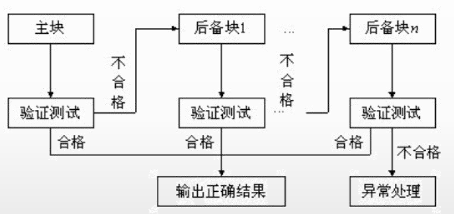

#### 防卫式程序设计

不采用传统的容错技术，**在程序中存储错误检查代码和错误恢复代码**。

### 双机容错技术

**两台服务器**和**一个外接共享磁盘阵列**及**相应的双机软件**组成。

- **双机热备模式**：工作状态+监控准备状态
- **双机互备模式**：同时运行，提供**不同的应用服务**，接管故障服务器
- **双机双工模式**：集群技术，同时运行，提供**相同的应用服务**，实现负载均衡和互为备份；

### 集群技术

将多台计算机组织起来进行协同工作，它是提高系统可用性和可靠性的一种技术。

分类：

- 高性能计算科学集群；
- 负载均衡集群：基于DNS、基于特定软件（协议内部支持）、基于NAT、反向代理、混合型
- 高可用性集群；

## 系统安全分析与设计

### 系统安全体系结构

**物理层**安全：物理环境的安全性，通信线路、物理设备和机房安全等；

**系统层**安全：操作系统的安全性，OS本身缺陷、安全配置问题、病毒威胁等；

**网络层**安全：计算机网络方面，如网络层身份认证、网络资源访问控制、传输的保密和完整性等；

**应用层**安全：Web服务，DNS，还包括病毒对系统的威胁；

**管理层**安全：安全管理制度，设备安全管理；

例：数据库容灾属于**应用安全和系统安全**。

### 加密

**确保数据的保密性，阻止被动攻击，防止截取和窃听**。

对称加密：私钥加密算法，加解密私钥相同，加密速度快，如 **IDEA，DES、RC5**<；

- **DES密钥长度56位**，**三重DES密钥长度112位**（两个56位 密钥）；
- **IDEA**：明/密文都是64位，密钥128位；

非对称加密：公钥加密算法，加解密密钥不同，不能从一个推出另一个，加密速度慢（一般不用于明文加密）；

- RSA，密钥长度512位；

### 杂凑算法

散列（Hash）函数进行数据加密，无法反推原文，无法同样Hash值的不同原文。

#### 消息摘要算法

MD5算法，产生128位的摘要信息。

#### 安全散列算法（Secure Hash Algorithm）

SHA-1, SHA-224, SHA-256, SHA-384, SHA-512：长度不超过264位的消息产生**160位**的消息摘要。

用于：SSL、TLS、SSL、IPSec等；

### 认证技术

**确保报文的真实性和完整性，阻止主动攻击，防止冒充、篡改和重访等**。

#### 数字签名

可以基于对称/非对称加密算法的数字签名，主要使用的还是非对称加密。

**数字证书**：由认证中心（CA）签发的对用户的公钥的认证。

**身份认证**：防止非法用户访问系统

- 口令认证、动态口令认证、生物特征认证

### 密钥管理体制

- 密钥管理基础设施（Key Management Infrastructure，KMS）：使用封闭网、以传统的密钥管理中心为代表；
- 公钥基础设施（Public Key Infrastructure, PKI）：适用于开放网；
- 种子化公钥（Seeded public-Key, SPK）：适用于规模化专用网；

### 通信与网络安全技术

#### 防火墙

- 网络级防火墙：包过滤型防火墙，状态检测型防护墙
- **应用级**防火墙：
  - **应用网关型**防火墙：在应用层实现协议过滤和转发；
  - 自适应代理防火墙

防火墙层级越高，安全性越好，性能越低；

实现方式：

- **双宿/多宿主机模式**：堡垒主机具有双网卡

  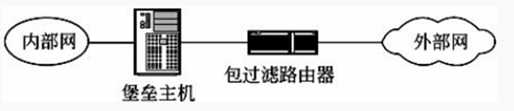

- **屏蔽主机模式**

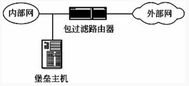

- **屏蔽子网模式**

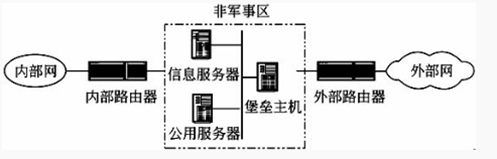

### 安全协议

#### SSL

传输层的安全协议，基于TCP；

#### HTTPS

HTTP+SSL

#### PGP

基于RSA的邮件加密软件

#### IPSec

为IP网络通信提供透明的安全服务，端到端的安全模式。

### 入侵检测和防护

入侵检测系统（Intrusion-detection system, IDS）一般有两种分类方法，一种是**基于数据源**的分类，另一种是基于**检测方法**的分类

常用的**检测方法**：

- 特征检测、统计监测、时间序列分析、专家系统；

**主动攻击**：拒绝服务攻击、会话拦截、修改数据命令、信息篡改；

**被动攻击**：系统干涉；

### 访问控制

**自主访问控制**（Discretionary Access Control, DAC）是借助DAC方法中的**访问控制表**（Access Control List, ACL），无法控制间接访问。

**强制访问控制（MAC）**：主体对客体是否能执行特定的操作取决于两者安全属性之间的关系，类似DAC。

**基于角色的访问控制**：特别适用于用户数量庞大、系统功能不断扩展的大型系统

**基于任务的访问控制**：在执行任务时只给用户分配所需的权限，未执行任务或任务终止后用户不再拥有所分配的权限，适用于工作流、控制管理；

**基于对象的访问控制**：将ACL与受控对象及其属性相关联，并将访问控制选项设计成为用户、组或角色及其对应权限的集合

## 中间件

类型：

- 通信处理（消息）中间件；
- 事务处理（交易）中间件；
- 数据存取管理中间件；
- Web服务器中间件；
- 安全中间件；
- 跨平台和架构的中间件；
- 专用平台中间件；
- 网络中间件；

### J2EE

**构件：EJB、Servlet、JSP、Applet、Application Client**

- EJB：实体Bean，会话Bean（有状态/无状态），消息驱动Bean（异步无状态Bean）；

**容器**：Applet Container、Application Container、Web Container、EJB Container

**服务**：JNDI、JMS、JAAS、RMI-IIOP、Java IDL、JTA、JDBC、Java Mail、JAXP、JAF、JCA、JAAS、JSF、JSTL

对象持久化框架：

- CMP（容器管理持久化)是基于EJB；
- Hibernate和iBatis也是ORM的解决方案；

J2EE三层架构：

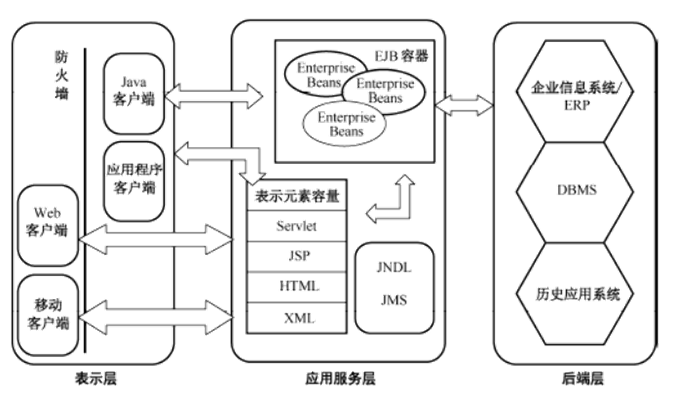

### .NET

- 全新的数据库访问技术ADO.NET

- 网络应用开发技术 ASP.NET 和
- Windows 编程技术 WinForms
- 在开发语言方面，.NET 提供了 VB、VC++、C#等多种语言支持

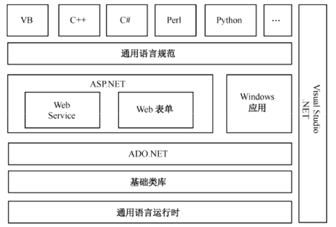

### EAI（企业应用集成）

通过中间件技术来连接企业级各种应用，使异构应用系统之间能够相互“交流”与“协作”。

- **界面集成**、**数据集成**、**业务过程集成**、**数据集成**

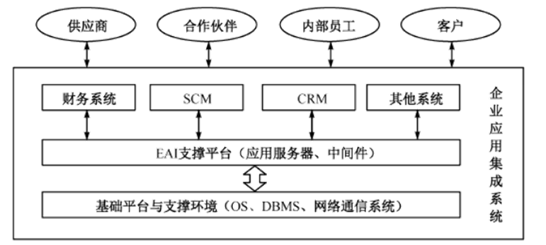

### MVC（前后端耦合）

Model：业务逻辑处理和数据保持，核心部分；

View：数据的输出，界面展示；

Controller：接收从视图发来的数据，控制Model和View；

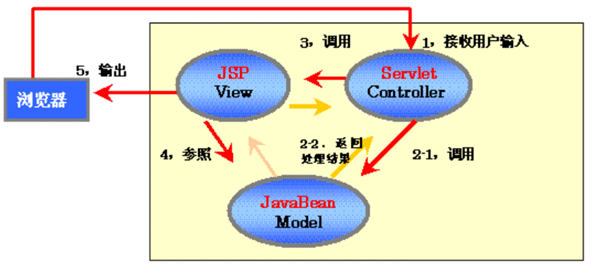