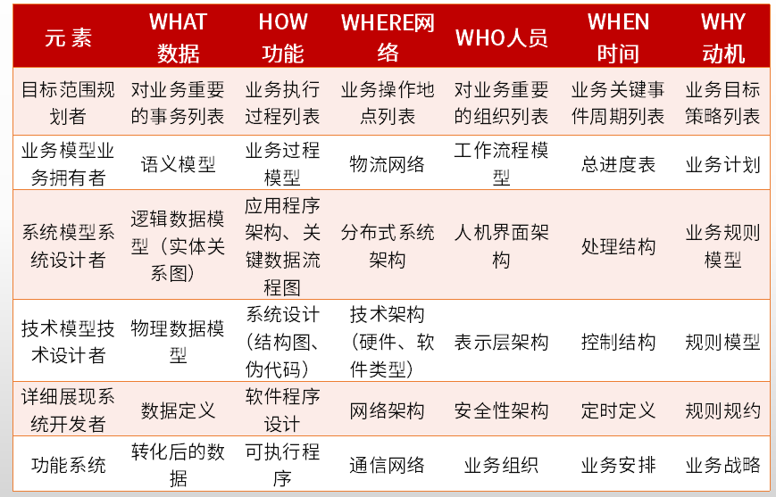
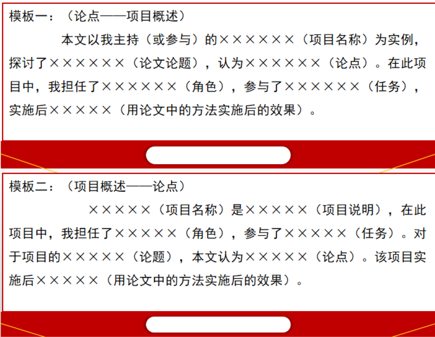

# 系统分析师（软考高级）

# 案例

### 2014年

#### 需求获取（JRP、抽样公式）

- JRP（联合需求计划）的定义、优势，不同需求获取的方式的适用场景；
- 抽样统计的样本公式= $0.25 * （可信度因子 * 错误率）^ 2$

#### 系统规划（可行性、净现值）

#### 系统运行与维护（恢复信息的级别、重构方法和优缺点）

### 2015年

#### 进度管理（工期计算、进度计划调整）

项目进度计划调整：

- 关键活动的调整；非关键活动的调整；增减工作项；资源调整

#### 架构分析（Zachman架构）

Zachman框架综合考虑企业业务架构中不同角色的不同观点，提出一个多视角、多角度的企业架构，是许多公司用来理解、表述企业信息基础设施的一种可以理解的信息表述，为企业现在以及未来的信息基础设施建设提供蓝图和架构。横向视角有5W1H，纵向功能视图包括目标范围、企业模型、系统模型、技术模型、详细展现、功能系统

#### 运行与维护（遗留系统的策略、新旧系统转换策略、数据迁移）

#### Web系统（功能划分和业务流程）

### 2016年

#### 系统规划（可行性、成本和收益类型、投资回收期（动态/静态））

#### 系统设计（面向对象设计，设计类分类，活动图/流程图区别，状态图填充）

设计类的类型、功能：

- 实体类：映射需求中的每个实体，需要保存在永久存储中的信息；
- 控制类：控制用例工作的类，用于对用例所特有的行为进行建模；
- 边界类：用于封装在用例内、外流动的信息或数据流； 

活动图和流程图的主要区别：

- 活动图是面向对象，流程图是面向结过程；
- 活动图着重表现系统的行为，流程图着重表现系统的处理过程；
- 活动图能够表示并发活动的情形，流程图主要结构是顺序、循环、分支，严格的顺序和时间关系，不能表示并发。

#### 数据库（反范式问题，读写锁及缺点，并发读写的三种问题现象）

数据冗余和数据不一致

丢失修改、读脏数据、不可重复读

#### Web系统（WebX，Hibernate/Mybatis，REST）

REST方案缺少对服务安全性的直接支持

### 2017年

#### Web系统（微服务概念/优劣势）

#### 数据库（数据库设计的三个阶段、范式判定、实体联系类型）

实体联系分为 1:1, 1:N, M:N

#### 数据库（反规范化设计及优缺点、数据分区及优缺点）

#### Web系统（分布式数据库概念和性能提升手段）

### 2018年

#### 系统分析（问题分析阶段的主要任务，因果分析，约束条件分类）

FAST系统分析的阶段和每个阶段的主要任务

#### 系统分析（结构化分析和面向对象分析的流程）

#### 数据库（视图概念和优缺点，物化视图，数据不一致的解决手段）

#### Web系统（REST的设计原则）

### 2019年

#### 系统分析（项目管理，PERT图，松弛时间，自由时差）

#### 系统设计（MDA软件开发方法）

#### 数据库（主从复制的类型，NOSQL比较，DB同步问题的方案）

DB同步问题（MYSQL-NOSQL）：程序级别，同步工具CDC，触发器

#### web系统（MVP的特点）

# 论文

理论联合实际

1. 负责的相关项目，和担任的主要工作（**系统分析师**）

**摘要模板**

### 2022年模拟1

#### 系统敏捷的开发方法（常见的敏捷开发方法，实施过程和效果）

#### 软件设计方法及应用（不同的软件设计方法、使用场景，实施效果）

#### NOSQL数据库及应用（NOSQL的主要内容和场景，架构设计过程和效果）

#### 软件系统测试及应用（测试管理主要活动内容，性能测试目的和类型，实施过程和效果）

### 2021年

#### 面向对象的系统分析方法（）

#### 静态测试方法及应用

#### ~~富Web / DecSecOps~~

### 2020年

#### 面向服务的信息系统开发（三个抽象级别，）

#### 快速应用开发方法（RAD 5步骤的工作和特点，实际问题和解决）

#### 软件设计模式（分类、特点、代表性，项目应用实践和效果）

#### 遗留系统演化策略（遗留系统评价的主要活动和演化策略，具体实施过程和效果）

### 2019年

#### ~~系统自动化测试的主要内容和优缺点~~

#### ~~处理流程设计工具和应用~~

#### ~~企业智能运维技术与方法~~

#### 系统需求分析的主要方法

### 2018年

#### ~~软件构件管理及其应用（构建获取和构架分类，如何获取构建和组装构建）~~

#### ~~数据挖掘方法及应用~~

#### 信息系统开发（自顶向下和自底向上的分析设计方式）

#### 需求获取技术及应用（需求获取方式和优缺点）

### 2017年

#### ~~企业应用集成~~

#### ~~数据流图在系统分析设计中的应用~~

#### ~~软件的系统测试及其应用~~（测试管理的主要内容，性能测试目的和类型）

#### 需求分析方法及应用（需求分析的主要工作内容，具体的需求分析方法和过程）

### 2016年

#### 需求验证方法及其应用（需求验证的方法和过程）

#### 系统测试及其应用（功能测试和性能测试）

#### 软件开发模型及应用（开发模型的主要思想和技术特点）

#### 信息系统规划与实践（系统规划主要步骤，实施过程，难点和解决方案）

### 2015年

#### 项目风险管理及其应用（）

#### 系统测试及其应用（）

#### 软件系统容灾与恢复（）

#### 非关系型数据库与应用（）
