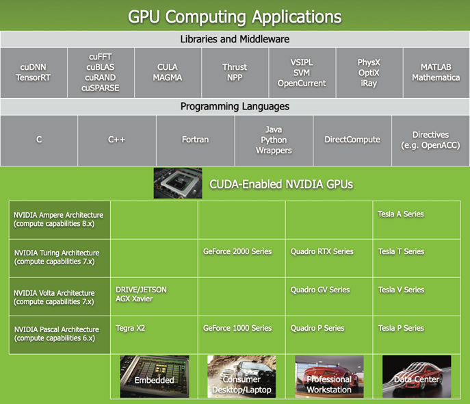
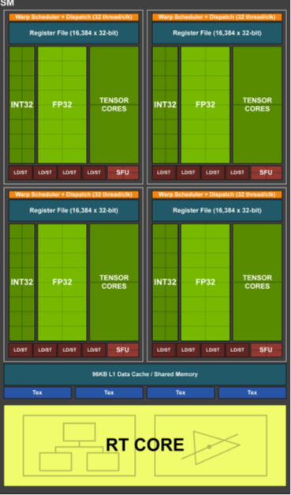

[toc]

# GPU

## CPU与GPU体系结构对比

## GPU计算应用

## 硬件概念

- 显存：GPU的内存，
- SP：最基本的处理单元，streaming processor，也称为Cuda core
- SM：多个SP加上其他的一些资源组成一个streaming multiprocessor，也叫GPU大核，其他资源如：warp scheduler，register，shared memory等。

[Tesla T4](https://www.nvidia.cn/content/dam/en-zz/Solutions/Data-Center/tesla-t4/t4-tensor-core-datasheet.pdf)：[Turing ](https://www.nvidia.com/content/dam/en-zz/Solutions/design-visualization/technologies/turing-architecture/NVIDIA-Turing-Architecture-Whitepaper.pdf)[架构](https://www.nvidia.com/content/dam/en-zz/Solutions/design-visualization/technologies/turing-architecture/NVIDIA-Turing-Architecture-Whitepaper.pdf)（第7代），目前已经演进到第8 代Ampere;

**Turing TU102 Full GPU with 72 SM Units **

**Turing TU102 Streaming Multiprocessor (SM) **

## 执行说明

- CUDA的设备在实际执行过程中，会以block为单位，把一个个block分配给SM进行运算；
- block中的thread又会以warp（线程束）为单位，对thread进行分组计算。
  - 目前CUDA的warp大小都是32，也就是说32个thread会被组成一个warp来一起执行。
  - 同一个warp中的thread执行的指令是相同的，只是处理的数据不同。
- 一个SM 一次只会执行一个block 里的一个warp
  - 当遇到正在执行的warp 需要等待的时候（例如存取global memory 就会要等好一段时间），就切换到别的warp来继续做运算