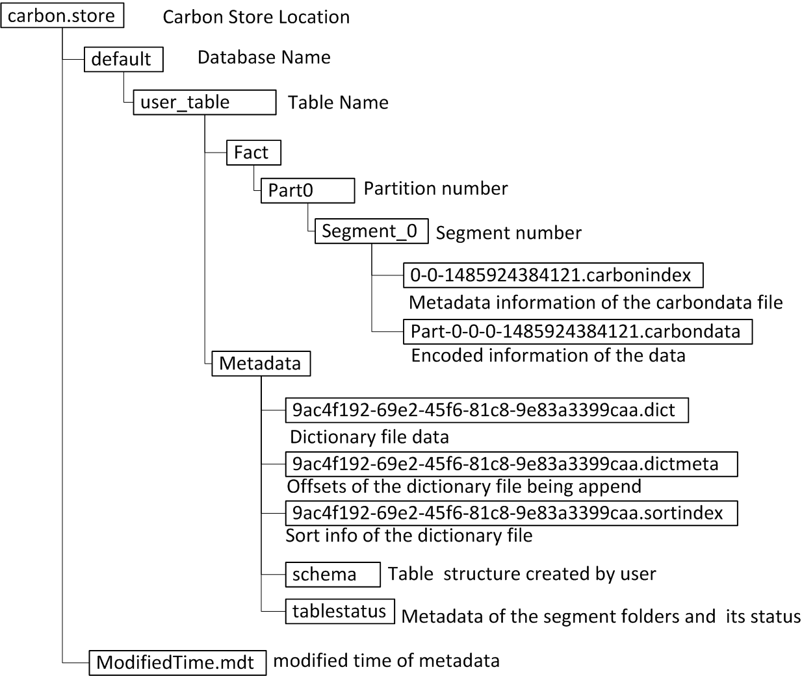
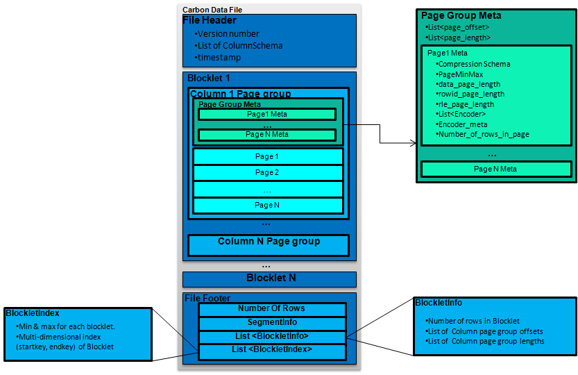
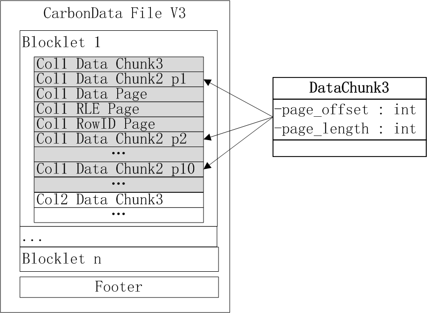
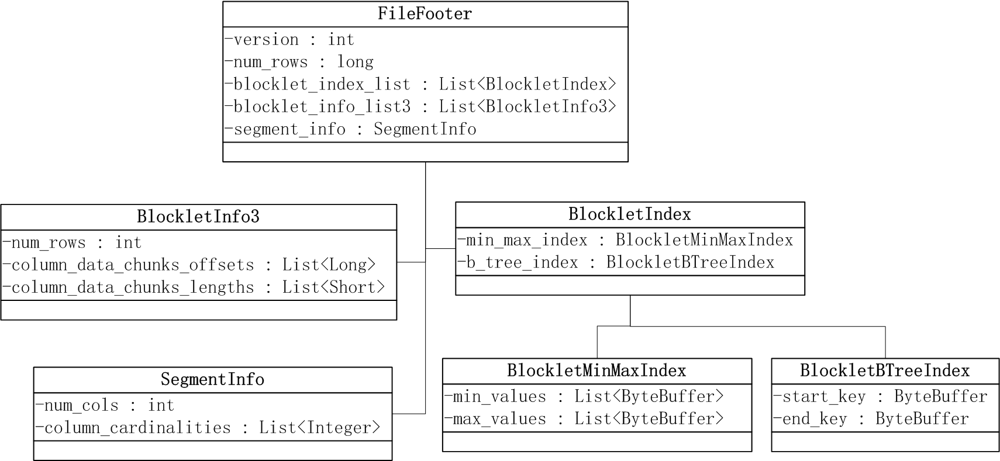
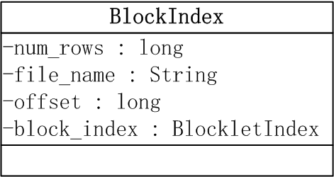

[toc]

# Apache CarbonData

**索引的列式存储格式**，用于大数据系统Hadoop、Spark分析。

- 数据带索引：当有过滤条件时，减少IO扫描和CPU资源；
- 数据编码和压缩：可以直接查询压缩/编码后的数据；
- 支持更新和删除操作；
- 支持多样的分析：OLAP交互式、大范围扫描（顺序读）和小范围扫描（随机读）

目前集成的系统有Hive、Spark、Presto 和 Alluxio。

## 表管理

### DDL(Create, Alter, Drop, CTAS)

**CarbonData提供单独的DDL来创建和管理carbondata 表**。DDL适配Hive、SparkSQL，并支持其他属性和格式来充分利用carbondata功能。

### DML(Load, Insert)

数据管理

### Update & Delete

类似Hive的IUD的语法

### Segment Management

管理表的增量负载，可以为正在执行的操作提供事务处理能力。

### Partition

- 支持类似Hive的分区；
- 支持hash，list，range 分区；

### Compaction

CarbonData将增量负载作为Segment进行管理。压缩有助于压缩不断增长的段数，也会提升查询过滤器修剪。

### External Tables

CarbonData可以读取任何CarbonData文件，并**自动从该文件推断模式，并提供一个关系表视图**，以便使用Spark或任何其他应用程序执行sql查询。

## DataMaps

### Pre-Aggregate

CarbonData将自动预聚合增量数据并重新编写查询，以便自动从最合适的预聚合表中提取数据，以更快地为查询服务。

### Time Series

时间序列是一个预聚合表，它可以在增量加载期间自动将数据汇总到所需的级别，并从最合适的预聚合表提供查询服务。

### Bloom filter

CarbonData支持bloom filter作为数据映射，以便快速有效地修剪数据以进行扫描并获得更快的查询性能。

### Lucene

CarbonData提供Lucene数据映射，以便可以使用Lucene索引文本列，并使用索引结果在查询期间有效地修剪要检索的数据。

### MV(Materialized Views)

MVs是一种支持高效查询重写和处理的预聚合表，CarbonData提供了MV，它可以重写查询以从任何表（包括非CarbonData表）中获取数据。典型的用例是将非carbondata事实表的聚合数据存储到carbondata中，并使用mv重写查询以从carbondata获取数据。

## Streaming

### Spark Streaming

CarbonData支持近乎实时地将数据流传输到CarbonData中，并使其立即可供查询。CarbonData提供DSL，可以轻松创建源表和汇表，而无需用户编写应用程序。

## 数据类型

CarbonData 支持以下的数据类型:

- 数字类型

  - SMALLINT
  - INT/INTEGER
  - BIGINT
  - DOUBLE
  - DECIMAL
  - FLOAT
  - BYTE

  **NOTE**: Float and Bytes are only supported for SDK and FileFormat.

- 时间日期类型

  - TIMESTAMP
  - DATE

- 字符串类型

  - STRING
  - CHAR
  - VARCHAR

- 复杂类型

  - arrays: ARRAY`<data_type>`
  - structs: STRUCT`<col_name : data_type COMMENT col_comment, ...>`
  - maps: MAP`<primitive_type, data_type>`

  **注意**: 目前仅支持 2 级复杂类型模式

- 其他类型

  - BOOLEAN
  - BINARAY

## 文件格式

### 文件目录结构

carbondata的数据存储路径，${***carbon.storelocation***}

### 数据文件格式

#### File Header

包含文件版本信息，列的schema信息和schema更新的时间戳。

#### Blocklet format

文件包含多个Blocklet + 1个FileFooter

Blocklet：数据集，默认64MB。对每个列包含一个ColumnChunk，每个ColumnChunk包含一个或多个列页；

每个ColumnChunk包含一个或多个Column Page，并且ColumnPage包含BlockletMinMaxIndex。

- Data Page: 包含列的编码数据。
- Row ID Page (可选): 包含行 ID 的映射信息，当数据页面被存储为倒排索引时使用。
- RLE Page (可选): 包含一些额外的元数据，当数据页面使用 RLE 编码时使用。

**Footer格式**

- BlockletInfo3 记录所有的 ColumnChunk3 的偏移量和长度；

- SegmentInfo记录列的数目和每列的基数；
- BlockletIndex包含MinMaxIndex和BTreeIndex。
  - MinMaxIndex记录blocklet中每列的最小、最大值；
  - BTreeIndex记录每个blocklet的起始/结束值；

### 索引文件格式

解析FileFooter中的BlockletIndex部分，生成index文件。

BlockIndex对象记录与块对应的索引信息，包括carbondata文件名、footer偏移量和BlockletIndex。

### 词典文件格式

- 词典文件记录列的不同值的列表；
- 词典元数据文件记录每个数据加载的新的不同值的元数据描述；
- sortindex文件记录按值排序的字典代码的键代码的结果集。

### tablestatus文件格式

Tablestatus记录每次加载和合并的段相关信息（gson格式），包括加载时间、加载状态、段名称、是否删除以及合并的段名称。每次加载或合并后重新生成表状态文件。