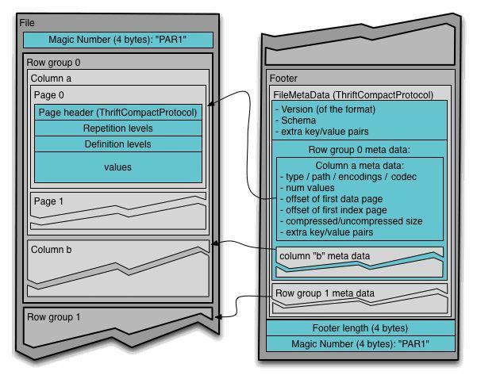

[toc]

# Parquet

## 定义

Parquet 是支持嵌套数据的列式存储格式，其元数据使用 Apache Thrift 编码。

[Input](https://github.com/apache/parquet-mr/blob/master/parquet-hadoop/src/main/java/org/apache/parquet/hadoop/ParquetInputFormat.java) and [Output](https://github.com/apache/parquet-mr/blob/master/parquet-hadoop/src/main/java/org/apache/parquet/hadoop/ParquetOutputFormat.java) formats. Note that to use an Input or Output format, you need to implement a `WriteSupport` or `ReadSupport` class, which will implement the conversion of your **object to and from a Parquet schema**. 

- Native Avro support
- Native Thrift support
- Native Protocol Buffers support

Avro, Thrift, Protocol Buffers 都有各自的存储格式，但是 Parquet 使用了自己在[parquet-format](https://github.com/apache/parquet-format)项目里定义的存储格式。

## 模块

- parquet-format：格式规范和Thrift的元数据定义；
- parquet-mr：包含多个子模块，读写parquet以及和其它格式的转换；
- parquet-cpp：C++库读写parquet（现在项目移到apache arrow 中）；
- parquet-rs：Rust 库读写parquet；
- parquet-compatibility：兼容性测试，验证不同语言的实现间的互相读写；

## 术语

- Block（HDFS block）： a block in HDFS and the meaning is unchanged for describing this file format。文件格式基于HDFS设计。
- File： A HDFS file that must include the metadata for the file. 
- Row group：A logical horizontal partitioning of the data into rows. 
- Column chunk：A chunk of the data for a particular column.
- Page：Column chunks are divided up into pages. There can be multiple page types which are interleaved in a column chunk.

## 格式

	

文件结构可以看出，Parquet 格式可以从以下几个部分理解：

- 文件（File）：一个 Parquet 文件，包括数据和元数据。
- 行组（Row Group）：数据在水平方向上按行拆分为多个单元，每个单元就是所谓的 Row Group，即行组。这是一般列式存储都会有的结构设计。每一个行组包含一定的行数，**Parquet 读写的时候会将整个行组缓存在内存中**，因此更大尺寸的行组将会占用更多的缓存，并且记录占用空间比较小的 Schema 可以在每一个行组中存储更多的行。
- 列块（Column Chunk）：一个行组中的每一列对应的保存在一个列块中。行组中的所有列连续的存储在这个行组文件中，每一个列块中的值都是相同类型的，**不同列块可能使用不同的算法进行压缩**。
- 数据页（Data Page）：**每一个列块划分为多个数据页或者说页**，**一个页是最小的编码的单位**，在同一个列块的不同页可能使用不同的编码方式。

文件的组织形式：

```
4-byte magic number "PAR1"
<Column 1 Chunk 1 + Column Metadata>
<Column 2 Chunk 1 + Column Metadata>
...
<Column N Chunk 1 + Column Metadata>
<Column 1 Chunk 2 + Column Metadata>
<Column 2 Chunk 2 + Column Metadata>
...
<Column N Chunk 2 + Column Metadata>
...
<Column 1 Chunk M + Column Metadata>
<Column 2 Chunk M + Column Metadata>
...
<Column N Chunk M + Column Metadata>
File Metadata
4-byte length in bytes of file metadata
4-byte magic number "PAR1"
```

## 元数据

Parquet 文件有三种类型的元数据，分别是file metadata、column(chunk) metadata、page header metadata，每部分元数据包含的信息从下面图解中大概可以得知。


## 索引

### 统计信息

每个**行组和每个页**都有统计信息：

- min, max；
- null_count, distinct_count；

### bloomFilter

详细设计见[Bloom Filter](./bloomfilter.md)


## 并行单元

- MapReduce - File/Row Group
- IO - Column chunk
- Encoding/Compression - Page


## Data Pages

在page header之后，以下三部分信息会依次编码：

- repetition levels data
- definition levels data
- encoded values

page header中的`uncompressed_page_size`包含这三部分。


## Column Chunks

列块由多个页组成，页共享共同的header，reader可以跳过不需要的page。header后面的数据页可以被编码和压缩，压缩和编码信息在page header中。

此外，文件可以包含可选的列索引，reader可以更有效跳过page，请看[PageIndex

[](./pageIndex.md)


## 元数据和列数据分离

该格式被明确设计为将元数据与数据分离。这允许将列拆分为多个文件，以及让单个元数据文件引用多个parquet文件。


## 校验和

Data Pages可以单独校验和（CRC32），因此可以取消HDFS文件级别的校验和，可以更好支持单行查找。

