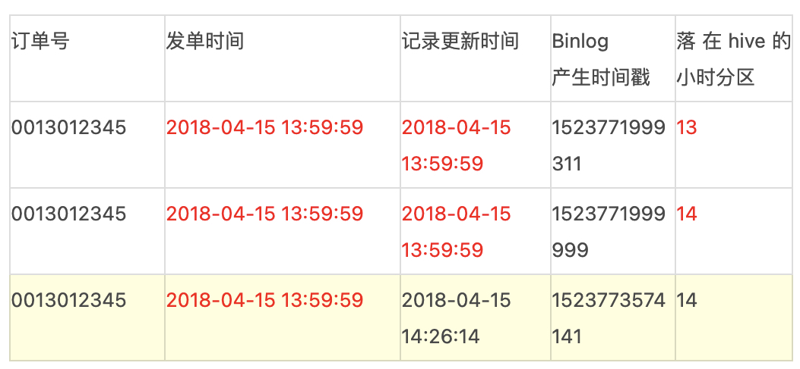

# 数据同步

## 类型

### 全量同步

**通过SparkSQL或者Flink SQL直连MySQL去Select表中的数据，将数据插入（覆盖）到Hive表**中。缺点如下：

- 性能瓶颈：随着业务规模的增长，Select From MySQL -> Spark -> Load to Hive这种数据流花费的时间越来越长，无法满足下游数仓生产的时间要求；
- 直接从MySQL中Select大量数据，对MySQL的影响非常大，容易造成慢查询，影响业务线上的正常服务；
- 由于需要清楚目标表所有数据，目标库一段时间内查不到数据。

### 增量同步

如果表中有时间戳，可以**通过时间戳过滤数据**，并插入到Hive表中，缺点如下：

- MySQL中发生 **Update/Delete 的数据无法很好地进行支持**；
- **表的Schema变更，无法很好支持**；

### 实时同步

[CDC（Change Data Capture）](./CDC.md)+ Merge的技术方案。

### 数据湖

针对**表的schema变更、需要保留表**的历史版本，可以通过数据湖进行存储实现，比如Apache Hudi、Apache Iceberge等。

## 校验

保障整个Binlog链路中数据完整性，记录着整个数据通道每一个流程的数据信息，如某一段时间内的数据总和等，包含以下功能：

- 为数据回溯提供元数据支持
- 校验数据丢失与延迟情况
- 校验数据完整性

## 细节

### 数据飘移的支持

存在很多类似的两种case，其采集周期存在一定的不确定性：

**case 1：**订单的Binlog日志中，当订单事件的更新时间在59分59秒左右时，数据有可能会落在下一个小时的分区，以至于当前小时数据没有统计到该条订单，同时下一个小时分区的数据也没有打上相应的事件标签。

**case 2：**支付结算系统，当天所有交易记录会在次日凌晨后结算完成，按照默认采集逻辑，当天的记录落在次日的变更内，无法有效支持当天核算。

解决方案：

- 能根据发单时间戳进行分区么？

- 按需配置偏移量。比如小时粒度默认为00:00 - 59:59之间的数据，配置5min的偏移，那么数据区间为00:00 - 04:59（次小时），多出来的部分可以有效解决数据漂移功能，同时为及时性提供了有效支撑。

### 分库分表的支持

分库分表的诉求，其规则也可能多种多样，如table_{城市区号}，table_{连续数字}，table_{日期}，如果逐个抽取并聚合，上下游的成本巨大。因此我们需要在数据规范层面，数据链路上保障能自动化收集这类数据。

- 默认情况下一个库的数据会收集到一个topic内，如果有分库存在也可以一并收集到一个topic内，保证逻辑上分库分表的数据物理上收集到一起。
- 按照/{db}/{table}/{year}/{month}/{day}/{hour}的路径结构（其中日期由Binlog时间格式化生成）落地到HDFS上，一个逻辑表的数据存储在一起。
- ETL处理阶段，取出上述路径下的Binlog日志，还原到Hive中。
