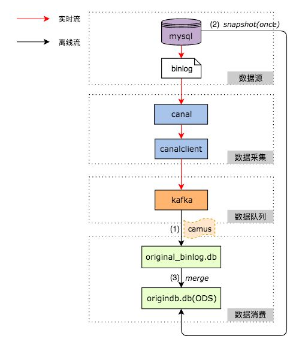
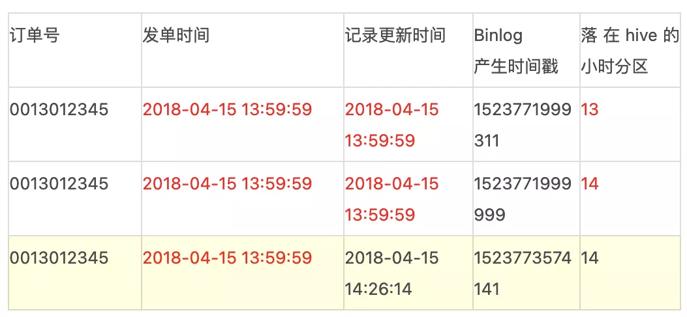
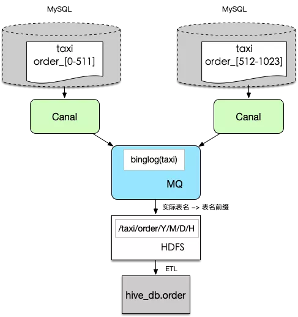
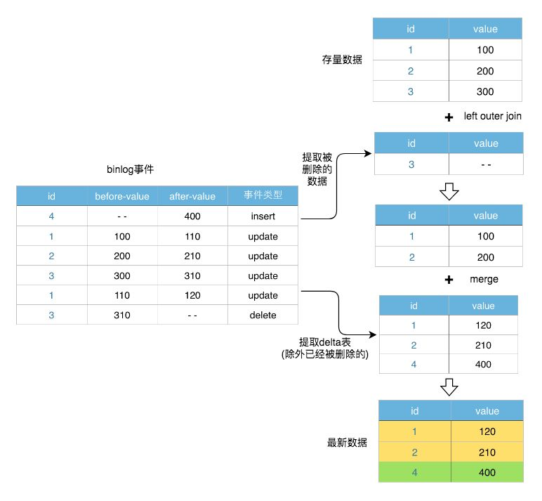

# 案例

> MySQL 数据实时同步到 Hive 的架构与实践，来源于美团和滴滴。

## 整体数据流程

通过下面的步骤在Hive上还原一张MySQL表：

1. 采用Linkedin的开源项目Camus，负责每小时把Kafka上的Binlog数据拉取到Hive上。
2. 对每张ODS表，首先需要一次性制作快照（Snapshot），把MySQL里的存量数据读取到Hive上，可以采用直连MySQL去Select数据的方式。
3. 对每张ODS表，每天基于存量数据和当天增量产生的Binlog做Merge，从而还原出业务数据。

## Binlog

Binlog 使用 **Row模式**，记录了每次对数据进行增删改查时，一行数据在变更前后的值，同时无论单列是否被改动，都会**记录一行数据的完整信息**。

对Binlog的订阅以MySQL的DB为粒度，**一个DB的Binlog对应了一个Kafka Topic**。

一个MySQL实例下所有订阅的DB，都由同一个Canal Instance进行处理。

CanalServer会抛弃掉未订阅的Binlog数据，然后CanalClient将**接收到的Binlog按DB粒度分发到Kafka**上。

## 一次性拉取&初始化

Binlog从发起采集的一刻起才会在整个链路上存在，即以增量的方式传递，那么对于历史数据如何获取？

实际场景中包括**全量接入**或**增量历史数据回溯**。

目前实现方式为通过 DataX 工具直连 MySQL 离线库，拉取一份截至到当前时间的全量数据，然后按列还原到Hive表的首个分区中。

**全量采集场景下，下个分区的数据基于上个分区的数据和当前周期内的增量Binlog日志merge，即可产生该分区内的数据。**

## Merge流程

Binlog成功入仓后，下一步要做的就是基于Binlog对MySQL数据进行还原。Merge流程做了两件事，首先把**当天生成的Binlog数据存放到Delta表中，然后和已有的存量数据做一个基于主键的Merge**。

Delta表中的数据是当天的最新数据，当一条数据在一天内发生多次变更时，Delta表中只存储最后一次变更后的数据。

### 场景一：数据飘移的支持

实际业务中，存在很多类似的两种case，其采集周期存在一定的不确定性。 

**case 1：**订单的Binlog日志中，当订单事件的更新时间在59分59秒左右时，**数据有可能会落在下一个小时的分区**，以至于当前小时数据没有统计到该条订单，同时下一个小时分区的数据也没有打上相应的事件标签。

**case 2：**支付结算系统，当天所有交易记录会在次日凌晨后结算完成，按照默认采集逻辑，当天的记录落在次日的变更内，无法有效支持当天核算。

常规解决方案可能是**把下个小时的数据也囊括到本采集周期内**，但会导致数据就位时间延迟一个小时，扩散到数据下游，时间会更长，可能不满足实际需求。采集平台提供数据漂移的功能，即按需配置偏移量。比如小时粒度默认为00:00 - 59:59之间的数据，配置5min的偏移，那么数据区间为00:00 - 04:59（次小时），多出来的部分可以有效解决数据漂移功能，同时为及时性提供了有效支撑。

### 场景二：分库分表的支持

分库分表的诉求，其规则也可能多种多样，如table_{城市区号}，table_{连续数字}，table_{日期}，如果逐个抽取并聚合，上下游的成本巨大。因此我们需要在数据规范层面，数据链路上保障能自动化收集这类数据。

- **1.** 统一MySQL使用规范，明确分库分表的命名规则，做到规则内自动化识别，同时完成全量元数据信息的收集，非规范化的命名规则无法自动化支持。
- **2.** 默认情况下一个库的数据会收集到一个topic内，如果有分库存在也可以一并收集到一个topic内，保证逻辑上分库分表的数据物理上收集到一起。
- **3.** 按照/{db}/{table}/{year}/{month}/{day}/{hour}的路径结构（其中日期由Binlog时间格式化生成）落地到HDFS上，一个逻辑表的数据存储在一起。
- **4.** ETL处理阶段，取出上述路径下的Binlog日志，还原到Hive中。

### 删除事件的支持

处理Delete事件的Merge流程，采用如下两个步骤：

- 首先，提取出发生Delete事件的数据，由于Binlog本身记录了事件类型，这一步很容易做到。
- 将**存量数据（表A）与被删掉的数据（表B）在主键上做左外连接**（Left outer join），如果能够全部join到双方的数据，说明该条数据被删掉了。因此，选择结果中表B对应的记录为NULL的数据，即是应当被保留的数据。
- 然后，对上面得到的**被保留下来的数据，按照前面描述的流程做常规的Merge**。

