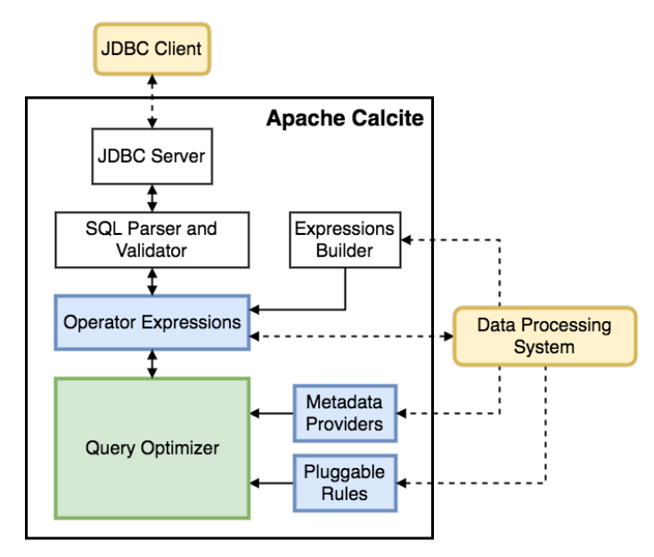
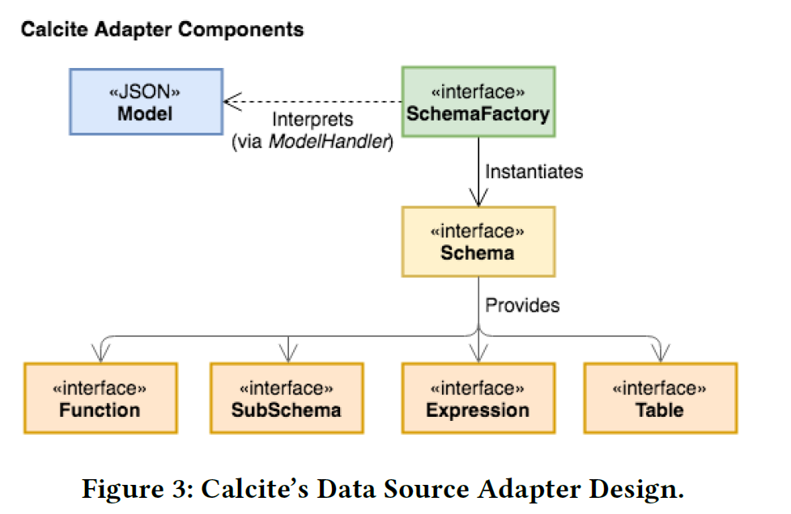
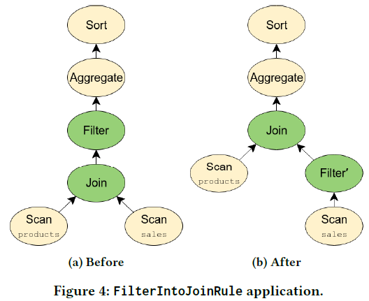
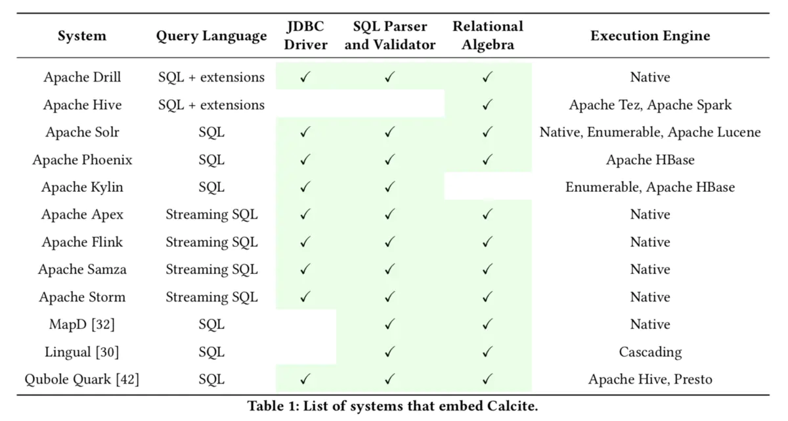
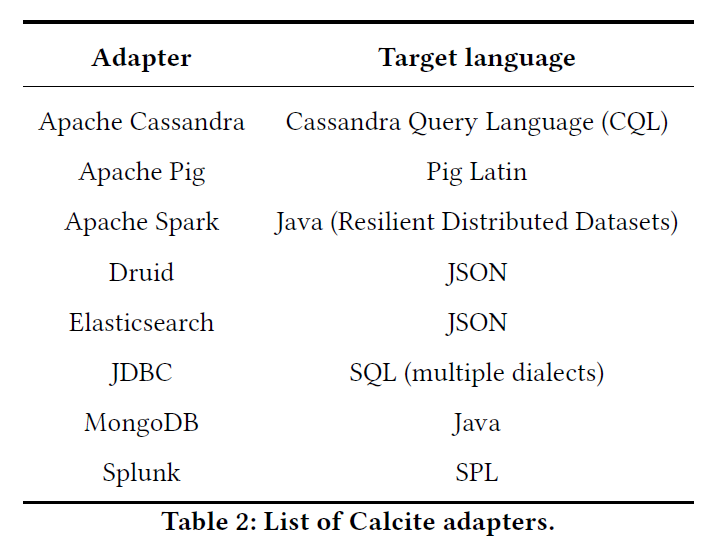

# Apache Calcite

> Apache Calcite : A Foundational Framework for Optimized Query Processing Over Heterogeneous Data Sources（一个用于优化异构数据源的查询处理的基础框架）

提供了**OLAP**和**流处理**的**查询引擎**，支持**异构数据源查询**

- **SQL 解析器、验证器和 JDBC 驱动**；
- **查询优化工具**，包括关系代数API，基于规则的计划器和基于成本的查询优化器；
- **不包括数据处理、数据存储**等 DBMS 的核心功能；

Apache Hive 使用 Calcite 进行基于成本的查询优化，而Apache Drill 和Apache Kylin 使用SQL 解析器。

## 起源

> 一个用于优化异构数据源的查询处理的基础框架。

Calcite 之前叫做 optiq：

- optiq 起初用于 Apache Hive 项目中，为 Hive 提供基于成本模型的优化，即CBO（cost based optimizations）；

- 2014 年 5 月 optiq 独立出来，成为 Apache 社区的孵化项目，2014 年 9 月正式更名为 Calcite。

该项目的目标是 one size fits all（一种方案适应所有需求场景），希望能为不同计算平台和数据源提供统一的查询引擎。

## 背景

数据库管理系统分为以下五部分，其中前三部分是Calcite负责的部分，后两部分提供适配器可集成：

- 查询语言
- 查询优化器
- 查询执行
- 数据管理
- 数据存储

Apache Calcite 为许多流行的开源数据处理系统(如Apache Hive、Apache Storm、Apache Flink、Druid和MapD)提供**查询处理、优化和查询语言**支持。

- 支持多种数据模型：流式、批式数据；
- 跨平台支持，查询优化灵活、可扩展；
- 支持ANSI SQL及其扩展；
- 支持SQL解析为关系算子树，并将优化后的树翻译回SQL；

不负责：

- 数据存储、处理数据的算法、元数据存储

产生背景：

- 分布式计算产品需要类似 SQL 解析、执行的功能，一条SQL能够被解析成多个语法树，需要进行优化；
- 大数据处理中的批量计算、流计算、交互查询等领域都会存在一些共性问题；
- 多种异构数据源需要整合，存在跨平台的查询语句分发及执行优化等课题；

## 架构



- JDBC client 表示外部的应用，访问时一般会以 SQL 语句的形式输入，通过 JDBC Client 访问 Calcite 内部的 JDBC Server；
- 接下来 JDBC Server  会把传入的 SQL 语句经过 SQL Parser and Validator 模块做 SQL 的解析和校验；
- 旁边的 Expressions Builder 用于支持 Calcite 做 SQL 解析和校验的框架对接；
- 接着是 Operator Expressions 模块来处理关系表达式；
- Metadata Providers 用来支持外部自定义元数据；
- Pluggable Rules 用来定义优化规则；
- 最核心的 Query Optimizer 则专注查询优化。

### 优化器（Optimizer）

- 采用**关系算子树**作为内部表示；

优化引擎构成：

- 规则（rules）：
- 元数据提供者（metadata providers）：
- 计划器引擎（planner engines）：

### 查询代数（Query Algebra）

**Operators**：

- 常用的关系型代数的算子：如 *join*, *project*, *filter* 等；
- 复杂操作/特定场景的算子：如 *window* 等；

**Traits**（？**不是很明白**？）：

- 使用特质（Trait）来描述与操作符关联的物理属性；
- 优化过程中，Calcite 尝试对关系表达式强制执行某些特质；
-  calling convention（调用约定特质）

### 适配器（Adapters）

**Adapter**：

- 模型（model）：访问的数据源的物理属性的规范说明；
- 范式（schema）：model中数据（格式和布局）的定义；
- 范式工厂（schema factory）：从模型中获取元数据信息并生成一个模式；



### 查询处理和优化

**计划器规则（planner rules）**

- 规则匹配树中的给定模式，进行表达式树的等价转换；



**元数据提供者（Metadata providers）**

- 指导计划者实现降低总体查询计划成本的目标；
- 在应用规则时向规则提供信息；
- 允许数据处理系统将其元数据信息插入框架，提供在优化阶段使用新的元数据功能
- 元数据提供程序可插入，使用Java轻量级编译器Janino在运行时对其进行编译和实例化

**规划器引擎（Planner engines）** 

- 触发提供给引擎的规则，直到达到给定目标为止；
- 基于成本的计划器引擎（COB）：
  - 类似于Volcano 的动态编程算法来创建和跟踪通过触发提供给引擎的规则而创建的不同替代计划
- 详细的计划程序，会循环地触发规则，直到它生成不再被任何规则修改的表达式为止。 

**物化视图（Materialized views）**

对数据摘要或物化视图进行预计算是加速数据仓库中查询处理的最强大技术之一，alcite 提供了两种不同的基于物化视图的重写算法的实现：

- 基于视图替换，用一个物化视图的等效表达式替换关系代数树的一部分；
- 基于格子（lattices）


## 使用方式

### Lib库

把 Calcite 当作 lib 库，嵌入到自己的项目中。



### 集成

实现一个适配器（Adapter），项目通过读取数据源的适配器与 Calcite 集成。




## 功能

Calcite’s core module (`calcite-core`) supports SQL queries (`SELECT`) and DML operations (`INSERT`, `UPDATE`, `DELETE`, `MERGE`) but does not support DDL operations such as `CREATE SCHEMA` or `CREATE TABLE`。

The server module (`calcite-server`) adds DDL support to Calcite。


## JDBC Driver

Calcite 对用户提供 jdbc driver，用户可以通过其连接Calcite进行数据查询。

```sql
jdbc:calcite:schemaType=JDBC; schema.jdbcUser=SCOTT; schema.jdbcPassword=TIGER; schema.jdbcUrl=jdbc:hsqldb:res:foodmart
```


## SQL Language

TODO


## 示例

maven依赖

```xml
<groupId>org.apache.calcite</groupId>
<artifactId>calcite-core</artifactId>
<version>1.29.0</version>
```

java demo

```java
package edu.xliu.lifelearning.cs.calcite;

import org.apache.calcite.adapter.java.ReflectiveSchema;
import org.apache.calcite.jdbc.CalciteConnection;
import org.apache.calcite.schema.SchemaPlus;

import java.sql.*;
import java.util.Properties;

public class HrSchema {

    public static class Employee {
        public final int emp_id;
        public final String name;
        public final int dept_no;

        public Employee(int emp_id, String name, int dept_no) {
            this.emp_id = emp_id;
            this.name = name;
            this.dept_no = dept_no;
        }
    }

    public static class Department {
        public final String name;
        public final int dept_no;

        public Department(int dept_no, String name) {
            this.dept_no = dept_no;
            this.name = name;
        }
    }

    public final Employee[] employee = {
            new Employee(100, "joe", 1),
            new Employee(200, "oliver", 2),
            new Employee(300, "twist", 1),
            new Employee(301, "king", 3),
            new Employee(305, "kelly", 1)
    };

    public final Department[] department = {
            new Department(1, "dev"),
            new Department(2, "market"),
            new Department(3, "test")
    };

    public static void main(String[] args) throws ClassNotFoundException, SQLException {
        Class.forName("org.apache.calcite.jdbc.Driver");
        Properties info = new Properties();
        info.setProperty("lex", "JAVA");
        Connection connection = DriverManager.getConnection("jdbc:calcite:", info);
        CalciteConnection calciteConnection = connection.unwrap(CalciteConnection.class);
        SchemaPlus rootSchema = calciteConnection.getRootSchema();
//        Class.forName("com.mysql.jdbc.Driver");
//        BasicDataSource dataSource = new BasicDataSource();
//        dataSource.setUrl("jdbc:mysql://localhost");
//        dataSource.setUsername("username");
//        dataSource.setPassword("password");
//        Schema schema = JdbcSchema.create(rootSchema, "hr", dataSource, null, "name");
        
        // 基于内存将Java对象注册为schema，将emps和depts作为表
        rootSchema.add("hr", new ReflectiveSchema(new HrSchema()));

        try(Statement statement = calciteConnection.createStatement()) {
            ResultSet resultSet = statement.executeQuery(
                    "select e.emp_id, e.name as emp_name, e.dept_no, d.name as dept_name "
                            + "from hr.employee as e left join hr.department as d on e.dept_no = d.dept_no");

            while (resultSet.next()) {
                for (int i = 1; i <= resultSet.getMetaData().getColumnCount(); i++) {
                    System.out.print(resultSet.getMetaData().getColumnName(i) + ":" + resultSet.getObject(i));
                    System.out.print(" | ");
                }
                System.out.println();
            }
            resultSet.close();
        }
        connection.close();
    }
}
```


其它SQL系统可以通过[Adapter](https://calcite.apache.org/docs/adapter.html)的方式，继承到Calcite中，可以参考 [example/csv](https://calcite.apache.org/docs/tutorial.html) 的 Adapter。

