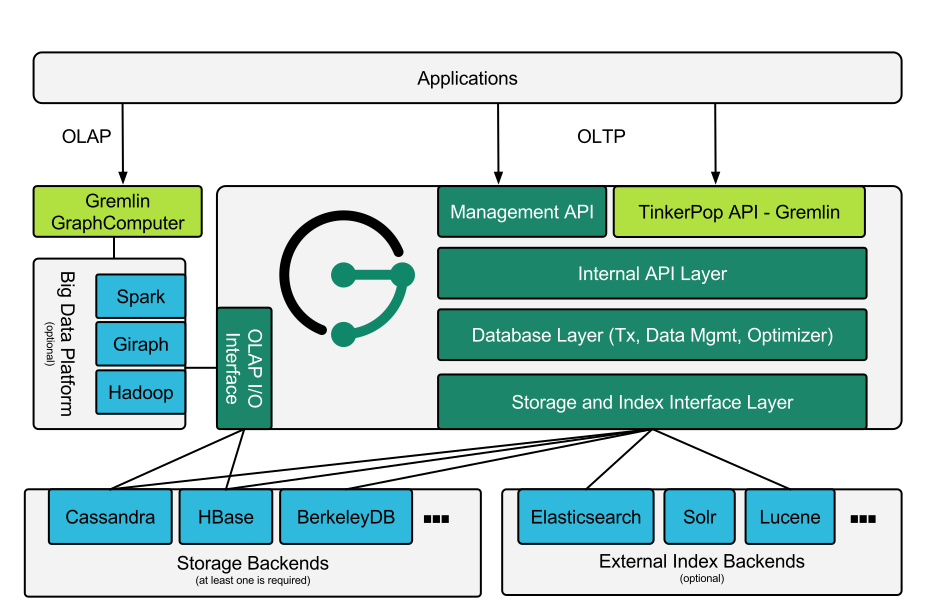

# JanusGraph

前身是Titan。

https://github.com/JanusGraph/janusgraph

## 架构

存储层

- Apache Cassandra
- Apache HBase
- Oracle Berkeley DB Java Edition

索引层

- Elasticsearch
- Apache Solr
- Apache Lucene

