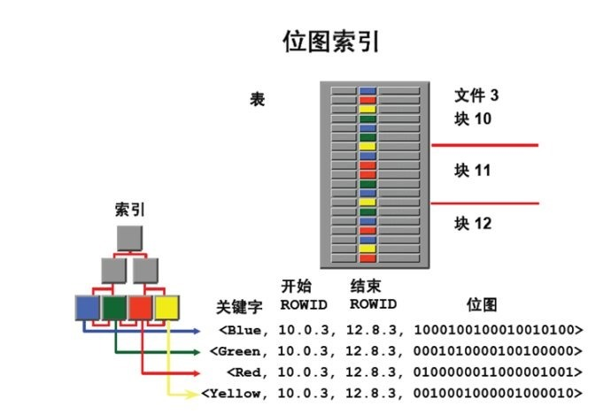

# 索引

## 倒排索引

索引方法，被用来存储在全文搜索下某个单词在一个文档或者一组文档中的存储位置的映射。

一般用在文档数据库，如MongoDB中。

## 树状索引

### B树系列索引

数据库系统巧妙利用了磁盘预读原理，将一个节点的大小设为等于一个页（磁盘的一个块），这样每个节点只需要一次I/O就可以完全载入。为了达到这个目的，在实际实现B- Tree还需要使用如下技巧：

- 每次新建节点时，直接申请一个页的空间，**保证一个节点物理上也存储在一个页**里，加之计算机存储分配都是按页对齐的，就实现了一个node只需一次I/O。
- B-Tree中一次检索最多需要 h-1 次I/O（根节点常驻内存），渐进复杂度为O（h）=O（logmN）。一般实际应用中，**m是非常大的数字，通常超过100**，因此h非常小（通常不超过3）。

#### InnoDB一棵B+树可以存放多少行数据

InnoDB的主键索引：B+树的叶子节点存储了完整的数据记录。

InnoDB的辅助索引：引用主键作为data域，因此需要两次的索引检索。

文件系统块的大小是4k，InnoDB最小储存单元页（Page）的大小是16K。

单行的字节数：1KB

一页存储的行数：16KB / 1KB = 16

主键：bigInt 8字节

指针：在InnoDB源码中设置为6字节

一页的索引个数：16KB = 16384/(6+8) = 1170

**高度为3的B+树**：**1170（索引个数）\*1170（索引个数）\*16（每页行数）= 21902400（2千万）**条这样的记录

## 位图索引

主要针对**大量相同值的列而创建的索引**，此时B+树索引仍然会取出大部分数据。

- 无需排序；
- 对**位图索引**列进行is null查询时,则可以使用索引；
- 当使用count(XX),可以直接访问索引就快速得出统计数据；
- 当根据**位图索引**的列进行and,or或 in(x,y,..)查询时,直接用索引的位图进行或运算,在访问数据之前可事先过滤数据；
- **位图索引**，由于用位图反映数据,不同会话更新相同键值的同一位图段，insert、update、delete相互操作都会发锁定。

### 原理

- 索引块的一个索引行中存储键值、起止Rowid,以及这些键值的位置编码；
- 位置编码中的每一位表示键值对应的数据行的有无.位数=表的总记录数；
- 所需的位图个数=索引列的不同键值多少，列的不同值越少，所需的位图就越少；
- 与B*树那样直接保存rowid的区别就在于**每次都要进行rowid的换算工作**。

### 场景

位图索引不适合**OLTP**，比较适合**OLAP**。

- **位图索引**，由于用位图反映数据，不同会话**更新相同键值的同一位图段**，insert、update、delete相互操作都会发锁定。