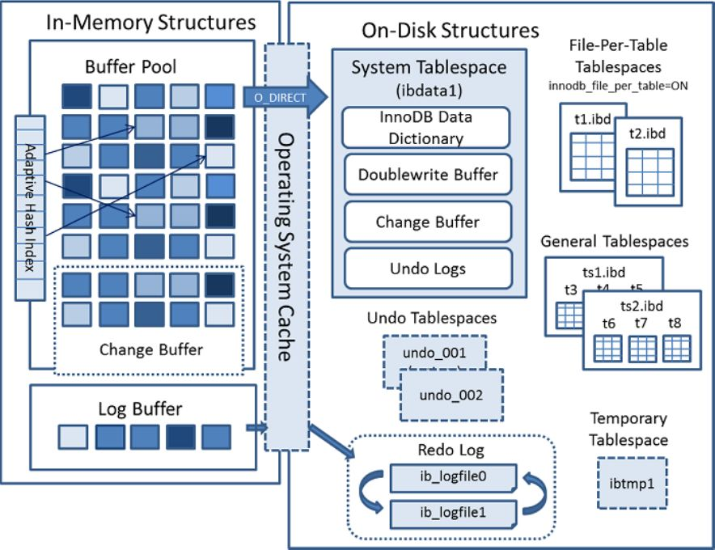
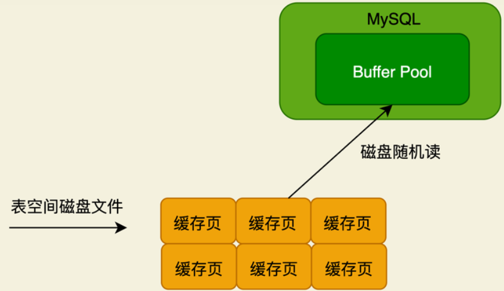
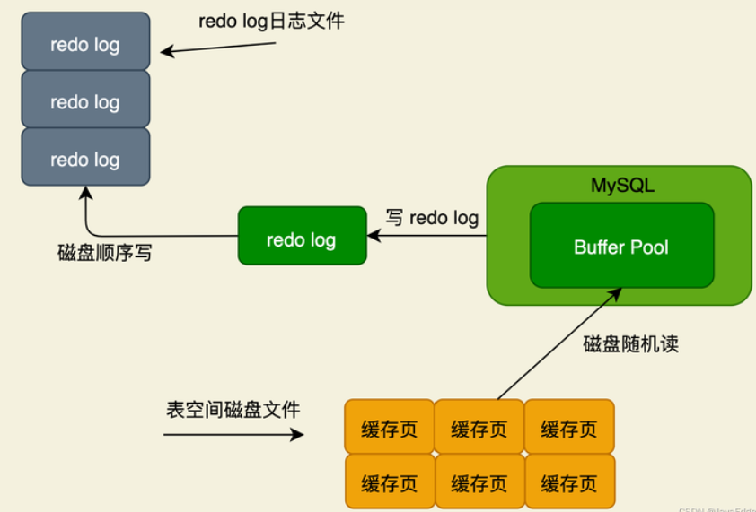

# Mysql

## 原理

msyql 中的数据是以页(16k)为单位保存的，无论读写，都需要找到数据所在的页才行，数据在缓存池中也是以页为单位保存的。

### 数据文件随机读写

> 对表空间的磁盘文件里的数据页进行的磁盘随机读写

MySQL执行增删改操作时，先从表空间的磁盘文件里读数据页出来， 这就是磁盘随机读。

- 读取一个数据页之后，放到BP的缓存，下次要更新时，直接更新BP里的缓存页；
- 如果数据页不在缓存池中，则把修改记录暂时保存在 change buffer 缓存中，等数据页被加载到内存中时修改；
- redo log  防止缓存中的数据脏页丢失

### 日志顺序读写

> 对redo log、binlog这种日志进行的磁盘顺序读写

当你在BP的缓存页里更新数据后，必须要写条redo log日志，它就是顺序写：在一个磁盘日志文件里，一直在末尾追加日志。

