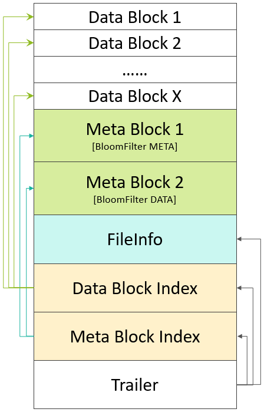
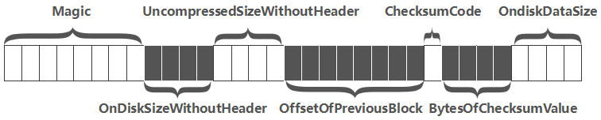

# HFile

## 版本

### V1

问题：Region Open的时候，**需要加载所有的Data Block Index数据**。另外，第一次读取时需要加载所有的Bloom Filter数据到内存中。一个HFile中的Bloom Filter的数据大小可达百MB级别，一个RegionServer启动时可能需要加载数GB的Data Block Index数据。这在一个大数据量的集群中，几乎无法忍受。

### V2

解决：降低RegionServer启动时加载HFile的时延，更希望解决一次全量加载数百MB级别的BloomFilter数据带来的时延过大的问题。

**分层索引**的设计：

- 索引分成三部分区域
- DataBlock：最多支持三层索引
  - 最底层的Data Block Index称之为Leaf Index Block，可直接索引到Data Block；
  - 中间层称之为Intermediate Index Block；
  - 最上层称之为Root Data Index，Root Data index存放在一个称之为”**Load-on-open Section**“区域；
  - 在实际场景中，**Intermediate Block Index基本上不会存在**
- Bloom Filter：一层索引
  - 在”Load-on-open Section”区域中，同样存放了所有Bloom Block的索引数据；

### V3

主要是为了支持Tag特性，在HFile V2基础上只做了微量改动；V3主要的提高是压缩比和，通过把key放在一起、Value放在一起， key存在block 的开始位置，value存在block的结束位置，通过对于key和value应用不同的压缩算法。

## 生成原理

Data Block Encoding是HBase为了降低KeyValue结构性膨胀而提供的内部编码机制

- 起初，HFile中并没有任何Block，数据还存在于MemStore中。
- Flush发生时，创建HFile Writer，第一个空的Data Block出现，初始化后的Data Block中为Header部分预留了空间，Header部分用来存放一个Data Block的元数据信息。
- 当Data Block增长到预设大小(默认64KB)后，一个Data Block被停止写入，执行以下流程：
  - 若有配置启用压缩或加密特性，对Data Block的数据按相应的算法进行压缩和加密。
  - 在预留的Header区，写入该Data Block的元数据信息，包含{压缩前的大小，压缩后的大小，上一个Block的偏移信息，Checksum元数据信息}等信息，下图是一个Header的完整结构
  
  - 生成Checksum信息；
  - Data Block以及Checksum信息通过HFile Writer中的**输出流**写入到HDFS中；
  - 为输出的Data Block生成一条**索引记录**，包含这个Data Block的{起始Key，偏移，大小}信息，这条索引记录被暂时记录到内存的Block Index Chunk中

- 随着Data Blocks数量的不断增多，**Block Index Chunk**中的记录数量也在不断变多。当Block Index Chunk达到一定大小以后(默认为128KB)，Block Index Chunk也经与Data Block的类似处理流程后输出到HDFS中，形成第一个**Leaf Index Block**
- 在内存中还有一个**Root Block Index Chunk**用来记录每一个Leaf Index Block的**索引信息**；
- 收尾：
  - 写入最后一个DataBlock，Leaf Index Block；
  - 如果Root Block Index Chunk超出了预设大小，则输出位于**Non-Scanned Block Section**区域的Intermediate Index Block数据，以及生成并输出Root Index Block(记录Intermediate Index Block索引)到**Load-On-Open Section**部分。
  - 如果未超出大小，则直接输出为**Load-On-Open Section**部分的Root Index Block。
  - 写入后续的FileInfo, Trailer等；