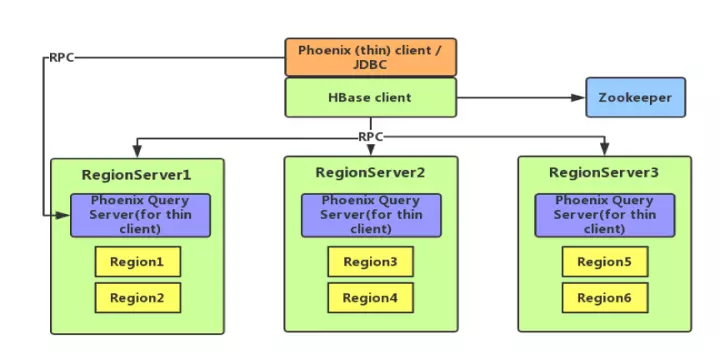

# Apache Phoenix

Phoenix 是一个 Hadoop 上的 **OLTP 和业务数据分析引擎**，为用户提供操作 **HBase 的 SQL 接口**，结合了具有**完整 ACID 事务功能的标准 SQL 和 JDBC API**，以及来自 NoSQL 的后期绑定，具有读取模式灵活的优点。



## 特性

### 二级索引

#### 覆盖索引

覆盖索引是把**原数据存储在索引数据表**中，这样在查询时不需要再去HBase的原表获取数据就，直接返回查询结果。

> 查询是 select 的列和 where 的列都需要在索引中出现。

```sql
CREATE INDEX my_index ON my_table ( v2,v3 ) INCLUDE ( v1 );
```

#### 函数索引

是索引的内容不局限于列，能根据**表达式创建索引**。适用于对查询表时过滤条件是表达式。如果你使用的表达式正好就是索引的话，数据也可以直接从这个索引获取，而不需要从数据库获取。

```sql
CREATE INDEX my_index ON my_table(substr(v3,1,9)) INCLUDE ( v1 );
```

#### 全局索引

全局索引适合**读多写少**的场景。如果使用全局索引，读数据基本不损耗性能，所有的性能损耗都来源于写数据。

数据表的**添加、删除和修改**都会更新相关的索引表（**数据删除了，索引表中的数据也会删除；数据增加了，索引表的数据也会增加**）。

> 对于全局索引在默认情况下，在**查询语句中检索的列如果不在索引表中，Phoenix不会使用索引表**，除非使用hint。

```sql
CREATE INDEX my_index ON my_table ( v3 );
```

#### 本地索引

适合写多读少的场景，或者存储空间有限的场景。和全局索引一样，Phoenix也会在查询的时候自动选择是否使用本地索引。

本地索引因为索引数据和原数据存储在同一台机器上（数据表的影子(shadow)列族），避免网络数据传输的开销，所以更适合写多的场景。

无法提前确定数据在哪个Region上，所以在**读数据的时候，需要检查每个Region上的数据**从而带来一些性能损耗。

```sql
CREATE LOCAL INDEX LOCAL_IDEX ON my_table(v3);
```

### 索引构建

#### 同步索引

```sql
CREATE INDEX SYNC_IDX ON SCHEMA_NAME.TABLE_NAME(BASICINFO."s1",BASICINFO."s2") ;
```

**创建同步索引超时怎么办？**

在客户端配置文件hbase-site.xml中，把超时参数设置大一些，足够 Build 索引数据的时间。

```xml
<property>
    <name>hbase.rpc.timeout</name>
    <value>60000000</value>
</property>
<property>
    <name>hbase.client.scanner.timeout.period</name>
    <value>60000000</value>
</property>
<property>
    <name>phoenix.query.timeoutMs</name>
    <value>60000000</value>
</property>
```

#### 异步索引

异步Build索引需要**借助MapReduce**，创建异步索引语法和同步索引相差一个关键字：**ASYNC**。

```sql
CREATE INDEX ASYNC_IDX ON SCHEMA_NAME.TABLE_NAME ( BASICINFO."s1", BASICINFO."s2" ) ASYNC;
```

执行MR：

```shell
hbase org.apache.phoenix.mapreduce.index.IndexTool \
--schema SCHEMA_NAME\
--data-table TABLE_NAME\
--index-table ASYNC_IDX \
--output-path ASYNC_IDX_HFILES
```


## Kylin VS Phoenix 

我们先来看看 Kylin 和 Phoenix 各自的优点是什么。Kylin 的优点主要有以下几点：

1. 支持雪花/星型模型；

2. 亚秒级查询响应；

3. 支持 ANSI-SQL，可通过 ODBC，JDBC 以及 RESTful API 进行访问；

4. 支持百亿、千亿甚至万亿级别交互式分析；

5. 无缝与 BI 工具集成；

6. 支持增量刷新；

7. 既支持历史数据也支持流式数据；

8. 易用的管理页面和 API。

Phoenix 的优点则主要是以下几点：

1. 支持明细和聚合查询；

2. 支持 insert，update，delete 操作，其使用 upsert 来代替 insert 和 update；

3. 较好的利用 HBase 的优点，如 row timestamp，将其与 HBase 原生的 row timestamp 映射起来，有助于 Phoenix 利用 HBase 针对存储文件的时间范围提供的多种优化和 Phoenix 内置的各式各样的查询优化；

4. 支持多种函数：聚合、String、时间和日期、数字、数组、数学和其它函数；

5. 支持具有完整 ACID 语义的跨行及跨表事务；

6. 支持多租户；

7. 支持索引（二级索引），游标。

当然，Kylin 和 Phoenix 也都有一些还有待提升的不足之处，Kylin 的不足主要是体现在首先由于 Kylin 是一个分析引擎，只读，不支持 insert, update, delete 等 SQL 操作，用户修改数据的话需要重新批量导入（构建）；其次，Kylin 用户需要预先建立模型后加载数据到 Cube 后才可进行查询；最后，使用 Kylin 的建模人员需要了解一定的数据仓库知识。

Phoenix 的不足则主要体现在：首先，其二级索引的使用有一定的限制，只有当查询中所有的列都在索引或覆盖索引中才生效且成本较高，在使用之前还需配置；其次，范围扫描的使用有一定的限制，只有当使用了不少于一个在主键约束中的先导列时才生效；最后，创建表时必须包含主键 ，对别名支持不友好。


