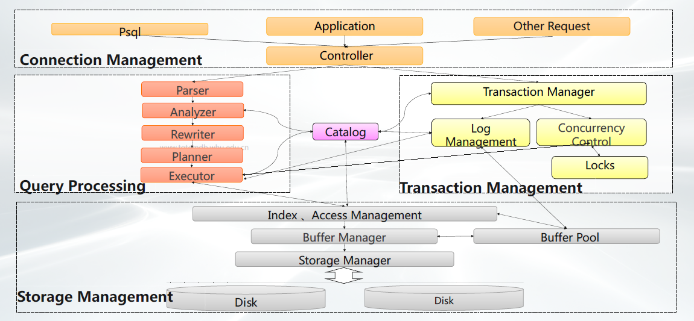
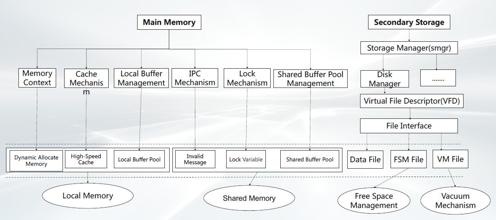
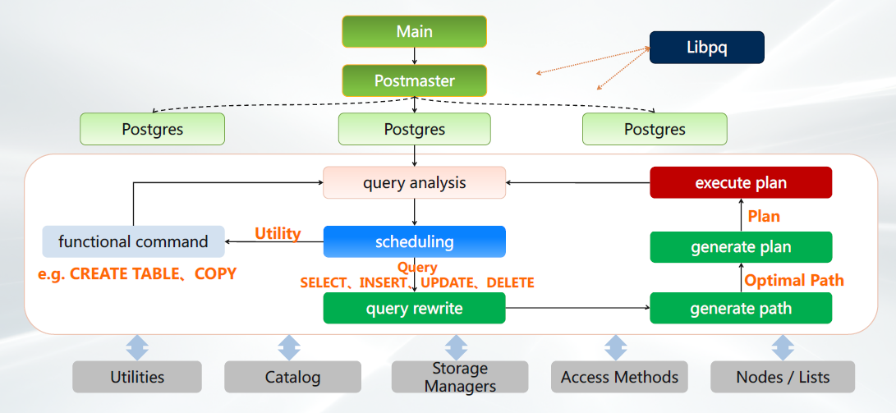
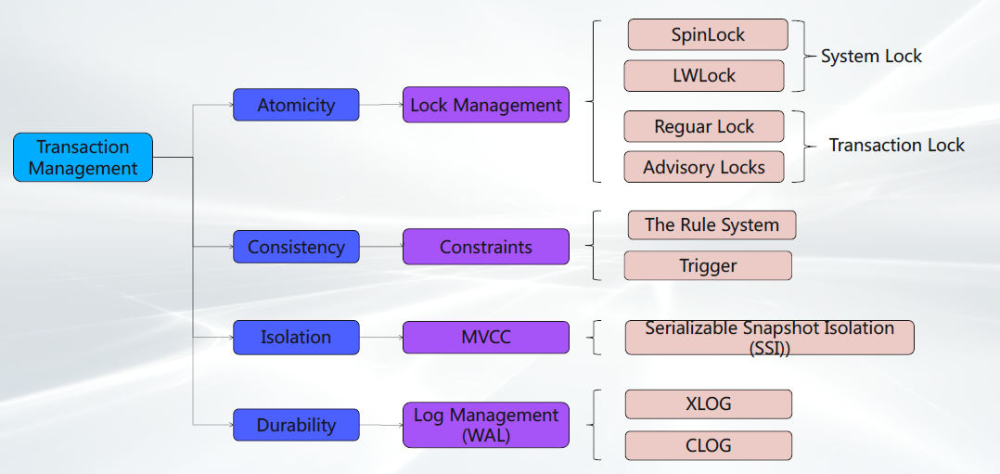

# Postgres

> 对象关系型开源数据库

PostgreSQL是目前**功能强大、技术先进、稳定可靠、生态良好、应用广泛的开源数据库**管理系统，主要特性如下

- 对象关系 
- 高可扩展 
- SQL兼容 
- 引用约束
- 灵活API 
- 过程语言
- MVCC机制
- 支持WAL

## 体系结构

## 存储过程

## 查询处理

## 事务管理

## 安全机制

