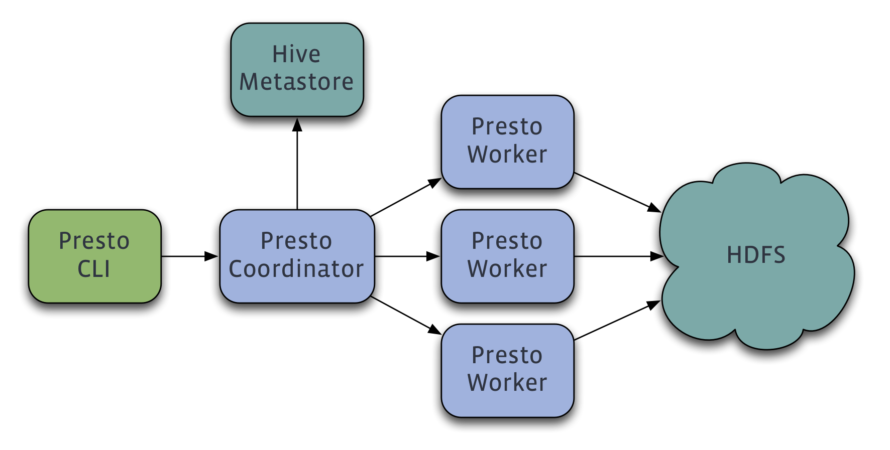
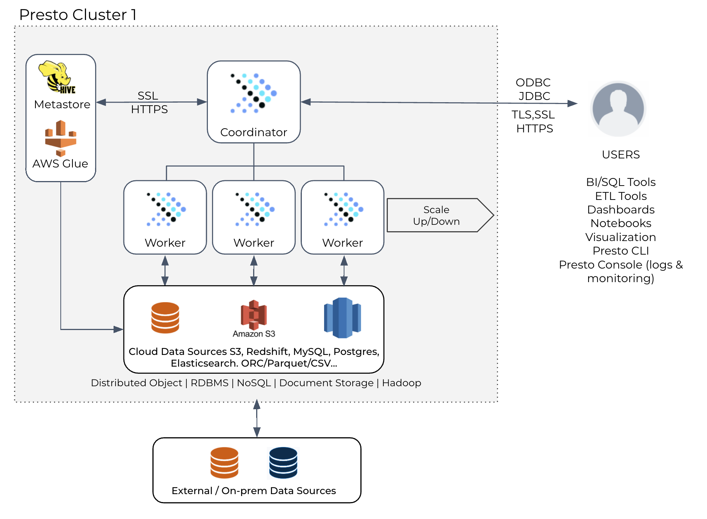

# Presto

[toc]

## 简介

**开源的分布式SQL查询引擎**，OLAP，数据规模从GB到PB；

> Presto有两个版本，PrestoDB和PrestoSQL项目（PrestoSQL更名为Trino）；
>

**场景**

数据分析，响应时间从**毫秒**到**分钟**，无重试（查询失败重新查询），用作Adhoc查询。

## 架构

### 节点类型

#### Coordinator（Master）

**职责**：接收客户端请求、解析语句、生成查询计划，管理Presto workers。

Coordinator和client、worker通信采用REST API；

discovery server， 通常内嵌于coordinator节点中，也可以单独部署，用于节点心跳。

#### Worker

**职责**：执行Tasks和处理数据，从connectors中获取数据并彼此间交换中间数据（shuffle）。

Workers彼此间通信采用REST API；

### 数据源（DataSouce）

#### Connector

类似于database中的driver，是Presto SPI的实现，实现数据源的可扩展性。

内置：JMX，System，Hive，TPCH的connector。

每个catalog和特定的connector关联。

#### Catalog

Catalog包含**schemas**和**数据源**的引用。

表的全名`hive.test_data.test`表示`hive` catalog中`test_data` schema中的`test`表。

Catalogs定义在properties文件中，存储在Presto的配置目录。

#### Schema

表的组织形式，类似于数据库中的库。

#### Table

类似于数据库中的表，unordered rows organized into named columns with types

connector中定义了元数据到表的映射。

### 查询执行模型（Query Execution Model）

Presto执行SQL语句，并将语句转成查询在coordinator和workers组成的分布式集群中执行。

#### Statement

ANSI-comatible的SQL语句，文本形式。会被解析成查询计划，将查询分配到Workers上执行。

#### Query

Statement -> 分布式的查询计划 -> 一系列相互联系的stages。

查询包含阶段、任务、分割、连接器以及其他组件和数据源，协同工作以产生结果。

#### Stage

当Presto执行查询时，它将执行分解为阶段层次结构。

组成查询的阶段层次结构类似于树。每个查询都有一个根阶段，它负责聚合来自其他阶段的输出。**阶段是协调器用来建模分布式查询计划的，但是阶段本身并不在Presto worker上运行。**

#### Task

阶段（Stage）是作为一系列分布在Presto Worker的任务（Task）实现的。

分布式查询计划被分解为一系列阶段，这些阶段随后被转换为任务，这些任务随后根据分解或处理拆分。Presto任务有输入和输出，**一个阶段可以由一系列任务并行执行一样，一个任务是由一系列驱动程序（Driver）并行执行**。

#### Split

任务的输入是数据集上的分片数据。低级别的Stage从connector中检索数据分批那，高级别的Stage从其它Stage中加锁分片数据。

Coordinator在调度查询时，会查询connector获取表的splits，并记录运行tasks的机器以及每个task处理的split。

#### Driver

任务包含一个或多个并行驱动程序。

驱动程序对数据进行操作，并结合操作程序（Operator）产生输出，然后由一个任务聚合，然后在另一个阶段交付给另一个任务。**驱动程序是操作算子实例的序列**。

Driver是Presto架构中最低级别的并行性。一个驱动器有一个输入和一个输出。

#### Operator

Operator 消费、转换并产生数据，给其它Operator消费。比如Scan 和 Filter操作。

#### Exchange

Exchanges对一个查询的不同stage，在Presto节点间传输数据。Tasks产生数据到output buffer，并用exchange client消费其他tasks的数据。

## 配置

### 内存

**System Pool** 

- 用来保留给系统使用的，如机器之间传递数据，在内存中会维护buffer；
- 默认为40%的内存空间留给系统使用。

**General Pool** 和**Reserved Pool**：

- 用来分配query运行时内存；

- 其中大部分的query使用general Pool。 而最大的一个query，使用Reserved Pool， 所以Reserved Pool的空间等同于一个query在一个机器上运行使用的最大空间大小，默认是10%的空间。
  - 防止其它小内存query一直插入，导致大内存query无法执行，一直再等待可用内存；
- General 则享有除了System Pool 和 Reserved Pool之外的其他内存空间。

## 安全

## 管理

## 连接器

## 函数和操作符