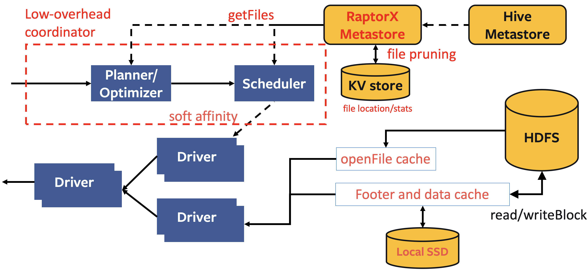
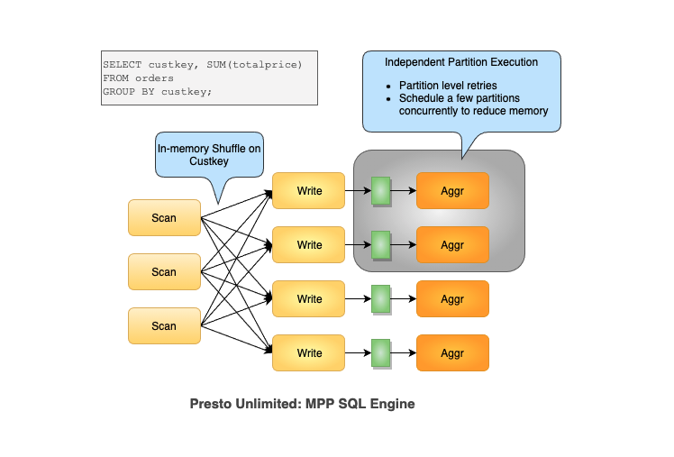
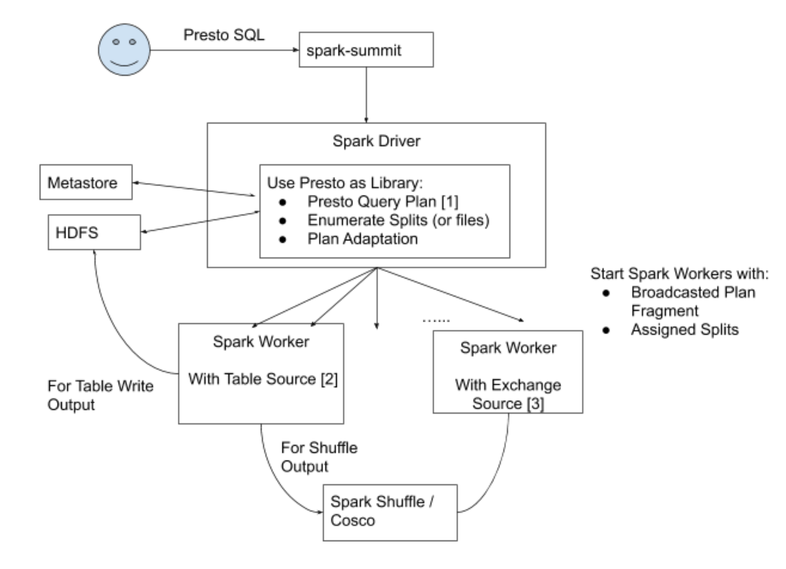
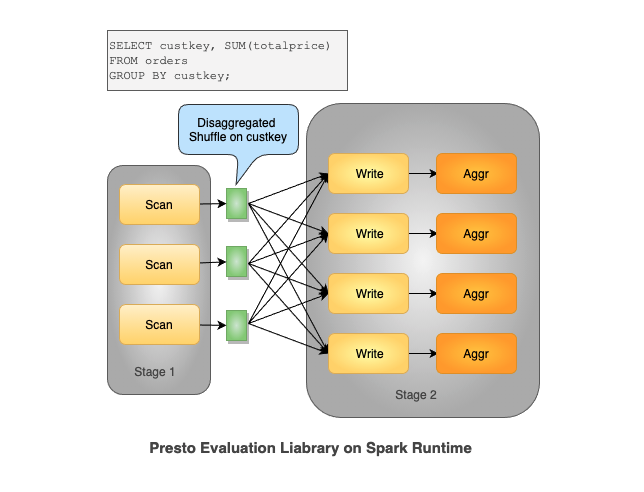

# Presto 扩展性

## [RaptorX (2021)](https://prestodb.io/blog/2021/02/04/raptorx#user-guide)

在 **Hive Connector** 中：

- **Metastore版本化的缓存方案**：
  - 把**表/分区信息**缓存到coordinator中，鉴于元数据是可变的，就像Iceberg或Delta Lake那样，因此信息是被版本化的，我们只与metastore同步版本信息，并仅在当前版本失效时去获取最新版本；
- **文件列表缓存**：
  - 将来自远端存储分区目录的文件列表缓存起来，避免`list`的开销；
- **片段结果缓存**：
  - 在leaf worker的本地**SSD上缓存部分计算结果**。由于查询会不断变化，所以我们需要运用裁剪技术来简化查询计划；
- **文件句柄（file handle）和footer的缓存**：
  - 在leaf worker内存中缓存打开的文件描述符（file descriptor）和stripe/文件footer信息，因为在读取文件时这些数据往往会被频繁访问；
- **Alluxio数据缓存**：
  - 在leaf worker的本地SSD上用**对齐的1MB大小数据块来缓存**文件段。该库（library）是通过Alluxio的缓存服务搭建的；
- **亲和调度器**：
  - 是指根据文件路径固定地向对应worker发送请求，从而使缓存命中率最大化的调度器（scheduler）。

### 架构



### 使用

要完全启用该功能，我们需要为worker配备本地的SSD，为了能够启用本文所述的各个缓存层，请进行以下配置:

`/catalog/hive.properties`

```properties
# 调度
hive.node-selection-strategy=SOFT_AFFINITY
# Metastore版本化的缓存
hive.partition-versioning-enabled=true
hive.metastore-cache-scope=PARTITION
hive.metastore-cache-ttl=2d
hive.metastore-refresh-interval=3d
hive.metastore-cache-maximum-size=10000000
# 文件列表缓存
hive.file-status-cache-expire-time=24h
hive.file-status-cache-size=100000000
hive.file-status-cache-tables=*
# 数据缓存
cache.enabled=true
cache.base-directory=file:///mnt/flash/data
cache.type=ALLUXIO
cache.alluxio.max-cache-size=1600GB

# 文件和stripe footer 缓存(/catalog/hive.properties):
# **针对ORC 或DWRF格式：**
hive.orc.file-tail-cache-enabled=true
hive.orc.file-tail-cache-size=100MB
hive.orc.file-tail-cache-ttl-since-last-access=6h
hive.orc.stripe-metadata-cache-enabled=true
hive.orc.stripe-footer-cache-size=100MB
hive.orc.stripe-footer-cache-ttl-since-last-access=6h
hive.orc.stripe-stream-cache-size=300MB
hive.orc.stripe-stream-cache-ttl-since-last-access=6h

# **针对Parquet格式：**
hive.parquet.metadata-cache-enabled=true
hive.parquet.metadata-cache-size=100MB
hive.parquet.metadata-cache-ttl-since-last-access=6h
```

片段结果缓存(`/config.properties`， `/catalog/hive.properties`):

```properties
fragment-result-cache.enabled=true
fragment-result-cache.max-cached-entries=1000000
fragment-result-cache.base-directory=file:///mnt/flash/fragment
fragment-result-cache.cache-ttl=24h
hive.partition-statistics-based-optimization-enabled=true
```

## 数据扩展性

进一步支持ETL类型的queries，更大的数据量处理。

### ~~Presto Unlimited（2019，已废弃）~~

> [Presto Unlimited: MPP SQL Engine at Scale](https://prestodb.io/blog/2019/08/05/presto-unlimited-mpp-database-at-scale)

Presto Unlimited是Presto team 内部尝试做的一些基本的scalability方面的尝试，包括materialized exchange到hive tables，grouped execution，operator spilling等等技术。

但是有两个design decisions成为了瓶颈（共享JVM container而非每个query独立的 JVM container；全局单一coordinator）导致Presto在fault-tolerance和resource management这两点有短板。

改进这两点基本等同于在Presto内部内置一个Spark core类似的设计了。

> While Presto Unlimited solved part of the problem by allowing shuffle to be partitioned over distributed disk, it didn’t fully solve **fault tolerance,** and did nothing to improve **isolation and resource management**.

#### 架构



### [Presto_On_Spark](https://github.com/prestodb/presto/issues/13856)（2021）

> [Scaling with Presto on Spark](https://prestodb.io/blog/2021/10/26/Scaling-with-Presto-on-Spark)

Spark：row-oriented + whole stage codegen 

Presto：columnar processing + vectorization

借用spark core作为资源调度和分布式运行平台，而与此同时保留Presto的运算内核和上层的query parsing & planning 部分，用户层面统一使用接口。

#### 架构



#### 原理



#### 使用

参考指导：https://prestodb.io/docs/current/installation/spark.html#

提交脚本

```shell
/spark/bin/spark-submit \
--master spark://spark-master:7077 \
--executor-cores 4 \
--conf spark.task.cpus=4 \
--class com.facebook.presto.spark.launcher.PrestoSparkLauncher \
  presto-spark-launcher-0.272.1.jar \
--package presto-spark-package-0.272.1.tar.gz \
--config /presto/etc/config.properties \
--catalogs /presto/etc/catalogs \
--catalog hive \
--schema default \
--file query.sql
```

