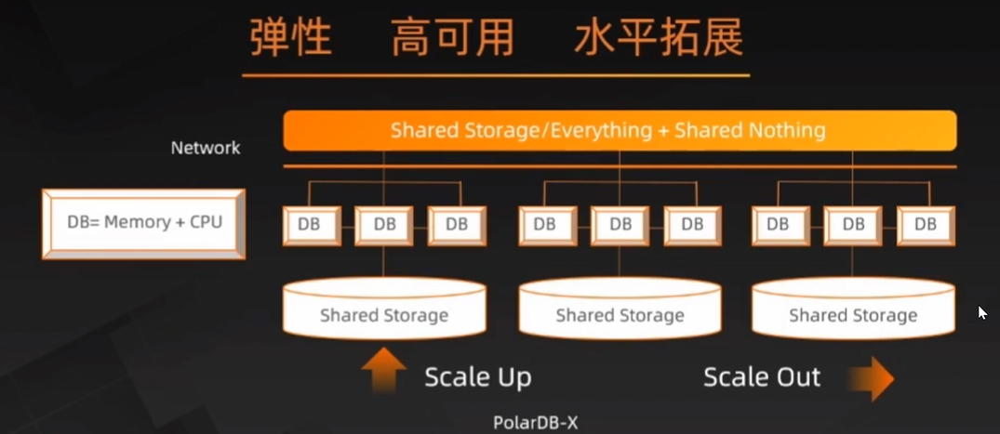
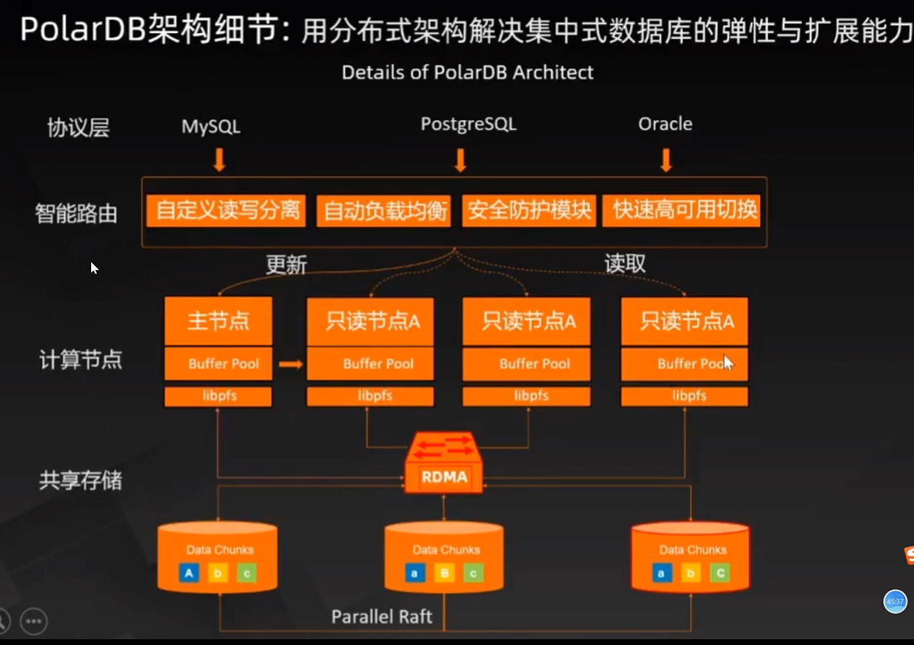
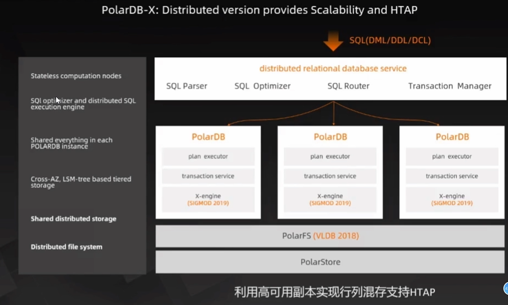
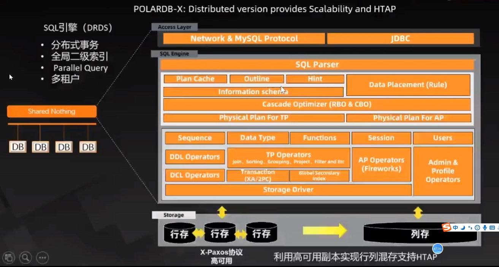
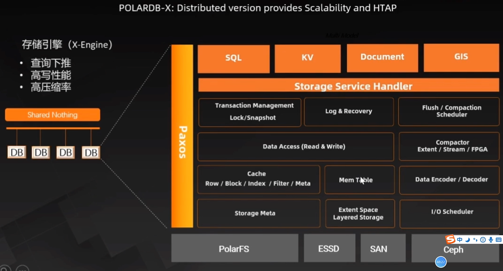
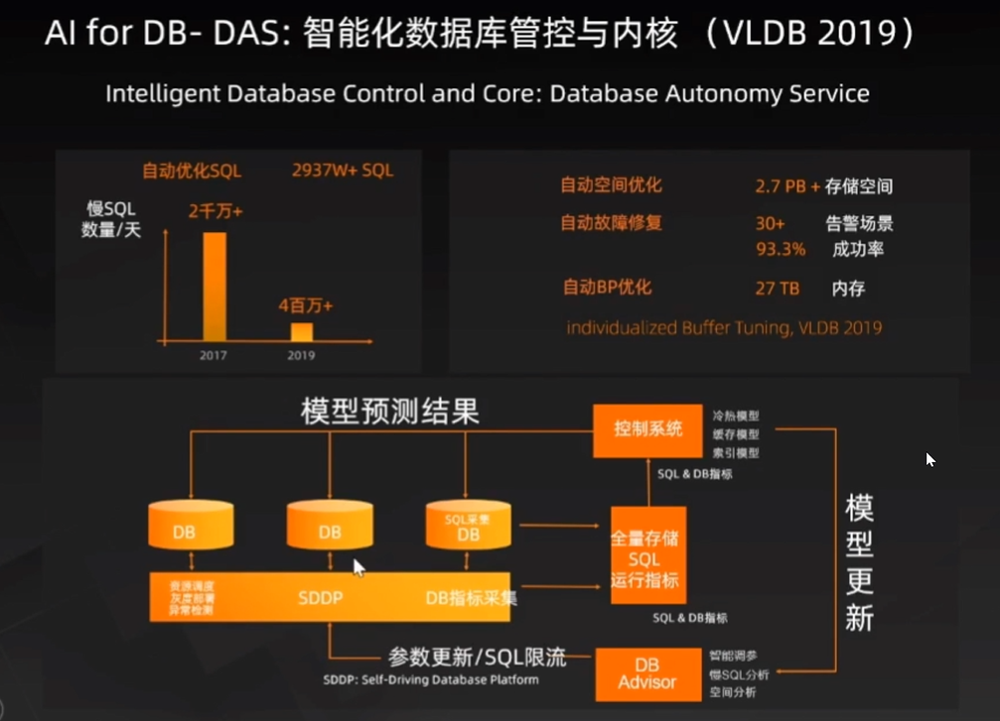
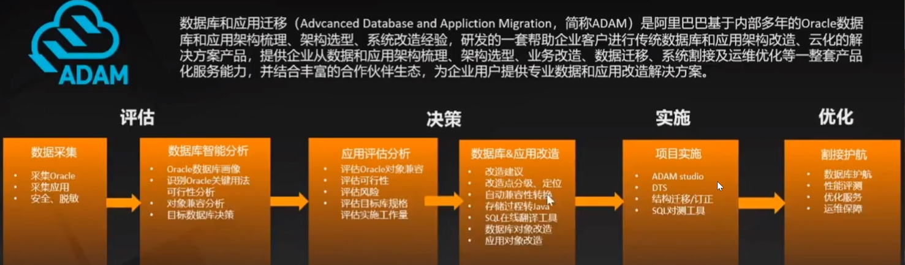
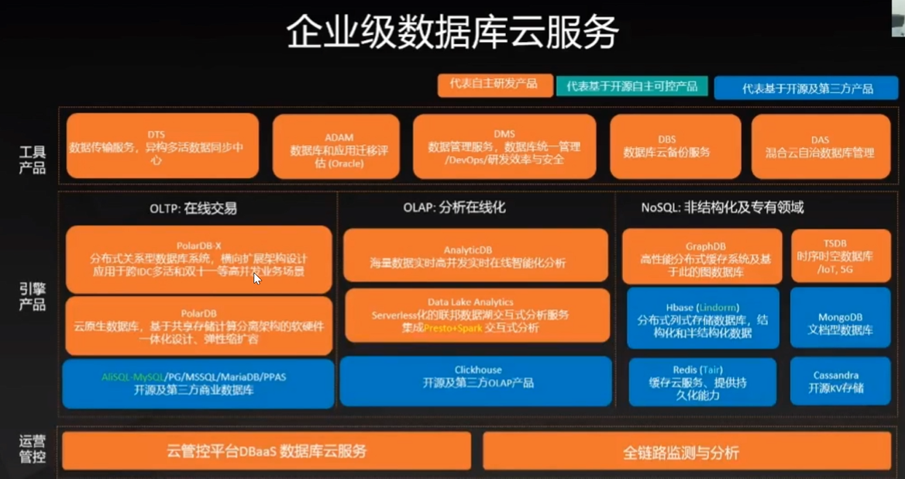

# 李飞飞报告-数据库

## 云原生分布式数据库系统的发展历程

结构化数据在线处理：RDBMS(SQL + OLTP)

海量数据分析：Data Warehouse(ETL + OLAP)

异构数据类型：（Multi-Model + HTAP)

数据库发展-业务视角

- 事务性数据库(OLTP）
  - 结构化数据库，高并发、高可用、强一致性
- NoSQL数据库及专用型数据库
  - 结构化或半结构化，不强制数据一致性
- 分析型数据库（OLAP）
  - 海量数据，数据类型复杂；分析条件复杂；
- 数据库服务+管理类工具
  - 数据传输、备份
- 数据库管控平台
  - 实例、资管管理和调度

## 数据库系统架构

### 数据库系统的模块

应用接口

SQL接口

查询执行引擎

- 计划生成器
- 计划优化器
- 计划执行器

数据访问模块

- 事务处理：崩溃恢复、并发控制
- 内存处理
- 安全管理
- 文件和索引管理

存储引擎

- 数据文件
- 索引文件
- 系统及元数据文件

### 数据库系统挑战

并行冲突（concurrent with）

- 读/写冲突

系列SQL

- 中途失败，节点宕机

事务机制：

- Atomicity
- Consistency
- Isolation
- Durablility

多表join性能

## 面向未来的云原生数据库

弹性-高可用

管控平台

### 行存储 VS 列存储

OLTP：行存储

OLAP：列存储 

### HTAP：事务处理与分析处理一体化

数据一致性挑战

### 下一代企业级数据库：云原生 + 分布式 + HTAP

#### PolarDB：共享存储+一写多读

#### PolarDB-X: 分布式版本支持水平拓展+HTAP

SQL引擎（DRDS）

存储引擎（X-Engine）

跨AZ：主AZ采用三副本，副AZ采用日志同步（解析binlog格式，传输再replay）。

数据仓库：元数据管理+存储引擎

- AnalyticDB

数据湖：元数据管理，不独立存储数据

- Presto，Spark SQL

数据库迁移

阿里的数据库

