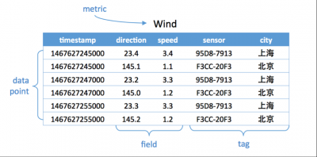

# 时序数据库

## 基本概念

不同的时序数据库称呼略有不同
- metric: 度量，相当于关系型数据库中的table。
- data point: 数据点，相当于关系型数据库中的row。
- timestamp：时间戳，代表数据点产生的时间。
- field: 度量下的不同字段。比如位置这个度量具有经度和纬度两个field。**一般情况下存放的是会随着时间戳的变化而变化的数据。**
- tag: 标签，或者附加信息。**一般存放的是并不随着时间戳变化的属性信息。**timestamp加上所有的tags可以认为是table的primary key。

p3-时序数据库基本概念图

如下图，度量为Wind，每一个数据点都具有一个timestamp，两个field：direction和speed，两个tag：sensor、city。它的第一行和第三行，存放的都是sensor号码为95D8-7913的设备，属性城市是上海。随着时间的变化，风向和风速都发生了改变，风向从23.4变成23.2；而风速从3.4变成了3.3。

时序数据库需要解决以下几个问题

- 时序数据的写入：如何支持每秒钟上千万上亿数据点的写入。

- 时序数据的读取：又如何支持在秒级对上亿数据的分组聚合运算。

- 成本敏感：由海量数据存储带来的是成本问题。如何更低成本的存储这些数据，将成为时序数据库需要解决的重中之重

  

LSM tree替换B tree，如Hbase, Cassandra等nosql中；

**分片方法**，时序数据库的分片方法和其他分布式系统是相通的。

- 哈希分片：这种方法实现简单，均衡性较好，但是集群不易扩展。
- 一致性哈希：这种方案均衡性好，集群扩展容易，只是实现复杂。代表有Amazon的DynamoDB和开源的Cassandra。
- 范围划分：通常配合全局有序，复杂度在于合并和分裂。代表有HBase。

LSM Tree的架构仅适合存储单行记录较小的数据（最好小于KB级别），对于偏大的数据，IO冗余太大 ？

## Time DB对比

- **InfluxDB：开源版不支持集群**

- **Kairosdb**:
  - 底层使用Cassandra作为分布式存储引擎，采用的是LSM tree。
  - Cassandra有两级索引：partition key和clustering key。其中partition key是其分片ID，使用的是一致性哈希；而clustering key在一个partition key中保证有序。
  - Kairosdb利用Cassandra的特性，将 **\<metric>+\<timestamp>+<数据类型>+\<tags>**作为partition key，**数据点时间在timestamp上的偏移**作为clustering key，其有序性方便做基于时间范围的查询。
  - partition key中的timestamp是3周对齐的，也就是说21天的时序数据会在一个clustering key下。3周的毫秒数是18亿正好小于Cassandra每行列数20亿的限制。

- **Prometheus**：
  - a Cloud Native Computing Foundation project, is a systems and service monitoring system. It collects metrics from configured targets at given intervals, evaluates rule expressions, displays the results, and can trigger alerts if some condition is observed to be true.

- **OpenTSDB**：
  - 底层使用HBase作为其分布式存储引擎，采用的是LSM tree。
  - OpenTSDB的row key组织方式。
    - **[salt]\<metric_uid>\<timestamp>\<tagk1>\<tagv1>[...\<tagkN>\tagvN>]**
    - 由于Hbase的row key全局有序，所以增加了可选的salt以达到更好的数据分布，避免热点产生，再由**与timestamp间的偏移和数据类型组成column qualifier**。timestamp是小时对齐的，一个row key下最多存储一个小时的数据。并且需要将构成row key的metric和tags都转成对应的uid来减少存储空间，避免Hfile索引太大
  

