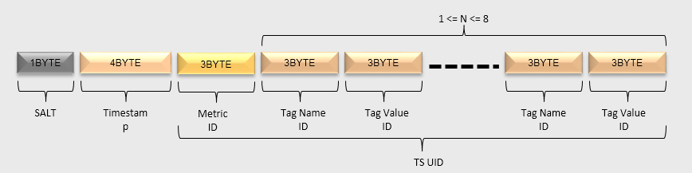

[toc]

# OpenTSDB

OpenTSDB是基于HBase的时序数据库，3.0会增加更多的数据源支撑（如Bigtable, cloud provider等）。

**使用场景**

指定**指标名称和时间范围**，给定**一个或多个标签名称和标签的值**作为条件，查询出所有的数据，应用**聚合函数**。

## 架构

 

## 元数据设计

### UID设计

UID的全称为Unique Identifier。这些UID信息被保存在OpenTSDB的元数据表中，默认表名为”**tsdb-uid**”。

OpenTSDB分配UID时遵循如下规则：

- metrics、tagKey 和 tagValue的 UID 分别**独立分配**；

- 每个metrics、tagKey、tagValue的UID值都是**唯一**；

- UID值的范围是0x000000到0xFFFFFF，即metrics（或tagKey、tagValue）最多只能存在2^24个不同的值。

支持 UID 到 name 的双向索引（会有缓存），具体表模型如下节所示。

### 元数据的表模型

关于metrics名为”cpu.hum”，tagKey值为”host”，tagValue值分别为”189.120.205.26″、”189.120.205.27″的UID信息定义如下：

- RowKey为”0″的行中，分别保存了metrics、tagKey和tagValue的当前UID的最大值。当为新的metrics、tagKey和tagValue分配了新的UID后，会更新对应的最大值；

- RowKey为”1″的行中，RowKey为UID，Qualifier为”name:metrics”的值对应metrics name，Qualifier为”name:tagk”的值中存放了tagKey，Qualifier为”name:tagv”的值中存放了tagValue；

- RowKey为”2″的行中，RowKey为UID，Qualifier为”name:tagv”的值为tagValue，不存在metrics与tagKey信息。

- RowKey为”189.120.205.26″的行中，Qualifer为”id:tagv”的值为UID信息。表示当”189.120.205.26″为tagValue时，其UID为1；

- RowKey为”189.120.205.27″的行中，Qualifer为”id:tagv”的值为UID信息。表示当”189.120.205.26″为tagValue时，其UID为2；

- RowKey为”cpu.hum”的行中，Qualifer为”id:metrics”的值为UID信息。表示当cpu.hum为metrics时，其UID为1；

- RowKey为”host”的行中，Qualifer为”id:tagk”的值为UID信息。表示当host为tagValue时，其UID为1。

由于HBase的存储数据类型是Bytes，所以UID在存储时会被转换为3个字节长度的Bytes数组进行存储。（如何防止 UID 和 name重复的情景？ 不同的列族吧）

## Metrics设计

### Metircs Rowkey设计

 

- **SALT**：建议开启SALT功能，可以有效提高性能。SALT数据的长度是变长的：如果SALT的值值少于256，那么只用一个字节表示即可；如果需要设置更大的SALT值，也会相应地占用更多的空间。
- **Metric ID**：metrics名经过编码后，每个Metric ID的长度为三个字节。
- **Timestamp**：这里是**整点小时时间戳**。
- **tagKey UID & tagValue UID**：tagKey和tagValue经过编码后，每个tagKey UID和tagValue UID的长度都为三个字节。tagKey UID和tagValue UID必须成对出现，最少必须存在1对，最多存在8对。

> 举个例子，在监控场景中，我们可以这样定义一个监控指标：
> 	指标名称：
> 	    sys.cpu.user
> 	标签：
> 	    host = 10.101.168.111
> 	    cpu = 0
> 	指标值：
> 	    0.5

### Metircs Qualifier设计

Rowkey包含的是小时的数据，**Qualifier需要保存一小时中具体某秒或者毫秒的信息**。一秒（3600）最多需要2个字节表示，一毫秒（36000000）最多需要4个字节表示。OpenTSDB针对特定类型不同的编码。

**判断秒还是毫秒**：请求中的时间戳超过无符号整数的最大值（即4个字节的长度），则时间为毫秒，否则为秒。

#### 秒类型

- **Value**长度：Value的实际长度是Qualifier的最后3个bit的值加1，即(qualifier & 0x07) + 1。表示该时间戳对应的值的字节数。所以，值的字节数的范围是1到8个字节。
- **Value类型**：Value的类型由Qualifier的倒数第4个bit表示，即(qualifier & 0x08)。如果值为1，表示Value的类型为float；如果值为0，表示Value的类型为long。
- **时间戳**：时间戳的值由Qualifier的第1到第12个bit表示，即(qualifier & 0xFFF0) >>>4。由于秒级的时间戳最大值不会大于3600，所以qualifer的前4个bits肯定不是1111。

#### 毫秒类型

- **Value长度**：与秒类型相同。
- **Value类型**：与秒类型相同。
- **时间戳**： 时间戳的值由Qualifier的第5到第26个bit表示，即(qualifier & 0x0FFFFFC0) >>>6。
- **标志位**：标志位由Qualifier的前4个bit表示。当该Qualifier表示毫秒级数据时，必须全为1，即(qualifier[0] & 0xF0) == 0xF0。
- 第27到28个bit未使用。

#### 混合类型

**当同一小时的数据发生合并后，就会形成混合类型的Qualifier**。

合并的方法很简单，就是按照时间戳顺序进行排序后，从小到大依次拼接秒类型和毫秒类型的Qualifier即可。

- 秒类型和毫秒类型的数量没有限制，并且可以任意组合。
- 不存在相同时间戳的数据，包括秒和毫秒的表示方式。
- 遍历混合类型中的所有DataPoint的方法是：
  - 从左到右，先判断前4个bit是否为0xF
  - 如果是，则当前DataPoint是毫秒型的，读取4个字节形成一个毫秒型的DataPoint
  - 如果否，则当前DataPoint是秒型的，读取2个字节形成一个秒型的DataPoint
  - 以此迭代即可遍历所有的DataPoint

### Metrics Value设计

HBase Value部分用于保存一个或多个DataPoint的具体某个时间戳对应的值。

由于在Qualifier中已经保存了DataPoint Value的类型和DataPoint Value的长度，所以无论是秒级还是毫秒级的值，都可以用相同的表示方法，而混合类型就是多个DataPoint Value的拼接。

#### 单字节

当DataPoint Value为long型，且大于等于-128（Byte.MIN_VALUE），且少于或等于127（Byte.MAX_VALUE）的时候，使用1个字节存储。

#### 双字节

当DataPoint Value为long型，且大于等于-32768（Short.MIN_VALUE），且少于或等于32767（Short.MAX_VALUE）的时候，使用2个字节存储。

#### 四字节

当DataPoint Value为long型，且大于等于0x80000000（Integer.MIN_VALUE），且少于或等于0x7FFFFFFF（Integer.MAX_VALUE）的时候，使用4个字节存储。

#### 八字节

当DataPoint Value为long型，且不是上面三种类型的时候，使用8个字节存储。

当DataPoint Value为float型的时候，使用8个字节表示。

#### 多字节

按照时间戳的顺序，把多个Value拼接起来的数据模型如下：

- 每个格子表示一个DataPoint Value的值，这个DataPoint Value的长度可能是1或2或4或8个字节。
- DataPoint Value的顺序与Qualifier中时间戳的顺序一一对应。
- **混合标志**：如果最后1个字节为0x01，表示存在秒级类型和毫秒级类型混合的情况。（具体用途？）

## Annotation设计

Annotation用于描述某一个时间点发生的事件，Annotation的数据为字符串类型，这与数字类型的metrics数据并不同。

> 1. *Annotation数据只支持秒级时间戳的数据。*
> 2. *Annotation数据不会合并。*

### Annotation RowKey设计

- SALT/ Timestamp/Metric UID/ tagKey UID /tagValue UID的意义与metrics RowKey中的意义相同。

- 把[Metric UID/ tagKey UID /tagValue UID]部分统称为TSUID。实际上，读写注释数据的时候，需要指定的是TSUID，而不是像metrics数据中那样分开指定的。

### Annotation Qualifier设计

由于注释数据只支持秒级类型的数据，同时注释类型的数据不支持合并，所以Qualifier的设计相对metrics数据简单一些。Qualifier定义如下：

- 与metrics数据的Qualifier相比，注释数据的HBase Qualifer的长度是3个字节。

- **标志位**：使用第1个字节表示，而且值必须为0x01。即(qualifier & 0xFF0000)>>>16 == 0x01。

- **时间戳**：使用第2到第3个字节表示。即时间戳的值为(qualifier & 0x00FFFF)。

### Annotation Value设计

注释数据中的Value保存的是字符串类型的数据，整个HBase Value部分就是注释数据的值。

## Append模式

当OpenTSDB启动APPEND模式后，每个插入的新DataPoint，都会以HBase的append的方式写入。

> 1. *由于使用了HBase的append的接口，每次插入一个新数据，都需要对同一小时的数据都执行一次读取和插入的操作(HBase append接口工作原理存疑？？）；另外多线程对同一小时的数据进行更新的时候，是不能并发的。这样就大大限制了数据写入的速度了，一般情况下不建议使用这种模式。*
> 2. *append的数据其实就是合并过的数据了，所以不会参与OpenTSDB的Compaction流程。*

### Append模式RowKey设计

Append模式的RowKey设计与普通模式下写入的metrics数据的RowKey是相同的。

### Append模式Qualifier设计

Append模式下，由于同1小时的数据中不存在多个Qualifier，所以只需要使用一个固定的Qualifier即可。

- Append模式的Qualifier使用3个字节表示
- 标志位： 由第1个字节表示，而且值必须为0x05。即(qualifier & 0xFF0000)>>>16 == 0x05
- 固定部分：由第2到第3个字节表示，这部分的值固定为0x0000，因此，Append模式的Qualifier固定为0x050000

### Append模式Value设计

Append模式下， **Value部分既要保存时间戳，数值类型和数值长度，也要保存对应的数值**。

上图每一个方块表示的Qualifier与Value的定义，与普通写入模式下的定义相同

遍历Value中的所有DataPoint的方法是：

- 从左到右，先判断前4个bit是否为0xF；
- 如果是，则当前DataPoint是毫秒型的读取4个字节形成一个毫秒型的Qualifier，从Qualifier中获得Value的长度，然后再读取对应长度的字节数；
- 如果否，则当前DataPoint是秒型的，读取2个字节形成一个秒型的Qualifier，从Qualifier中获得Value的长度，然后再读取对应长度的字节数；
- 依此迭代即可遍历所有的DataPoint。

## 优化的思想

OpenTSDB底层存储的优化思想

- 对数据的优化：为Metric、TagKey和TagValue分配UniqueID，建立原始值与UniqueID的索引，数据表存储Metric、TagKey和TagValue对应的UniqueID而不是原始值。
- 对KeyValue数的优化：如果对HBase底层存储模型十分了解的话，就知道行中的每一列在存储时对应一个KeyValue，减少行数和列数，能极大的节省存储空间以及提升查询效率。
- 对查询的优化：利用HBase的Server Side Filter来优化多维查询，利用Pre-aggregation和Rollup来优化GroupBy和降精度查询。

FuzzyRowFilter：不是减小查询的范围，而是**减少该范围内扫描的数据量**，动态跳过一定数据量。

HBase的底层文件存储格式中，每一列会对应一个KeyValue，Key为该行的RowKey，所以**HBase中一行中的每一列，都会重复的存储相同的RowKey**，这也是为何采用了UID编码后能大大节省存储空间的主要原因，也是为何有了UID编码后还能采用compaction策略（将一行中所有列合并为一列）来进一步压缩存储空间的原因。