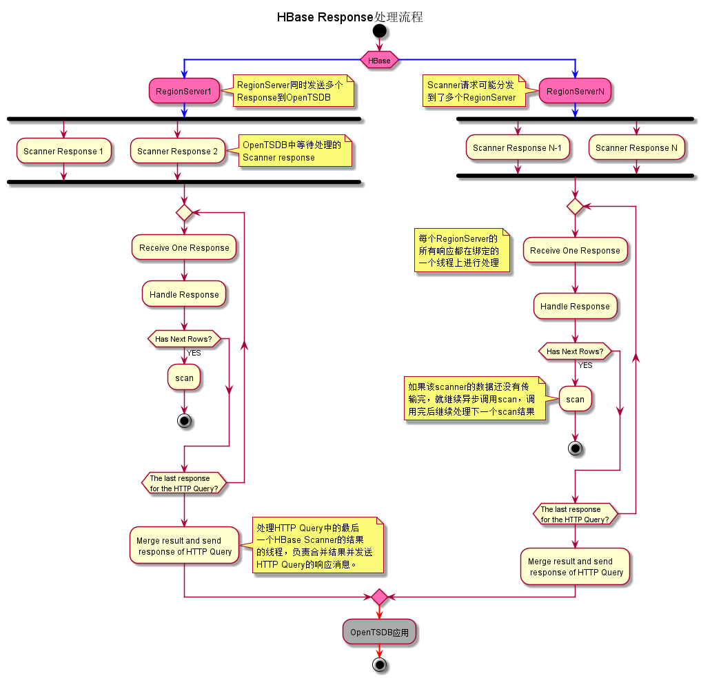

# 读取流程

一个完整的OpenTSDB HTTP Query请求，分别由OpenTSDB I/O Thread和AsyncHBase I/O Thread完成。OpenTSDB I/O Thread线程负责处理HTTP Query请求，AsyncHBase I/O Thread负责处理HBase的响应并发送HTTP响应。

## 请求处理流程

**1.OpenTSDB I/O Thread收到HTTP Query请求后，会根据OpenTSDB是否使用了SALT进行不同的处理。**

是否使用了SALT，只会对生成的HBase Scanner数量产生影响，每个HBase Scanner的处理流程都是相同的。

**当使用了SALT，就会生成相应SALT数量的HBase Scanner。**

Scanner的**StatKey和StopKey中，只包含了{SALT+Metric ID+Timestamp}**。如果需要查询的Metric中包含大量不同的TagName或者TagValue的话，这个Scanner可能需要扫描大量的数据，影响OpenTSDB查询的性能。

**2.为每个Scanner设置Filter，设置Filter可以更精确的过滤HBase的行，减少无效数据行的传输和处理，以提高查询的性能。**

如果HTTP Query中设置了Tag的查询条件，Scanner中就会设置KeyRegexpFilter；如果同时设置了explicitTags 为true，Scanner中还会再设置FuzzyRowFilter。

> 虽然设置了Filter，但是在HBase服务端需要扫描的数据量并不会减少，只是减少了返回的数据量。

**3.最后调用Scanner的scan方法，scan方法采用了异步调用。**

## 响应处理流程

**1**.  一个HTTP Query所生成的多个Scanner，可能发送到了多个RegionServer上，所以OpenTSDB可能收到多个RegionServer发送过来的scanner结果。

**2**. 每个RegionServer的scanner结果，都由其绑定的一个线程进行处理。这个线程既负责从socket中接收Scanner结果，也要负责处理这些scanner结果。因此，它只能逐个处理这些Scanner结果。

**3**. 当处理完一个scanner结果后，如果这个scanner的所有结果还没有传输完，就继续异步调用scan方法，以获得后续的scanner结果。调用完后，就继续处理下一个scanner结果。

**4**. 当一个scanner的所有结果都已经处理完了，而且这个scanner不是所关联HTTP Query请求的最后一个被处理的Scanner，那么就把处理后的数据暂时缓存起来。然后继续处理下一个scanner结果；如果是最后一个scanner，就把这个HTTP Query请求的所有scanner结果进行合并，生成一个HTTP Query的Response，并发送回到OpenTSDB应用。

**至此，在OpenTSDB的应用端，就已经完成了一次完整的HTTP Query查询。**