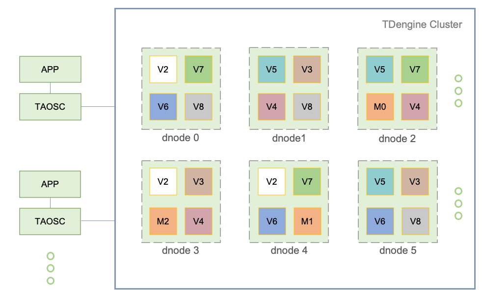
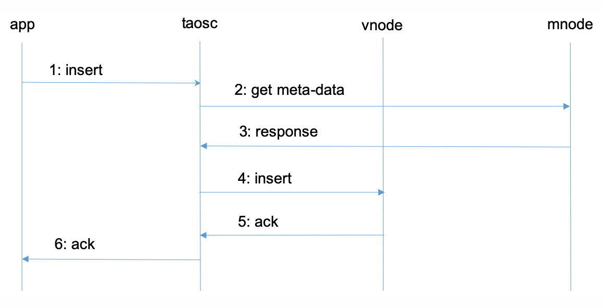

[toc]

# TDEngine

> 开源、高效的物联网大数据平台

## 数据特征

除时序特征外，仔细研究发现，物联网、车联网、运维监测类数据还具有很多其他明显的特征：

1. 数据高度结构化；
2. 数据极少有更新或删除操作；
3. 无需传统数据库的事务处理；
4. 相对互联网应用，写多读少；
5. 流量平稳，根据设备数量和采集频次，可以预测出来；
6. 用户关注的是一段时间的趋势，而不是某一特定时间点的值；
7. 数据有保留期限；
8. 数据的查询分析一定是基于时间段和空间区域；
9. 除存储、查询操作外，还需要各种统计和实时计算操作；
10. 数据量巨大，一天可能采集的数据就可以超过100亿条。

TDengine采用**传统的关系型数据库模型管理数据，用的是结构化存储**，而不是NoSQL的key-value存储。

## 表组织

### 一个数据采集点一张表

TDengine要求**对每个数据采集点单独建表**，存储这个采集点所采集的时序数据。

- 保证**一个采集点的数据在存储介质上是以块为单位连续存储**。如果读取一个时间段的数据，它能大幅**减少随机读取**操作，成数量级的提升读取和查询速度。
- 由于不同采集设备产生数据的过程完全独立，每个设备的数据源是唯一的，**一张表也就只有一个写入者，采用无锁方式来写**，写入速度就能大幅提升。
- 对于一个数据采集点而言，其产生的数据是时序的，因此**写的操作可用追加的方式**实现，进一步大幅提高数据写入速度。

**表的第一列必须是时间戳，即数据类型为 timestamp。**对采集的数据，TDengine将**自动按照时间戳建立索引**，但对采集的物理量不建任何索引。数据用列式存储方式保存。

### 超级表：同一类型数据采集点的集合

**一张超级表包含有多张表，这些表具有相同的时序数据schema，但带有不同的标签值**。

超级表是指某一特定类型的数据采集点的集合。同一类型的数据采集点，其表的结构是完全一样的，但每个表（数据采集点）的静态属性（标签）是不一样的。

在TDengine的设计里，**表用来代表一个具体的数据采集点，超级表用来代表一组相同类型的数据采集点集合**。

当为某个具体数据采集点创建表时，用户使用超级表的定义做模板，同时指定该具体采集点（表）的标签值。与传统的关系型数据库相比，表（一个数据采集点）是带有静态标签的，而且这些标签可以事后增加、删除、修改。

### 多列模型 vs 单列模型

TDengine支持多列模型，只要物理量是一个数据采集点同时采集的（时间戳一致），这些量就可以作为不同列放在一张超级表里。但还有一种极限的设计，单列模型，每个采集的物理量都单独建表，因此每种类型的物理量都单独建立一超级表。比如电流、电压、相位，就建三张超级表。 TDengine建议尽可能采用多列模型，因为插入效率以及存储效率更高。

## 架构和组成

### 主要逻辑单元

逻辑上，它包含数据节点(dnode)、TDengine客户端(taosc)以及应用(app)。系统中存在一到多个数据节点，这些数据节点组成一个集群(cluster)。应用通过taosc的API与TDengine集群进行互动。

**物理节点(pnode):** 有OS的物理机、虚拟机或容器

- 物理节点由其配置的 FQDN(Fully Qualified Domain Name)来标识。

**数据节点(dnode):** dnode 是 TDengine 服务器侧执行代码 taosd 在物理节点上的一个运行实例。

- **dnode包含零到多个逻辑的虚拟节点(VNODE)，零或者至多一个逻辑的管理节点(mnode)**。
- dnode在系统中的唯一标识由实例的End Point (EP )决定。EP是dnode所在物理节点的FQDN (Fully Qualified Domain Name)和系统所配置的网络端口号(Port)的组合。通过配置不同的端口，一个pnode可以运行多个数据节点。

**虚拟节点(vnode)**: 为更好的支持数据分片、负载均衡，防止数据过热或倾斜，**数据节点被虚拟化成多个虚拟节点**(vnode，图中V2, V3, V4等)。

- 每个 vnode 都是一个相对独立的工作单元，**是时序数据存储的基本单元，具有独立的运行线程、内存空间与持久化存储的路径**。
- 一个 vnode 包含一定数量的表（数据采集点）。当创建一张新表时，系统会检查是否需要创建新的 vnode。一个数据节点上能创建的 vnode 的数量取决于该数据节点所在物理节点的硬件资源。一个 vnode 只属于一个DB，但一个DB可以有多个 vnode。
- 一个 vnode 除存储的时序数据外，也保存有所包含的表的SCHEMA、标签值等。一个虚拟节点由所属的数据节点的EP，以及所属的VGroup ID在系统内唯一标识，由管理节点创建并管理。

**管理节点(mnode):** 一个**虚拟的逻辑单元，负责所有数据节点运行状态的监控和维护，以及节点之间的负载均衡**(图中M)

- 管理节点也负责元数据(包括用户、数据库、表、静态标签等)的存储和管理，因此也称为 Meta Node。
- TDengine 集群中可配置多个(最多不超过5个) mnode，它们自动构建成为一个虚拟管理节点组(图中M0, M1, M2)。
- mnode 间采用 master/slave 的机制进行管理，而且采取**强一致方式进行数据同步**，任何数据更新操作只能在 Master 上进行。
- mnode 集群的创建由系统自动完成，无需人工干预。每个dnode上至多有一个mnode，由所属的数据节点的EP来唯一标识。每个**dnode通过内部消息交互自动获取整个集群中所有 mnode 所在的 dnode 的EP**。

**虚拟节点组(VGroup):** 不同数据节点上的 vnode 可以组成一个虚拟节点组(vnode group)来保证系统的高可靠。

- 虚拟节点组内采取master/slave的方式进行管理。写操作只能在 master vnode 上进行，系统采用异步复制的方式将数据同步到 slave vnode，确保一份数据在多个物理节点上有拷贝。
- 一个 vgroup 里**虚拟节点个数就是数据的副本数**。如果一个DB的副本数为N，系统必须有至少N个数据节点。**副本数在创建DB时通过参数 replica 可以指定，缺省为1**。
- 虚拟节点组由管理节点创建、管理，并且由管理节点分配一个系统唯一的ID，VGroup ID。如果两个虚拟节点的vnode group ID相同，说明他们属于同一个组，数据互为备份。虚拟节点组里虚拟节点的个数是可以动态改变的，容许只有一个，也就是没有数据复制。VGroup ID是永远不变的，即使一个虚拟节点组被删除，它的ID也不会被收回重复利用。

**TAOSC:** taosc是TDengine给应用提供的驱动程序(driver)，负责处理应用与集群的接口交互，内嵌于JDBC、ODBC driver中，或者C、Python、Go语言连接库。

- 应用都是通过taosc而不是直接连接集群中的数据节点与整个集群进行交互的。
- 负责获取并缓存元数据：**将插入、查询等请求转发到正确的数据节点**；在把结果返回给应用时，还需要**负责最后一级的聚合、排序、过滤等操作**。对于JDBC, ODBC, C/C++接口而言，这个模块是在应用所处的物理节点上运行，但消耗的资源很小。
- 为支持全分布式的RESTful接口，taosc在TDengine集群的每个dnode上都有一运行实例。

### 节点之间的通讯

**通讯方式**：各个节点之间的通讯是通过TCP/UDP进行的，TDengine实现了自己的超时、重传、确认等机制，以确保UDP的可靠传输。

- 对于数据量不到15K的数据包，采取UDP的方式进行传输，超过15K的，或者是查询类的操作，自动采取TCP的方式进行传输。

- TDengine根据配置和数据包，会自动对数据进行压缩/解压缩，数字签名/认证等处理。

- 对于数据节点之间的数据复制，只采用TCP方式进行数据传输

**FQDN配置**：配置为host或者ip；一个数据节点的EP(End Point)由FQDN + Port组成。

**端口配置：**一个数据节点对外的端口由TDengine的系统配置参数serverPort决定，对集群内部通讯的端口是serverPort+5。数据复制操作还占有一个TCP端口，是serverPort+10。

- 为支持多线程高效的处理UDP数据，每个对内和对外的UDP链接，都需要占用5个连续的端口。因此一个数据节点总的端口范围为serverPort到serverPort + 10，总共11个TCP/UDP端口。

**集群对外链接:** 应用只需要向集群中任何一个数据节点发起连接即可，链接需要提供的网络参数是一数据节点的End Point(FQDN加配置的端口号）。

**集群内部通讯**: 各个数据节点之间通过TCP/UDP进行链接。一个数据节点启动时，将获取mnode所在的dnode的EP信息，然后与系统中的mnode建立起链接，交换信息。

**MNODE的选择**：系统自动决定mnode

- 一个数据节点启动时，会检查自己的End Point, 并与获取的mnode EP List进行比对，如果在其中，该数据节点认为自己应该启动mnode模块，成为mnode；
- 在系统的运行过程中，由于负载均衡、宕机等原因，mnode有可能自动迁移至新的dnode；

### 典型的消息流程

## 存储模型

TDengine存储的数据包括采集的时序数据以及库、表相关的元数据、标签数据等，这些数据具体分为三部分：

- **时序数据**：存放于vnode里，由data、head和last三个文件组成，数据量大，查询量取决于应用场景。**容许乱序写入，但暂时不支持删除和更新操作**。通过采用一个采集点一张表的模型，一个时间段的数据是连续存储，对单张表的写入是简单的追加操作，一次读，可以读到多条记录，这样保证对单个采集点的插入和查询操作，性能达到最优。
- **标签数据**：存放于vnode里的meta文件，支持增删改查四个标准操作。数据量不大，**有N张表，就有N条记录，因此可以全内存存储**。如果标签过滤操作很多，查询将十分频繁，因此TDengine支持多核多线程并发查询。只要计算资源足够，即使有数千万张表，过滤结果能毫秒级返回。
- **其他元数据**：存放于mnode里，包含系统节点、用户、DB、Table Schema等等，支持增删改查四个标准操作。这部分数据的量不大，可以全内存保存，而且由于**客户端有缓存**，查询量也不大。因此目前的设计虽是集中式存储管理，但不会构成性能瓶颈。

### 数据分片

通过vnode来实现数据分片的，通过一个时间段一个数据文件来实现时序数据分区的。

TDengine将**一张表（一个数据采集点）的所有数据都存放在一个vnode**里，而不会让同一个采集点的数据分布到两个或多个dnode上：

- 如果每秒生成一条16字节的记录，一年产生的原始数据不到0.5G；
- 一个vnode可存储多个数据采集点(表）的数据，一个vnode可容纳的表的数目的上限为一百万；设计上，一个vnode里所有的表都属于同一个DB。
- 一个数据节点上，除非特殊配置，一个DB拥有的vnode数目不会超过系统核的数目。

### 数据分区

TDengine除vnode分片之外，还对时序数据按照时间段进行分区。**每个数据文件只包含一个时间段的时序数据**，时间段的长度由DB的配置参数days决定。

### 负载均衡

dnode都定时向 mnode(虚拟管理节点)报告其状态（包括硬盘空间、内存大小、CPU、网络、虚拟节点个数等），因此mnode了解整个集群的状态。基于整体状态，当mnode发现某个dnode负载过重，它会将dnode上的一个或多个vnode挪到其他dnode。**在挪动过程中，对外服务继续进行，数据插入、查询和计算操作都不受影响**。

## 数据写入与复制流程

### Master vnode写入流程

### Slave vnode写入流程

