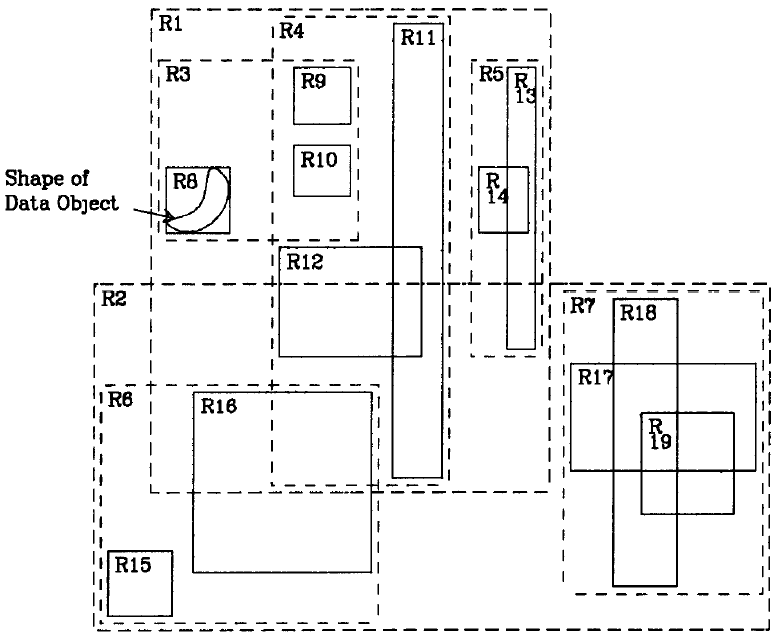
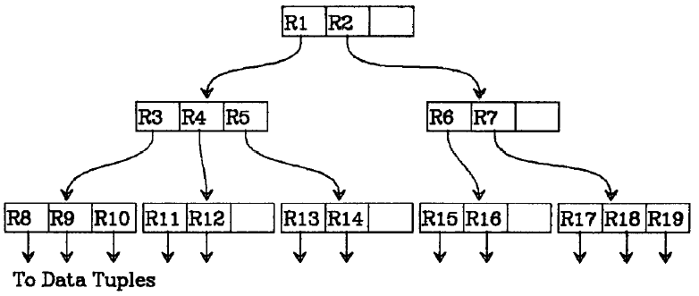
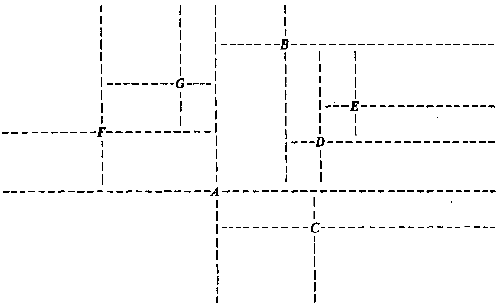
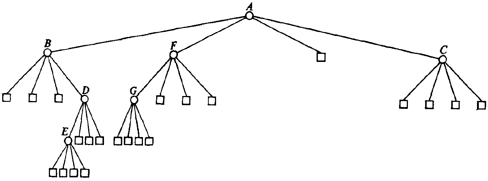
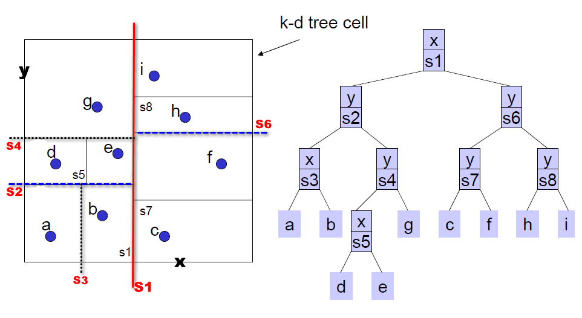
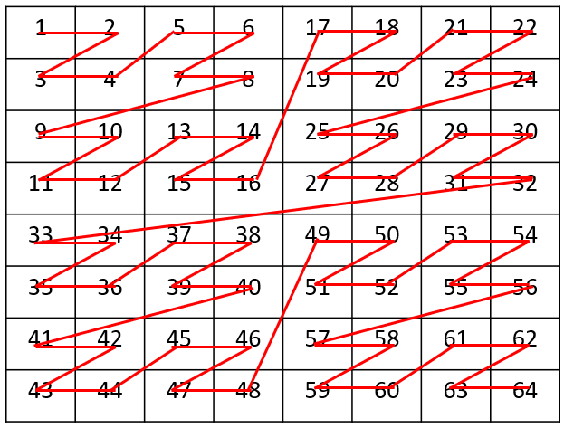
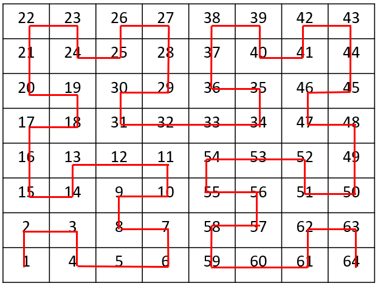

# 常见的时空索引技术

时空数据，顾名思义，包含了两个维度的信息：空间信息与时间信息。

最典型的时空数据，莫过于移动对象的轨迹点数据，如每隔5秒钟记录的车辆实时位置信息。

HBase中的数据按照RowKey单维度排序组织，而我们现在却面临的是一个多维数据问题。因此，HBase如果想很好的支持时空数据的存储，需要引入时空索引技术。

开源的时空数据库：**GeoMesa**

## R-Trees

论文《R-Trees: A Dynamic Index Structure For Spatial Searching》

R-Trees基于这样的思想设计：

- 每一个空间对象，如一个多边形区域，都存在一个最小的矩形，能够恰好包含此时空对象，如上图中的矩形R6所包含的弯月形区域。这个最小包围矩形被称之为**MBR(Minimum Bounding Rectangle)**。
- 多个相邻的矩形，可以被包含在一个更大的最小包围矩形中。如R6、R9以及R10三个矩形，可以被包含在R3中，而R11与R12则被包含在R4中。
- 继续迭代，总能找到若干个最大的区域，以一种树状的形式，将所有的时空对象给容纳进去，如上图中的R1, R2。这样，整个树状结构，呈现如下：

R-Trees的定义：

1. 每一个Leaf Node包含m到M个索引记录（Root节点除外）。

2. 每一个索引记录是一个关于(I, tuple-identifier)的二元组信息，I是空间对象的最小包围矩形，而tuple-identifier用来描述空间对象本身。

3. 每一个Non-leaf节点，包含m到M个子节点（Root节点除外）。

4. Non-leaf节点上的每一个数据元素，是一个(I, child-pointer)的二元组信息，child-pointer指向其中一个子节点，而I则是这个子节点上所有矩形的最小包围矩形。

   如上图中，R3、R4以及R5，共同构成一个non-leaf节点，R3指向包含元素R8，R9以及R10的子节点，这个指针就是child-pointer，而与R8，R9以及R10相关的最小包围矩形，就是I。

5. Root节点至少包含两个子节点，除非它本身也是一个Leaf Node。

6. 所有的Leaf Nodes都出现在树的同一层上。

从定义上来看，R-Trees与B-Trees存在诸多类似：Root节点与Non-Leaf节点，均包含限定数量的子节点；所有的Leaf Nodes都出现在树的同一层上。这两种树也都是**自平衡**的。

R-Trees有多种变种，如R+-Trees，R*-Trees，X-Trees, M-Trees，BR-Trees等等。

#### Quad-Trees

论文《Quad Trees: A Data Structure for Retrieval on Composite Keys》

上图中的A,B,C,E,F,G均为Point，以每一个Point作为中心点，可以将一个区间分成4个象限。

任何新写入的一个Point，总能找到一个某一个已存在的Point的子象限，来存放这个新的Point。

整个树状结构呈现如下：

鲜明的特点：1. 对于非叶子节点，均包含4个子节点，对应4个面积不一的象限。2.**不平衡，树的结构与数据的写入顺序直接相关**。3.有空的Leaf Nodes，且所有的Leaf Nodes则是”参差不齐”的(并不一定都出现在树的同一层中)。4.数据既可能出现在分枝节点中，也可能出现在叶子节点中。

另一种典型的Quad-Trees，被称之为Point Region QuadTrees(简称为PR QuadTrees)，每一次迭代出来的4个象限，面积相同，且不依赖于用户数据Point作为分割点，或者说，**数据分区与用户数据无关**。每一个划分出来的子象限中，只允许存在一个Point。

## K-D Trees

K-D Trees是一种针对高维点向量数据的索引结构，一棵简单的K-D Tree如下图所示(原图源自James Fogarty的”K-D Trees and Quad Trees”，但为了更直观，关于分区分割线的线条做了改动)：

K-D Trees 每次将区间分成左右或上下两个区间。如果已经存在一批Points，则较容易针对这批数据构建出一棵趋于平衡的K-D Tree，如若接收实时写入的数据，或者说数据更新频繁，K-D Tree则难以维持平衡态，除非对整棵树进行重构。

## Space Filling Curve

如果将一个完整的二维空间，分割成一个个大小相同的矩形，可以将Space Filling Curve简单理解为它是一种将所有的矩形区域用一条线”串”起来的方法，因”串”的方式不同，也就引申出了不同的Space Filling Curve算法。

典型的如 **Z-Order Curve**

Hilbert Curve：

Space Filling Curve事实上是**为空间数据提供了一种一维排序**的方法，它拉近了空间数据与传统数据库的距离：因为这意味着可以使用传统的B-Tree或B+-Tree索引，来存储空间数据。

## GeoHash

GeoHash可以将Point编码成一个字符串，不断按照 经度/纬度 二分的方式构建比特值，在对比特值采用Base-32编码成字符串。

经Geohash编码后，其顺序与Z-Order编码保持一致，因此，也可以将Geohash理解成Z-Order算法的**一种编码机制**。

- 以字符串字典顺序表达Z-Order顺序，利用字符串的前缀匹配规则，也可快速实现多边形区域的重叠计算，但在编码效率上却并无任何优势

## 结合HBase

按照传统的树遍历的顺序来理解R-Trees中的对象排序，这种排序是不确定的。这意味着，我们无法构建出一种确定顺序的RowKey。

K-D Trees与HBase结合的最大障碍，依然在于**如何将Trees中的数据映射到KeyValue模型中**。

存在一种方法，**将每一个小方格的访问路径，映射成HBase的RowKey**，就完美解决了时空Points数据存放在HBase中的问题，**这种思路正是Spatial Filling Curve的核心思想**。

Z-Order曲线在距离保留度上，略弱于Hilbert曲线，但在编码复杂度上，却比Hilbert曲线更低，这是**GeoMesa选择Z-Order曲线**的关键原因。