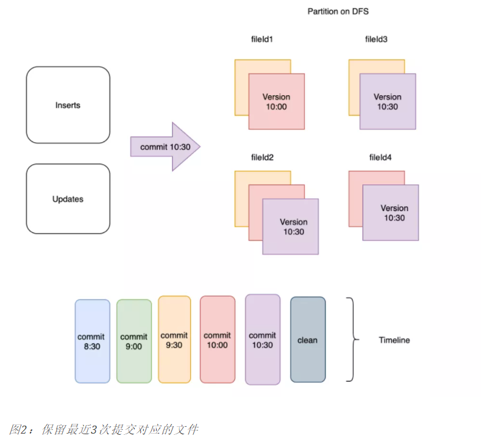
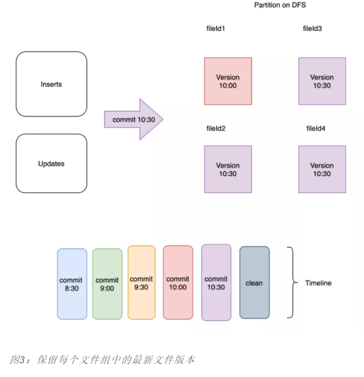

# 清理

清理会在每次写操作之后自动执行，并利用时间轴服务器上缓存的时间轴元数据来避免扫描整个表来评估清理时机。

在数据湖架构中，读取端和写入端同时访问同一张表是非常常见的场景。由于 Hudi 清理服务会定期回收较旧的文件版本，因此可能会出现**长时间运行的查询访问到被清理服务回收的文件版本的情况**，因此需要使用正确的配置来确保查询不会失败。


## 策略

支持两种方式的清理：

1）**KEEP_LATEST_COMMITS**：按 `commits / deltacommits`清理：这是增量查询中最常见且必须使用的模式；

- 保留最近N次commit/delta commit提交中写入的所有文件切片，从而有效提供在**任何即时范围内进行增量查询**的能力；
- 最好**确保数据保留的时间超过最大查询执行时间**；
- 在某些高写入负载的场景下可能需要更大的存储空间；

以下是配置保留最近3个commit的执行示意图：



2）**KEEP_LATEST_FILE_VERSIONS**：按保留的文件片清理：这是一种更为简单的清理方式，这里我们仅保存每个文件组中的最后N个文件片；

- 保存每个文件组中的最后N个文件片；
- 对于Hive需要几小时才能完成的查询场景，将N设置为足够大以至于不会删除查询仍然可以访问的文件片是很有用的。

以下是配置保留1个文件版本的示意图：




## 配置

- `hoodie.clean.automatic`：是否启动清理服务，默认true。
- `hoodie.clean.async`：是否异步执行清理服务，默认false，必须先配置启动清理服务。异步清理，会提升写入的性能。
- `hoodie.cleaner.policy`：清理策略，默认`KEEP_LATEST_COMMITS `，可选`KEEP_LATEST_FILE_VERSIONS`；
- `hoodie.cleaner.commits.retained`：
- `hoodie.cleaner.fileversions.retained`：默认3，清理时，每个file group保留的最小的文件个数；


## 运行

### 同步(默认)

```properties
hoodie.clean.automatic=true
hoodie.clean.async=false
```

### 异步

```properties
hoodie.clean.automatic=true
hoodie.clean.async=true
```

### Spark独立运行

```shell
$ spark-submit --class org.apache.hudi.utilities.HoodieCleaner \
  --props s3:///temp/hudi-ingestion-config/config.properties \
  --target-base-path s3:///temp/hudi \
  --spark-master yarn-cluster
```

