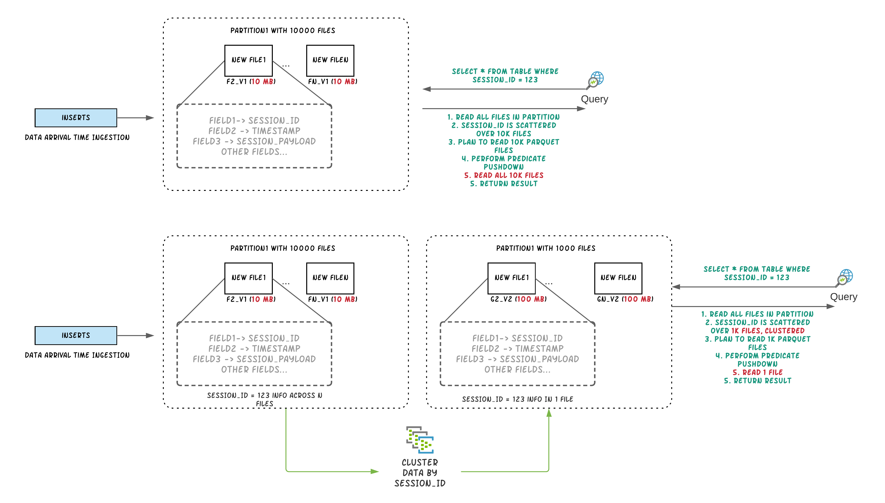
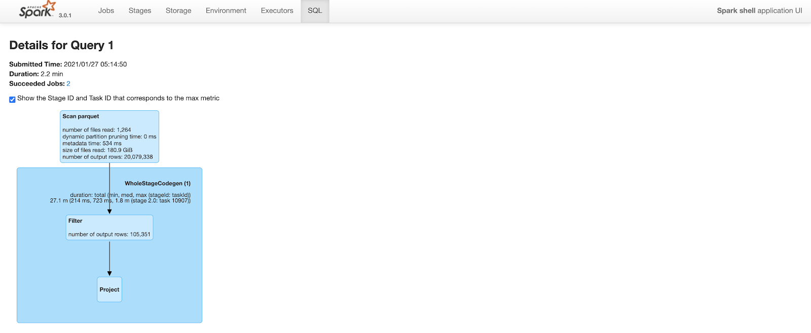

# Clustering（文件合并）

## 背景

数据摄取通常倾向于小文件，以提高并行性，并使数据能够尽快用于查询。但是，如果有很多小文件，查询性能就会下降。

在摄入期间，数据通常根据到达时间在同一位置。但是，当频繁查询的数据放在一起时，查询引擎的性能会更好。

为了能够在文件大小和摄取速度之间进行权衡，Hudi 提供`hoodie.parquet.small.file.limit`来配置允许的最小文件大小。用户可以将小文件软限制配置为`0`强制新数据进入一组新文件组或将其设置为更高的值以确保新数据“填充”到现有文件中，直到满足增加摄取的限制延迟。


称为集群的新型表服务[[RFC-19\]](https://cwiki.apache.org/confluence/display/HUDI/RFC+-+19+Clustering+data+for+freshness+and+query+performance)重新组织数据以**提高查询性能而不影响摄取速度**。

Clustering Service 建立在 **Hudi 基于 MVCC 的设计**之上，允许 **writers 继续插入新数据，而 clustering action 在后台运行以重新格式化数据布局**，确保**并发读取器和写入器之间的快照隔离**。


注意：只能为**未接收任何并发更新的表/分区**执行Clustering服务。


## 原理

“Clustering”服务来重写数据以优化 Hudi 数据湖文件布局。

聚类表服务可以**异步或同步**运行，添加一个名为**“REPLACE”的新动作类型**，它将在 **Hudi 元数据时间线中标记聚类动作**。

Clustering分为两个部分：

- **调度**Clustering：使用可插拔的Clustering策略创建Clustering计划。

- **执行**Clustering：使用执行策略处理计划以创建新文件并替换旧文件。

### Scheduling clustering

1. 识别适合集群的文件：根据选择的集群策略，**调度逻辑将识别适合集群的文件**。
2. 根据**特定条件对符合聚类条件的文件进行分组**：
   - 每个组的数据大小应为`targetFileSize`的倍数。分组是作为计划中定义的“策略”的一部分完成的。；
   - 还有一个选项可以设置组大小上限，以提高并行性并避免混洗大量数据。
3. 最后，**聚类计划以 avro元数据格式保存到时间线**。


### Running clustering

1. 读取clustering plan并获取需要clustering的文件组`clusteringGroups`；
2. 对每个组，实例化合适的策略类，并应用到数据上；
3. 创建`replace`commit，并更新hudi的元数据。



## Clustering策略

clustering计划和执行，依赖于配置的策略，策略被广义上划分为三类：

### Plan策略

用于决策哪些文件组应该被聚合（clustered）：

- `SparkSizeBasedClusteringPlanStrategy`：基于base file（parquet）的小文件限制，创建聚合组允许每个组达到最大的文件大小。这种策略对于将中等大小的文件拼接到更大的文件中，以减少大量文件在冷分区上的传播非常有用。
- `SparkRecentDaysClusteringPlanStrategy`：默认策略，回顾以前的N天分区，并创建一个计划，将这些分区中的“小”文件片集群起来。当工作负载是可预测的并且数据是按时间划分的时候，它会很有用。
- `SparkSelectedPartitionsClusteringPlanStrategy`：只想在一个范围内集群特定的分区，无论这些分区是旧的还是新的

**注意：所有策略都是分区感知的，后两种策略仍然受到第一种策略的大小限制的约束。**即小文件/最大文件的限制）.


### 执行策略

在规划阶段构建聚合组之后，Hudi对每个组应用**执行策略**，主要基于排序列和大小。

- `SparkSortAndSizeExecutionStrategy`：默认配置，指定排序的列，为集群生成的parquet文件设置最大文件大小（hoodie.parquet.max.file.size），使用bulk insert写数据到新文件中，该**策略改变了数据布局，不仅提高了查询性能，还自动平衡了重写开销**。

  - 根据规划阶段创建的集群组的数量，该策略可以作为单个spark作业执行，也可以作为多个作业执行。
  - 默认情况下，Hudi将提交多个spark作业并合并结果。
  - `SingleSparkJobExecutionStrategy`：强制Hudi使用单Spark作业执行

  

### 更新策略

当前，clustering只能被**调度到没有接收到任何并发更新的表/分区**：

- `SparkRejectUpdateStrategy`：默认，如果**某个文件组在集群期间有更新，那么它将拒绝更新并抛出异常**。
- `SparkAllowUpdateStrategy`：


## 参数

- `hoodie.clustering.plan.strategy.class`：[默认`SparkRecentDaysClusteringPlanStrategy `](https://hudi.apache.org/docs/clustering#plan-strategy)
  - 配置为`SparkSelectedPartitionsClusteringPlanStrategy`时，可以执行起始分区
    - `hoodie.clustering.plan.strategy.cluster.begin.partition`
    - `hoodie.clustering.plan.strategy.cluster.end.partition`
- `hoodie.clustering.execution.strategy.class`：执行策略，[默认`SparkSortAndSizeExecutionStrategy `](https://hudi.apache.org/docs/clustering#execution-strategy)
- `hoodie.clustering.updates.strategy`：更新策略，[默认`SparkRejectUpdateStrategy`](https://hudi.apache.org/docs/clustering#update-strategy)；
- 
- `hoodie.clustering.plan.strategy.small.file.limit`：默认629145600，小文件的阈值；
- `hoodie.clustering.plan.strategy.daybased.skipfromlatest.partitions`：默认0，创建聚类计划时，从最新分区跳过的分区数；
- `hoodie.clustering.preserve.commit.metadata`：默认false，重写数据后，是否保留已存在的`_hoodie_commit_time`，意味**着用户可以直接在聚合后的数据上直接运行增量查询**。


- `hoodie.clustering.inline`：默认false，设置**为true会在每次写完成的时候运行clustering**，和写任务同步；
- `hoodie.clustering.async.enabled`：默认false，**异步clustering**，否则同步进行clustering；
  - `hoodie.parquet.small.file.limit`：异步运行时，设置为0，避免触发小文件合并策略；
  - `hoodie.clustering.async.max.commits`：默认4，多少commits之后，可以触发clustering；

- `hoodie.clustering.inline`：默认false，用于单独启动clustering时配置；


## 支持引擎

### HoodieClusteringJob（独立服务，Spark）

指定-mode或-m选项。有如下三种模式：

- schedule（调度）：制定一个Clustering计划。这提供了一个可以在执行模式下传递的instant。
- execute（执行）：在给定的instant执行Clustering计划，这意味着这里需要instant。

- scheduleAndExecute（调度并执行）：首先制定Clustering计划并立即执行该计划。

开启multi-writing（在原始写入程序仍在运行时运行作业请启用多写入）：

```properties
hoodie.write.concurrency.mode=optimistic_concurrency_control
hoodie.write.lock.provider=org.apache.hudi.client.transaction.lock.ZookeeperBasedLockProvider
```

Spark运行：

```bash
spark-submit \--class org.apache.hudi.utilities.HoodieClusteringJob \/path/to/hudi-utilities-bundle/target/hudi-utilities-bundle_2.12-0.9.0-SNAPSHOT.jar \--props /path/to/config/clusteringjob.properties \--mode scheduleAndExecute \--base-path /path/to/hudi_table/basePath \--table-name hudi_table_schedule_clustering \--spark-memory 1g
```

示例 clusteringjob.properties 配置：

```properties
hoodie.clustering.async.enabled=true
hoodie.clustering.async.max.commits=4
hoodie.clustering.plan.strategy.target.file.max.bytes=1073741824
hoodie.clustering.plan.strategy.small.file.limit=629145600
hoodie.clustering.execution.strategy.class=org.apache.hudi.client.clustering.run.strategy.SparkSortAndSizeExecutionStrategy
hoodie.clustering.plan.strategy.sort.columns=column1,column2
```


### DeltaStreamer

```scala
spark-submit \
--class org.apache.hudi.utilities.deltastreamer.HoodieDeltaStreamer \
/path/to/hudi-utilities-bundle/target/hudi-utilities-bundle_2.12-0.9.0-SNAPSHOT.jar \
--props /path/to/config/clustering_kafka.properties \
--schemaprovider-class org.apache.hudi.utilities.schema.SchemaRegistryProvider \
--source-class org.apache.hudi.utilities.sources.AvroKafkaSource \
--source-ordering-field impresssiontime \
--table-type COPY_ON_WRITE \
--target-base-path /path/to/hudi_table/basePath \
--target-table impressions_cow_cluster \
--op INSERT \
--hoodie-conf hoodie.clustering.async.enabled=true \
--continuous
```


### Spark Structured Streaming

原始任务写入时，进行异步聚类

```scala
val commonOpts = Map(
   "hoodie.insert.shuffle.parallelism" -> "4",
   "hoodie.upsert.shuffle.parallelism" -> "4",
   DataSourceWriteOptions.RECORDKEY_FIELD.key -> "_row_key",
   DataSourceWriteOptions.PARTITIONPATH_FIELD.key -> "partition",
   DataSourceWriteOptions.PRECOMBINE_FIELD.key -> "timestamp",
   HoodieWriteConfig.TBL_NAME.key -> "hoodie_test"
)

def getAsyncClusteringOpts(isAsyncClustering: String, 
                           clusteringNumCommit: String, 
                           executionStrategy: String):Map[String, String] = {
   commonOpts + (DataSourceWriteOptions.ASYNC_CLUSTERING_ENABLE.key -> isAsyncClustering,
           HoodieClusteringConfig.ASYNC_CLUSTERING_MAX_COMMITS.key -> clusteringNumCommit,
           HoodieClusteringConfig.EXECUTION_STRATEGY_CLASS_NAME.key -> executionStrategy
   )
}

def initStreamingWriteFuture(hudiOptions: Map[String, String]): Future[Unit] = {
   val streamingInput = // define the source of streaming
   Future {
      println("streaming starting")
      streamingInput
              .writeStream
              .format("org.apache.hudi")
              .options(hudiOptions)
              .option("checkpointLocation", basePath + "/checkpoint")
              .mode(Append)
              .start()
              .awaitTermination(10000)
      println("streaming ends")
   }
}

def structuredStreamingWithClustering(): Unit = {
   val df = //generate data frame
   val hudiOptions = getAsyncClusteringOpts("true", "1", "org.apache.hudi.client.clustering.run.strategy.SparkSortAndSizeExecutionStrategy")
   val f1 = initStreamingWriteFuture(hudiOptions)
   Await.result(f1, Duration.Inf)
}
```


### Spark DataSource（inline）

```scala
import org.apache.hudi.QuickstartUtils._
import scala.collection.JavaConversions._
import org.apache.spark.sql.SaveMode._
import org.apache.hudi.DataSourceReadOptions._
import org.apache.hudi.DataSourceWriteOptions._
import org.apache.hudi.config.HoodieWriteConfig._


val df =  //generate data frame
df.write.format("org.apache.hudi").
        options(getQuickstartWriteConfigs).
        option(PRECOMBINE_FIELD_OPT_KEY, "ts").
        option(RECORDKEY_FIELD_OPT_KEY, "uuid").
        option(PARTITIONPATH_FIELD_OPT_KEY, "partitionpath").
        option(TABLE_NAME, "tableName").
        option("hoodie.parquet.small.file.limit", "0").
        option("hoodie.clustering.inline", "true").
        option("hoodie.clustering.inline.max.commits", "4").
        option("hoodie.clustering.plan.strategy.target.file.max.bytes", "268435456").
        option("hoodie.clustering.plan.strategy.small.file.limit", "134217728").
        option("hoodie.clustering.plan.strategy.sort.columns", "column1,column2"). //optional, if sorting is needed as part of rewriting data
        mode(Append).
        save("dfs://location");
```


### [Flink Clustering Jira](https://issues.apache.org/jira/browse/HUDI-2207)


## 性能对比

### Before Clustering

Query took 2.2 minutes to complete. Note that the number of output rows in the “scan parquet” part of the query plan includes all 20M rows in the table.



### After Clustering

The query plan is similar to above. But, because of improved data locality and predicate push down, spark is able to prune a lot of rows. After clustering, the same query only outputs 110K rows (out of 20M rows) while scanning parquet files. This cuts query time to less than a minute from 2.2 minutes.


## 总结

使用Clustering，我们可以通过以下方式提高查询性能

1. 利用[空间填充曲线](https://en.wikipedia.org/wiki/Z-order_curve)等概念来适应数据湖布局并减少查询期间读取的数据量。
2. 将小文件拼接成大文件，减少查询引擎需要扫描的文件总数。

Clustering框架还提供了根据特定要求异步重写数据的灵活性。采用集群框架和自定义可插拔策略来满足按需数据湖管理活动，如：

1. 重写数据并加密静态数据。
2. 从表中修剪未使用的列并减少存储空间。


## TODO

### Support clustering with updates

### CLI tools to support clustering

### 

