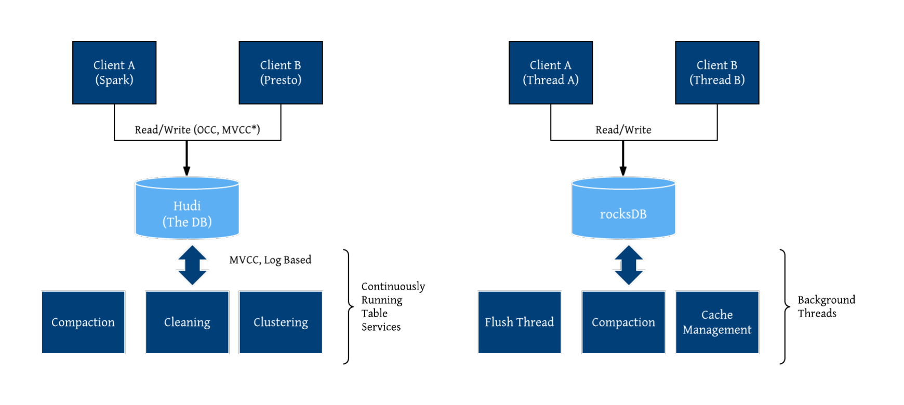
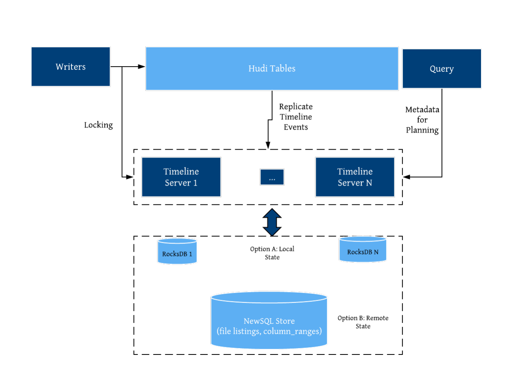

# Apache Hudi

> Upserts, Deletes And Incremental Processing on Big Data.
>
> Apache Hudi ingests & manages storage of large analytical datasets over DFS (hdfs or cloud stores).
>
> Hudi brings transactions, record-level updates/deletes and change streams to data lakes!

 

## 数据库的存储方式

### RDBMS B-Tree

RDBMS基于B-Tree结构：

- 数据存储在数据页中，数据页可以通过在表的列上创建的索引来找到；

- 当发出更新命令时，RDBMS引擎会找到包含该记录的确切页面，并在**该数据页面中适当地更新数据**

这是一个简化的描述，在大多数现代RDBMS引擎中，在多版本并发控制等方面存在额外的复杂性，但基本思想保持不变。

### No-SQL LSM-Tree

NoSQL数据库采用LSM树结构：

- 基于日志的存储模型，新数据（插入/更新/删除）被添加到append-only的日志中；

- 定期将日志合并回数据文件，使数据文件与所有更改的数据保持最新，这种合并过程称为压缩；

- 当更新一条记录时，只是将其写入到append-only日志中，根据数据库引擎的优化规则，将组合append-only日志和数据文件来为读取查询提供服务；

这也是一个简化的描述，但基本思想相同。

下图说明了如何将新的和更新的数据添加到append-only日志（级别0）中，并最终合并到更大的文件中（级别1和级别2）。

## 特性

- 支持**快速、可插拔索引的upsert和删除**；
- **增量查询**，记录级别**更改流**；
- 支持**事务、回滚、并发控制**；
- 支持Spark/Presto/Hive/Flink等SQL读写；
- 自动调整文件大小、**数据集群、压缩、清理**；
- 流式摄取，内置CDC源和工具；
- 用于可扩展存储访问的内置元数据跟踪；
- 向后兼容的模式演变和实施（enforcement）；
- 满足**GDPR(通用数据保护条例)**、数据删除功能。

## 使用场景

典型用法是将上游数据通过 Kafka 或者 Sqoop，经由 DeltaStreamer 写入 Hudi。

DeltaStreamer 是一个常驻服务，不断地从上游拉取数据，并写入 hudi。

随着数据不断写入，会有小文件产生。对于这些小文件，DeltaStreamer 可以**自动地触发小文件合并的任务**。

查询引擎，Hudi 支持 Hive、Spark、Presto、Flink等。

## 表类型

> MoR is better suited for **write- or change-heavy** workloads with fewer reads. 
>
> CoW is better suited for **read-heavy workloads** on data that changes less frequently.
>
> 数据写入效率，对于cow及mor表，不存在更新操作时，写入速率接近。

一张 Hudi 数据湖表具备两种形态：

1）**表形态**：查询最新的快照结果，同时提供高效的列存格式。

2）**流形态**：流式消费变更，可以指定任意点位流读之后的 changelog。

### Copy On Write

类似于RDBMS B-Tree更新，仅使用列式存储（Parquet）数据，**更新写入时做数据的合并，更新数据版本并重写数据文件**，写入性能略差，但是**读性能更高一些**。

Copy On Write 类型表**每次写入都会生成一个新的持有 base file（对应写入的 instant time ） 的 FileSlice**。

用户在 snapshot 读取的时候会扫描所有最新的 FileSlice 下的 base file。

- 更新：先找到包含更新数据的文件，然后再使用更新值（最新的数据）重写该文件，包含其他记录的文件保持不变。**当突然有大量写操作时会导致重写大量文件，从而导致极大的I/O开销**。（TODO：会不会出现同时更新同一个文件的场景，如何保证一致性？）
  - 重写文件时的逻辑是什么样？先获取所有的旧数据，再更新？并发的问题？
  - **该文件ID的最新版本都将被重写一次，并对所有已更改的记录使用新值**（啥意思？）

- 插入：**记录首先打包到每个分区路径中的最小文件中**，直到达到配置的最大大小（小文件合并策略），所有剩余记录将再次打包到新的文件组，新的文件组也会满足最大文件大小要求。

3）读取：在读取数据集时，通过读取最新的数据文件来获取最新的更新，此存储类型适用于少量更新写入和大量读取的场景

### Merge On Read

> MOR is a superset of COW.

使用列式（parquet）与行式（avro）文件混合的方式存储数据。在更新记录时，类似NoSQL中的LSM-Tree更新。

- 在更新记录时，仅更新到增量文件（Avro）中，然后进行异步（或同步）的compaction，最后创建列式文件（parquet）的新版本。

- 在读取数据集时，需要先将增量文件与旧文件进行合并，然后生成列式文件成功后，再进行查询。**（TODO：合并时与compaction会有冲突么？）**
- 此存储类型**适合频繁写的工作负载**，因为新记录是以追加的模式写入增量文件中。

写入行为，依据 index 的不同会有细微的差别：

1）**插入log文件**：可以**对 log file 生成 index 的索引方案**，如Flink state 索引 和 HBase 索引，每次写入都是 log format，并且会不断追加和 roll over。

2）**插入parquet文件**：对于 BloomFilter 这种**无法对 log file 生成 index 的索引方案**，对于 **INSERT 消息仍然会写 base file** （parquet ），只有 **UPDATE 消息会 append log 文件**（因为 base file 已经记录了该 UPDATE 消息的 FileGroup ID）

### 对比

| Trade-off               | CopyOnWrite                         | MergeOnRead                                  |
| ----------------------- | ----------------------------------- | -------------------------------------------- |
| **Data Latency**        | Higher                              | **Lower**                                    |
| **Update cost (I/O)**   | Higher (rewrite entire parquet)     | **Lower** (append to delta log)              |
| **Parquet File Size**   | **Smaller** (high update(I/O) cost) | Larger (low update cost)                     |
| **Write Amplification** | Higher                              | **Lower** (depending on compaction strategy) |

## 主键和分区

基本的概念：

- 记录键（ record key ）：`hoodie.datasource.write.recordkey.field`
- 分区路径（partition path）：`hoodie.datasource.write.partitionpath.field`
- Hoodie Key：record key + partition path；

### Key生成策略

用来生成 HoodieKey（record key + partition path），目前支持以下策略：

- 支持多个字段组合 record keys
- 支持多个字段组合的 parition path （可定制时间格式，支持Hive style path name）

- 非分区表

具体的生成策略见[主键和分区配置](./key_partition.md)

#### 删除策略

- 逻辑删：将 value 字段全部标记为 null
- 物理删：
  - 通过 `OPERATION_OPT_KEY` 删除所有的输入记录
  - 配置 `PAYLOAD_CLASS_OPT_KEY = org.apache.hudi.EmptyHoodieRecordPayload` 删除所有的输入记录
  - 在输入记录添加字段：`_hoodie_is_deleted`

## 组件

表格式简单地包括：**表的文件布局**、**表的模式**和**跟踪表更改的元数据**。

- 将表/分区的文件，划分成组，并且维护record key到已经存在的文件组的映射，所有的更新记录到对应的文件组的delta log文件中
  - 分组降低合并开销，delta records只需要合并对应的文件组中的base file；
  - 与状态存储非常相似，Hudi的设计预期快速的基于键的upserts/delete，并只需要合并每个文件组中的delta日志。

三个主要组件：

1）  有序的**时间轴元数据**：类似于数据库事务日志。

2）  **分层布局的数据文件**：实际写入表中的数据。

3）  **索引**（多种实现方式）：映射包含指定记录的数据集。

### 时间轴（Timeline）

时间轴是所有 Hudi 表元数据的事件日志，存储在`.hoodie`文件夹下，它提供了在表上执行的所有操作的有序日志。

- 事件将保留在时间轴上，直到配置的时间/活动间隔；
- 每个文件组也设计成它自己的独立的日志；
- **限制元数据的大小**，与表被写入/操作的频率成正比，与整个表的大小无关；
  - 最新的instant被保存为单个文件，而较旧的instant被存档到时间轴归档文件夹中，以限制writers和queries列出的文件数量。
- 时间轴上的新事件被消耗并反映到一个内部元数据表上（MOR实现）：
  - 使用 HFile 格式，提供键的索引查找，不需要读取整个元数据表；
  - **存储表的所有的物理路径**，避免对象存储的list开销；

Timeline 是 Hudi 用来管理提交（commit）的抽象，每个 commit 都绑定一个固定时间戳，分散到时间线上。在 Timeline 上，每个 commit 被抽象为一个 HoodieInstant，一个 instant 记录了一次提交 (commit) 的行为、时间戳、和状态。

Hudi 的读写 API 通过 Timeline 的接口可以方便的在 commits 上进行条件筛选，对 history 和 on-going 的 commits 应用各种策略，快速筛选出需要操作的目标 commit。

Hudi 时间轴instant由下面几个组件构成：

1）  **操作类型**：对数据集执行的操作类型；

2）  **即时时间**：即时时间通常是一个时间戳(例如：20190117010349)，该时间戳按操作开始时间的顺序单调增加；

3）  **即时状态**：instant的当前状态;

每个instant都有avro或者json格式的元数据信息，详细的描述了该操作的状态以及这个即时时刻instant的状态。

关键的Instant操作类型有：

1）  **COMMIT**：一次提交表示将一组记录原子写入到数据集中；

2）  **CLEAN**：删除数据集中不再需要的旧文件版本的后台活动；

3）  **DELTA_COMMIT**：将一批记录原子写入到MergeOnRead存储类型的数据集中，其中一些/所有数据都可以只写到增量日志中；

4）  **COMPACTION**：协调Hudi中差异数据结构的后台活动，MOR表的delta log与base file的合并。在内部，压缩表现为时间轴上的特殊提交；

5）  **ROLLBACK**：表示提交/增量提交不成功且已回滚，删除在写入过程中产生的所有部分文件；

6）  **SAVEPOINT**：将某些文件组标记为"已保存"，以便清理程序不会将其删除。在发生灾难/数据恢复的情况下，它有助于将数据集还原到时间轴上的某个点；

任何给定的即时都会处于以下状态之一：

1）  **REQUESTED**：表示已调度但尚未初始化；

2）  **INFLIGHT**：表示当前正在执行该操作；

3）  **COMPLETED**：表示在时间轴上完成了该操作。

存储根据时间发生时间（Event time）,查询根据（Arrival time）

- **Arrival time**: 数据到达 Hudi 的时间，commit time

- **Event time**: record 中记录的时间

从 10:00 开始陆续产生各种 commits，10:20 来了一条 9:00 的数据，该数据仍然可以落到 9:00 对应的分区，通过 timeline 直接消费 10:00 之后的增量更新（只消费有新 commits 的 group），那么这条延迟的数据仍然可以被消费到。

### 数据文件

Hudi 将表组织成 DFS上 基本路径下的文件夹结构中：

- 如果表分区，则在基本路径下还会有其他的分区，这些分区是包含该分区数据的文件夹，与Hive表非常类似；
- 分区由分区路径唯一标识，在每个分区内，**文件被组织成文件组，由唯一ID标识**；
- 每个**文件组由多个文件切片**（file slice）构成，切片由 基本文件（parquet）和增量文件（log，MOR表）构成；
- 每个**文件的文件名都带有其归属的 FileID（即 FileGroup Identifier）和 base commit time**（即 InstanceTime）。
- 通过文件名的 FileID 组织 FileGroup 的 logical 关系；通过文件名的 base commit time 组织 FileSlice 的逻辑关系。

一个新的 base commit time 对应一个新的 FileSlice，实际就是一个新的数据版本。

HUDI 通过 TableFileSystemView 抽象来管理 table 对应的文件：

- 找到所有最新版本 FileSlice 中的 base file （Copy On Write Snapshot 读）或者 base + log files（Merge On Read 读)；
- 通过 Timeline 和 TableFileSystemView 抽象，HUDI 实现了非常便捷和高效的表文件查找。

Hudi采用了MVCC设计，**压缩操作会将日志和基本文件合并以产生新的文件片**，而**清理操作则将未使用的/较旧的文件片删除以回收DFS上的空间**。

### 索引

Hudi 通过`HoodieKey`有 Min/Max 统计和BloomFilter，用于快速定位 Record 所在的文件。**索引机制提供高效的`upsert`操作**（区分消息是INSERT还是UPDATE）：

- 将 Hoodie key （**记录键+分区路径**）到 file id (FileGroup) 之间的映射关系；
- 映射数据第一次写入文件后保持不变，一个 FileGroup 包含了一批 record 的所有版本记录

Hudi索引可以根据其查询分区记录的能力进行分类：

1） **全局索引**：**不需要分区信息**即可查询记录键映射的文件ID。比如，写程序可以传入null或者任何字符串作为分区路径（partitionPath），但索引仍然会查找到该记录的位置。全局索引在记录键在**整张表中保证唯一的情况下非常有用**，但是**查询的消耗随着表的大小呈函数式增加**。

2） **非全局索引**：非全局索引**依赖分区路径**（partitionPath），对于**给定的记录键，它只会在给定分区路径下查找该记录**。这比较适合总是**同时生成分区路径和记录键的场景**，同时还能享受到更好的扩展性，因为**查询索引的消耗只与写入到该分区下数据集大小**有关系。

#### 索引类型

- **HBaseIndex**：本质上是全局索引；
- **BloomIndex**：Bloom索引，通过base file（parquet）的footer的meta区记录record key组成的BloomFilter；
  - 动态布隆过滤器（设置`hoodie.bloom.index.filter.type=DYNAMIC_V0`），根据文件里存放的记录数量来调整大小从而达到设定的伪正率。
- **SimpleIndex**：a lean join of the incoming update/delete records against keys extracted from the table on storage；
- **InMemoryHashIndex**：内存中ConcurrentMap，Spark 内存索引当前是用来测试的索引；

- **Flink State-based Index**：HUDI 在 0.8.0 版本中实现的 Flink witer，采用了 Flink 的 state 作为底层的 index 存储，每个 records 在写入之前都会先计算目标 bucket ID，不同于 BloomFilter Index，避免了每次重复的文件 index 查找；

#### 场景

**场景一：对事实表的延迟更新**

- 特点：大**部分更新会发生在最新的几个分区上而小部分会在旧的分区**
- 适用索引：**布隆索引**

- 原理：因为查询索引可以靠设置得当的布隆过滤器来剪枝很多数据文件。另外，如果生成的键可以以某种顺序排列，参与比较的文件数会进一步通过范围剪枝而减少。**Hudi用所有文件的键域来构造区间树**，这样能来高效地依据输入的更删记录的键域来排除不匹配的文件。

  

**场景二：对事件表的去重**

- 特点：**大部分都是仅追加的数据，插入和更新只存在于最新的几个分区中**。由于重复事件可能发生在整个数据管道的任一节点，在存放到数据湖前去重是一个常见的需求。
- 适用索引：**布隆索引**

- 原理：我们可以利用作为首类处理对象的时间来构造由事件时间戳和事件id（event_ts+event_id)组成的键，这样插入的记录就有了单调增长的键。这会在最新的几个分区里大幅提高剪枝文件的效益。

  

**场景三：对维度表的随机更删**

- 特点：**更新量通常很小但所接触的分区和数据文件会很多，范围涉及从旧到新的整个数据集**。有时因为没有很好的分区条件，这些表也会不分区。
- 适用索引：简单索引

- 原理：更新操作通常会触及表里大多数文件从而导致布隆过滤器依据输入的更新对所有文件标明真正(true positive)。最终会导致，**即使采用了范围比较，也还是检查了所有文件。**使用`简单索引`对此场景更合适，因为它不采用提前的剪枝操作，而是直接和所有文件的所需字段连接。如果额外的运维成本可以接受的话，也可以采用HBase索引，其对这些表能提供更加优越的查询效率。

#### Future（Data skip index）

- [RFC-27](https://cwiki.apache.org/confluence/display/HUDI/RFC-27+Data+skipping+index+to+improve+query+performance) ：在元数据表上添加额外的索引形式，作为新分区，添加索引列范围，它可以扩展到许多小文件，并支持更快的更改。
- [RFC-8](https://cwiki.apache.org/confluence/display/HUDI/RFC-08++Record+level+indexing+mechanisms+for+Hudi+datasets)：Record level indexing mechanisms for Hudi datasets
- [point-lookup-ish queries](https://github.com/apache/hudi/pull/2487) 

## 写入模式

- **UPSERT**：默认行为，数据先通过 index 打标(INSERT/UPDATE)，有一些启发式算法决定消息的组织以优化文件的大小 => CDC 导入；
- **INSERT**：跳过 index，写入效率更高 => Log Deduplication；
- **BULK_INSERT**：写排序，对大数据量的 Hudi 表初始化友好，对文件大小的限制 best effort（写 HFile）。

### UpSert

#### COW

- 先对 records 按照 record key 去重；
- 首先对这批数据创建索引 (HoodieKey => HoodieRecordLocation)；通过索引区分哪些 records 是 update，哪些 records 是 insert（key 第一次写入）；
- 对于 update 消息，会直接找到对应 key 所在的最新 FileSlice 的 base 文件，并做 **merge** 后写新的 base file (新的 FileSlice)；
- 对于 insert 消息，会扫描当前 partition 的所有 SmallFile（小于一定大小的 base file），然后 merge 写新的 FileSlice；如果没有 SmallFile，直接写新的 FileGroup + FileSlice；

#### MOR

- 先对 records 按照 record key 去重（可选）
- 首先对这批数据创建索引 (HoodieKey => HoodieRecordLocation)；通过索引区分哪些 records 是 update，哪些 records 是 insert（key 第一次写入）
- 如果是 insert 消息：
  - 如果 log file 不可建索引（默认），会尝试 merge 分区内最小的 base file （不包含 log file 的 FileSlice），生成新的 FileSlice；如果没有 base file 就新写一个 FileGroup + FileSlice + base file；
  - 如果 log file 可建索引，尝试 append 小的 log file，如果没有就新写一个 FileGroup + FileSlice + base file；
- 如果是 update 消息，写对应的 file group + file slice，直接 append 最新的 log file（如果碰巧是当前最小的小文件，会 merge base file，生成新的 file slice），log file 大小达到阈值会 roll over 一个新的

### Insert

#### COW

- 先对 records 按照 record key 去重（可选，`write.insert.deduplicate`）
- 不会创建 Index

- 如果有小的 base file 文件，merge base file，生成新的 FileSlice + base file，否则直接写新的 FileSlice + base file 

#### MOR

- 先对 records 按照 record key 去重（可选，`write.insert.deduplicate`）
- 不会创建 Index

- 如果 log file 可索引，并且有小的 FileSlice，尝试追加或写最新的 log file；如果 log file 不可索引，写一个新的 FileSlice + base file 

### Bulk Insert

 Hudi支持`bulk_insert`操作来将数据初始化至Hudi表中，该操作相比`insert`和`upsert`操作速度更快，效率更高。`bulk_insert`不会查看已存在数据的开销并且不会进行小文件优化。

详细介绍见[Bulk Insert](./bulk_insert.md)。

## 查询

> 查询性能，一般需求是根据查询谓词生成过滤条件下推至 datasource。Hudi 这方面没怎么做工作，其性能完全基于引擎自带的谓词下推和 partition prune 功能。

支持的查询类型

| Table Type    | Supported Query types                                        |
| ------------- | ------------------------------------------------------------ |
| Copy On Write | Snapshot Queries + Incremental Queries                       |
| Merge On Read | Snapshot Queries + Incremental Queries + Read Optimized Queries |

MOR表的Snapshot和读优化查询的对比

| Trade-off     | Snapshot                                                     | Read Optimized                               |
| ------------- | ------------------------------------------------------------ | -------------------------------------------- |
| Data Latency  | Lower                                                        | Higher                                       |
| Query Latency | Higher (merge base / columnar file + row based delta / log files) | Lower (raw base / columnar file performance) |

### 快照查询

给定delta commit或者commit即时操作后表的最新快照，读取所有 partiiton 下每个 FileGroup 最新的 FileSlice 中的文件：

- Copy On Write 表读 parquet 文件；
- Merge On Read 表读 parquet + log 文件。

### 增量查询

自给定commit/delta commit即时操作以来新写入的数据

- COW：在给定的开始，结束即时时间范围内，对最新的基本文件执行查询（称为增量查询窗口）
- MOR：在增量查询窗口中对最新的文件片执行，取决于窗口本身，读取基本块或日志块中读取记录的组合。

#### Streaming 读

**0.8.0 版本的 HUDI Flink writer 支持实时的增量订阅，可用于同步 CDC 数据，日常的数据同步 ETL pipeline。Flink 的 streaming 读做到了真正的流式读取，source 定期监控新增的改动文件，将读取任务下派给读 task。**

### 读优化查询

读优化查询仅针对MOR（因为COW没有Compaction）

- MOR ：仅访问基本文件，提供给定文件片**自上次执行压缩操作以来的数据**。通常**查询数据的最新程度的保证取决于压缩策略**

## 表服务

数据库通常由几个内部组件组成，它们协同工作，为用户提供效率、性能和极大的可操作性。出于作为增量数据管道的状态存储的目的，我们设计了带有内置表服务和自管理运行时的Hudi，确保性能表存储布局和元数据管理，这些服务在每次写操作之后都会自动同步调用，或者作为单独的后台作业异步调用：

- **Compaction**：带有内置的策略(基于日期分区，有I/O限制)，它将基本文件与一组增量日志文件合并以生成新的基本文件，同时允许对文件组并发写入；
- **Clustering**：将较小的基本文件合并为较大的文件来控制文件大小；数据聚簇，将文件按照某些列进行聚簇，以重新布局，达到优化查询性能的效果；
- **Cleaning**：删除超过增量查询配置保留期的文件片；
- **Replication**：复制服务，将数据跨地域进行复制；
- **Archiving**：归档服务，归档commit元数据，避免元数据不断膨胀；

### 压缩（Compaction）

instant操作，压缩仅适用于读时合并（MOR）表类型，详细内容和配置见[Compaction](./compaction.md#Compaction)

将一组文件片作为输入，将每个文件切片中的所有日志文件与其basefile文件（parquet文件）合并，以生成新的压缩文件片，并写为时间轴上的一个commit。

- 由压缩策略（默认选择具有最大未压缩日志的文件片）决定选择要进行压缩的文件片。

### 清理（Clean）

instant操作，删除旧的文件片，并限制表占用的存储空间。

清理默认会在每次写操作之后自动执行，并利用时间轴服务器上缓存的时间轴元数据来避免扫描整个表来评估清理时机，详见 [Clean](./clean.md)。

### 小文件合并

写入速度快，小文件的个数越多，但小文件个数越多，查询效率越慢，且对HDFS不友好。

Hudi 在写入时，支持自动进行小文件合并机制，详细见 [维持最优文件大小的机制](./small_files_merge.md)

## Timeline Metaserver

提供了一个元数据服务器，称为“时间轴服务器”，它为Hudi的表元数据提供了备用存储。

- 目前，时间轴服务器嵌入在Hudi写入进程中运行，在写入过程中从本地rocksDB store/Javalin REST API提供文件列表，而不需要重复list the cloud storage。

## 其它

### DFS访问优化

Hudi高效写，管理数据存储的方法:

- 小文件处理特性：**剖析输入的工作负载，并将内容分配到现有的文件组**，而不是创建新文件组（这会导致生成小文件）;
- 在writer中使用一个时间轴缓存，这样只要Spark集群不每次都重启，后续的写操作就**不需要列出DFS目录**来获取指定分区路径下的文件片列表；
- 以调整**基本文件和日志文件大小之间的比值系数**以及期望的压缩率，以便将足够数量的insert分到统一文件组，从而生成大小合适的基本文件；
- 智能调整bulk insert并行度，可以再次调整大小合适的初始文件组。