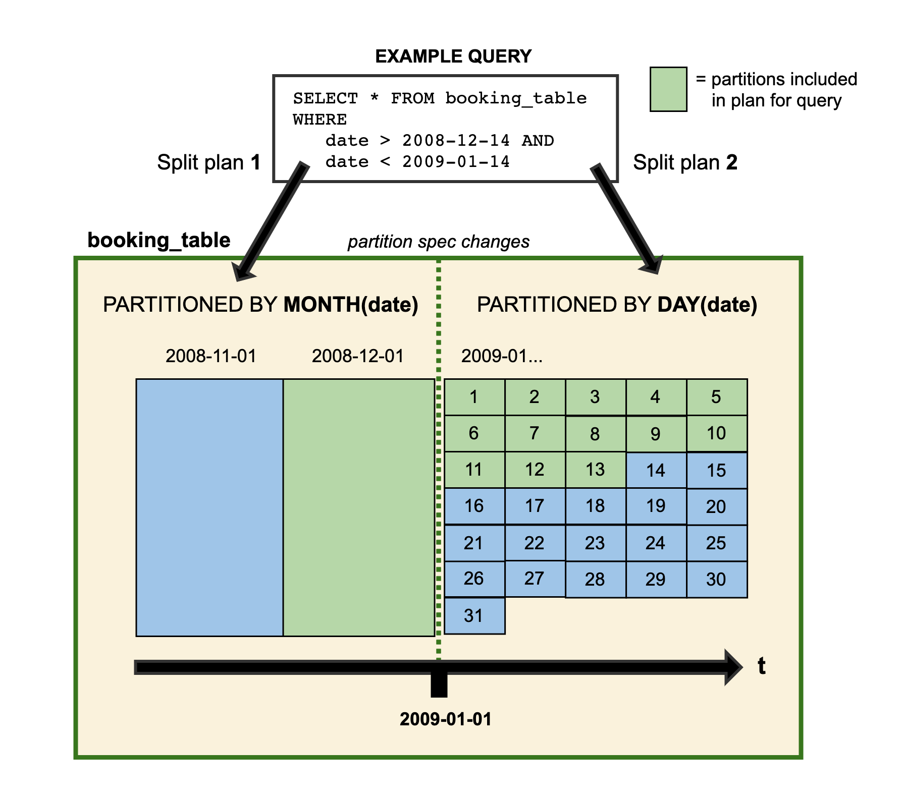

[toc]

# [Apache Iceberg v0.11](http://iceberg.apache.org/)

> Apache Iceberg is an open **table format** for huge analytic datasets.

支持Trino(前PrestoSQL)和Spark，Hive（Hive InputFormat）和Flink Sink/Source。

Iceberg可以解决业务的几大问题：

- 降低NameNode的list请求压力。[**新partition模式**]
- 提高查询性能。[**新partition模式&&新表统计信息**]
- T+1离线数仓进化为分钟级别的准实时数仓。[**新API提供了准实时增量消费**]
- 所有数据基于Parquet等通用开源文件格式，没有lambad架构，不需要额外的运维成本和机器成本。
- 高效低成本的表schema和partition字段变更。**[基于snapshot的schema/partition变更**]

Iceberg Table Version 2 支持批量row-level deletes，这个功能主要用于数据合规修正处理。（Iceberg 并不支持 update/delete/merge）

## 目标

- 开源的表格式，静态数据交换
  - 表格式的清晰定义
  - 跨语言的实现
- 提升可扩展性和可靠性：
  - 单节点可以工作，可扩展到集群；
  - 所有改变是原子性，具备serializable ioslation；
  - 云对象存储的原生支持；
  - 支持并发写入；
- 持续性的使用问题
  - in-place的表模式和分区的演进；
  - 隐藏分区：查询和物理格式隔离；
  - 支持time travel，rollback和metadata inspection；

## 术语

### Snapshot（快照）

A **snapshot** is the state of a table at some time：特定时刻的表的状态。

每个快照列出了在快照时构成表内容的所有数据文件。数据文件跨多个清单文件存储，快照的清单列在一个清单列表文件中。

### Manifest list（清单列表）

清单列表是一个元数据文件，它列出了构成表快照的所有的清单文件。

清单列表中的每个清单文件都存储有关于其内容的信息，如分区值范围，用于加快元数据操作。

### Manifest file（清单文件）

清单文件是一个元数据文件，它列出组成快照的数据文件的子集。

清单中的每个数据文件都存储有一个分区元组、列级统计和摘要信息，用于在扫描规划期间修剪分割。

### Partition spec（分区规范）

分区规范是对如何对表中的数据进行分区的描述。

规范由源列和转换的列表组成。转换从源值生成分区值。例如，date(ts)生成与名为ts的时间戳列相关联的日期。

### Partition tuple（分区元组）

分区元组是存储在每个数据文件中的分区数据的元组或结构。

分区元组中的所有值对于存储在数据文件中的所有行都是相同的。分区元组是通过使用分区规范从行数据转换值产生的。

Iceberg存储的分区值不可改，不像Hive表那样在文件系统路径和键中将值与字符串进行转换。

### Snapshot log（快照日志）

快照日志是关于**表的当前快照如何随时间变化的元数据日志**。

该日志是时间戳和ID对的列表:当当前快照被更改时以及当前快照被更改为的快照ID。

快照日志作为snapshot-log存储在表元数据中。

## 设计

### 隐藏分区

parition字段是表中的一个字段或者对表中的字段做特定transform转换而来，而Hive Metastore中分区字段由用户自己处理。

- Hive无法验证分区值的正确性，由用户保证；Iceberg由特定的Transform保证，不许用户手动处理；
- Iceberg允许表的schema演进，可以随着数据量的变化随着时间的推移发展分区方案；

- Iceberg表根据partition定位文件相比 metastore **少了根据目录信息去HDFS上执行list命令获取分区下的文件**的操作。

### 扫描计划

Iceberg是为大型表设计的，用于生产中，一个表可以包含几十pb的数据。甚至可以从单个节点读取多pb级的表，而**不需要分布式SQL引擎来筛选表元数据**。

扫描规划是在表中查找查询所需文件的过程。

在Iceberg表中进行Planning适合于单个节点，因为Iceberg的元数据除了过滤不包含匹配数据的数据文件外，还可以用于删除不需要的元数据文件。

从单个节点快速扫描规划，优势是:

- 低延迟SQL查询——消除分布式扫描；

- 从任何客户端访问—独立进程可以直接从Iceberg表读取数据；

#### 元数据过滤

**Manifest files**：存储数据文件的列表，以及每个数据文件的分区数据和列级别的统计信息；

**Manifest list**：存储Manifest的快照的列表，以及每个分区字段的值范围。

为了进行快速扫描规划，Iceberg首先使用Manifest list的分区值范围筛选Manifest files。然后，它读取每个Manifest file以获得数据文件。在这个方案中，Manifest list充当Manifest file的索引，这样就可以在不读取所有清单的情况下进行计划。

除了分区值范围外，Manifest list还存储Manifest中添加或删除的文件数量，以加速快照过期等操作。

#### 数据过滤

清单文件包括每个数据文件的分区数据和列级统计的元组。表统计信息实现粒度跟Hive Metastore不同。

（1）**Metastore中一张表的统计信息是表/分区级别粒度的统计信息**，比如记录一张表中某一列的记录数量、平均长度、为null的记录数量、最大值\最小值等。

- 基于Metastore，查询谓词只能基于分区进行过滤，选中的分区需要解压甚至扫描其下的所有文件。


（2）Iceberg中**统计信息精确到文件粒度**，即每个数据文件都会记录所有列的记录数量、平均长度、最大值\最小值等。

- 基于Iceberg，查询谓词不仅可以过滤到分区级别，也可以**基于文件级别的统计信息（每一列的最大值\最小值）对这个分区下的文件进行过滤**，对于不满足条件的文件可以不用解压扫描（Parquet）。

在Planning期间，查询谓词自动转换为分区数据上的谓词，并首先应用于筛选数据文件。接下来，列级值计数、空计数、下界和上界用于消除不能匹配查询谓词的文件。

Metastore表格式不支持增量拉取，而Iceberg表格式支持增量拉取（上层业务写好一批文件，调用Iceberg的commit接口（单个事务）提交本次写入形成一个新的snapshot快照）。

### 表的演化

支持in-place表的演化，包括表schema修改和分区的修改。但不需要重写表数据或者迁移新表这种昂贵的代价。

#### Schema演化

元数据的操作，没有数据的移动。支持的操作：

- Add：添加新列；
- Drop：移除列；
- Rename：重命名列；
- Update：宽化（widen）列的类型；
- Reorder：改变列的顺序？

> Note that map keys do not support adding or dropping struct fields that would change equality.

**正确性的保证**

模式演变的变化是独立的，没有副作用，而且不需要重写文件:

- 添加的列从不从其他列读取现有值；
- 删除列或字段不会改变任何其他列中的值；
- 更新列或字段不会改变任何其他列中的值。
- 改变结构中列或字段的顺序不会改变与列或字段名称相关联的值。

Iceberg使用惟一id来跟踪表中的每一列。当添加列时，会给它分配一个新ID，这样就不会错误地使用现有数据。

- 根据名称跟踪列的格式在重复使用名称时可能会无意中恢复列的删除，这违反了第1条。
- 按位置跟踪列的格式不能在不更改每个列使用的名称的情况下删除列，这违反了第2条。

#### 分区演化

表分区可以在现有表中更新，因为查询不会直接引用分区值。演化一个新的分区规范时，用早期分区规范写入的旧数据保持不变。新数据在新布局中使用新规范写入。每个分区版本的元数据是分开保存的。

对于查询会得到分割的计划。每个分区布局使用从其特定分区布局中派生的筛选器分别规划文件。示例：



```java
Table sampleTable = ...;
sampleTable.updateSpec()
    .addField(bucket("id", 8))
    .removeField("category")
    .commit();
```


#### 排序演化

与分区规范类似，Iceberg排序顺序也可以在现有表中更新。当演化排序顺序时，使用先前顺序写入的旧数据将保持不变。引擎总是可以选择以最新的排序顺序或未排序的顺序写入数据（当排序成本过高时）。

```java
Table sampleTable = ...;
sampleTable.replaceSortOrder()
   .asc("id", NullOrder.NULLS_LAST)
   .dec("category", NullOrder.NULL_FIRST)
   .commit();
```


### 可靠性（原子性要求）

Hive tables 跟踪数据文件，使用集中的metastore用于分区，以及使用文件系统用于单独的文件，使得原子性更改很难实现，以及对文件系统的list/rename有一致性和原子性的要求。

Iceberg使用持久树结构跟踪每个[快照](http://iceberg.apache.org/terms/#snapshot)中数据文件的完整列表。每次写入或删除都会产生一个新快照，该快照将尽可能多地重用先前快照的元数据树，以避免大量写入。

Iceberg表中的有效快照以及对当前快照的引用都存储在表元数据文件中。**提交时使用原子操作替换当前表元数据文件的路径**。这确保对**表数据和元数据的所有更新都是原子更新**，并且是可[序列化隔离](https://en.wikipedia.org/wiki/Isolation_(database_systems)#Serializable)的基础。

- **可序列化的隔离**：所有表更改都发生在原子表更新的线性历史记录中；
- **可靠的读取**：读取器始终使用表的一致快照而不持有锁；
- **版本历史记录和回滚**：将表快照保留为历史记录，如果作业产生不良数据，则表可以回滚；
- **安全的文件级操作**：通过支持原子更改，Iceberg至此新的场景，例如安全地压缩小型文件并将新数据安全地附加到表中；
- **O（1）个RPC**：不用list O(n)个目录计划单个job，读取快照只需要O(1) RPC 调用；
- **分布式计划**：将文件修剪和谓词下推式分配给作业，从而消除了元存储的瓶颈。


### 并发写操作

乐观锁支持多个并发写入。

每个写者都假定没有其他写者正在操作，并为该操作写出新的表元数据。然后，写者尝试通过原子方式将新表元数据文件交换为现有元数据文件来进行提交。

如果原子交换由于其他写入者的提交而失败，则失败的写入者将根据新的当前表状态通过写入新的元数据树来重试。

#### 重试的代价

写入者通过结构化更改来避免昂贵的重试操作，以便可以在重试之间重用工作。

例如，附加通常会为附加的数据文件创建一个新的清单文件，可以将其添加到表中，而无需每次尝试都重写清单。

#### 重试校验

commit被结构化分为假设（assumptions）和动作（actions）两部分。在发生冲突后，写入者检查当前表的状态只要满足假设，就可以安全地执行动作和提交。


### 兼容性

通过避免list和rename操作，Iceberg支持对象存储，不需要一致性的list操作。